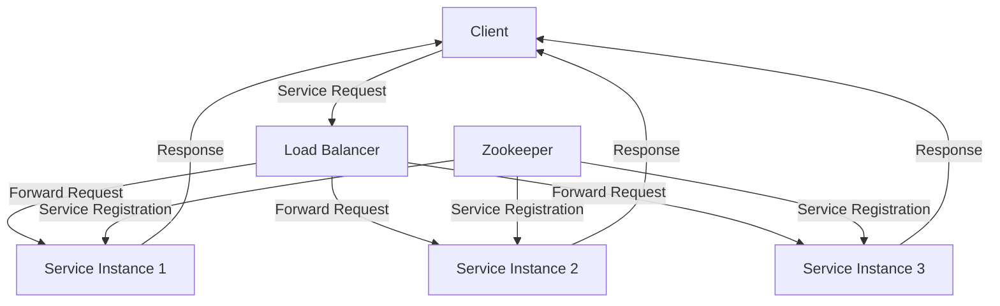

## 15.12. Distributed Systems and Service Discovery

Distributed systems are at the heart of modern software architecture, enabling scalability, fault tolerance, and high availability. In this section, we will explore the key concepts and patterns for building distributed systems in Clojure, with a focus on service discovery, coordination, and consistency models. We will delve into the challenges of distributed systems, such as partitioning and latency, and provide practical examples using coordination services like Zookeeper. Additionally, we will discuss service discovery mechanisms, consistency models, and consensus algorithms, emphasizing the design for eventual consistency and fault tolerance.

### Understanding Distributed Systems

Distributed systems consist of multiple independent components that communicate and coordinate their actions by passing messages. These systems are designed to achieve a common goal, such as processing large volumes of data or providing a seamless user experience across different geographical locations. The key challenges in distributed systems include:

- **Partitioning**: Dividing the system into smaller, manageable parts that can operate independently.
- **Latency**: The time delay in communication between different parts of the system.
- **Fault Tolerance**: The ability to continue operating in the presence of failures.
- **Consistency**: Ensuring that all parts of the system have a consistent view of the data.

### Service Discovery in Distributed Systems

Service discovery is a critical component of distributed systems, enabling services to find and communicate with each other. In a dynamic environment where services can be added, removed, or relocated, service discovery ensures that clients can locate the services they need without hardcoding their locations.

#### Service Discovery Mechanisms

1. **Client-Side Discovery**: Clients are responsible for discovering the service instances. They query a service registry to get the list of available instances and choose one to connect to.

2. **Server-Side Discovery**: A load balancer or proxy handles the discovery process. Clients send requests to the load balancer, which forwards them to the appropriate service instance.

3. **DNS-Based Discovery**: Services are registered with a DNS server, and clients use DNS queries to discover service instances.

#### Implementing Service Discovery with Zookeeper

Zookeeper is a popular coordination service for distributed systems, providing mechanisms for service discovery, configuration management, and distributed synchronization. Let's explore how to use Zookeeper for service discovery in Clojure.

```clojure
(ns distributed-system.service-discovery
  (:require [zookeeper :as zk]))

(defn connect-to-zookeeper []
  ;; Connect to Zookeeper server
  (zk/connect "localhost:2181"))

(defn register-service [zk-client service-name service-info]
  ;; Register a service with Zookeeper
  (zk/create zk-client (str "/services/" service-name) service-info))

(defn discover-service [zk-client service-name]
  ;; Discover a service from Zookeeper
  (zk/get-data zk-client (str "/services/" service-name)))

;; Usage
(let [zk-client (connect-to-zookeeper)]
  (register-service zk-client "my-service" "http://localhost:8080")
  (println "Discovered service:" (discover-service zk-client "my-service")))
```

In this example, we connect to a Zookeeper server, register a service, and discover it using the Zookeeper client library for Clojure.

### Coordination and Consensus in Distributed Systems

Coordination services like Zookeeper play a crucial role in distributed systems by providing mechanisms for leader election, distributed locking, and configuration management. These services help maintain consistency and coordination across distributed components.

#### Consensus Algorithms

Consensus algorithms are used to achieve agreement among distributed components. Some popular consensus algorithms include:

- **Paxos**: A family of protocols for achieving consensus in a network of unreliable processors.
- **Raft**: A consensus algorithm designed to be easy to understand and implement.
- **ZAB (Zookeeper Atomic Broadcast)**: The protocol used by Zookeeper to achieve consensus.

#### Designing for Consistency and Fault Tolerance

In distributed systems, achieving strong consistency can be challenging due to network partitions and failures. Therefore, many systems opt for eventual consistency, where all nodes will eventually have the same data, but not necessarily at the same time.

**Eventual Consistency**: A consistency model where updates to a distributed database will eventually propagate to all nodes, ensuring that all nodes will have the same data eventually.

**CAP Theorem**: The CAP theorem states that a distributed system can only provide two out of three guarantees: Consistency, Availability, and Partition tolerance. Understanding this trade-off is crucial when designing distributed systems.

### Practical Example: Building a Distributed Key-Value Store

Let's build a simple distributed key-value store in Clojure using Zookeeper for coordination and service discovery.

```clojure
(ns distributed-system.key-value-store
  (:require [zookeeper :as zk]))

(defn connect-to-zookeeper []
  (zk/connect "localhost:2181"))

(defn put-key-value [zk-client key value]
  (zk/create zk-client (str "/kv-store/" key) value))

(defn get-key-value [zk-client key]
  (zk/get-data zk-client (str "/kv-store/" key)))

;; Usage
(let [zk-client (connect-to-zookeeper)]
  (put-key-value zk-client "foo" "bar")
  (println "Value for 'foo':" (get-key-value zk-client "foo")))
```

In this example, we use Zookeeper to store key-value pairs, demonstrating how to leverage coordination services for building distributed systems.

### Designing for Scalability and Fault Tolerance

When designing distributed systems, it's essential to consider scalability and fault tolerance. Here are some best practices:

- **Horizontal Scaling**: Add more nodes to the system to handle increased load.
- **Replication**: Replicate data across multiple nodes to ensure availability and fault tolerance.
- **Load Balancing**: Distribute incoming requests evenly across available nodes.
- **Graceful Degradation**: Design the system to degrade gracefully in the event of failures.

### Visualizing Distributed Systems and Service Discovery

To better understand the architecture of distributed systems and service discovery, let's visualize the components and their interactions using Mermaid.js.



This diagram illustrates a typical service discovery architecture, where clients send requests to a load balancer, which forwards them to available service instances. Zookeeper is used for service registration and discovery.

### Conclusion

Building distributed systems in Clojure requires a deep understanding of service discovery, coordination, and consistency models. By leveraging tools like Zookeeper and designing for eventual consistency and fault tolerance, we can create scalable, reliable, and efficient distributed systems. Remember, this is just the beginning. As you progress, you'll build more complex and interactive distributed systems. Keep experimenting, stay curious, and enjoy the journey!

## **Ready to Test Your Knowledge?**



### What is a key challenge in distributed systems?

- [x] Partitioning
- [ ] Centralization
- [ ] Monolithic architecture
- [ ] Single-threading

> **Explanation:** Partitioning is a key challenge in distributed systems as it involves dividing the system into smaller, manageable parts that can operate independently.

### Which service discovery mechanism involves clients querying a service registry?

- [x] Client-Side Discovery
- [ ] Server-Side Discovery
- [ ] DNS-Based Discovery
- [ ] Manual Configuration

> **Explanation:** In client-side discovery, clients are responsible for discovering the service instances by querying a service registry.

### What is Zookeeper used for in distributed systems?

- [x] Coordination and service discovery
- [ ] Data storage
- [ ] User authentication
- [ ] Network routing

> **Explanation:** Zookeeper is used for coordination and service discovery in distributed systems, providing mechanisms for leader election, distributed locking, and configuration management.

### What is the CAP theorem?

- [x] A theorem stating a distributed system can provide only two out of three guarantees: Consistency, Availability, and Partition tolerance.
- [ ] A theorem about the speed of light in distributed systems.
- [ ] A theorem about the maximum number of nodes in a distributed system.
- [ ] A theorem about the minimum latency in distributed systems.

> **Explanation:** The CAP theorem states that a distributed system can only provide two out of three guarantees: Consistency, Availability, and Partition tolerance.

### Which consensus algorithm is designed to be easy to understand and implement?

- [x] Raft
- [ ] Paxos
- [ ] ZAB
- [ ] Byzantine

> **Explanation:** Raft is a consensus algorithm designed to be easy to understand and implement, making it popular for use in distributed systems.

### What is eventual consistency?

- [x] A consistency model where updates will eventually propagate to all nodes.
- [ ] A model where updates are immediately consistent across all nodes.
- [ ] A model where updates are never consistent.
- [ ] A model where updates are consistent only during failures.

> **Explanation:** Eventual consistency is a consistency model where updates to a distributed database will eventually propagate to all nodes, ensuring that all nodes will have the same data eventually.

### What is a benefit of horizontal scaling?

- [x] Increased load handling by adding more nodes
- [ ] Reduced complexity by using fewer nodes
- [ ] Immediate consistency across all nodes
- [ ] Single point of failure

> **Explanation:** Horizontal scaling involves adding more nodes to the system to handle increased load, improving scalability and fault tolerance.

### What role does a load balancer play in service discovery?

- [x] It distributes incoming requests evenly across available nodes.
- [ ] It stores data for the distributed system.
- [ ] It manages user authentication.
- [ ] It provides network routing.

> **Explanation:** A load balancer distributes incoming requests evenly across available nodes, ensuring efficient resource utilization and fault tolerance.

### What is the primary function of a coordination service like Zookeeper?

- [x] To maintain consistency and coordination across distributed components
- [ ] To store large volumes of data
- [ ] To provide user interfaces
- [ ] To manage network traffic

> **Explanation:** Coordination services like Zookeeper maintain consistency and coordination across distributed components, providing mechanisms for leader election, distributed locking, and configuration management.

### True or False: In distributed systems, achieving strong consistency is always possible.

- [ ] True
- [x] False

> **Explanation:** Achieving strong consistency in distributed systems can be challenging due to network partitions and failures, leading many systems to opt for eventual consistency.


