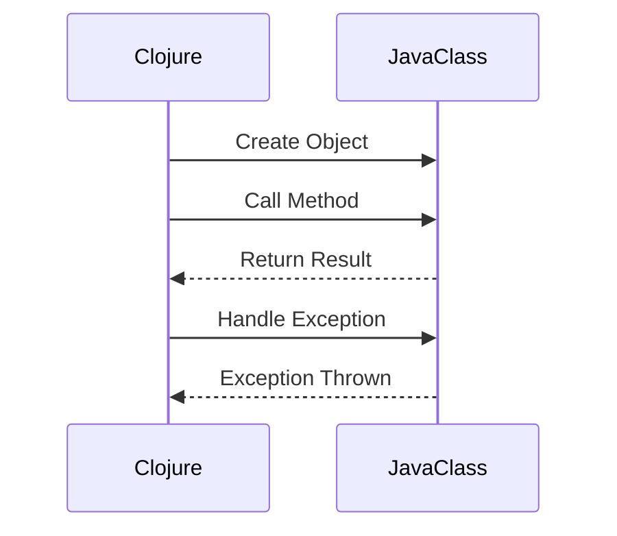

## 15.13. Java Interop Patterns

Clojure, being a hosted language on the Java Virtual Machine (JVM), provides seamless interoperability with Java. This feature allows Clojure developers to leverage the vast ecosystem of Java libraries and frameworks, enhancing code reuse and integration. In this section, we will explore idiomatic ways to interact with Java classes and methods, handle overloaded methods and constructors, manage exceptions, and optimize performance with type hinting. We'll also emphasize maintaining readability and idiomatic Clojure code throughout the process.

### Understanding Java Interoperability in Clojure

Java interoperability in Clojure is a powerful feature that allows developers to call Java methods, create Java objects, and use Java libraries directly from Clojure code. This capability is crucial for integrating with existing Java systems and utilizing Java's extensive library ecosystem.

#### Key Concepts

- **Java Classes and Methods**: Clojure can directly interact with Java classes and methods using a straightforward syntax.
- **Overloaded Methods**: Java methods can be overloaded, meaning multiple methods with the same name but different parameters. Clojure provides mechanisms to handle these.
- **Exception Handling**: Clojure can catch and handle Java exceptions, allowing for robust error management.
- **Type Hinting**: To optimize performance, Clojure allows type hints to reduce reflection overhead when interacting with Java.

### Interacting with Java Classes and Methods

Clojure provides a simple and intuitive syntax for interacting with Java classes and methods. Let's explore some common patterns.

#### Creating Java Objects

To create a Java object, use the `new` keyword followed by the class name and constructor arguments.

```clojure
;; Creating a Java String object
(def my-string (new String "Hello, Java Interop!"))

;; Alternatively, using the dot notation
(def my-string (. String (new "Hello, Java Interop!")))
```

#### Calling Java Methods

To call a Java method, use the dot notation. The method name follows the object or class, separated by a dot.

```clojure
;; Calling an instance method
(.toUpperCase my-string)

;; Calling a static method
(Math/pow 2 3)
```

#### Handling Overloaded Methods

Java supports method overloading, where multiple methods have the same name but different parameter types. Clojure handles this by matching the method signature based on the provided arguments.

```clojure
;; Using overloaded methods
(defn calculate-power [base exponent]
  (Math/pow base exponent))

;; Calling the method with different argument types
(calculate-power 2 3)   ;; Calls the double version
(calculate-power 2.0 3) ;; Calls the double version
```

### Exception Handling and Resource Management

Clojure provides mechanisms to handle Java exceptions and manage resources effectively.

#### Catching Java Exceptions

Use the `try`, `catch`, and `finally` constructs to handle exceptions.

```clojure
(try
  ;; Code that may throw an exception
  (let [result (/ 10 0)]
    (println "Result:" result))
  (catch ArithmeticException e
    (println "Caught an arithmetic exception:" (.getMessage e)))
  (finally
    (println "Cleanup actions")))
```

#### Resource Management with `try-with-resources`

Java's `try-with-resources` can be mimicked in Clojure using the `with-open` macro for automatic resource management.

```clojure
(with-open [reader (java.io.BufferedReader. (java.io.FileReader. "file.txt"))]
  (println (.readLine reader)))
```

### Type Hinting and Performance Optimization

Type hinting in Clojure helps optimize performance by reducing reflection overhead when interacting with Java.

#### Using Type Hints

Type hints are metadata annotations that specify the expected type of a variable or return value.

```clojure
(defn calculate-square-root [^double x]
  (Math/sqrt x))
```

#### Performance Considerations

- **Avoid Reflection**: Use type hints to avoid reflection, which can be costly in terms of performance.
- **Leverage Java Libraries**: Utilize Java libraries for performance-critical tasks, as they are often optimized for speed.

### Maintaining Readability and Idiomatic Clojure Code

While leveraging Java interoperability, it's essential to maintain the readability and idiomatic nature of Clojure code.

#### Best Practices

- **Use Clojure's Functional Paradigm**: Favor Clojure's functional constructs over imperative Java code.
- **Minimize Java Interop**: Use Java interop sparingly and only when necessary to keep the codebase clean and maintainable.
- **Document Interop Code**: Clearly document any Java interop code to aid understanding and maintenance.

### Visualizing Java Interoperability

To better understand the interaction between Clojure and Java, let's visualize the process using a sequence diagram.



### Try It Yourself

Experiment with the following code examples to deepen your understanding of Java interoperability in Clojure. Try modifying the examples to call different Java methods or handle various exceptions.

### References and Further Reading

- [Clojure Java Interop Documentation](https://clojure.org/reference/java_interop)
- [Java SE Documentation](https://docs.oracle.com/javase/8/docs/api/)
- [Effective Java by Joshua Bloch](https://www.oreilly.com/library/view/effective-java-3rd/9780134686097/)

### Knowledge Check

To reinforce your understanding, try answering the following questions and challenges.

## **Ready to Test Your Knowledge?**



### What is the primary purpose of Java interoperability in Clojure?

- [x] To leverage Java's vast ecosystem and libraries
- [ ] To replace Clojure's core libraries
- [ ] To write Java code within Clojure
- [ ] To convert Clojure code to Java

> **Explanation:** Java interoperability allows Clojure to leverage Java's vast ecosystem and libraries, enhancing code reuse and integration.

### How do you create a Java object in Clojure?

- [x] Using the `new` keyword
- [ ] Using the `create` keyword
- [ ] Using the `make` keyword
- [ ] Using the `construct` keyword

> **Explanation:** In Clojure, you create a Java object using the `new` keyword followed by the class name and constructor arguments.

### What is the purpose of type hinting in Clojure?

- [x] To optimize performance by reducing reflection overhead
- [ ] To increase code readability
- [ ] To enforce type safety
- [ ] To simplify syntax

> **Explanation:** Type hinting in Clojure helps optimize performance by reducing reflection overhead when interacting with Java.

### Which construct is used in Clojure to handle exceptions?

- [x] `try`, `catch`, and `finally`
- [ ] `begin`, `rescue`, and `ensure`
- [ ] `try`, `except`, and `finally`
- [ ] `catch`, `throw`, and `finally`

> **Explanation:** Clojure uses `try`, `catch`, and `finally` constructs to handle exceptions, similar to Java.

### How can you call a static method in Java from Clojure?

- [x] Using the dot notation with the class name
- [ ] Using the `invoke` function
- [ ] Using the `call` function
- [ ] Using the `execute` function

> **Explanation:** In Clojure, you call a static method in Java using the dot notation with the class name.

### What is a key consideration when using Java interop in Clojure?

- [x] Maintaining readability and idiomatic Clojure code
- [ ] Maximizing the use of Java code
- [ ] Avoiding Clojure's functional paradigm
- [ ] Using Java interop for all tasks

> **Explanation:** It's important to maintain readability and idiomatic Clojure code when using Java interop to keep the codebase clean and maintainable.

### How do you handle overloaded methods in Clojure?

- [x] By matching the method signature based on provided arguments
- [ ] By using a special keyword
- [ ] By converting methods to Clojure functions
- [ ] By avoiding overloaded methods

> **Explanation:** Clojure handles overloaded methods by matching the method signature based on the provided arguments.

### What is the benefit of using `with-open` in Clojure?

- [x] Automatic resource management
- [ ] Improved performance
- [ ] Enhanced readability
- [ ] Simplified syntax

> **Explanation:** The `with-open` macro in Clojure provides automatic resource management, similar to Java's `try-with-resources`.

### True or False: Clojure can directly call Java methods without any special syntax.

- [x] True
- [ ] False

> **Explanation:** Clojure can directly call Java methods using a straightforward syntax, such as the dot notation.

### Which of the following is a best practice when using Java interop in Clojure?

- [x] Use Java interop sparingly and only when necessary
- [ ] Use Java interop for all tasks
- [ ] Avoid using Clojure's core libraries
- [ ] Maximize the use of Java code

> **Explanation:** It's a best practice to use Java interop sparingly and only when necessary to maintain a clean and maintainable codebase.



Remember, mastering Java interoperability in Clojure opens up a world of possibilities by allowing you to leverage Java's extensive ecosystem while maintaining the elegance and power of Clojure. Keep experimenting, stay curious, and enjoy the journey!
