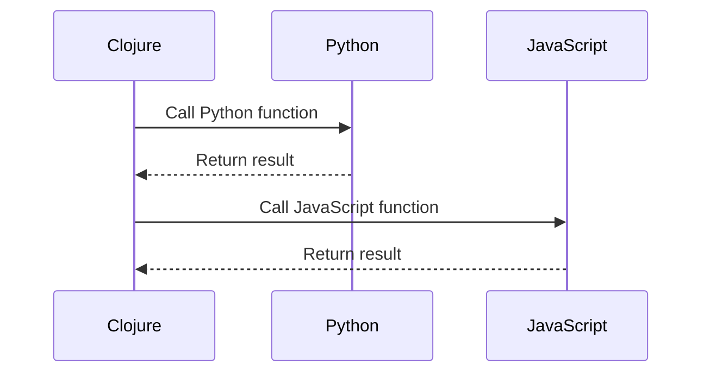

## 15.14. Cross-Language Interoperability Patterns

In the ever-evolving landscape of software development, the ability to integrate different programming languages within a single application is a powerful asset. Clojure, with its robust functional programming paradigm and seamless Java interoperability, extends its capabilities further by integrating with languages like Python and JavaScript. This section explores the patterns and practices for achieving cross-language interoperability, focusing on tools like `libpython-clj` for Python and various JavaScript integration techniques.

### Understanding Cross-Language Interoperability

Cross-language interoperability refers to the ability of a program written in one language to interact with code written in another language. This interaction can involve calling functions, sharing data, or even executing code in a different runtime environment. The primary goals of interoperability are to leverage the strengths of different languages, reuse existing libraries, and facilitate collaboration across diverse technology stacks.

### Tools and Libraries for Interoperability

#### 1. libpython-clj for Python

`libpython-clj` is a Clojure library that provides seamless interoperability with Python. It allows Clojure developers to call Python functions, manipulate Python objects, and leverage Python's extensive ecosystem, including machine learning libraries like TensorFlow and PyTorch.

- **Installation**: To use `libpython-clj`, add it to your `deps.edn` file:

  ```clojure
  {:deps {clj-python/libpython-clj {:mvn/version "2.00"}}}
  ```

- **Basic Usage**: Here's a simple example of calling a Python function from Clojure:

  ```clojure
  (require '[libpython-clj.python :as py])

  ;; Initialize the Python environment
  (py/initialize!)

  ;; Import a Python module
  (py/import-module "math")

  ;; Call a Python function
  (println (py/call-attr "math" "sqrt" 16))
  ```

  This code initializes the Python environment, imports the `math` module, and calls the `sqrt` function to compute the square root of 16.

#### 2. JavaScript Integration

ClojureScript, the Clojure-to-JavaScript compiler, enables Clojure code to run in JavaScript environments, such as web browsers and Node.js. This integration allows developers to use Clojure's functional programming features in front-end development and server-side JavaScript applications.

- **ClojureScript Setup**: To get started with ClojureScript, you can use tools like `shadow-cljs` or `lein-cljsbuild` to compile Clojure code to JavaScript.

- **Calling JavaScript Functions**: ClojureScript provides a straightforward way to call JavaScript functions using the `js` namespace:

  ```clojure
  ;; Call a JavaScript function
  (js/alert "Hello from ClojureScript!")
  ```

  This example demonstrates calling the `alert` function in a web browser to display a message.

### Use Cases for Cross-Language Interoperability

#### 1. Leveraging Machine Learning Libraries

Python is renowned for its machine learning libraries, such as TensorFlow, PyTorch, and scikit-learn. By integrating Clojure with Python, developers can harness these powerful tools while benefiting from Clojure's functional programming paradigm.

- **Example**: Using TensorFlow in Clojure

  ```clojure
  (require '[libpython-clj.python :as py])

  (py/initialize!)
  (py/import-module "tensorflow")

  ;; Create a simple TensorFlow constant
  (let [tf (py/import-module "tensorflow")
        constant (py/call-attr tf "constant" 42)]
    (println "TensorFlow constant:" constant))
  ```

  This example demonstrates creating a TensorFlow constant in Clojure using `libpython-clj`.

#### 2. Front-End Development with ClojureScript

ClojureScript enables developers to build rich, interactive web applications using Clojure's syntax and functional programming features. By compiling to JavaScript, ClojureScript can interact with existing JavaScript libraries and frameworks.

- **Example**: Integrating with React

  ```clojure
  (ns my-app.core
    (:require [reagent.core :as r]))

  ;; Define a simple React component
  (defn hello-world []
    [:div "Hello, world!"])

  ;; Render the component
  (r/render [hello-world] (.getElementById js/document "app"))
  ```

  This example shows how to create a simple React component using Reagent, a ClojureScript interface to React.

### Challenges and Considerations

#### 1. Data Serialization and Type Compatibility

One of the primary challenges in cross-language interoperability is data serialization and type compatibility. Different languages have different data types and serialization formats, which can lead to compatibility issues.

- **Solution**: Use common serialization formats like JSON or Protocol Buffers to ensure data compatibility across languages. Libraries like `cheshire` in Clojure can help with JSON serialization.

#### 2. Performance Overheads

Cross-language calls can introduce performance overheads due to context switching and data conversion. It's essential to minimize these overheads by optimizing the frequency and complexity of cross-language interactions.

- **Best Practice**: Batch operations and minimize the number of cross-language calls to reduce overhead.

### Best Practices for Interoperability

1. **Modular Design**: Design your application in a modular way, with clear boundaries between language-specific components. This approach simplifies integration and maintenance.

2. **Consistent Data Formats**: Use consistent data formats and serialization protocols across languages to ensure compatibility and reduce conversion overhead.

3. **Performance Monitoring**: Continuously monitor the performance of cross-language interactions and optimize as needed to maintain efficiency.

4. **Documentation and Testing**: Document the integration points and test cross-language interactions thoroughly to ensure reliability and correctness.

### Visualizing Cross-Language Interoperability

To better understand the flow of data and control between Clojure and other languages, let's visualize a typical cross-language interoperability scenario using a sequence diagram.



This diagram illustrates how Clojure can interact with both Python and JavaScript, calling functions and receiving results.

### Try It Yourself

Experiment with the code examples provided in this section. Try modifying the Python and JavaScript function calls to explore different functionalities. For instance, use a different Python library or JavaScript API to see how Clojure can interact with them.

### References and Further Reading

- [libpython-clj GitHub Repository](https://github.com/clj-python/libpython-clj)
- [ClojureScript Documentation](https://clojurescript.org/)
- [Reagent: Minimalistic React for ClojureScript](https://reagent-project.github.io/)

### Ready to Test Your Knowledge?



### What is the primary goal of cross-language interoperability?

- [x] To leverage the strengths of different languages
- [ ] To replace one language with another
- [ ] To simplify code syntax
- [ ] To reduce code size

> **Explanation:** Cross-language interoperability aims to leverage the strengths of different languages and facilitate collaboration across diverse technology stacks.

### Which library is used for Python interoperability in Clojure?

- [x] libpython-clj
- [ ] clojure-py
- [ ] py-clj
- [ ] python-clojure

> **Explanation:** `libpython-clj` is a Clojure library that provides seamless interoperability with Python.

### How can you call a JavaScript function in ClojureScript?

- [x] Using the `js` namespace
- [ ] Using the `java` namespace
- [ ] Using the `python` namespace
- [ ] Using the `interop` namespace

> **Explanation:** In ClojureScript, JavaScript functions can be called using the `js` namespace.

### What is a common challenge in cross-language interoperability?

- [x] Data serialization and type compatibility
- [ ] Code readability
- [ ] Syntax errors
- [ ] Lack of libraries

> **Explanation:** Data serialization and type compatibility are common challenges in cross-language interoperability due to different data types and serialization formats.

### Which of the following is a best practice for cross-language interoperability?

- [x] Use consistent data formats
- [ ] Increase the number of cross-language calls
- [ ] Avoid using serialization
- [ ] Minimize documentation

> **Explanation:** Using consistent data formats ensures compatibility and reduces conversion overhead in cross-language interoperability.

### What is the purpose of `libpython-clj`?

- [x] To enable Clojure to call Python functions and manipulate Python objects
- [ ] To compile Clojure code to Python
- [ ] To replace Python with Clojure
- [ ] To convert Python code to Clojure syntax

> **Explanation:** `libpython-clj` allows Clojure to call Python functions and manipulate Python objects, enabling interoperability with Python.

### Which tool is commonly used to compile Clojure code to JavaScript?

- [x] shadow-cljs
- [ ] lein-clj
- [ ] cljs-compiler
- [ ] js-clj

> **Explanation:** `shadow-cljs` is a tool commonly used to compile Clojure code to JavaScript.

### What is one way to minimize performance overhead in cross-language calls?

- [x] Batch operations and minimize the number of calls
- [ ] Increase the frequency of calls
- [ ] Use complex data structures
- [ ] Avoid using serialization

> **Explanation:** Batching operations and minimizing the number of cross-language calls can help reduce performance overhead.

### True or False: Clojure can only interoperate with Java.

- [ ] True
- [x] False

> **Explanation:** Clojure can interoperate with languages beyond Java, such as Python and JavaScript, using tools like `libpython-clj` and ClojureScript.

### Which of the following is NOT a use case for cross-language interoperability?

- [ ] Leveraging machine learning libraries
- [ ] Front-end development with ClojureScript
- [x] Replacing all Java code with Python
- [ ] Integrating with existing JavaScript libraries

> **Explanation:** Cross-language interoperability is not about replacing all code in one language with another but about leveraging the strengths of different languages.



Remember, this is just the beginning. As you progress, you'll discover more ways to integrate Clojure with other languages, unlocking new possibilities for your applications. Keep experimenting, stay curious, and enjoy the journey!
