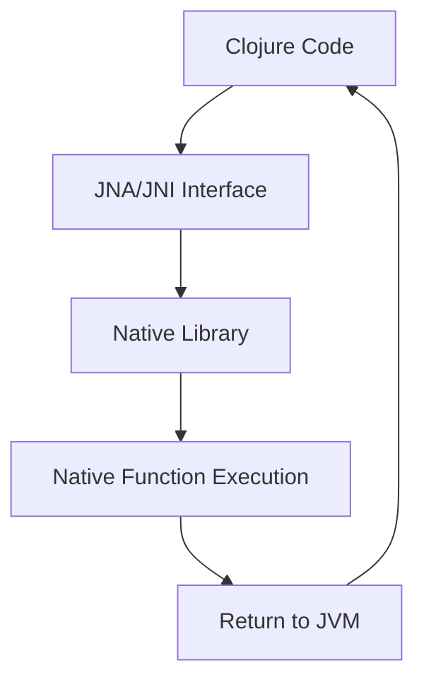

## 15.15. Implementing Foreign Function Interfaces (FFI)

In the world of software development, the ability to interface with native code is a powerful feature that can unlock a plethora of capabilities. Clojure, being a JVM language, provides mechanisms to interact with native libraries written in languages like C or C++. This is achieved through Foreign Function Interfaces (FFI), which allow Clojure programs to call functions and use data structures defined in native libraries.

### What is FFI?

Foreign Function Interface (FFI) is a mechanism that allows a programming language to call functions or use services written in another language. In the context of Clojure, FFI is primarily used to interface with C or C++ libraries, enabling Clojure applications to leverage existing native code for performance-critical tasks or to access platform-specific features.

#### Use Cases for FFI

- **Performance Optimization**: Native code can be used to perform computationally intensive tasks more efficiently.
- **Access to System Libraries**: FFI allows Clojure to interact with system-level libraries that are not directly accessible through the JVM.
- **Reusing Existing Libraries**: Many mature libraries are written in C or C++, and FFI enables their reuse without rewriting them in Clojure.
- **Hardware Interaction**: Directly interact with hardware components or use specialized hardware libraries.

### Tools for Implementing FFI in Clojure

Clojure developers can use several tools to implement FFI, with the most common being Java Native Access (JNA) and Java Native Interface (JNI).

#### Java Native Access (JNA)

[JNA](https://github.com/java-native-access/jna) provides Java programs easy access to native shared libraries without writing anything but Java code. It uses a dynamic approach to interface with native code, which simplifies the process significantly.

- **Advantages**: 
  - No need to write native code or compile JNI code.
  - Easier to use and integrate compared to JNI.
  - Supports a wide range of platforms.

- **Disadvantages**:
  - Slightly slower than JNI due to its dynamic nature.
  - Limited control over low-level details.

#### Java Native Interface (JNI)

[JNI](https://docs.oracle.com/javase/8/docs/technotes/guides/jni/) is a framework that allows Java code running in the Java Virtual Machine (JVM) to call and be called by native applications and libraries written in other languages like C or C++.

- **Advantages**:
  - Provides more control and is generally faster than JNA.
  - Suitable for performance-critical applications.

- **Disadvantages**:
  - Requires writing native code and compiling it.
  - More complex and error-prone compared to JNA.

### Calling Native Functions from Clojure

Let's explore how to call native functions from Clojure using both JNA and JNI.

#### Using JNA

To call a native function using JNA, you need to define a Java interface that maps to the native library's functions. Here's a step-by-step example:

1. **Define the Interface**: Create a Java interface that extends `com.sun.jna.Library`.

```java
public interface CLibrary extends com.sun.jna.Library {
    CLibrary INSTANCE = (CLibrary) com.sun.jna.Native.load("c", CLibrary.class);

    void printf(String format, Object... args);
}
```

2. **Call the Native Function from Clojure**:

```clojure
(ns myapp.core
  (:import [myapp CLibrary]))

(defn call-native-function []
  (.printf CLibrary/INSTANCE "Hello from Clojure! %d\n" (into-array Object [42])))
```

- **Explanation**: The `printf` function from the C standard library is called from Clojure using JNA. The `CLibrary` interface maps the `printf` function, and `INSTANCE` is used to access it.

#### Using JNI

JNI requires more setup, including writing native code and compiling it. Here's a basic example:

1. **Write the Native Code**: Create a C file with the native function.

```c
#include <jni.h>
#include <stdio.h>

JNIEXPORT void JNICALL Java_myapp_Core_printHello(JNIEnv *env, jobject obj) {
    printf("Hello from JNI!\n");
}
```

2. **Compile the Native Code**: Compile the C code into a shared library.

```bash
gcc -shared -fpic -o libhello.so -I${JAVA_HOME}/include -I${JAVA_HOME}/include/linux HelloJNI.c
```

3. **Call the Native Function from Clojure**:

```clojure
(ns myapp.core)

(defn load-native-library []
  (System/loadLibrary "hello"))

(defn call-native-function []
  (load-native-library)
  (let [method (.getMethod (Class/forName "myapp.Core") "printHello" (into-array Class []))]
    (.invoke method nil (into-array Object []))))
```

- **Explanation**: The `printHello` function is defined in C and compiled into a shared library. The Clojure code loads this library and invokes the native method using reflection.

### Challenges in FFI

Interfacing with native code introduces several challenges, including:

#### Memory Management

- **Garbage Collection**: The JVM's garbage collector does not manage memory allocated by native code. Developers must ensure proper allocation and deallocation to avoid memory leaks.
- **Pointers and References**: Handling pointers and references requires careful management to prevent segmentation faults or data corruption.

#### Data Types

- **Type Mapping**: Mapping Java types to native types can be complex, especially for complex data structures.
- **Endianness and Alignment**: Differences in data representation between Java and native code must be handled.

### Performance and Security Considerations

#### Performance

- **Overhead**: FFI introduces overhead due to context switching between the JVM and native code.
- **Optimization**: Use JNI for performance-critical sections, as it provides more control and is faster than JNA.

#### Security

- **Native Code Risks**: Native code can introduce security vulnerabilities, such as buffer overflows.
- **Sandboxing**: Consider sandboxing native code to limit its access to system resources.

### Visualizing FFI Workflow

Below is a diagram illustrating the workflow of calling a native function from Clojure using FFI.



- **Description**: This diagram shows the flow from Clojure code to the native library and back, highlighting the role of JNA/JNI in bridging the two environments.

### Try It Yourself

Experiment with the provided examples by modifying the native functions or creating new ones. Consider:

- **Adding Parameters**: Modify the native functions to accept parameters and return values.
- **Error Handling**: Implement error handling in native code and propagate errors to Clojure.
- **Performance Testing**: Measure the performance impact of using JNA vs. JNI.

### References and Further Reading

- [Java Native Access (JNA)](https://github.com/java-native-access/jna)
- [Java Native Interface (JNI)](https://docs.oracle.com/javase/8/docs/technotes/guides/jni/)

### Knowledge Check

## **Ready to Test Your Knowledge?**



### What is the main purpose of FFI in Clojure?

- [x] To call functions from native libraries
- [ ] To compile Clojure code to native binaries
- [ ] To convert Clojure code to C++
- [ ] To optimize Clojure code for the JVM

> **Explanation:** FFI allows Clojure to call functions from native libraries, enabling integration with C or C++ code.

### Which tool is easier to use for FFI in Clojure?

- [x] JNA
- [ ] JNI
- [ ] Both are equally easy
- [ ] Neither is easy to use

> **Explanation:** JNA is easier to use because it does not require writing native code or compiling JNI code.

### What is a disadvantage of using JNA?

- [x] It is slightly slower than JNI
- [ ] It requires writing native code
- [ ] It does not support multiple platforms
- [ ] It cannot call C++ functions

> **Explanation:** JNA is slightly slower than JNI due to its dynamic nature.

### What is a key advantage of JNI over JNA?

- [x] More control and faster performance
- [ ] Easier to use
- [ ] No need for native code
- [ ] Supports more languages

> **Explanation:** JNI provides more control and is generally faster, making it suitable for performance-critical applications.

### What must be managed manually when using FFI?

- [x] Memory allocation and deallocation
- [ ] Java object creation
- [ ] JVM garbage collection
- [ ] Clojure namespace management

> **Explanation:** Memory allocated by native code must be managed manually to prevent leaks.

### Which of the following is a security risk when using FFI?

- [x] Buffer overflows in native code
- [ ] JVM garbage collection
- [ ] Clojure's dynamic typing
- [ ] Java's type safety

> **Explanation:** Native code can introduce security vulnerabilities like buffer overflows.

### What is the role of JNA in FFI?

- [x] It provides a dynamic interface to native libraries
- [ ] It compiles Java code to native binaries
- [ ] It converts Clojure code to C++
- [ ] It optimizes Clojure code for the JVM

> **Explanation:** JNA provides a dynamic interface to native libraries, simplifying FFI.

### How can you call a native function using JNI?

- [x] By writing native code and compiling it into a shared library
- [ ] By using a Java interface
- [ ] By converting Clojure code to C++
- [ ] By using a Clojure macro

> **Explanation:** JNI requires writing native code and compiling it into a shared library.

### What is a common challenge when using FFI?

- [x] Type mapping between Java and native code
- [ ] Writing Clojure macros
- [ ] Managing JVM garbage collection
- [ ] Using Clojure's dynamic typing

> **Explanation:** Mapping Java types to native types can be complex and requires careful handling.

### True or False: FFI can be used to interact with hardware components.

- [x] True
- [ ] False

> **Explanation:** FFI allows direct interaction with hardware components or specialized hardware libraries.



Remember, this is just the beginning. As you progress, you'll build more complex and interactive applications by leveraging the power of FFI in Clojure. Keep experimenting, stay curious, and enjoy the journey!
