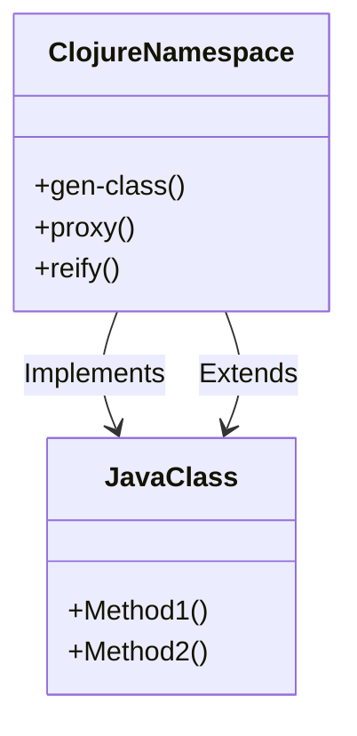

## 15.16. Advanced Java Interop Techniques

Clojure's seamless interoperability with Java is one of its standout features, allowing developers to leverage the vast ecosystem of Java libraries and frameworks. This section delves into advanced techniques for Java interoperability, focusing on implementing interfaces, extending classes, and creating Java classes and interfaces in Clojure using `gen-class`, `proxy`, and `reify`. We will explore use cases, performance considerations, and best practices for maintainable code.

### Understanding Java Interoperability in Clojure

Before diving into advanced techniques, let's briefly revisit the basics of Java interoperability in Clojure. Clojure runs on the Java Virtual Machine (JVM), which allows it to call Java methods, create Java objects, and implement Java interfaces. This interoperability is facilitated by Clojure's syntax and functions designed to interact with Java seamlessly.

### Implementing Interfaces and Extending Classes

#### Using `gen-class`

The `gen-class` macro is used to generate a Java class from Clojure code. It is particularly useful when you need to create a class that can be instantiated from Java or when you need to implement a Java interface.

**Example: Creating a Java Class with `gen-class`**

```clojure
(ns myapp.core
  (:gen-class
   :name myapp.MyClass
   :implements [java.lang.Runnable]
   :methods [[run [] void]]))

(defn -run
  "Implements the Runnable interface's run method."
  [this]
  (println "Running in a separate thread"))

;; Compile the class using `lein compile` or `clojure -M:compile`
```

In this example, we define a class `myapp.MyClass` that implements the `Runnable` interface. The `-run` function provides the implementation for the `run` method.

**Use Cases for `gen-class`**

- Creating classes that need to be instantiated from Java.
- Implementing interfaces that require multiple methods.
- Extending abstract classes.

**Considerations for `gen-class`**

- **Performance**: `gen-class` generates bytecode, which can be more performant than other interop techniques.
- **Compatibility**: Ensure that the generated class is compatible with the Java version you are targeting.
- **Classloading**: Be aware of classloading issues, especially in environments with dynamic class reloading.

#### Using `proxy`

The `proxy` function is used to create an instance of a Java class or interface at runtime. It is useful for creating anonymous classes or implementing interfaces with a small number of methods.

**Example: Implementing an Interface with `proxy`**

```clojure
(def runnable-instance
  (proxy [java.lang.Runnable] []
    (run []
      (println "Running with proxy"))))

(.start (Thread. runnable-instance))
```

In this example, we create an instance of `Runnable` using `proxy` and start a new thread with it.

**Use Cases for `proxy`**

- Implementing interfaces with a small number of methods.
- Creating anonymous classes for quick tasks.
- Wrapping existing Java objects with additional behavior.

**Considerations for `proxy`**

- **Performance**: `proxy` can be slower than `gen-class` due to the overhead of dynamic method dispatch.
- **Compatibility**: Ensure that the interfaces you are implementing are compatible with the JVM version.
- **Maintainability**: Use `proxy` for simple tasks to avoid complex and hard-to-maintain code.

#### Using `reify`

The `reify` macro is similar to `proxy` but is more efficient and idiomatic in Clojure. It creates an instance of an anonymous class that implements one or more interfaces.

**Example: Using `reify` to Implement an Interface**

```clojure
(def runnable-instance
  (reify java.lang.Runnable
    (run [this]
      (println "Running with reify"))))

(.start (Thread. runnable-instance))
```

In this example, `reify` is used to create an instance of `Runnable` with an implementation for the `run` method.

**Use Cases for `reify`**

- Implementing interfaces with a small number of methods.
- Creating lightweight and efficient anonymous classes.
- Enhancing existing Java objects with additional behavior.

**Considerations for `reify`**

- **Performance**: `reify` is generally more performant than `proxy` due to its more efficient implementation.
- **Compatibility**: Ensure that the interfaces you are implementing are compatible with the JVM version.
- **Maintainability**: `reify` is more idiomatic and should be preferred over `proxy` for new code.

### Performance and Compatibility Considerations

When working with Java interop in Clojure, performance and compatibility are crucial factors to consider. Here are some tips to ensure optimal performance and compatibility:

- **Choose the Right Tool**: Use `gen-class` for generating classes that need to be instantiated from Java, `proxy` for quick and simple tasks, and `reify` for efficient and idiomatic implementations.
- **Optimize Method Dispatch**: Avoid unnecessary dynamic method dispatch by using `reify` or `gen-class` when possible.
- **Monitor Classloading**: Be aware of classloading issues, especially in environments with dynamic class reloading or multiple classloaders.
- **Test Compatibility**: Ensure that your code is compatible with the Java version you are targeting, especially when using advanced features or libraries.

### Best Practices for Maintainable Code

Maintaining clean and efficient code is essential for long-term project success. Here are some best practices for Java interop in Clojure:

- **Keep It Simple**: Use the simplest interop technique that meets your needs. Avoid overcomplicating your code with unnecessary abstractions.
- **Document Your Code**: Clearly document the purpose and usage of interop code, especially when using `gen-class` or `proxy`.
- **Encapsulate Complexity**: Encapsulate complex interop logic in dedicated namespaces or functions to keep your codebase organized.
- **Leverage Clojure's Strengths**: Use Clojure's functional programming features and immutable data structures to complement your interop code.

### Classloading and Namespace Issues

Classloading can be a challenging aspect of Java interop, especially in environments with dynamic class reloading or multiple classloaders. Here are some tips to manage classloading and namespace issues:

- **Use `require` and `import` Wisely**: Use `require` and `import` to manage dependencies and avoid namespace conflicts.
- **Monitor Classloaders**: Be aware of the classloaders in your environment and how they affect your interop code.
- **Handle Dynamic Reloading**: Use tools like `tools.namespace` to manage dynamic reloading and avoid classloading issues.

### Try It Yourself

To solidify your understanding of advanced Java interop techniques, try modifying the examples provided:

- **Experiment with `gen-class`**: Create a new Java class that implements multiple interfaces and test it from Java.
- **Enhance `proxy` Usage**: Use `proxy` to wrap an existing Java object with additional behavior.
- **Optimize `reify`**: Implement an interface with multiple methods using `reify` and compare its performance with `proxy`.

### Visualizing Java Interop Techniques

To help visualize the relationships between Clojure and Java classes, consider the following diagram:



This diagram illustrates how Clojure namespaces can implement or extend Java classes using `gen-class`, `proxy`, and `reify`.

### References and Further Reading

- [Clojure Documentation on Java Interop](https://clojure.org/reference/java_interop)
- [Java Interop in Clojure: A Comprehensive Guide](https://www.braveclojure.com/java/)
- [Clojure Programming: Interoperability with Java](https://www.oreilly.com/library/view/clojure-programming/9781449310387/ch04.html)

### Knowledge Check

To reinforce your understanding of advanced Java interop techniques, try answering the following questions:

## **Ready to Test Your Knowledge?**



### What is the primary use case for `gen-class` in Clojure?

- [x] To generate a Java class that can be instantiated from Java
- [ ] To create anonymous classes at runtime
- [ ] To wrap existing Java objects
- [ ] To implement interfaces with a small number of methods

> **Explanation:** `gen-class` is used to generate a Java class that can be instantiated from Java, making it suitable for creating classes that need to be accessed from Java code.

### Which interop technique is generally more efficient and idiomatic in Clojure?

- [ ] proxy
- [x] reify
- [ ] gen-class
- [ ] import

> **Explanation:** `reify` is more efficient and idiomatic in Clojure compared to `proxy`, as it provides a more performant implementation for creating anonymous classes.

### What is a common performance consideration when using `proxy`?

- [ ] It generates bytecode that is more performant
- [x] It can be slower due to dynamic method dispatch
- [ ] It requires additional classloading
- [ ] It is incompatible with the JVM

> **Explanation:** `proxy` can be slower than other techniques due to the overhead of dynamic method dispatch, making it less performant for complex tasks.

### How can you manage classloading issues in environments with dynamic class reloading?

- [x] Use tools like `tools.namespace` to manage dynamic reloading
- [ ] Avoid using `gen-class`
- [ ] Use `proxy` exclusively
- [ ] Disable classloaders

> **Explanation:** Tools like `tools.namespace` can help manage dynamic reloading and avoid classloading issues by providing mechanisms to reload code safely.

### Which technique should you use for quick and simple tasks?

- [ ] gen-class
- [x] proxy
- [ ] reify
- [ ] import

> **Explanation:** `proxy` is suitable for quick and simple tasks, such as implementing interfaces with a small number of methods or creating anonymous classes.

### What is a best practice for maintainable interop code?

- [x] Encapsulate complex interop logic in dedicated namespaces
- [ ] Use `gen-class` for all interop tasks
- [ ] Avoid documenting interop code
- [ ] Use `proxy` for all interop tasks

> **Explanation:** Encapsulating complex interop logic in dedicated namespaces helps keep the codebase organized and maintainable.

### How can you ensure compatibility with the Java version you are targeting?

- [x] Test your code with the targeted Java version
- [ ] Use `proxy` exclusively
- [ ] Avoid using `gen-class`
- [ ] Disable classloaders

> **Explanation:** Testing your code with the targeted Java version ensures that your interop code is compatible and functions as expected.

### What is the role of `reify` in Clojure interop?

- [ ] To generate Java classes
- [x] To create efficient anonymous classes
- [ ] To wrap existing Java objects
- [ ] To manage classloading

> **Explanation:** `reify` is used to create efficient anonymous classes that implement one or more interfaces, making it a preferred choice for idiomatic Clojure code.

### Which interop technique is used to wrap existing Java objects with additional behavior?

- [x] proxy
- [ ] gen-class
- [ ] reify
- [ ] import

> **Explanation:** `proxy` is used to wrap existing Java objects with additional behavior, allowing for dynamic method implementation.

### True or False: `gen-class` is the only way to implement Java interfaces in Clojure.

- [ ] True
- [x] False

> **Explanation:** False. While `gen-class` is one way to implement Java interfaces, `proxy` and `reify` can also be used to implement interfaces in Clojure.



Remember, mastering Java interop in Clojure opens up a world of possibilities by allowing you to leverage the extensive Java ecosystem. Keep experimenting, stay curious, and enjoy the journey!
