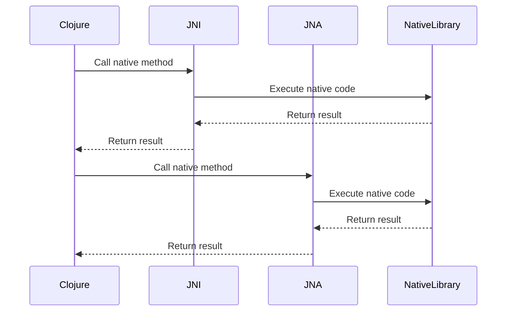

## 15.17. Interacting with Native Libraries Using JNI and JNA

Interacting with native libraries is a powerful feature that allows Clojure developers to leverage existing C/C++ libraries, access platform-specific features, or optimize performance-critical sections of their applications. This section delves into using Java Native Interface (JNI) and Java Native Access (JNA) for integrating native code, comparing their ease of use and performance, and providing practical examples and best practices.

### Introduction to JNI and JNA

**Java Native Interface (JNI)** is a framework that allows Java code running in the Java Virtual Machine (JVM) to call and be called by native applications and libraries written in other languages like C and C++. JNI is part of the Java platform and provides a way to interact with native code, but it requires writing boilerplate code and managing resources manually.

**Java Native Access (JNA)**, on the other hand, provides Java programs easy access to native shared libraries without writing anything but Java code. JNA uses a dynamic approach to interface with native code, which simplifies the process compared to JNI, but may introduce some performance overhead.

### Comparing JNI and JNA

#### Ease of Use

- **JNI** requires writing native code in C/C++ and compiling it into a shared library. It involves defining native methods in Java, implementing them in C/C++, and managing the JNI environment, which can be complex and error-prone.
- **JNA** abstracts much of the complexity by allowing you to define interfaces in Java that map directly to native functions. It eliminates the need for writing C/C++ code, making it easier and faster to use.

#### Performance

- **JNI** generally offers better performance because it involves direct calls to native code with minimal overhead. However, the complexity of managing JNI calls and resources can lead to performance issues if not handled correctly.
- **JNA** introduces some overhead due to its dynamic nature, as it uses reflection and proxy classes to interact with native libraries. While this makes it easier to use, it can be slower than JNI for performance-critical applications.

### Integrating Complex Native Libraries

#### Using JNI

To integrate a complex native library using JNI, follow these steps:

1. **Define Native Methods**: Declare native methods in your Clojure code using Java interop.

   ```clojure
   (ns myproject.core)

   (definterface MyNativeLibrary
     (nativeMethod [int] int))
   ```

2. **Implement Native Methods in C/C++**: Write the corresponding C/C++ code.

   ```c
   #include <jni.h>
   #include "myproject_core_MyNativeLibrary.h"

   JNIEXPORT jint JNICALL Java_myproject_core_MyNativeLibrary_nativeMethod
     (JNIEnv *env, jobject obj, jint value) {
       return value * 2;
   }
   ```

3. **Compile the Native Code**: Compile the C/C++ code into a shared library.

   ```bash
   gcc -shared -fpic -o libmynativelib.so -I${JAVA_HOME}/include -I${JAVA_HOME}/include/linux myproject_core_MyNativeLibrary.c
   ```

4. **Load the Library in Clojure**: Use Java interop to load the library and call the native method.

   ```clojure
   (System/loadLibrary "mynativelib")

   (defn call-native-method [value]
     (.nativeMethod (MyNativeLibrary.) value))
   ```

#### Using JNA

To achieve the same functionality with JNA, follow these steps:

1. **Define a Java Interface**: Create a Java interface that maps to the native library.

   ```java
   import com.sun.jna.Library;
   import com.sun.jna.Native;

   public interface MyNativeLibrary extends Library {
       MyNativeLibrary INSTANCE = (MyNativeLibrary) Native.load("mynativelib", MyNativeLibrary.class);
       int nativeMethod(int value);
   }
   ```

2. **Call the Native Method in Clojure**: Use the JNA interface to call the native method.

   ```clojure
   (ns myproject.core
     (:import [MyNativeLibrary]))

   (defn call-native-method [value]
     (.nativeMethod MyNativeLibrary/INSTANCE value))
   ```

### Managing Native Resources and Error Handling

When interacting with native libraries, managing resources and handling errors is crucial to prevent memory leaks and crashes.

#### Resource Management

- **JNI**: You must manually manage resources, such as releasing memory and closing file handles. Use `JNIEnv` functions like `ReleaseStringUTFChars` and `DeleteLocalRef` to manage resources.
- **JNA**: JNA handles most resource management automatically, but you should still be cautious with resources like file handles and memory allocations. Use JNA's `Memory` class to manage memory allocations.

#### Error Handling

- **JNI**: Check for errors after each JNI call and handle exceptions using `JNIEnv` functions like `ExceptionCheck` and `ExceptionDescribe`.
- **JNA**: JNA throws Java exceptions for most errors, making it easier to handle errors using standard Java exception handling mechanisms.

### Tools for Generating Bindings or Wrappers

Several tools can help generate JNI or JNA bindings or wrappers, simplifying the process of interacting with native libraries.

- **SWIG (Simplified Wrapper and Interface Generator)**: Generates JNI bindings from C/C++ code, supporting multiple languages, including Java.
- **JNAerator**: Automatically generates JNA interfaces from C header files, reducing the need for manual interface creation.

### Testing and Debugging Techniques

Testing and debugging native code interactions can be challenging due to the complexity of JNI and JNA.

#### Testing Strategies

- **Unit Testing**: Write unit tests for your JNI or JNA code to ensure correct functionality. Use mocking frameworks to simulate native library behavior.
- **Integration Testing**: Test the integration of native libraries with your Clojure application to ensure seamless interaction.

#### Debugging Techniques

- **JNI**: Use native debuggers like GDB to debug C/C++ code. Enable JNI debugging by setting the `-Xcheck:jni` JVM option to catch common JNI errors.
- **JNA**: Use Java debuggers like JDB to debug JNA code. Enable JNA debugging by setting the `jna.debug_load` and `jna.debug_load.jna` system properties to true.

### Conclusion

Interacting with native libraries using JNI and JNA in Clojure provides powerful capabilities for leveraging existing native code and optimizing performance-critical sections of your applications. While JNI offers better performance, JNA simplifies the integration process, making it more accessible for developers. By following best practices for resource management, error handling, and testing, you can effectively integrate complex native libraries into your Clojure applications.

### Try It Yourself

Experiment with the provided code examples by modifying the native method to perform different operations or by integrating a different native library. Explore the performance differences between JNI and JNA by benchmarking the native method calls.

### Visualizing JNI and JNA Interaction



This diagram illustrates the interaction flow between Clojure, JNI, JNA, and the native library, highlighting the differences in how JNI and JNA handle native method calls.

### References and Links

- [Java Native Interface (JNI) Documentation](https://docs.oracle.com/javase/8/docs/technotes/guides/jni/)
- [Java Native Access (JNA) Documentation](https://github.com/java-native-access/jna)
- [SWIG Documentation](http://www.swig.org/)
- [JNAerator Documentation](https://code.google.com/archive/p/jnaerator/)

## **Ready to Test Your Knowledge?**



### What is the primary advantage of using JNA over JNI?

- [x] Easier to use
- [ ] Better performance
- [ ] Requires writing C/C++ code
- [ ] Provides more control over native resources

> **Explanation:** JNA is easier to use because it abstracts much of the complexity involved in interacting with native libraries, eliminating the need to write C/C++ code.

### Which tool can automatically generate JNA interfaces from C header files?

- [ ] SWIG
- [x] JNAerator
- [ ] JNI
- [ ] GDB

> **Explanation:** JNAerator is a tool that automatically generates JNA interfaces from C header files, simplifying the process of creating JNA bindings.

### What is a common performance consideration when using JNA?

- [ ] Requires manual memory management
- [x] Introduces overhead due to dynamic nature
- [ ] Provides direct calls to native code
- [ ] Requires JNI environment setup

> **Explanation:** JNA introduces some overhead due to its dynamic nature, as it uses reflection and proxy classes to interact with native libraries.

### How can you enable JNI debugging to catch common errors?

- [ ] Use JNA's debugging properties
- [x] Set the `-Xcheck:jni` JVM option
- [ ] Use a Java debugger like JDB
- [ ] Enable `jna.debug_load` property

> **Explanation:** Setting the `-Xcheck:jni` JVM option enables JNI debugging, which helps catch common JNI errors during development.

### Which of the following is a key difference between JNI and JNA?

- [x] JNI requires writing native code, JNA does not
- [ ] JNA provides better performance than JNI
- [ ] JNI uses reflection to interact with native libraries
- [ ] JNA requires manual resource management

> **Explanation:** JNI requires writing native code in C/C++, whereas JNA allows you to define interfaces in Java, eliminating the need for writing native code.

### What is the role of the `Memory` class in JNA?

- [ ] To manage JNI environment
- [x] To manage memory allocations
- [ ] To handle exceptions
- [ ] To compile native code

> **Explanation:** The `Memory` class in JNA is used to manage memory allocations, helping to prevent memory leaks when interacting with native libraries.

### What is a common use case for interacting with native libraries in Clojure?

- [ ] Writing web applications
- [ ] Building RESTful APIs
- [x] Leveraging existing C/C++ libraries
- [ ] Creating graphical user interfaces

> **Explanation:** A common use case for interacting with native libraries in Clojure is leveraging existing C/C++ libraries to access platform-specific features or optimize performance-critical sections.

### Which debugging tool is recommended for C/C++ code in JNI?

- [ ] JDB
- [ ] JNAerator
- [x] GDB
- [ ] SWIG

> **Explanation:** GDB is a native debugger recommended for debugging C/C++ code in JNI, helping developers identify and fix issues in their native code.

### True or False: JNA requires writing C/C++ code to interact with native libraries.

- [ ] True
- [x] False

> **Explanation:** False. JNA does not require writing C/C++ code; it allows you to define interfaces in Java that map directly to native functions.

### What is a benefit of using SWIG for JNI bindings?

- [x] Generates bindings from C/C++ code
- [ ] Provides Java exception handling
- [ ] Uses reflection for dynamic access
- [ ] Eliminates the need for JNI environment

> **Explanation:** SWIG generates JNI bindings from C/C++ code, supporting multiple languages and simplifying the process of creating JNI interfaces.


