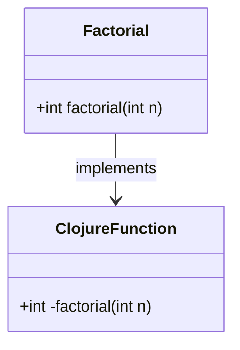

## 15.2. Writing Clojure Libraries for Other JVM Languages

Clojure, a dynamic, functional language that runs on the Java Virtual Machine (JVM), offers a unique opportunity to create libraries that can be used across various JVM languages, such as Java, Scala, Kotlin, and Groovy. This capability promotes code reuse and allows developers to leverage Clojure's strengths in functional programming and concurrency in a broader ecosystem. In this section, we will explore the considerations and techniques for writing Clojure libraries that can be effectively consumed by other JVM languages.

### Designing Libraries for Cross-Language Use

When designing Clojure libraries intended for use by other JVM languages, several key considerations must be taken into account:

1. **API Design**: Ensure that the library's API is intuitive and easy to use from non-Clojure languages. This often involves providing Java-friendly interfaces and avoiding Clojure-specific idioms that may not translate well.

2. **Documentation**: Comprehensive documentation is crucial. Non-Clojure developers may not be familiar with Clojure's syntax and paradigms, so clear examples and usage instructions are essential.

3. **Packaging and Distribution**: The library should be packaged in a way that is compatible with standard JVM build tools like Maven and Gradle. This includes generating JAR files and providing necessary metadata.

4. **Error Handling**: Consider how errors and exceptions are handled and propagated across language boundaries. Ensure that exceptions thrown by Clojure code are meaningful and can be caught and handled appropriately in other languages.

5. **Performance Considerations**: Be mindful of performance implications, especially when dealing with dynamic typing and reflection, which can introduce overhead.

### Exposing Clojure Functions as Java-Compatible APIs

To make Clojure functions accessible from Java or other JVM languages, you need to expose them in a way that is compatible with Java's type system. This typically involves:

- **Defining Java Interfaces**: Create Java interfaces that define the contract for the functionality you want to expose. These interfaces will serve as the bridge between Clojure and Java.

- **Implementing Interfaces in Clojure**: Use Clojure's `gen-class` or `proxy` to implement these interfaces. This allows you to provide concrete implementations of the interface methods using Clojure functions.

- **Handling Data Types**: Ensure that data types used in the API are compatible with Java. This may involve converting Clojure data structures to Java collections or using primitive types.

#### Example: Exposing a Clojure Function to Java

Let's consider a simple example where we expose a Clojure function that calculates the factorial of a number to Java.

```clojure
(ns mylib.core
  (:gen-class
   :name mylib.Factorial
   :methods [[factorial [int] int]]))

(defn -factorial [n]
  (reduce * (range 1 (inc n))))
```

In this example, we define a Clojure namespace `mylib.core` and use `:gen-class` to generate a Java class `mylib.Factorial` with a method `factorial` that takes an integer and returns an integer. The `-factorial` function implements the method, calculating the factorial using Clojure's `reduce` function.

#### Java Usage

```java
import mylib.Factorial;

public class Main {
    public static void main(String[] args) {
        Factorial factorial = new Factorial();
        int result = factorial.factorial(5);
        System.out.println("Factorial of 5 is: " + result);
    }
}
```

In the Java code, we import the `mylib.Factorial` class and use it like any other Java class. The Clojure function is seamlessly integrated into the Java application.

### Compiling and Packaging Clojure Code for Distribution

To distribute your Clojure library, you need to compile it into a JAR file that can be consumed by other JVM languages. This involves several steps:

1. **Project Setup**: Use a build tool like Leiningen or `tools.deps` to manage dependencies and build configurations.

2. **Compilation**: Compile the Clojure code into Java bytecode. This is typically done using the `lein uberjar` command in Leiningen, which packages the compiled code and all dependencies into a single JAR file.

3. **Metadata**: Ensure that the JAR file includes necessary metadata, such as the `pom.xml` for Maven or `build.gradle` for Gradle, to facilitate integration with other projects.

4. **Publishing**: Publish the JAR file to a repository like Clojars or Maven Central, making it accessible to other developers.

### Challenges with Dynamic Typing and Reflection

Clojure's dynamic typing and reliance on reflection can pose challenges when integrating with statically-typed JVM languages. Here are some strategies to mitigate these challenges:

- **Type Hints**: Use type hints in Clojure to reduce reflection overhead and improve performance. Type hints provide the compiler with information about the expected types of function arguments and return values.

- **Explicit Type Conversion**: Convert Clojure data structures to Java-compatible types explicitly when necessary. This ensures that the data is in a format that other JVM languages can work with.

- **Performance Testing**: Conduct performance testing to identify and address any bottlenecks caused by dynamic typing or reflection.

### Documentation and Usability for Non-Clojure Developers

To make your Clojure library accessible to non-Clojure developers, focus on the following documentation and usability aspects:

- **Comprehensive API Documentation**: Provide detailed API documentation, including method signatures, expected inputs and outputs, and example usage in both Clojure and Java.

- **Code Examples**: Include code examples in multiple JVM languages to demonstrate how to use the library effectively.

- **User Guides**: Create user guides that explain the library's functionality, installation, and configuration in a step-by-step manner.

- **Community Support**: Foster a community around your library by providing support channels, such as forums or chat rooms, where users can ask questions and share knowledge.

### Try It Yourself

To deepen your understanding, try modifying the example code to expose additional Clojure functions to Java. Experiment with different data types and explore how they are handled across the language boundary. Consider creating a small library that performs a specific task and document it for use by Java developers.

### Visualizing Clojure and Java Interoperability

To better understand the interaction between Clojure and Java, let's visualize the process using a class diagram.



This diagram illustrates how the `Factorial` class in Java interacts with the Clojure function `-factorial`. The `Factorial` class implements the interface defined by the Clojure function, allowing seamless integration between the two languages.

### References and Links

- [Clojure Documentation](https://clojure.org/reference/documentation)
- [Leiningen](https://leiningen.org/)
- [Clojars](https://clojars.org/)
- [Java Interoperability](https://clojure.org/reference/java_interop)

### Knowledge Check

To reinforce your understanding, consider the following questions and exercises:

- What are the key considerations when designing a Clojure library for use by other JVM languages?
- How can you expose a Clojure function to Java?
- What are some challenges associated with dynamic typing and reflection in Clojure?
- Create a simple Clojure library and document its usage for Java developers.

## **Ready to Test Your Knowledge?**



### What is a key consideration when designing Clojure libraries for other JVM languages?

- [x] API design
- [ ] Using only Clojure-specific idioms
- [ ] Avoiding documentation
- [ ] Ignoring performance

> **Explanation:** API design is crucial to ensure that the library is intuitive and easy to use from non-Clojure languages.

### How can you expose a Clojure function to Java?

- [x] By using `gen-class` to generate a Java-compatible class
- [ ] By writing the function in Java
- [ ] By using Clojure-specific data structures
- [ ] By avoiding type hints

> **Explanation:** `gen-class` is used to generate a Java-compatible class that can expose Clojure functions to Java.

### What is a common challenge when integrating Clojure with statically-typed JVM languages?

- [x] Dynamic typing and reflection
- [ ] Lack of JVM support
- [ ] Incompatibility with Java collections
- [ ] Absence of build tools

> **Explanation:** Dynamic typing and reflection can introduce overhead and challenges when integrating with statically-typed languages.

### Which tool is commonly used to compile and package Clojure code?

- [x] Leiningen
- [ ] Maven
- [ ] Gradle
- [ ] Ant

> **Explanation:** Leiningen is a popular build tool for Clojure that is used to compile and package Clojure code.

### What is the purpose of type hints in Clojure?

- [x] To reduce reflection overhead
- [ ] To increase reflection overhead
- [ ] To convert Java code to Clojure
- [ ] To avoid using Java interfaces

> **Explanation:** Type hints provide the compiler with information about expected types, reducing reflection overhead.

### Why is documentation important for Clojure libraries intended for other JVM languages?

- [x] Non-Clojure developers may not be familiar with Clojure's syntax
- [ ] Documentation is not important
- [ ] Clojure libraries are self-explanatory
- [ ] To avoid using Java

> **Explanation:** Comprehensive documentation helps non-Clojure developers understand how to use the library effectively.

### What is a benefit of packaging Clojure libraries as JAR files?

- [x] Compatibility with standard JVM build tools
- [ ] Incompatibility with Maven
- [ ] Avoiding Java integration
- [ ] Limiting library distribution

> **Explanation:** Packaging as JAR files ensures compatibility with standard JVM build tools like Maven and Gradle.

### How can you handle data types when exposing Clojure functions to Java?

- [x] Convert Clojure data structures to Java collections
- [ ] Use only Clojure-specific data types
- [ ] Avoid type conversion
- [ ] Use Java-specific data structures only

> **Explanation:** Converting Clojure data structures to Java collections ensures compatibility with Java.

### What is a common tool for publishing Clojure libraries?

- [x] Clojars
- [ ] GitHub
- [ ] Docker
- [ ] Jenkins

> **Explanation:** Clojars is a popular repository for publishing Clojure libraries.

### True or False: Clojure's dynamic typing can introduce performance overhead.

- [x] True
- [ ] False

> **Explanation:** Clojure's dynamic typing can introduce performance overhead, especially when reflection is involved.



Remember, this is just the beginning. As you progress, you'll build more complex and interactive libraries. Keep experimenting, stay curious, and enjoy the journey!
