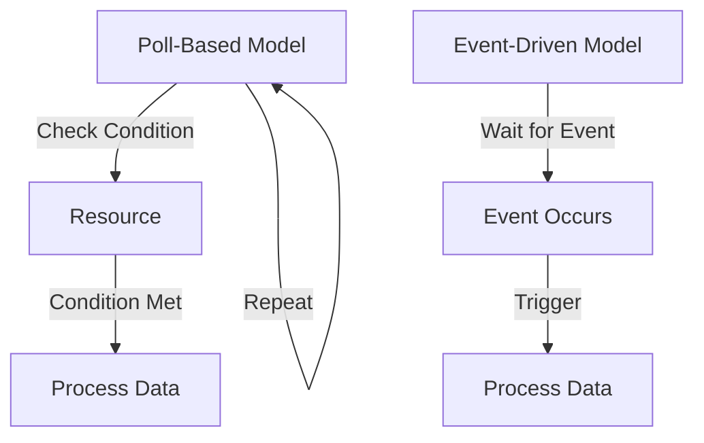

## 15.2 Poll-Based Concurrency Models in Clojure

### Introduction

Poll-based concurrency models have been a traditional approach to managing concurrent tasks in software development. These models involve actively checking for conditions or data availability, which can lead to inefficiencies such as increased resource consumption and latency. In the context of Clojure, a language that thrives on immutability and functional paradigms, poll-based models are often considered obsolete. This section explores the drawbacks of polling and highlights modern alternatives like event-driven and reactive models that align better with Clojure's strengths.

### Detailed Explanation

#### Understanding Poll-Based Concurrency

Poll-based concurrency involves repeatedly checking a condition or querying a resource to determine if a task can proceed. This approach can be likened to a busy-wait loop, where a program continuously checks for a condition to be met, often leading to wasted CPU cycles and increased latency.

**Example of Inefficient Polling:**

```clojure
;; Inefficient polling example:
(while (not (condition-met?))
  (Thread/sleep 100))
```

In this example, the program repeatedly checks if a condition is met, pausing briefly between checks. This can lead to high CPU usage and delayed responses, especially if the polling interval is not well-tuned.

#### Drawbacks of Poll-Based Concurrency

1. **Resource Consumption:** Polling can consume significant CPU resources, as the system is constantly checking for conditions rather than waiting for events.
2. **Latency:** The delay between polling intervals can introduce latency, making the system less responsive.
3. **Complexity:** Managing polling intervals and conditions can add complexity to the codebase, making it harder to maintain and debug.

### Modern Alternatives to Poll-Based Concurrency

#### Event-Driven Concurrency with `core.async`

Clojure's `core.async` library provides a powerful abstraction for managing concurrency through channels, allowing processes to communicate asynchronously without polling.

**Using `core.async` Channels:**

```clojure
(require '[clojure.core.async :refer [chan go <! >!]])

(def ch (chan))

;; Producer
(go
  (>! ch (get-data)))

;; Consumer
(go
  (let [data (<! ch)]
    (process-data data)))
```

In this example, a producer sends data to a channel, and a consumer retrieves it asynchronously. This model eliminates the need for polling by leveraging channels to handle data flow.

#### Callbacks and Listeners

Callbacks allow functions to be registered and executed when specific events occur, providing a more efficient alternative to polling.

**Example of Using Callbacks:**

```clojure
(defn fetch-data [callback]
  ;; Simulate asynchronous operation
  (future
    (let [data (get-data)]
      (callback data))))

(fetch-data process-data)
```

Here, `fetch-data` accepts a callback function that processes data once it is retrieved, avoiding the need for continuous checking.

#### Reactive Streams with Libraries like `manifold`

Reactive programming models, such as those provided by the `manifold` library, offer a declarative approach to handling asynchronous data flows.

**Implementing Reactive Streams:**

```clojure
(require '[manifold.deferred :as d])

(def deferred (d/deferred))

(d/chain deferred
         (fn [data] (process data))
         (fn [result] (println "Result:" result)))

(d/success! deferred (get-data))
```

In this example, a deferred object represents a future value, and a chain of functions processes the data once it becomes available, promoting a clean and efficient handling of asynchronous operations.

### Visual Aids

#### Conceptual Diagram: Poll-Based vs. Event-Driven Models



### Use Cases

- **Real-Time Data Processing:** Event-driven models are ideal for applications requiring real-time data processing, such as financial trading platforms or IoT systems.
- **Responsive User Interfaces:** Using callbacks and reactive streams can enhance the responsiveness of user interfaces by reacting to user inputs and system events efficiently.

### Advantages and Disadvantages

#### Advantages of Event-Driven Models

- **Efficiency:** Reduces CPU usage by eliminating unnecessary polling.
- **Responsiveness:** Improves system responsiveness by reacting to events as they occur.
- **Simplicity:** Simplifies code by abstracting concurrency management.

#### Disadvantages

- **Complexity in Debugging:** Asynchronous code can be harder to debug due to non-linear execution flow.
- **Learning Curve:** Requires understanding of new paradigms and libraries.

### Best Practices

- **Leverage `core.async`:** Use channels to manage data flow between concurrent processes.
- **Adopt Reactive Programming:** Utilize libraries like `manifold` for declarative handling of asynchronous data.
- **Avoid Busy-Wait Loops:** Replace polling with event-driven mechanisms to enhance performance.

### Comparisons

- **Polling vs. Event-Driven:** Polling is resource-intensive and introduces latency, while event-driven models are efficient and responsive.
- **Callbacks vs. Reactive Streams:** Callbacks provide simple event handling, whereas reactive streams offer a more powerful and flexible approach to managing data flows.

### Conclusion

Poll-based concurrency models are largely considered obsolete in modern Clojure applications due to their inefficiencies and complexity. By adopting event-driven and reactive paradigms, developers can create more efficient, responsive, and maintainable systems. Leveraging tools like `core.async` and libraries such as `manifold` allows for a seamless transition to these modern concurrency models, aligning with Clojure's functional programming ethos.

## Quiz Time!



### What is a primary drawback of poll-based concurrency models?

- [x] High resource consumption
- [ ] Simplified code structure
- [ ] Enhanced responsiveness
- [ ] Reduced latency

> **Explanation:** Poll-based models consume significant CPU resources due to continuous condition checking.

### Which Clojure library provides channels for event-driven concurrency?

- [x] core.async
- [ ] manifold
- [ ] clojure.spec
- [ ] ring

> **Explanation:** `core.async` provides channels for managing concurrency in an event-driven manner.

### How do callbacks improve concurrency handling?

- [x] By executing functions when events occur
- [ ] By continuously checking conditions
- [ ] By increasing CPU usage
- [ ] By introducing latency

> **Explanation:** Callbacks allow functions to be executed in response to events, eliminating the need for polling.

### What is a benefit of using reactive streams?

- [x] Declarative handling of asynchronous data
- [ ] Increased complexity
- [ ] Higher resource consumption
- [ ] Reduced responsiveness

> **Explanation:** Reactive streams offer a declarative approach to managing asynchronous data flows efficiently.

### Which library can be used for reactive programming in Clojure?

- [x] manifold
- [ ] core.async
- [ ] clojure.test
- [ ] clojure.java.io

> **Explanation:** `manifold` provides tools for reactive programming in Clojure.

### What is a common issue with busy-wait loops?

- [x] High CPU usage
- [ ] Improved performance
- [ ] Simplified debugging
- [ ] Enhanced code readability

> **Explanation:** Busy-wait loops consume a lot of CPU resources due to constant condition checking.

### How can `core.async` channels improve concurrency?

- [x] By facilitating asynchronous communication
- [ ] By increasing polling frequency
- [ ] By simplifying busy-wait loops
- [ ] By reducing event handling

> **Explanation:** `core.async` channels allow for asynchronous communication between processes, eliminating the need for polling.

### What is a disadvantage of event-driven models?

- [x] Complexity in debugging
- [ ] High resource consumption
- [ ] Increased latency
- [ ] Simplified concurrency management

> **Explanation:** Event-driven models can be harder to debug due to their asynchronous nature.

### Which of the following is NOT a modern alternative to polling?

- [ ] core.async
- [ ] Callbacks
- [ ] Reactive streams
- [x] Busy-wait loops

> **Explanation:** Busy-wait loops are a form of polling, not a modern alternative.

### True or False: Poll-based concurrency models are efficient and preferred in modern Clojure applications.

- [ ] True
- [x] False

> **Explanation:** Poll-based models are inefficient and generally not preferred in modern Clojure applications due to their resource consumption and latency issues.


