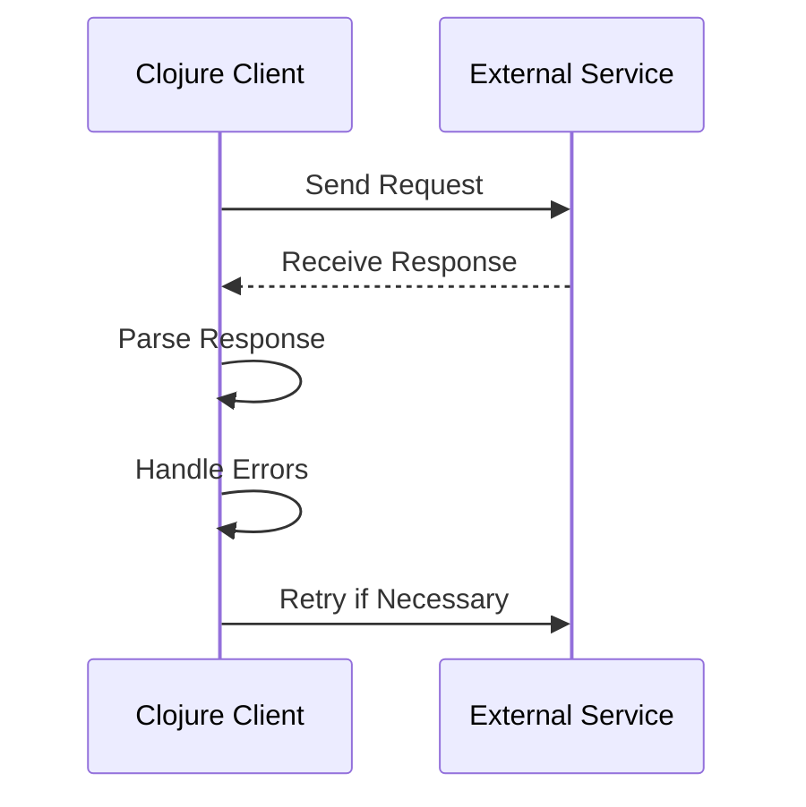

## 15.3. Communicating with External Services

In today's interconnected world, applications often need to communicate with external services to fetch data, perform operations, or integrate with third-party platforms. Clojure, with its rich ecosystem and interoperability with Java, provides robust tools for handling such interactions. In this section, we will explore how to effectively communicate with external services using Clojure, focusing on HTTP clients, data parsing, authentication, and error handling.

### Understanding HTTP Clients in Clojure

HTTP clients are essential for interacting with RESTful services. In Clojure, `clj-http` is a popular choice for making HTTP requests. It is built on Apache HttpComponents and provides a simple interface for sending requests and handling responses.

#### Using `clj-http` for RESTful Services

To get started with `clj-http`, add it to your project dependencies:

```clojure
;; project.clj
(defproject my-project "0.1.0-SNAPSHOT"
  :dependencies [[org.clojure/clojure "1.10.3"]
                 [clj-http "3.12.3"]])
```

Here's a basic example of making a GET request:

```clojure
(ns my-project.core
  (:require [clj-http.client :as client]))

(defn fetch-data [url]
  (let [response (client/get url)]
    (println (:status response))
    (println (:body response))))

(fetch-data "https://api.example.com/data")
```

**Key Points:**
- The `client/get` function sends a GET request to the specified URL.
- The response is a map containing keys like `:status`, `:headers`, and `:body`.

#### Handling Authentication

Many APIs require authentication. `clj-http` supports various authentication methods, including Basic Auth and OAuth.

**Basic Authentication Example:**

```clojure
(defn fetch-secure-data [url username password]
  (let [response (client/get url
                             {:basic-auth [username password]})]
    (println (:status response))
    (println (:body response))))

(fetch-secure-data "https://secure.api.example.com/data" "user" "pass")
```

**OAuth Example:**

For OAuth, you might need to use additional libraries like `clj-oauth` to handle token generation and management.

### Consuming SOAP Services

While RESTful services are prevalent, some legacy systems still use SOAP. Clojure can interact with SOAP services using libraries like `clj-soap`.

**Example of Consuming a SOAP Service:**

```clojure
(ns my-project.soap
  (:require [clj-soap.core :as soap]))

(defn call-soap-service [wsdl-url operation params]
  (let [client (soap/client wsdl-url)
        response (soap/call client operation params)]
    (println response)))

(call-soap-service "http://example.com/service?wsdl" "GetInfo" {:param1 "value1"})
```

### Parsing and Generating Data Formats

Data exchange often involves formats like JSON and XML. Clojure provides libraries for parsing and generating these formats.

#### Working with JSON

`cheshire` is a widely-used library for JSON in Clojure.

**Parsing JSON:**

```clojure
(ns my-project.json
  (:require [cheshire.core :as json]))

(def json-data "{\"name\": \"John\", \"age\": 30}")

(defn parse-json [data]
  (json/parse-string data true))

(println (parse-json json-data))
```

**Generating JSON:**

```clojure
(defn generate-json [data]
  (json/generate-string data))

(println (generate-json {:name "John" :age 30}))
```

#### Working with XML

`clojure.data.xml` is a library for handling XML.

**Parsing XML:**

```clojure
(ns my-project.xml
  (:require [clojure.data.xml :as xml]))

(def xml-data "<person><name>John</name><age>30</age></person>")

(defn parse-xml [data]
  (xml/parse-str data))

(println (parse-xml xml-data))
```

**Generating XML:**

```clojure
(defn generate-xml [data]
  (xml/emit-str data))

(println (generate-xml {:tag :person :content [{:tag :name :content ["John"]}
                                                {:tag :age :content ["30"]}]}))
```

### Handling Authentication and Rate Limiting

When communicating with external services, handling authentication and rate limiting is crucial to ensure smooth operation and avoid service disruptions.

#### Authentication Strategies

- **API Keys**: Simple and often used for public APIs. Include the key in the request headers.
- **OAuth**: More secure, used for accessing user data. Requires token management.

#### Rate Limiting

APIs often impose rate limits to prevent abuse. Implement strategies to handle rate limits gracefully:

- **Retry with Backoff**: Implement exponential backoff to retry requests after a delay.
- **Throttling**: Limit the number of requests your application sends to stay within limits.

### Error Handling and Retries

Network communication is prone to errors. Implement robust error handling to manage failures gracefully.

#### Error Handling Patterns

- **Retry Logic**: Automatically retry failed requests with a delay.
- **Circuit Breaker**: Temporarily stop requests to a failing service to prevent overload.

**Retry Example:**

```clojure
(defn fetch-with-retry [url retries]
  (try
    (client/get url)
    (catch Exception e
      (if (pos? retries)
        (do
          (Thread/sleep 1000) ; wait for 1 second
          (recur url (dec retries)))
        (throw e)))))
```

### Visualizing Communication with External Services

To better understand the flow of communication with external services, let's visualize the process using a sequence diagram.



**Diagram Description:** This sequence diagram illustrates the interaction between a Clojure client and an external service, highlighting the steps of sending a request, receiving a response, parsing the response, handling errors, and retrying if necessary.

### Best Practices for Communicating with External Services

- **Use Asynchronous Requests**: For non-blocking operations, consider using libraries like `core.async` to handle requests asynchronously.
- **Cache Responses**: Cache frequently accessed data to reduce the number of requests.
- **Monitor and Log**: Implement logging to monitor request and response data for debugging and analysis.
- **Secure Communication**: Use HTTPS to encrypt data in transit and protect sensitive information.

### Try It Yourself

Experiment with the provided code examples by modifying the URLs, parameters, and authentication methods. Try implementing additional features like caching or logging to enhance the functionality.

### Further Reading

- [clj-http Documentation](https://github.com/dakrone/clj-http)
- [Cheshire JSON Library](https://github.com/dakrone/cheshire)
- [Clojure Data XML](https://github.com/clojure/data.xml)
- [OAuth in Clojure](https://github.com/mattrepl/clj-oauth)

## **Ready to Test Your Knowledge?**



### What is the primary library used for HTTP requests in Clojure?

- [x] clj-http
- [ ] clj-soap
- [ ] cheshire
- [ ] core.async

> **Explanation:** `clj-http` is the primary library used for making HTTP requests in Clojure.

### Which library is commonly used for JSON parsing in Clojure?

- [x] cheshire
- [ ] clj-http
- [ ] clj-soap
- [ ] clojure.data.xml

> **Explanation:** `cheshire` is a popular library for parsing and generating JSON in Clojure.

### What method does `clj-http` use for Basic Authentication?

- [x] :basic-auth
- [ ] :oauth
- [ ] :api-key
- [ ] :token-auth

> **Explanation:** `clj-http` uses the `:basic-auth` option to handle Basic Authentication.

### How can you handle rate limiting when communicating with external services?

- [x] Implement retry with backoff
- [ ] Ignore rate limits
- [ ] Increase request frequency
- [ ] Use only synchronous requests

> **Explanation:** Implementing retry with backoff is a strategy to handle rate limiting by retrying requests after a delay.

### What is a common strategy for handling unreliable network connections?

- [x] Retry logic
- [ ] Ignore errors
- [ ] Increase timeout
- [ ] Use only GET requests

> **Explanation:** Retry logic is a common strategy to handle network errors by attempting to resend requests.

### Which library would you use to consume SOAP services in Clojure?

- [x] clj-soap
- [ ] clj-http
- [ ] cheshire
- [ ] core.async

> **Explanation:** `clj-soap` is used to interact with SOAP services in Clojure.

### What is the purpose of the `core.async` library in the context of HTTP requests?

- [x] To handle requests asynchronously
- [ ] To parse JSON
- [ ] To authenticate requests
- [ ] To generate XML

> **Explanation:** `core.async` is used to handle HTTP requests asynchronously, allowing non-blocking operations.

### What is a benefit of using HTTPS for communication with external services?

- [x] Encrypts data in transit
- [ ] Increases request speed
- [ ] Reduces server load
- [ ] Simplifies authentication

> **Explanation:** HTTPS encrypts data in transit, providing security for sensitive information.

### Which of the following is a best practice for handling API responses?

- [x] Cache frequently accessed data
- [ ] Always retry failed requests
- [ ] Use only synchronous requests
- [ ] Ignore error codes

> **Explanation:** Caching frequently accessed data reduces the number of requests and improves performance.

### True or False: `clj-http` can handle both synchronous and asynchronous requests.

- [x] True
- [ ] False

> **Explanation:** `clj-http` primarily handles synchronous requests, but can be used in conjunction with `core.async` for asynchronous operations.



Remember, mastering communication with external services in Clojure is a journey. Keep experimenting, stay curious, and enjoy the process of building robust and efficient applications!
