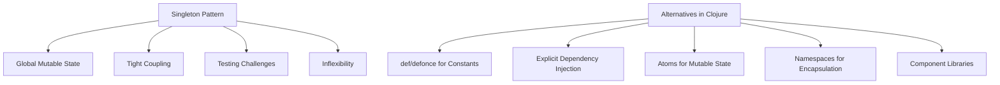

## 15.3 Classic Singleton in Clojure

### Introduction

The Singleton pattern is a classic design pattern that ensures a class has only one instance and provides a global point of access to it. While this pattern is prevalent in object-oriented programming languages, its application in Clojure, a functional programming language, is generally discouraged. This article explores why the Singleton pattern is considered obsolete in Clojure and presents more flexible and idiomatic alternatives for managing state and dependencies.

### Detailed Explanation

#### The Singleton Pattern: A Brief Overview

The Singleton pattern is designed to restrict the instantiation of a class to a single object. This is typically achieved by:

1. **Private Constructor:** Preventing external instantiation.
2. **Static Method:** Providing a global access point to the instance.
3. **Lazy Initialization:** Creating the instance only when needed.

While this approach can be useful for managing shared resources like configuration settings or logging, it introduces several limitations.

#### Limitations of the Singleton Pattern

1. **Global Mutable State:** Singletons often rely on global mutable state, which is discouraged in functional programming due to potential side effects and concurrency issues.
2. **Tight Coupling:** Singletons can lead to tight coupling between components, making the system harder to test and maintain.
3. **Testing Challenges:** Mocking or replacing Singletons in tests can be difficult, hindering testability.
4. **Inflexibility:** Singletons are rigid in their design, making it challenging to adapt to changing requirements or configurations.

### Alternatives to the Singleton Pattern in Clojure

Clojure offers several idiomatic alternatives to the Singleton pattern that align with its functional programming principles:

#### 1. Avoid Using Singletons for Global State

Instead of creating single-instance classes or objects, consider using other mechanisms to manage shared resources.

#### 2. Use `def` or `defonce` for Constants and Immutable Data

Clojure's `def` and `defonce` are ideal for defining constants and immutable data structures. These constructs ensure that data is initialized once and remains unchanged, promoting immutability.

```clojure
(def config
  {:db-url "jdbc:postgresql://localhost:5432/mydb"
   :api-key "secret-key"})

(defonce logger (initialize-logger))
```

#### 3. Pass Dependencies Explicitly

Explicitly passing dependencies into functions or components enhances modularity and testability. This approach aligns with the dependency injection principle, allowing for greater flexibility.

```clojure
(defn process-request [db-conn request]
  ;; Use db-conn here
  )
```

#### 4. Use Atoms for Managed Mutable State (if necessary)

When mutable state is necessary, Clojure's `atom` provides a thread-safe way to manage state changes. Atoms allow for controlled updates using functions like `swap!`.

```clojure
(def app-state (atom {}))

;; Update state
(swap! app-state assoc :key value)
```

#### 5. Leverage Namespaces to Encapsulate State

Namespaces in Clojure can encapsulate related functions and state, providing a clean separation of concerns. This approach helps manage state without resorting to global variables.

```clojure
;; In myapp.logger namespace
(ns myapp.logger)

(defonce ^:private logger-instance (initialize-logger))

(defn log [level message]
  (send-to-logger logger-instance level message))
```

#### 6. Consider Component Libraries for Lifecycle Management

Libraries like `mount` or `component` offer robust solutions for managing stateful resources and their lifecycles. These libraries facilitate dependency injection and promote modular design.

```clojure
(require '[mount.core :as mount])

(mount/defstate database
  :start (connect-to-db config)
  :stop (disconnect-from-db database))
```

### Visual Aids

#### Conceptual Diagram: Singleton vs. Alternatives



### Use Cases

While the Singleton pattern is generally discouraged in Clojure, there are scenarios where its alternatives shine:

- **Configuration Management:** Use `def` or `defonce` to store configuration settings that remain constant throughout the application's lifecycle.
- **Logging:** Encapsulate logging functionality within a namespace, using `defonce` to initialize the logger once.
- **Database Connections:** Pass database connections explicitly to functions that require them, enhancing testability and flexibility.

### Advantages and Disadvantages

#### Advantages of Alternatives

- **Immutability:** Promotes immutable data structures, reducing side effects.
- **Testability:** Enhances testability by avoiding global state.
- **Flexibility:** Allows for easy adaptation to changing requirements.

#### Disadvantages of Alternatives

- **Complexity:** May introduce complexity in managing dependencies explicitly.
- **Learning Curve:** Requires understanding of functional programming principles and Clojure's concurrency primitives.

### Best Practices

- **Favor Immutability:** Use immutable data structures wherever possible to ensure thread safety.
- **Encapsulate State:** Use namespaces to encapsulate related functions and state, promoting modular design.
- **Leverage Libraries:** Utilize libraries like `mount` or `component` for managing stateful resources and their lifecycles.

### Conclusion

The Classic Singleton pattern, while useful in certain contexts, is largely obsolete in Clojure due to its emphasis on global mutable state and tight coupling. By leveraging Clojure's functional programming features and modern libraries, developers can achieve more flexible, testable, and maintainable designs. Embracing these alternatives not only aligns with Clojure's philosophy but also enhances the overall quality of the codebase.

## Quiz Time!



### What is the primary purpose of the Singleton pattern?

- [x] To ensure a class has only one instance and provide a global access point
- [ ] To allow multiple instances of a class
- [ ] To encapsulate related functions and state
- [ ] To manage state changes in a thread-safe manner

> **Explanation:** The Singleton pattern is designed to restrict a class to a single instance and provide a global point of access to it.

### Why is the Singleton pattern discouraged in Clojure?

- [x] It relies on global mutable state, which is discouraged in functional programming
- [ ] It promotes immutability
- [ ] It enhances testability
- [ ] It simplifies dependency management

> **Explanation:** The Singleton pattern is discouraged in Clojure because it relies on global mutable state, which can lead to side effects and concurrency issues.

### Which Clojure construct is recommended for defining constants?

- [x] def
- [ ] atom
- [ ] ref
- [ ] agent

> **Explanation:** The `def` construct is used to define constants and immutable data structures in Clojure.

### What is a key advantage of passing dependencies explicitly in Clojure?

- [x] It enhances modularity and testability
- [ ] It simplifies code
- [ ] It promotes global state
- [ ] It reduces code complexity

> **Explanation:** Passing dependencies explicitly enhances modularity and testability by avoiding global state and tight coupling.

### Which Clojure construct is suitable for managing mutable state?

- [x] atom
- [ ] def
- [ ] defonce
- [ ] namespace

> **Explanation:** The `atom` construct is suitable for managing mutable state in a thread-safe manner in Clojure.

### What is the role of namespaces in Clojure?

- [x] To encapsulate related functions and state
- [ ] To manage global state
- [ ] To ensure a single instance of a class
- [ ] To simplify dependency injection

> **Explanation:** Namespaces in Clojure are used to encapsulate related functions and state, promoting modular design.

### Which library is recommended for managing stateful resources in Clojure?

- [x] mount
- [ ] core.async
- [ ] clojure.spec
- [ ] ring

> **Explanation:** The `mount` library is recommended for managing stateful resources and their lifecycles in Clojure.

### What is a disadvantage of using alternatives to the Singleton pattern?

- [x] It may introduce complexity in managing dependencies explicitly
- [ ] It promotes global mutable state
- [ ] It reduces testability
- [ ] It leads to tight coupling

> **Explanation:** Using alternatives to the Singleton pattern may introduce complexity in managing dependencies explicitly.

### Which of the following is NOT a limitation of the Singleton pattern?

- [x] Promotes immutability
- [ ] Relies on global mutable state
- [ ] Leads to tight coupling
- [ ] Hinders testing

> **Explanation:** The Singleton pattern does not promote immutability; it often relies on global mutable state.

### True or False: The Singleton pattern is considered obsolete in Clojure.

- [x] True
- [ ] False

> **Explanation:** The Singleton pattern is considered obsolete in Clojure due to its reliance on global mutable state and tight coupling.


