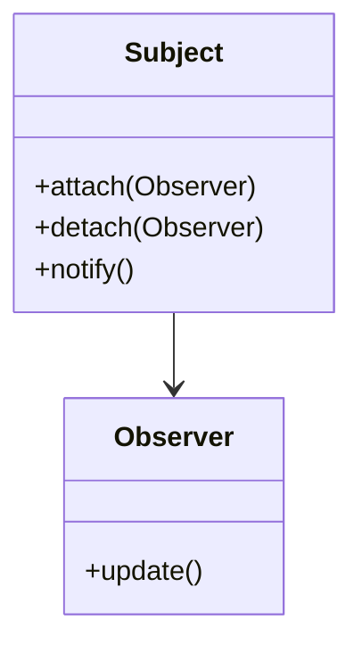
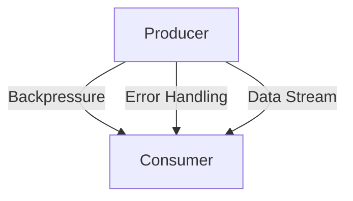

## 15.4 Classic Observer vs. Reactive Streams in Clojure

In the realm of software design patterns, the Observer pattern has long been a staple for implementing event-driven systems. However, as applications have evolved to require more sophisticated handling of asynchronous data flows, reactive streams have emerged as a more robust alternative. This article delves into the nuances of the classic Observer pattern and contrasts it with reactive streams, particularly within the context of Clojure, leveraging libraries like `core.async` and `manifold`.

### Introduction

The Observer pattern is a behavioral design pattern that defines a one-to-many dependency between objects. When one object changes state, all its dependents are notified and updated automatically. While this pattern is effective for simple scenarios, it falls short in handling complex asynchronous workflows, especially those requiring backpressure and error management.

Reactive streams, on the other hand, provide a more comprehensive framework for handling asynchronous data streams. They offer built-in support for backpressure, error handling, and composability, making them ideal for modern, non-blocking applications.

### Detailed Explanation

#### Classic Observer Pattern

The classic Observer pattern involves two main components: the subject and the observers. The subject maintains a list of observers and notifies them of any state changes.

**Limitations of the Classic Observer Pattern:**

- **Memory Leaks:** Unsubscribed observers can lead to memory leaks if not properly managed.
- **Lack of Backpressure:** The pattern does not inherently support backpressure, which can result in system overload if the producer generates events faster than the consumer can handle.
- **Error Handling:** Error propagation is often rudimentary, lacking the sophistication needed for complex systems.

**Conceptual Diagram:**



#### Reactive Streams

Reactive streams address the shortcomings of the Observer pattern by introducing a more structured approach to handling data streams. They are designed to handle asynchronous data flows with backpressure, ensuring that the system remains responsive and efficient.

**Key Features of Reactive Streams:**

- **Backpressure:** Allows consumers to signal to producers about their capacity to handle data, preventing overload.
- **Error Handling:** Provides mechanisms for propagating and handling errors gracefully.
- **Composability:** Supports complex transformations and operations on data streams.

**Architectural Diagram:**



### Implementing Reactive Streams in Clojure

Clojure offers powerful libraries like `core.async` and `manifold` to implement reactive streams, each providing unique features to manage asynchronous workflows effectively.

#### Using `core.async`

`core.async` is a Clojure library that provides facilities for asynchronous programming using channels, which can be used to implement reactive streams with backpressure.

**Example:**

```clojure
(require '[clojure.core.async :refer [chan >! <! go]])

(def buffer-size 10)
(def ch (chan buffer-size))

;; Producer
(go
  (doseq [event (range 100)]
    (>! ch event)))

;; Consumer
(go
  (while true
    (let [event (<! ch)]
      (println "Processing event:" event))))
```

In this example, a channel with a specified buffer size is used to manage the flow of events, ensuring that the consumer processes events at its own pace.

#### Using `manifold`

`manifold` is another Clojure library that provides advanced stream processing capabilities, including built-in support for backpressure and stream transformations.

**Example:**

```clojure
(require '[manifold.stream :as s])

(def source (s/stream))

;; Producer
(s/put! source "event-1")

;; Consumer with backpressure
(def sink (s/consume
            (fn [event]
              (println "Processing event:" event))
            source))
```

`manifold` allows for more sophisticated stream operations, making it suitable for complex asynchronous workflows.

### Advantages and Disadvantages

**Classic Observer Pattern:**

- **Advantages:**
  - Simple and easy to implement for basic use cases.
  - Well-suited for synchronous event handling.

- **Disadvantages:**
  - No built-in backpressure support.
  - Potential for memory leaks.
  - Limited error handling capabilities.

**Reactive Streams:**

- **Advantages:**
  - Supports backpressure, preventing overload.
  - Enhanced error handling and propagation.
  - Composable and flexible for complex workflows.

- **Disadvantages:**
  - More complex to implement and understand.
  - Requires additional libraries and infrastructure.

### Best Practices

- **Use Reactive Streams for Asynchronous Workflows:** Leverage the power of reactive streams for applications that require non-blocking, asynchronous data processing.
- **Manage Subscription Lifecycle:** Ensure that resources are properly managed and released when subscribers unsubscribe.
- **Handle Errors Gracefully:** Utilize the error handling capabilities of reactive streams to maintain system stability.

### Conclusion

While the classic Observer pattern remains useful for simple scenarios, reactive streams offer a more powerful and flexible approach for handling asynchronous data flows in modern applications. By leveraging libraries like `core.async` and `manifold`, Clojure developers can implement reactive streams that provide backpressure, error handling, and composability, making them well-suited for complex, non-blocking applications.

## Quiz Time!



### What is a key limitation of the classic Observer pattern?

- [x] Lack of backpressure control
- [ ] Complex implementation
- [ ] High memory usage
- [ ] Poor readability

> **Explanation:** The classic Observer pattern does not support backpressure, which can lead to system overload if the producer generates events faster than the consumer can handle.

### Which Clojure library provides facilities for asynchronous programming using channels?

- [x] core.async
- [ ] manifold
- [ ] clojure.spec
- [ ] ring

> **Explanation:** `core.async` is a Clojure library that provides facilities for asynchronous programming using channels.

### What is a primary advantage of reactive streams over the classic Observer pattern?

- [x] Support for backpressure
- [ ] Simplicity
- [ ] Synchronous processing
- [ ] Reduced memory usage

> **Explanation:** Reactive streams support backpressure, allowing consumers to signal their capacity to handle data, preventing overload.

### How does `manifold` enhance stream processing in Clojure?

- [x] Provides built-in support for backpressure and stream transformations
- [ ] Simplifies synchronous workflows
- [ ] Reduces code complexity
- [ ] Increases memory usage

> **Explanation:** `manifold` provides advanced stream processing capabilities, including built-in support for backpressure and stream transformations.

### What is a disadvantage of reactive streams?

- [x] More complex to implement and understand
- [ ] Lack of error handling
- [ ] No support for backpressure
- [ ] Limited to synchronous processing

> **Explanation:** Reactive streams are more complex to implement and understand compared to the classic Observer pattern.

### Which of the following is a feature of reactive streams?

- [x] Composability
- [ ] Synchronous event handling
- [ ] High memory usage
- [ ] Limited error handling

> **Explanation:** Reactive streams support composability, allowing for complex transformations and operations on data streams.

### What is a common issue with the classic Observer pattern?

- [x] Memory leaks due to unsubscribed observers
- [ ] High complexity
- [ ] Lack of flexibility
- [ ] Poor performance

> **Explanation:** The classic Observer pattern can lead to memory leaks if unsubscribed observers are not properly managed.

### Which library is suitable for complex asynchronous workflows in Clojure?

- [x] manifold
- [ ] clojure.core
- [ ] ring
- [ ] clojure.spec

> **Explanation:** `manifold` is suitable for complex asynchronous workflows, providing advanced stream processing capabilities.

### What does backpressure in reactive streams prevent?

- [x] System overload
- [ ] Memory leaks
- [ ] Code duplication
- [ ] Synchronous processing

> **Explanation:** Backpressure in reactive streams prevents system overload by allowing consumers to signal their capacity to handle data.

### True or False: Reactive streams are more suitable for asynchronous, non-blocking applications than the classic Observer pattern.

- [x] True
- [ ] False

> **Explanation:** Reactive streams are designed for asynchronous, non-blocking applications, providing features like backpressure and enhanced error handling.


