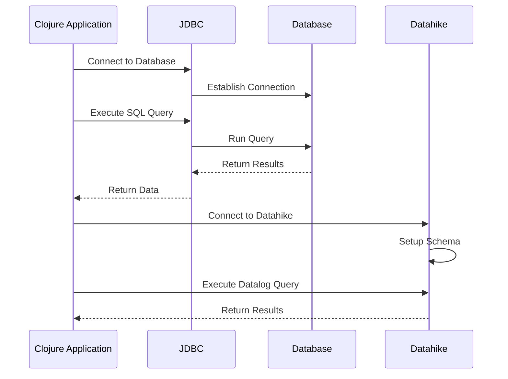

## 15.4. Working with Databases Using JDBC and Datahike

In modern software development, databases play a crucial role in storing and managing data. Clojure, with its functional programming paradigm, provides robust tools for interacting with both relational and graph databases. In this section, we will explore how to work with databases using JDBC (Java Database Connectivity) and Datahike, a durable Datalog database. We will cover connecting to databases, executing queries, managing transactions, and leveraging Datahike's graph-based data capabilities.

### Introduction to JDBC in Clojure

JDBC is a Java-based API that allows you to connect to a wide range of relational databases. Clojure, being a JVM language, can leverage JDBC to interact with databases like PostgreSQL, MySQL, and SQLite.

#### Connecting to a Database Using JDBC

To connect to a database using JDBC in Clojure, you need to include the necessary dependencies in your project. For example, to connect to a PostgreSQL database, you would add the following dependency to your `project.clj` file:

```clojure
:dependencies [[org.clojure/clojure "1.10.3"]
               [org.clojure/java.jdbc "0.7.12"]
               [org.postgresql/postgresql "42.2.18"]]
```

Next, you can establish a connection using the `clojure.java.jdbc` library:

```clojure
(ns myapp.database
  (:require [clojure.java.jdbc :as jdbc]))

(def db-spec
  {:dbtype "postgresql"
   :dbname "mydatabase"
   :host "localhost"
   :port 5432
   :user "myuser"
   :password "mypassword"})

(defn connect-to-db []
  (jdbc/get-connection db-spec))
```

#### Executing Queries and Managing Transactions

Once connected, you can execute SQL queries and manage transactions. The `clojure.java.jdbc` library provides functions like `query`, `insert!`, `update!`, and `delete!` to interact with the database.

```clojure
(defn fetch-users []
  (jdbc/query db-spec ["SELECT * FROM users"]))

(defn add-user [user]
  (jdbc/insert! db-spec :users user))

(defn update-user [id user]
  (jdbc/update! db-spec :users user ["id=?" id]))

(defn delete-user [id]
  (jdbc/delete! db-spec :users ["id=?" id]))

(defn transaction-example []
  (jdbc/with-db-transaction [tx db-spec]
    (jdbc/insert! tx :users {:name "Alice" :email "alice@example.com"})
    (jdbc/insert! tx :users {:name "Bob" :email "bob@example.com"})))
```

### Introduction to Datahike

Datahike is a durable Datalog database that provides graph-based data capabilities. It is built on top of Datomic's architecture and offers features like schema definition, immutability, and time travel.

#### Setting Up Datahike

To use Datahike, you need to add the following dependency to your `project.clj`:

```clojure
:dependencies [[org.clojure/clojure "1.10.3"]
               [com.github.replikativ/datahike "0.3.6"]]
```

#### Defining a Schema in Datahike

Datahike requires a schema to define the structure of your data. A schema is a collection of attributes that describe the types and constraints of your data.

```clojure
(ns myapp.datahike
  (:require [datahike.api :as d]))

(def schema
  [{:db/ident :person/name
    :db/valueType :db.type/string
    :db/cardinality :db.cardinality/one}
   {:db/ident :person/age
    :db/valueType :db.type/long
    :db/cardinality :db.cardinality/one}
   {:db/ident :person/friends
    :db/valueType :db.type/ref
    :db/cardinality :db.cardinality/many}])

(def config
  {:store {:backend :file
           :path "/path/to/datahike"}})

(defn setup-database []
  (d/create-database config)
  (d/connect config)
  (d/transact conn {:tx-data schema}))
```

#### Querying Data with Datahike

Datahike uses Datalog, a declarative query language, to interact with the database. You can perform complex queries using Datalog syntax.

```clojure
(defn find-persons-by-name [name]
  (d/q '[:find ?e
         :in $ ?name
         :where [?e :person/name ?name]]
       (d/db conn) name))

(defn add-person [name age]
  (d/transact conn {:tx-data [{:person/name name
                               :person/age age}]}))
```

### Best Practices for Performance and Security

When working with databases, it's essential to follow best practices to ensure performance and security.

- **Connection Pooling**: Use connection pooling to manage database connections efficiently.
- **Parameterized Queries**: Always use parameterized queries to prevent SQL injection attacks.
- **Indexing**: Create indexes on frequently queried fields to improve query performance.
- **Schema Design**: Design your schema carefully to accommodate future changes and scalability.
- **Data Encryption**: Encrypt sensitive data both at rest and in transit.

### Visualizing Database Interactions

To better understand the interaction between Clojure, JDBC, and Datahike, let's visualize the process using a sequence diagram.



### Try It Yourself

Now that we've covered the basics, it's time to try it yourself. Experiment with the code examples provided, and try modifying them to suit your needs. For instance, you can:

- Add more attributes to the Datahike schema.
- Implement additional SQL queries using JDBC.
- Explore Datahike's time travel feature by querying historical data.

### References and Links

- [Datahike GitHub Repository](https://github.com/replikativ/datahike)
- [Clojure JDBC Documentation](https://clojure.github.io/java.jdbc/)
- [Datalog Query Language](https://en.wikipedia.org/wiki/Datalog)

### Knowledge Check

To reinforce your understanding, let's test your knowledge with some questions.

## **Ready to Test Your Knowledge?**



### What is JDBC used for in Clojure?

- [x] Connecting to relational databases
- [ ] Managing in-memory data structures
- [ ] Building web applications
- [ ] Creating user interfaces

> **Explanation:** JDBC is used for connecting to relational databases in Clojure.

### Which library is used for executing SQL queries in Clojure?

- [x] clojure.java.jdbc
- [ ] clojure.core.async
- [ ] clojure.spec.alpha
- [ ] clojure.data.json

> **Explanation:** The `clojure.java.jdbc` library is used for executing SQL queries in Clojure.

### What is Datahike?

- [x] A durable Datalog database
- [ ] A web framework for Clojure
- [ ] A testing library
- [ ] A JSON parsing tool

> **Explanation:** Datahike is a durable Datalog database used for graph-based data.

### How do you define a schema in Datahike?

- [x] Using a collection of attributes
- [ ] By writing SQL statements
- [ ] Through XML configuration
- [ ] Using JSON files

> **Explanation:** In Datahike, a schema is defined using a collection of attributes.

### What is a best practice for preventing SQL injection?

- [x] Use parameterized queries
- [ ] Use plain SQL strings
- [ ] Disable database logging
- [ ] Increase connection timeout

> **Explanation:** Using parameterized queries is a best practice for preventing SQL injection.

### Which of the following is a feature of Datahike?

- [x] Time travel
- [ ] RESTful API support
- [ ] Built-in authentication
- [ ] Graphical user interface

> **Explanation:** Datahike supports time travel, allowing you to query historical data.

### What is the purpose of connection pooling?

- [x] Efficiently manage database connections
- [ ] Increase query execution speed
- [ ] Simplify schema design
- [ ] Enhance data encryption

> **Explanation:** Connection pooling is used to efficiently manage database connections.

### How can you improve query performance in a database?

- [x] Create indexes on frequently queried fields
- [ ] Use longer SQL queries
- [ ] Disable caching
- [ ] Increase database size

> **Explanation:** Creating indexes on frequently queried fields can improve query performance.

### What language does Datahike use for querying data?

- [x] Datalog
- [ ] SQL
- [ ] JSONPath
- [ ] XPath

> **Explanation:** Datahike uses Datalog, a declarative query language, for querying data.

### True or False: Datahike is built on top of Datomic's architecture.

- [x] True
- [ ] False

> **Explanation:** Datahike is indeed built on top of Datomic's architecture.



Remember, this is just the beginning. As you progress, you'll build more complex and interactive applications. Keep experimenting, stay curious, and enjoy the journey!
