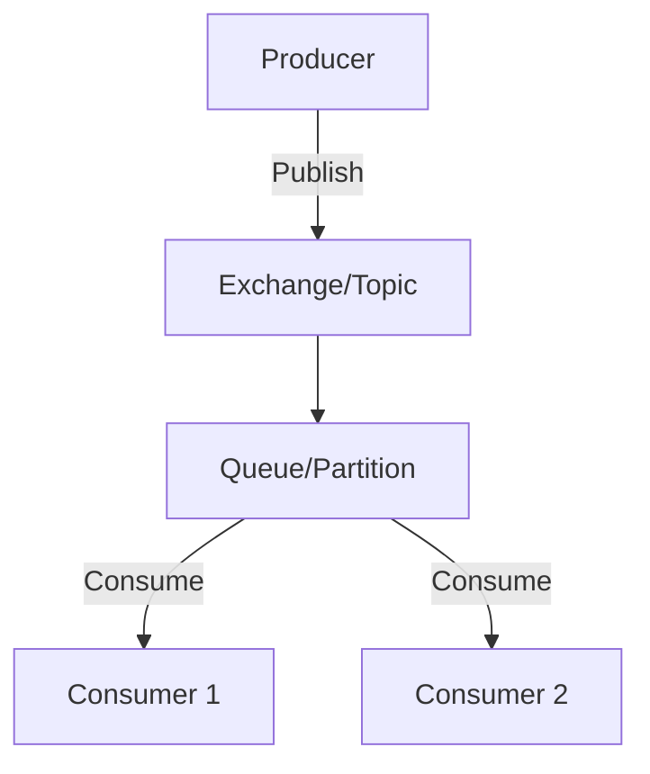

## 15.5. Message Brokers and Queues (RabbitMQ, Kafka)

In modern software architecture, message brokers play a crucial role in facilitating asynchronous, decoupled communication between different components of a system. This section explores how to integrate Clojure with popular message brokers like RabbitMQ and Kafka, focusing on patterns such as Publish/Subscribe (Pub/Sub) and message queuing. We will also discuss handling message serialization and deserialization, and considerations for reliability and scaling.

### The Role of Message Brokers in Systems Integration

Message brokers are intermediary programs that translate messages from the formal messaging protocol of the sender to the formal messaging protocol of the receiver. They enable different systems to communicate with each other without being directly connected, thus promoting loose coupling and scalability.

- **Decoupling**: By using message brokers, systems can communicate without needing to know each other's details, allowing for independent scaling and development.
- **Asynchronous Communication**: Message brokers facilitate asynchronous communication, enabling systems to send and receive messages without waiting for a response.
- **Scalability**: They help in scaling systems by distributing messages across multiple consumers and balancing the load.

### RabbitMQ and Kafka: An Overview

#### RabbitMQ

RabbitMQ is a robust, open-source message broker that supports multiple messaging protocols. It is known for its reliability, flexibility, and ease of use. RabbitMQ is particularly well-suited for complex routing scenarios and supports various messaging patterns, including Pub/Sub, point-to-point, and request/reply.

- **Website**: [RabbitMQ](https://www.rabbitmq.com/)
- **Key Features**: 
  - Supports AMQP, MQTT, STOMP, and other protocols.
  - Flexible routing with exchanges and queues.
  - High availability and clustering.

#### Kafka

Apache Kafka is a distributed event streaming platform capable of handling trillions of events a day. It is designed for high-throughput, fault-tolerant, and scalable messaging. Kafka is often used for building real-time data pipelines and streaming applications.

- **Website**: [Kafka](https://kafka.apache.org/)
- **Key Features**:
  - Distributed and highly scalable.
  - Strong durability guarantees.
  - Supports stream processing with Kafka Streams.

### Integrating RabbitMQ with Clojure

To integrate RabbitMQ with Clojure, we can use the `langohr` library, which provides a comprehensive client for RabbitMQ.

#### Setting Up RabbitMQ

Before diving into code, ensure RabbitMQ is installed and running on your system. You can download it from the [official website](https://www.rabbitmq.com/download.html).

#### Using Langohr for RabbitMQ

Langohr is a Clojure client for RabbitMQ that provides a simple API for interacting with RabbitMQ's features.

```clojure
;; Add Langohr to your project dependencies
:dependencies [[com.novemberain/langohr "5.0.0"]]

(require '[langohr.core :as rmq]
         '[langohr.channel :as lch]
         '[langohr.queue :as lq]
         '[langohr.basic :as lb])

;; Establish a connection to RabbitMQ
(def conn (rmq/connect {:host "localhost"}))

;; Create a channel
(def ch (lch/open conn))

;; Declare a queue
(lq/declare ch "my-queue" {:durable true})

;; Publish a message
(lb/publish ch "" "my-queue" "Hello, RabbitMQ!")

;; Consume messages
(lb/consume ch "my-queue"
            (fn [ch {:keys [delivery-tag]} ^bytes payload]
              (println "Received message:" (String. payload "UTF-8"))
              (lb/ack ch delivery-tag)))
```

- **Connection**: Establish a connection to the RabbitMQ server.
- **Channel**: Open a channel for communication.
- **Queue Declaration**: Declare a queue to send and receive messages.
- **Publishing**: Send messages to the queue.
- **Consuming**: Receive messages from the queue.

### Integrating Kafka with Clojure

For Kafka integration, we can use the `clj-kafka` library, which provides a simple interface for producing and consuming messages.

#### Setting Up Kafka

Ensure Kafka is installed and running. You can download it from the [official website](https://kafka.apache.org/downloads).

#### Using clj-kafka for Kafka

```clojure
;; Add clj-kafka to your project dependencies
:dependencies [[clj-kafka "0.3.0"]]

(require '[clj-kafka.producer :as producer]
         '[clj-kafka.consumer :as consumer])

;; Producer configuration
(def producer-config {"bootstrap.servers" "localhost:9092"
                      "key.serializer" "org.apache.kafka.common.serialization.StringSerializer"
                      "value.serializer" "org.apache.kafka.common.serialization.StringSerializer"})

;; Create a producer
(def kafka-producer (producer/make-producer producer-config))

;; Send a message
(producer/send kafka-producer (producer/record "my-topic" "key" "Hello, Kafka!"))

;; Consumer configuration
(def consumer-config {"bootstrap.servers" "localhost:9092"
                      "group.id" "my-group"
                      "key.deserializer" "org.apache.kafka.common.serialization.StringDeserializer"
                      "value.deserializer" "org.apache.kafka.common.serialization.StringDeserializer"})

;; Create a consumer
(def kafka-consumer (consumer/make-consumer consumer-config))

;; Subscribe to a topic
(consumer/subscribe kafka-consumer ["my-topic"])

;; Poll for messages
(doseq [record (consumer/poll kafka-consumer 1000)]
  (println "Received message:" (.value record)))
```

- **Producer**: Configure and create a Kafka producer to send messages.
- **Consumer**: Configure and create a Kafka consumer to receive messages.
- **Serialization**: Handle message serialization and deserialization using Kafka's serializers and deserializers.

### Patterns: Pub/Sub and Message Queuing

#### Publish/Subscribe (Pub/Sub)

In the Pub/Sub pattern, messages are published to a topic and consumed by multiple subscribers. This pattern is ideal for broadcasting messages to multiple consumers.

- **RabbitMQ**: Use exchanges to route messages to multiple queues.
- **Kafka**: Use topics to publish messages that can be consumed by multiple consumers.

#### Message Queuing

Message queuing involves sending messages to a queue where they are stored until a consumer retrieves them. This pattern ensures reliable message delivery and is suitable for point-to-point communication.

- **RabbitMQ**: Messages are stored in queues and consumed by one or more consumers.
- **Kafka**: Messages are stored in topics and can be consumed by multiple consumers, with each consumer group receiving a copy of the message.

### Handling Message Serialization and Deserialization

Serialization is the process of converting an object into a format that can be easily stored or transmitted, while deserialization is the reverse process.

- **RabbitMQ**: Use libraries like `cheshire` for JSON serialization and deserialization.
- **Kafka**: Use Kafka's built-in serializers and deserializers for common data formats like JSON and Avro.

```clojure
(require '[cheshire.core :as json])

;; Serialize a Clojure map to JSON
(def message (json/generate-string {:event "user_signup" :user_id 123}))

;; Deserialize JSON to a Clojure map
(def data (json/parse-string message true))
```

### Considerations for Reliability and Scaling

When integrating with message brokers, consider the following:

- **Reliability**: Ensure messages are not lost by using durable queues and persistent messages in RabbitMQ, and by configuring appropriate retention policies in Kafka.
- **Scaling**: Use clustering and partitioning to scale your message broker setup. RabbitMQ supports clustering, while Kafka uses partitions to distribute load across multiple brokers.
- **Monitoring**: Implement monitoring and alerting to track the health and performance of your message broker setup.

### Visualizing Message Flow

To better understand the flow of messages in a Pub/Sub system, consider the following diagram:



**Caption**: This diagram illustrates the flow of messages from a producer to an exchange or topic, and then to queues or partitions, where they are consumed by multiple consumers.

### Try It Yourself

Experiment with the provided code examples by modifying the message content, queue names, or topics. Try setting up multiple consumers to see how messages are distributed. Explore different serialization formats and observe how they affect message size and processing time.

### External Links

- [RabbitMQ](https://www.rabbitmq.com/)
- [Kafka](https://kafka.apache.org/)

### Summary

In this section, we explored how to integrate Clojure with RabbitMQ and Kafka, two popular message brokers. We discussed the role of message brokers in systems integration, provided code examples for using RabbitMQ and Kafka with Clojure, and highlighted patterns like Pub/Sub and message queuing. We also covered handling message serialization and deserialization, and considerations for reliability and scaling.

## **Ready to Test Your Knowledge?**



### What is the primary role of message brokers in systems integration?

- [x] To facilitate asynchronous, decoupled communication between different components.
- [ ] To provide a database for storing messages.
- [ ] To replace direct communication between systems.
- [ ] To enforce security policies across systems.

> **Explanation:** Message brokers enable different systems to communicate asynchronously and without being directly connected, promoting loose coupling and scalability.

### Which Clojure library is commonly used for integrating with RabbitMQ?

- [x] Langohr
- [ ] clj-kafka
- [ ] Cheshire
- [ ] core.async

> **Explanation:** Langohr is a Clojure client for RabbitMQ that provides a simple API for interacting with RabbitMQ's features.

### What pattern does Kafka use to distribute messages to multiple consumers?

- [x] Publish/Subscribe (Pub/Sub)
- [ ] Point-to-Point
- [ ] Request/Reply
- [ ] Load Balancing

> **Explanation:** Kafka uses the Publish/Subscribe pattern, where messages are published to a topic and can be consumed by multiple consumers.

### What is the purpose of message serialization?

- [x] To convert an object into a format that can be easily stored or transmitted.
- [ ] To encrypt messages for security.
- [ ] To compress messages for faster transmission.
- [ ] To validate message content.

> **Explanation:** Serialization is the process of converting an object into a format that can be easily stored or transmitted, while deserialization is the reverse process.

### Which of the following is a consideration for scaling message broker setups?

- [x] Use clustering and partitioning.
- [ ] Increase message size.
- [ ] Reduce the number of consumers.
- [ ] Disable monitoring.

> **Explanation:** Clustering and partitioning help distribute load across multiple brokers, enhancing scalability.

### What is the main advantage of using durable queues in RabbitMQ?

- [x] Ensures messages are not lost in case of a broker failure.
- [ ] Increases message throughput.
- [ ] Reduces message latency.
- [ ] Simplifies message serialization.

> **Explanation:** Durable queues ensure that messages are not lost in case of a broker failure, enhancing reliability.

### How does Kafka achieve high throughput?

- [x] By using partitions to distribute load across multiple brokers.
- [ ] By using a single broker for all messages.
- [ ] By reducing message size.
- [ ] By increasing consumer count.

> **Explanation:** Kafka uses partitions to distribute load across multiple brokers, achieving high throughput.

### What is the function of an exchange in RabbitMQ?

- [x] To route messages to one or more queues.
- [ ] To store messages temporarily.
- [ ] To serialize messages.
- [ ] To consume messages.

> **Explanation:** An exchange in RabbitMQ routes messages to one or more queues based on routing rules.

### Which serialization library is mentioned for use with RabbitMQ in Clojure?

- [x] Cheshire
- [ ] clj-kafka
- [ ] core.async
- [ ] Langohr

> **Explanation:** Cheshire is a library used for JSON serialization and deserialization in Clojure.

### True or False: Kafka is designed for high-throughput, fault-tolerant, and scalable messaging.

- [x] True
- [ ] False

> **Explanation:** Kafka is indeed designed for high-throughput, fault-tolerant, and scalable messaging, making it suitable for real-time data pipelines and streaming applications.


