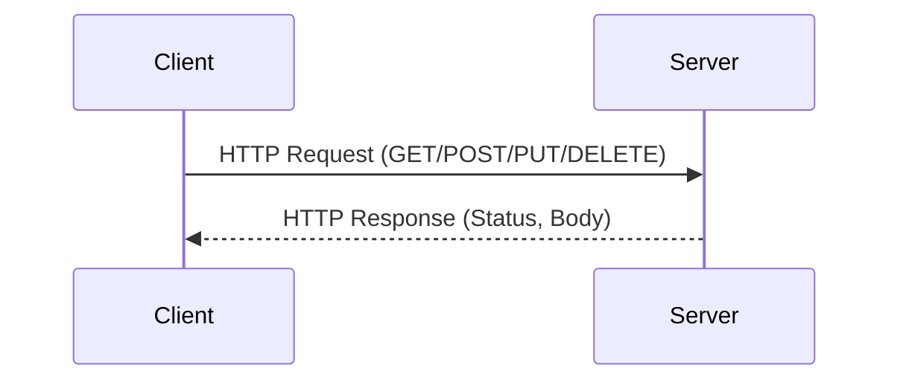

## 15.6. RESTful Services and HTTP Clients with `clj-http` and `http-kit`

In the modern software landscape, integrating with RESTful services is a common requirement. Clojure, with its rich ecosystem, provides powerful libraries like `clj-http` and `http-kit` to facilitate HTTP communication. This section will guide you through the essentials of using these libraries to interact with RESTful APIs, covering everything from basic requests to advanced asynchronous handling and performance optimization.

### Introduction to `clj-http` and `http-kit`

**`clj-http`** is a Clojure HTTP client inspired by the Apache HttpClient. It is known for its simplicity and ease of use, making it a popular choice for making synchronous HTTP requests.

**`http-kit`**, on the other hand, is a high-performance HTTP server and client library. It is designed for both synchronous and asynchronous operations, providing a flexible solution for building web applications and consuming APIs.

#### Use Cases

- **`clj-http`**: Ideal for applications where simplicity and ease of use are prioritized, and synchronous requests are sufficient.
- **`http-kit`**: Suitable for high-performance applications requiring asynchronous request handling and server capabilities.

### Making HTTP Requests

Let's explore how to perform basic HTTP operations using `clj-http` and `http-kit`.

#### GET Request

**`clj-http` Example:**

```clojure
(require '[clj-http.client :as client])

(defn fetch-data [url]
  (let [response (client/get url)]
    (println (:status response))
    (println (:body response))))
```

**`http-kit` Example:**

```clojure
(require '[org.httpkit.client :as http])

(defn fetch-data [url]
  (http/get url
            (fn [{:keys [status body]}]
              (println status)
              (println body))))
```

#### POST Request

**`clj-http` Example:**

```clojure
(defn post-data [url data]
  (let [response (client/post url {:body (json/write-str data)
                                   :headers {"Content-Type" "application/json"}})]
    (println (:status response))
    (println (:body response))))
```

**`http-kit` Example:**

```clojure
(defn post-data [url data]
  (http/post url
             {:body (json/write-str data)
              :headers {"Content-Type" "application/json"}}
             (fn [{:keys [status body]}]
               (println status)
               (println body))))
```

#### PUT and DELETE Requests

Both libraries support PUT and DELETE requests similarly to GET and POST. You can specify the method and options accordingly.

### Handling Headers, Query Parameters, and Request Bodies

#### Headers and Query Parameters

**`clj-http` Example:**

```clojure
(defn fetch-with-params [url params headers]
  (client/get url {:query-params params
                   :headers headers}))
```

**`http-kit` Example:**

```clojure
(defn fetch-with-params [url params headers]
  (http/get url {:query-params params
                 :headers headers}
            (fn [{:keys [status body]}]
              (println status)
              (println body))))
```

#### Request Bodies

For POST and PUT requests, you can include a body in the request. Ensure the content type is set appropriately, such as `application/json` for JSON data.

### Best Practices for Managing Connections and Timeouts

- **Connection Management**: Use connection pooling to manage resources efficiently.
- **Timeouts**: Set appropriate timeouts to prevent hanging requests. Both libraries allow you to specify timeouts in milliseconds.

**`clj-http` Example:**

```clojure
(client/get url {:socket-timeout 1000
                 :conn-timeout 1000})
```

**`http-kit` Example:**

```clojure
(http/get url {:timeout 1000}
          (fn [response] ...))
```

### Asynchronous Requests and Performance Considerations

**`http-kit`** excels in handling asynchronous requests, making it suitable for high-performance applications. It uses a non-blocking architecture, allowing you to handle multiple requests concurrently without blocking threads.

#### Asynchronous Example with `http-kit`

```clojure
(defn async-fetch [url]
  (http/get url
            {:timeout 5000}
            (fn [{:keys [status body error]}]
              (if error
                (println "Failed, exception is " error)
                (println "Async HTTP GET: " status body)))))
```

### Visualizing HTTP Request Flow

To better understand the flow of HTTP requests and responses, let's visualize the process using a sequence diagram.



This diagram illustrates the basic interaction between a client and a server during an HTTP request.

### External Resources

For more detailed information on these libraries, refer to their official documentation:

- [clj-http](https://github.com/dakrone/clj-http)
- [http-kit](http://www.http-kit.org/)

### Knowledge Check

Before we conclude, let's reinforce what we've learned with a few questions.

1. What are the main differences between `clj-http` and `http-kit`?
2. How do you handle query parameters in `clj-http`?
3. What is the advantage of using asynchronous requests in `http-kit`?
4. How can you set a timeout for an HTTP request in `clj-http`?
5. Why is it important to manage connections efficiently?

### Try It Yourself

Experiment with the examples provided. Try modifying the request methods, adding headers, or changing the request body. Observe how these changes affect the response.

### Conclusion

Mastering HTTP communication in Clojure with `clj-http` and `http-kit` opens up a world of possibilities for integrating with RESTful services. By understanding the nuances of each library, you can choose the right tool for your application's needs, ensuring efficient and effective API interactions.

Remember, this is just the beginning. As you progress, you'll build more complex and interactive applications. Keep experimenting, stay curious, and enjoy the journey!

## **Ready to Test Your Knowledge?**



### What is the primary use case for `clj-http`?

- [x] Making synchronous HTTP requests
- [ ] Building high-performance web servers
- [ ] Handling asynchronous operations
- [ ] Managing WebSocket connections

> **Explanation:** `clj-http` is primarily used for making synchronous HTTP requests.

### Which library is better suited for asynchronous HTTP requests?

- [ ] clj-http
- [x] http-kit
- [ ] core.async
- [ ] aleph

> **Explanation:** `http-kit` is designed for high-performance applications requiring asynchronous request handling.

### How do you specify query parameters in a `clj-http` request?

- [x] Using the `:query-params` option
- [ ] Including them in the URL string
- [ ] Using the `:params` option
- [ ] Adding them to the request body

> **Explanation:** Query parameters are specified using the `:query-params` option in `clj-http`.

### What is a key benefit of using asynchronous requests?

- [x] Non-blocking architecture allows handling multiple requests concurrently
- [ ] Simplifies code structure
- [ ] Reduces server load
- [ ] Increases data security

> **Explanation:** Asynchronous requests allow handling multiple requests concurrently without blocking threads.

### How can you set a timeout for an HTTP request in `http-kit`?

- [x] Using the `:timeout` option
- [ ] Modifying the server configuration
- [ ] Using a separate timeout library
- [ ] Setting a global timeout variable

> **Explanation:** The `:timeout` option is used to set a timeout for HTTP requests in `http-kit`.

### Why is connection management important?

- [x] To efficiently use resources and prevent resource leaks
- [ ] To increase the speed of requests
- [ ] To simplify code
- [ ] To enhance security

> **Explanation:** Efficient connection management prevents resource leaks and ensures optimal use of resources.

### What is the default content type for POST requests in `clj-http`?

- [ ] text/plain
- [ ] application/xml
- [x] application/json
- [ ] multipart/form-data

> **Explanation:** The default content type for POST requests in `clj-http` is `application/json`.

### Which library provides a built-in server capability?

- [ ] clj-http
- [x] http-kit
- [ ] clojure.core
- [ ] ring

> **Explanation:** `http-kit` provides built-in server capabilities.

### What is the purpose of setting headers in an HTTP request?

- [x] To provide additional information about the request
- [ ] To encrypt the request
- [ ] To specify the server address
- [ ] To manage cookies

> **Explanation:** Headers provide additional information about the request, such as content type and authorization.

### True or False: `clj-http` can handle asynchronous requests natively.

- [ ] True
- [x] False

> **Explanation:** `clj-http` is primarily designed for synchronous requests, while `http-kit` handles asynchronous requests.


