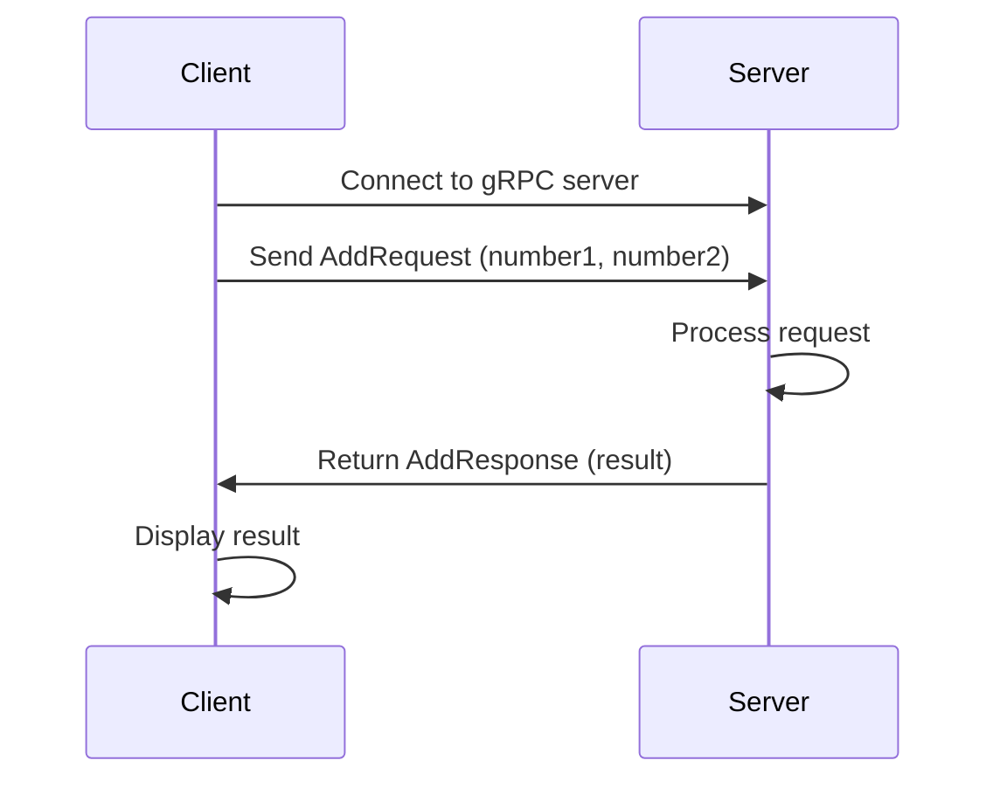

## 15.7. gRPC and Protobuf Integration

In the world of distributed systems and microservices, efficient communication between services is paramount. gRPC (gRPC Remote Procedure Calls) and Protocol Buffers (Protobuf) are technologies that provide a robust framework for building scalable and efficient APIs. In this section, we will explore how to integrate gRPC and Protobuf into Clojure applications, leveraging libraries like Protojure for seamless support.

### Introduction to gRPC and Protocol Buffers

**gRPC** is an open-source RPC framework developed by Google. It uses HTTP/2 for transport, providing features like bidirectional streaming, flow control, header compression, and multiplexing requests over a single TCP connection. This makes gRPC a powerful choice for building efficient, low-latency, and scalable APIs.

**Protocol Buffers** (Protobuf) is a language-neutral, platform-neutral, extensible mechanism for serializing structured data. It is used by gRPC to define service interfaces and payload messages, ensuring that data is efficiently serialized and deserialized across different languages and platforms.

### Defining `.proto` Files

The first step in using gRPC and Protobuf is to define your service and message structures in a `.proto` file. This file serves as the contract between the client and server, specifying the methods and data types that will be used.

Here's an example of a simple `.proto` file defining a service for a calculator:

```protobuf
syntax = "proto3";

package calculator;

// The calculator service definition.
service Calculator {
  // Sends a request to add two numbers.
  rpc Add (AddRequest) returns (AddResponse);
}

// The request message containing two numbers.
message AddRequest {
  int32 number1 = 1;
  int32 number2 = 2;
}

// The response message containing the result.
message AddResponse {
  int32 result = 1;
}
```

### Generating Classes from `.proto` Files

Once you have defined your `.proto` file, the next step is to generate the necessary classes for your language of choice. For Clojure, we can use the Protojure library, which provides tools for generating Clojure code from `.proto` files.

To generate the classes, you will need to install the Protocol Buffers compiler (`protoc`) and the Protojure plugin. Here's how you can do it:

1. **Install Protocol Buffers Compiler**: Follow the instructions on the [Protocol Buffers GitHub page](https://github.com/protocolbuffers/protobuf) to install `protoc`.

2. **Install Protojure Plugin**: Use Leiningen or Clojure CLI to add Protojure to your project dependencies.

3. **Generate Classes**: Run the `protoc` command with the Protojure plugin to generate Clojure classes from your `.proto` file.

```bash
protoc --proto_path=./proto --clojure_out=./src --plugin=protoc-gen-clojure=$(which protoc-gen-clojure) ./proto/calculator.proto
```

### Implementing gRPC Clients and Servers

With the generated classes, you can now implement gRPC clients and servers in Clojure. Protojure provides a straightforward API for creating both clients and servers.

#### Implementing a gRPC Server

To implement a gRPC server, you need to define the service logic in Clojure. Here's an example of a simple server for the `Calculator` service:

```clojure
(ns calculator.server
  (:require [protojure.grpc.server :as grpc]
            [calculator.api :as api]))

(defn add [request]
  (let [{:keys [number1 number2]} request]
    {:result (+ number1 number2)}))

(defn start-server []
  (grpc/start {:port 50051
               :services [{:service api/Calculator
                           :handlers {:Add add}}]}))

;; Start the server
(start-server)
```

#### Implementing a gRPC Client

To implement a gRPC client, you can use the Protojure client API to make requests to the server. Here's an example of a client for the `Calculator` service:

```clojure
(ns calculator.client
  (:require [protojure.grpc.client :as grpc]
            [calculator.api :as api]))

(defn add-numbers [number1 number2]
  (let [client (grpc/connect {:host "localhost" :port 50051})
        request {:number1 number1 :number2 number2}]
    (grpc/invoke client api/Calculator :Add request)))

;; Call the Add method
(println (add-numbers 5 7))
```

### Benefits of gRPC and Protobuf

- **Strongly-Typed Contracts**: gRPC and Protobuf enforce a strongly-typed contract between client and server, reducing errors and improving code quality.
- **Performance**: Protobuf's binary serialization is more efficient than JSON or XML, leading to faster data transmission and reduced bandwidth usage.
- **Cross-Language Support**: gRPC and Protobuf support multiple programming languages, making it easier to integrate services written in different languages.
- **Streaming**: gRPC supports streaming requests and responses, enabling efficient handling of large data sets and real-time data processing.

### Visualizing gRPC Communication

To better understand how gRPC communication works, let's visualize the interaction between a gRPC client and server using a sequence diagram.



### Using Protojure for Clojure Support

Protojure is a Clojure library that provides comprehensive support for gRPC and Protobuf. It allows you to define services and messages in `.proto` files and generate Clojure code for both clients and servers. Protojure also supports advanced features like streaming and authentication.

For more information on Protojure, visit the [official documentation](https://protojure.github.io/).

### Try It Yourself

Now that you have a basic understanding of gRPC and Protobuf integration in Clojure, try modifying the code examples to add new methods or messages. Experiment with different data types and explore the streaming capabilities of gRPC.

### Knowledge Check

- What are the main benefits of using gRPC and Protobuf?
- How do you define a service and messages in a `.proto` file?
- What is the role of Protojure in Clojure gRPC integration?
- How can you implement a gRPC server in Clojure?
- What are the advantages of using strongly-typed contracts in distributed systems?

### Summary

In this section, we've explored the integration of gRPC and Protobuf in Clojure, highlighting the benefits of efficient data serialization and strongly-typed contracts. We've also demonstrated how to define services and messages in `.proto` files, generate Clojure classes using Protojure, and implement gRPC clients and servers. By leveraging these technologies, you can build scalable and efficient APIs that are easy to integrate across different languages and platforms.

## **Ready to Test Your Knowledge?**



### What is gRPC primarily used for?

- [x] Efficient communication between distributed systems
- [ ] Data storage
- [ ] User authentication
- [ ] File compression

> **Explanation:** gRPC is primarily used for efficient communication between distributed systems, leveraging HTTP/2 and Protocol Buffers for performance and scalability.

### What language-neutral mechanism does gRPC use for data serialization?

- [x] Protocol Buffers
- [ ] JSON
- [ ] XML
- [ ] YAML

> **Explanation:** gRPC uses Protocol Buffers, a language-neutral and platform-neutral mechanism for serializing structured data.

### Which library provides Clojure support for gRPC and Protobuf?

- [x] Protojure
- [ ] Ring
- [ ] Compojure
- [ ] Luminus

> **Explanation:** Protojure is a Clojure library that provides support for gRPC and Protobuf, allowing you to define services and messages in `.proto` files and generate Clojure code.

### What is the primary benefit of using strongly-typed contracts in gRPC?

- [x] Reducing errors and improving code quality
- [ ] Increasing data storage capacity
- [ ] Enhancing user interface design
- [ ] Simplifying database queries

> **Explanation:** Strongly-typed contracts in gRPC help reduce errors and improve code quality by enforcing a clear and consistent interface between client and server.

### How do you define a service and messages in gRPC?

- [x] Using a `.proto` file
- [ ] Writing JavaScript code
- [ ] Creating a JSON schema
- [ ] Designing an XML document

> **Explanation:** Services and messages in gRPC are defined using a `.proto` file, which specifies the methods and data types used in the communication.

### What transport protocol does gRPC use?

- [x] HTTP/2
- [ ] HTTP/1.1
- [ ] FTP
- [ ] SMTP

> **Explanation:** gRPC uses HTTP/2 as its transport protocol, providing features like bidirectional streaming and multiplexing requests.

### What command is used to generate classes from `.proto` files?

- [x] `protoc`
- [ ] `javac`
- [ ] `npm`
- [ ] `pip`

> **Explanation:** The `protoc` command is used to generate classes from `.proto` files, with support for various languages including Clojure through plugins like Protojure.

### What feature of gRPC allows handling of large data sets efficiently?

- [x] Streaming
- [ ] Caching
- [ ] Indexing
- [ ] Compression

> **Explanation:** gRPC supports streaming, which allows efficient handling of large data sets and real-time data processing.

### Which of the following is NOT a benefit of using gRPC?

- [ ] Strongly-typed contracts
- [ ] Cross-language support
- [ ] Performance
- [x] Increased storage capacity

> **Explanation:** While gRPC provides many benefits like strongly-typed contracts, cross-language support, and performance, it does not inherently increase storage capacity.

### True or False: Protojure supports advanced features like streaming and authentication.

- [x] True
- [ ] False

> **Explanation:** Protojure supports advanced features like streaming and authentication, making it a comprehensive solution for gRPC and Protobuf integration in Clojure.


