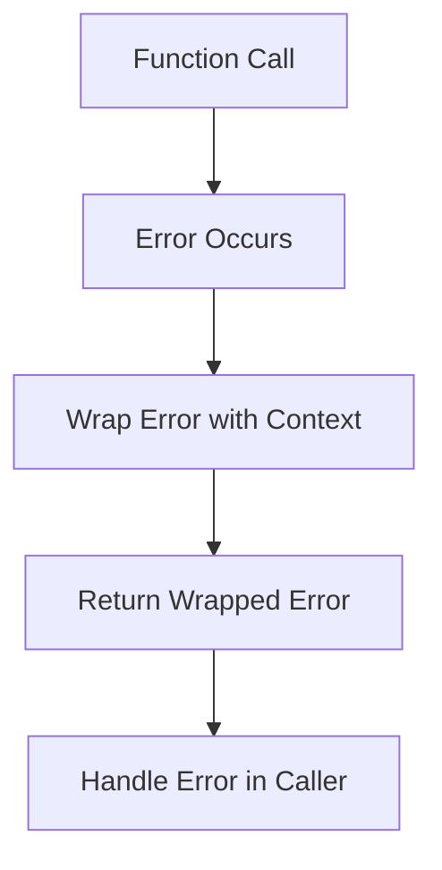
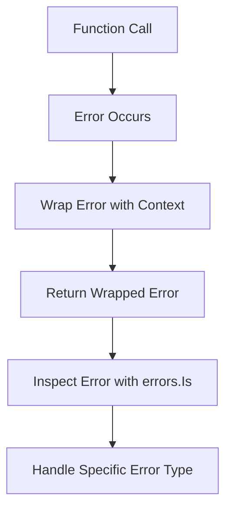
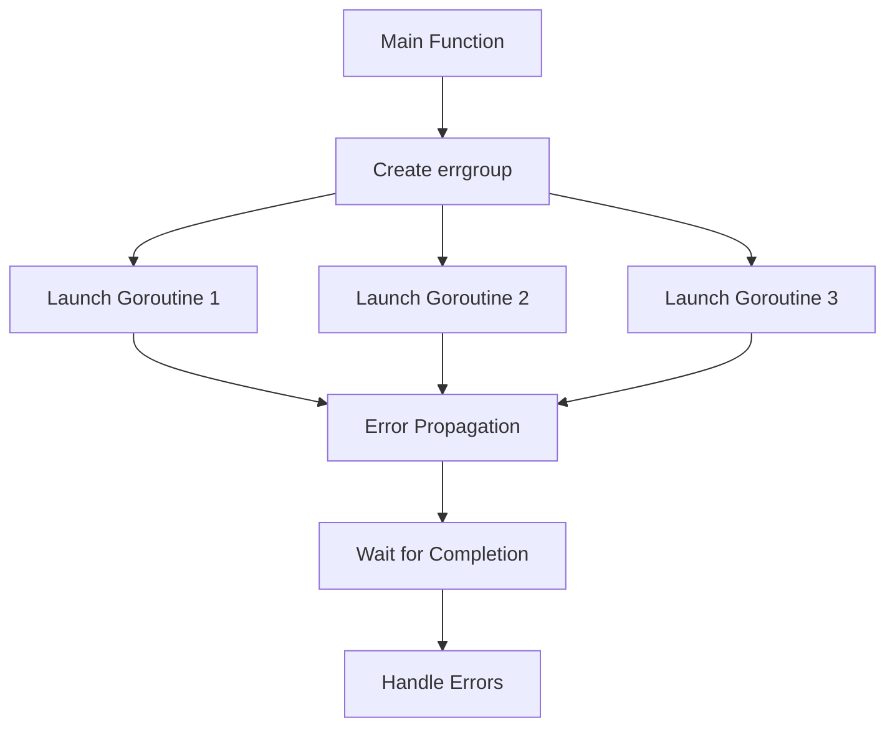

## 15.7 Error Handling Libraries

Error handling is a critical aspect of software development, ensuring that applications can gracefully handle unexpected situations and provide meaningful feedback to users and developers. In Go, error handling is explicit and integral to the language's design. However, as applications grow in complexity, managing errors effectively becomes more challenging. This is where error handling libraries come into play, offering enhanced capabilities for error management and debugging. In this section, we'll explore three prominent error handling libraries in Go: `pkg/errors`, `x/errors`, and `errgroup`.

### Introduction to Error Handling in Go

Before diving into the libraries, let's briefly review Go's approach to error handling. Go uses a simple, explicit error handling mechanism where functions return an error value as the last return value. This approach encourages developers to handle errors immediately and explicitly, promoting robust and reliable code.

```go
package main

import (
    "fmt"
    "errors"
)

func divide(a, b int) (int, error) {
    if b == 0 {
        return 0, errors.New("division by zero")
    }
    return a / b, nil
}

func main() {
    result, err := divide(4, 0)
    if err != nil {
        fmt.Println("Error:", err)
        return
    }
    fmt.Println("Result:", result)
}
```

While this approach is straightforward, it can become cumbersome in large applications where errors need to be propagated and additional context is necessary. This is where error handling libraries can enhance Go's native capabilities.

### `pkg/errors`: Enhancing Error Context

The `pkg/errors` library provides simple error handling primitives that allow developers to add context to errors and trace their origins through stack traces. This library is particularly useful for debugging and understanding the flow of errors in complex applications.

#### Key Features

- **Error Wrapping**: Add context to errors using `errors.Wrap`.
- **Error Cause**: Retrieve the original error using `errors.Cause`.
- **Stack Traces**: Automatically capture stack traces when errors are wrapped.

#### Usage

Here's how you can use `pkg/errors` to wrap errors and provide additional context:

```go
package main

import (
    "fmt"
    "github.com/pkg/errors"
)

func readFile(filename string) error {
    return errors.Wrap(errors.New("file not found"), "failed to read file")
}

func main() {
    err := readFile("config.yaml")
    if err != nil {
        fmt.Printf("Error: %+v\n", err)
    }
}
```

In this example, `errors.Wrap` is used to add context to the error, indicating that the file read operation failed. The `%+v` format specifier prints the error along with its stack trace, providing valuable debugging information.

### `x/errors` Package: Advanced Error Handling

The `x/errors` package, part of the Go standard library's `golang.org/x` repository, offers advanced error handling features, including error inspection and formatting. It builds upon the capabilities introduced in Go 1.13, providing a more structured approach to error handling.

#### Key Features

- **Error Inspection**: Use `errors.Is` and `errors.As` to inspect and match errors.
- **Error Wrapping**: Wrap errors with additional context.
- **Error Unwrapping**: Retrieve underlying errors for detailed inspection.

#### Usage

Here's an example demonstrating how to use `x/errors` for error inspection:

```go
package main

import (
    "errors"
    "fmt"
    "golang.org/x/xerrors"
)

var ErrNotFound = errors.New("not found")

func findResource(id int) error {
    return xerrors.Errorf("resource %d: %w", id, ErrNotFound)
}

func main() {
    err := findResource(42)
    if errors.Is(err, ErrNotFound) {
        fmt.Println("Resource not found")
    } else {
        fmt.Println("Error:", err)
    }
}
```

In this example, `xerrors.Errorf` is used to wrap the error with additional context, and `errors.Is` is used to check if the error is of type `ErrNotFound`.

### `errgroup`: Managing Concurrent Errors

Concurrency is a powerful feature in Go, but managing errors across multiple goroutines can be challenging. The `errgroup` package simplifies this by providing a mechanism to manage multiple goroutines with error propagation.

#### Key Features

- **Goroutine Management**: Launch multiple goroutines and wait for their completion.
- **Error Propagation**: Collect and propagate errors from goroutines.
- **Context Integration**: Use with `context` for cancellation and timeout control.

#### Usage

Here's an example of using `errgroup` to manage concurrent tasks:

```go
package main

import (
    "context"
    "fmt"
    "golang.org/x/sync/errgroup"
    "net/http"
)

func fetchURL(ctx context.Context, url string) error {
    req, err := http.NewRequestWithContext(ctx, "GET", url, nil)
    if err != nil {
        return err
    }
    resp, err := http.DefaultClient.Do(req)
    if err != nil {
        return err
    }
    defer resp.Body.Close()
    fmt.Println("Fetched:", url)
    return nil
}

func main() {
    g, ctx := errgroup.WithContext(context.Background())

    urls := []string{
        "https://golang.org",
        "https://pkg.go.dev",
        "https://godoc.org",
    }

    for _, url := range urls {
        url := url // capture range variable
        g.Go(func() error {
            return fetchURL(ctx, url)
        })
    }

    if err := g.Wait(); err != nil {
        fmt.Println("Error:", err)
    } else {
        fmt.Println("All URLs fetched successfully")
    }
}
```

In this example, `errgroup` is used to fetch multiple URLs concurrently. If any of the goroutines return an error, it is propagated and handled in the main function.

### Visualizing Error Handling with Diagrams

To better understand how these libraries enhance error handling, let's visualize their interactions using Mermaid.js diagrams.

#### Error Wrapping with `pkg/errors`



#### Error Inspection with `x/errors`



#### Concurrent Error Management with `errgroup`



### Advantages and Disadvantages

#### Advantages

- **Enhanced Debugging**: Libraries like `pkg/errors` and `x/errors` provide stack traces and context, making debugging easier.
- **Structured Error Handling**: `x/errors` offers structured error handling with inspection capabilities.
- **Concurrent Error Management**: `errgroup` simplifies error management in concurrent applications.

#### Disadvantages

- **Additional Complexity**: Introducing libraries can add complexity to the codebase.
- **Learning Curve**: Developers need to familiarize themselves with the libraries' APIs and idioms.

### Best Practices

- **Consistent Error Handling**: Use a consistent approach to error handling across your codebase.
- **Add Context**: Always add context to errors to make them more informative.
- **Inspect Errors**: Use error inspection to handle specific error types gracefully.
- **Manage Concurrency**: Use `errgroup` to manage errors in concurrent applications effectively.

### Conclusion

Error handling is a crucial aspect of building robust Go applications. By leveraging libraries like `pkg/errors`, `x/errors`, and `errgroup`, developers can enhance their error handling capabilities, making their applications more reliable and easier to debug. These libraries provide powerful tools for adding context, inspecting errors, and managing concurrency, helping developers build resilient software systems.

## Quiz Time!



### Which library provides stack traces for errors?

- [x] pkg/errors
- [ ] x/errors
- [ ] errgroup
- [ ] None of the above

> **Explanation:** The `pkg/errors` library provides stack traces when errors are wrapped, aiding in debugging.

### What function in `pkg/errors` is used to add context to an error?

- [x] errors.Wrap
- [ ] errors.New
- [ ] errors.Is
- [ ] errors.As

> **Explanation:** `errors.Wrap` is used to add context to an error in the `pkg/errors` library.

### Which package is part of the Go standard library's `golang.org/x` repository?

- [ ] pkg/errors
- [x] x/errors
- [ ] errgroup
- [ ] None of the above

> **Explanation:** The `x/errors` package is part of the Go standard library's `golang.org/x` repository.

### What function in `x/errors` is used to check if an error is of a specific type?

- [ ] errors.Wrap
- [x] errors.Is
- [ ] errors.New
- [ ] errors.Cause

> **Explanation:** `errors.Is` is used to check if an error is of a specific type in the `x/errors` package.

### Which library is used for managing errors in concurrent applications?

- [ ] pkg/errors
- [ ] x/errors
- [x] errgroup
- [ ] None of the above

> **Explanation:** The `errgroup` library is used for managing errors in concurrent applications.

### What does `errgroup` simplify in Go applications?

- [x] Concurrent task execution
- [ ] Error wrapping
- [ ] Error inspection
- [ ] None of the above

> **Explanation:** `errgroup` simplifies concurrent task execution by managing multiple goroutines and error propagation.

### Which function in `x/errors` is used for error wrapping?

- [x] xerrors.Errorf
- [ ] errors.New
- [ ] errors.Wrap
- [ ] errors.Cause

> **Explanation:** `xerrors.Errorf` is used for error wrapping in the `x/errors` package.

### What is the purpose of `errors.Cause` in `pkg/errors`?

- [x] Retrieve the original error
- [ ] Add context to an error
- [ ] Check if an error is of a specific type
- [ ] None of the above

> **Explanation:** `errors.Cause` is used to retrieve the original error in the `pkg/errors` library.

### Which library provides error inspection capabilities?

- [ ] pkg/errors
- [x] x/errors
- [ ] errgroup
- [ ] None of the above

> **Explanation:** The `x/errors` library provides error inspection capabilities with functions like `errors.Is` and `errors.As`.

### True or False: `errgroup` can be used with the `context` package for cancellation.

- [x] True
- [ ] False

> **Explanation:** `errgroup` can be used with the `context` package to manage cancellation and timeouts in concurrent operations.


