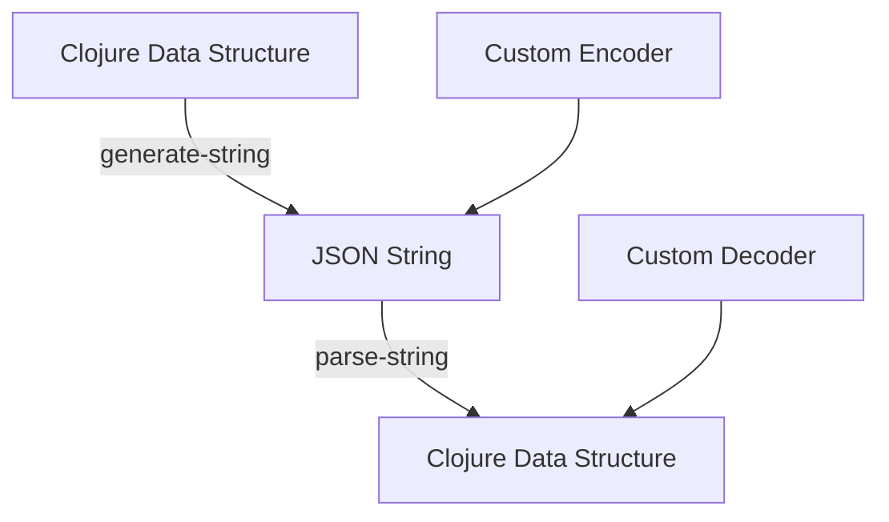

## 15.8. JSON and Data Serialization with Cheshire

In the realm of modern software development, JSON (JavaScript Object Notation) has become the de facto standard for data interchange. Its lightweight and human-readable format makes it ideal for APIs and web services. In Clojure, the Cheshire library is a powerful tool for handling JSON serialization and deserialization. In this section, we will explore Cheshire's capabilities, demonstrate how to encode and decode JSON data, customize serialization, and optimize performance.

### Introduction to Cheshire

Cheshire is a fast JSON library for Clojure, built on top of the Jackson library for Java. It provides a simple and efficient way to convert Clojure data structures to JSON and vice versa. Cheshire is known for its speed and flexibility, making it a popular choice among Clojure developers.

#### Advantages of Using Cheshire

- **Performance**: Cheshire leverages the Jackson library's high-performance JSON processing capabilities.
- **Ease of Use**: With a straightforward API, Cheshire simplifies JSON handling in Clojure.
- **Flexibility**: Supports custom encoders and decoders, allowing for tailored serialization.
- **Integration**: Seamlessly integrates with Clojure's data structures and idioms.

### Encoding JSON Data with Cheshire

Encoding data to JSON is a common task when building APIs or storing data in a JSON format. Cheshire provides the `generate-string` function to convert Clojure data structures into JSON strings.

```clojure
(require '[cheshire.core :as json])

(def data {:name "Alice" :age 30 :city "Wonderland"})

;; Convert Clojure map to JSON string
(def json-string (json/generate-string data))

(println json-string)
;; Output: {"name":"Alice","age":30,"city":"Wonderland"}
```

In this example, we use `generate-string` to serialize a Clojure map into a JSON string. The resulting JSON is a string representation of the map, with keys and values converted to their JSON equivalents.

#### Customizing JSON Encoding

Cheshire allows customization of the encoding process through custom encoders. This is useful when you need to serialize complex data types or apply specific formatting.

```clojure
(require '[cheshire.generate :as gen])

;; Define a custom encoder for java.util.Date
(gen/add-encoder java.util.Date
  (fn [date jsonGenerator]
    (.writeString jsonGenerator (.format (java.text.SimpleDateFormat. "yyyy-MM-dd") date))))

(def data-with-date {:name "Alice" :birthdate (java.util.Date.)})

;; Convert data with custom date encoder
(def json-string-with-date (json/generate-string data-with-date))

(println json-string-with-date)
;; Output: {"name":"Alice","birthdate":"2024-11-25"}
```

In this example, we define a custom encoder for `java.util.Date` to format dates as `yyyy-MM-dd`. The `add-encoder` function registers the custom encoder, which is then used during serialization.

### Decoding JSON Data with Cheshire

Decoding JSON data is equally straightforward with Cheshire. The `parse-string` function converts JSON strings into Clojure data structures.

```clojure
(def json-input "{\"name\":\"Alice\",\"age\":30,\"city\":\"Wonderland\"}")

;; Parse JSON string to Clojure map
(def parsed-data (json/parse-string json-input true))

(println parsed-data)
;; Output: {:name "Alice", :age 30, :city "Wonderland"}
```

The `parse-string` function takes a JSON string and returns a Clojure map. The second argument, `true`, indicates that keys should be converted to keywords.

#### Handling Edge Cases and Validation

When dealing with JSON data, it's crucial to handle edge cases and validate input to prevent errors and ensure data integrity. Cheshire provides options for handling malformed JSON and missing data.

```clojure
;; Parse JSON with error handling
(try
  (def invalid-json-input "{\"name\":\"Alice\",\"age\":30,\"city\":\"Wonderland\"")
  (def parsed-invalid-data (json/parse-string invalid-json-input true))
  (println parsed-invalid-data)
  (catch Exception e
    (println "Error parsing JSON:" (.getMessage e))))
```

In this example, we use a `try-catch` block to handle parsing errors. If the JSON input is malformed, an exception is caught, and an error message is printed.

### Performance Considerations

Cheshire is designed for high performance, but there are still best practices to follow for optimal efficiency:

- **Batch Processing**: When dealing with large datasets, process data in batches to reduce memory usage.
- **Streaming**: Use Cheshire's streaming capabilities for processing large JSON files without loading them entirely into memory.
- **Custom Encoders**: Implement custom encoders for complex data types to avoid unnecessary conversions.

### Try It Yourself

Experiment with Cheshire by modifying the code examples above. Try adding custom encoders for other data types, such as `java.time.LocalDate`, or handle more complex JSON structures. Test the performance of encoding and decoding large datasets using Cheshire's streaming API.

### Visualizing JSON Serialization and Deserialization

To better understand the JSON serialization and deserialization process, let's visualize the flow using a Mermaid.js diagram.



**Diagram Description**: This flowchart illustrates the process of converting a Clojure data structure to a JSON string using `generate-string` and back to a Clojure data structure using `parse-string`. Custom encoders and decoders can be integrated into this process to handle specific data types.

### References and Further Reading

- [Cheshire GitHub Repository](https://github.com/dakrone/cheshire)
- [Jackson JSON Processor](https://github.com/FasterXML/jackson)
- [JSON.org](https://www.json.org/json-en.html)

### Knowledge Check

To reinforce your understanding of JSON serialization and deserialization with Cheshire, try answering the following questions and challenges.

## **Ready to Test Your Knowledge?**



### What is the primary advantage of using Cheshire for JSON processing in Clojure?

- [x] High performance and ease of use
- [ ] Built-in support for XML
- [ ] Integration with Python libraries
- [ ] Automatic database connectivity

> **Explanation:** Cheshire is known for its high performance and ease of use, making it a popular choice for JSON processing in Clojure.

### Which function is used to convert a Clojure map to a JSON string?

- [ ] parse-string
- [x] generate-string
- [ ] encode-json
- [ ] stringify

> **Explanation:** The `generate-string` function is used to convert Clojure data structures to JSON strings.

### How can you customize the serialization of a `java.util.Date` in Cheshire?

- [x] By adding a custom encoder with `add-encoder`
- [ ] By modifying the `generate-string` function
- [ ] By using a different JSON library
- [ ] By changing the date format in the Clojure REPL

> **Explanation:** Custom encoders can be added using `add-encoder` to handle specific data types like `java.util.Date`.

### What is the purpose of the `parse-string` function in Cheshire?

- [ ] To convert JSON strings to XML
- [x] To convert JSON strings to Clojure data structures
- [ ] To validate JSON syntax
- [ ] To generate JSON schemas

> **Explanation:** The `parse-string` function is used to convert JSON strings into Clojure data structures.

### Which argument in `parse-string` ensures keys are converted to keywords?

- [ ] false
- [x] true
- [ ] nil
- [ ] :keywordize

> **Explanation:** Passing `true` as the second argument to `parse-string` converts keys to keywords.

### How can you handle malformed JSON input in Cheshire?

- [x] By using a `try-catch` block
- [ ] By ignoring the error
- [ ] By using a different JSON library
- [ ] By converting JSON to XML first

> **Explanation:** A `try-catch` block can be used to handle exceptions when parsing malformed JSON input.

### What is a recommended practice for processing large JSON datasets with Cheshire?

- [x] Use streaming capabilities
- [ ] Load the entire dataset into memory
- [ ] Convert JSON to XML first
- [ ] Use a different programming language

> **Explanation:** Cheshire's streaming capabilities allow for efficient processing of large JSON datasets without loading them entirely into memory.

### Which of the following is NOT a feature of Cheshire?

- [ ] Custom encoders
- [ ] High performance
- [x] Built-in XML support
- [ ] Integration with Clojure data structures

> **Explanation:** Cheshire is focused on JSON processing and does not provide built-in support for XML.

### True or False: Cheshire can only serialize simple data types.

- [ ] True
- [x] False

> **Explanation:** Cheshire can serialize complex data types using custom encoders.

### What is the role of custom encoders in Cheshire?

- [x] To handle specific data types during serialization
- [ ] To improve parsing speed
- [ ] To convert JSON to XML
- [ ] To validate JSON schemas

> **Explanation:** Custom encoders in Cheshire are used to handle specific data types during serialization.



Remember, mastering JSON serialization and deserialization with Cheshire is just the beginning. As you continue to explore Clojure's rich ecosystem, you'll discover even more powerful tools and techniques for building robust and efficient applications. Keep experimenting, stay curious, and enjoy the journey!
