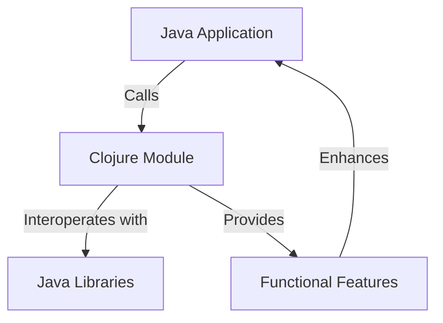

## 15.9. Using Clojure in Existing Ecosystems

Integrating Clojure into existing ecosystems can be a transformative step for organizations looking to leverage the power of functional programming, immutability, and concurrency models. This section explores strategies for introducing Clojure into mixed-language environments, providing practical examples and highlighting tools that facilitate this integration. We will also address organizational considerations and emphasize the importance of incremental integration and interoperability.

### Introduction to Clojure Integration

Clojure, a dynamic, functional language that runs on the Java Virtual Machine (JVM), offers unique advantages such as immutable data structures, first-class functions, and a robust concurrency model. These features make it an attractive choice for enhancing existing systems. However, integrating Clojure into a mixed-language environment requires careful planning and execution to ensure seamless coexistence with other technologies.

### Strategies for Introducing Clojure

#### 1. Incremental Adoption

Start small by identifying specific components or modules within your existing system that could benefit from Clojure's strengths. This approach minimizes risk and allows teams to gradually become familiar with Clojure's syntax and paradigms.

#### 2. Interoperability with Java

Clojure's seamless interoperability with Java is one of its most significant advantages. You can call Java code from Clojure and vice versa, allowing you to leverage existing Java libraries and frameworks.

#### 3. Leveraging Clojure's Strengths

Identify areas where Clojure's features, such as immutability and concurrency, can provide the most value. Common use cases include data processing, concurrent programming, and building domain-specific languages (DSLs).

### Calling Clojure Code from Java

To call Clojure code from Java, you need to compile your Clojure code into Java bytecode. Here's a step-by-step guide:

1. **Create a Clojure Project**: Use Leiningen, a popular build tool for Clojure, to create a new project.

   ```bash
   lein new app my-clojure-app
   ```

2. **Write Clojure Code**: Implement your Clojure functions in the `src/my_clojure_app/core.clj` file.

   ```clojure
   (ns my-clojure-app.core)

   (defn greet [name]
     (str "Hello, " name "!"))
   ```

3. **Compile Clojure Code**: Use Leiningen to compile the Clojure code into Java bytecode.

   ```bash
   lein uberjar
   ```

4. **Call Clojure from Java**: Use the `clojure.java.api.Clojure` class to invoke Clojure functions from Java.

   ```java
   import clojure.java.api.Clojure;
   import clojure.lang.IFn;

   public class Main {
       public static void main(String[] args) {
           IFn require = Clojure.var("clojure.core", "require");
           require.invoke(Clojure.read("my-clojure-app.core"));

           IFn greet = Clojure.var("my-clojure-app.core", "greet");
           String result = (String) greet.invoke("World");
           System.out.println(result);
       }
   }
   ```

### Calling Java Code from Clojure

Clojure's ability to call Java code is straightforward, thanks to its native support for Java interoperability. Here's how you can do it:

1. **Import Java Classes**: Use the `import` statement to bring Java classes into your Clojure namespace.

   ```clojure
   (ns my-clojure-app.core
     (:import [java.util Date]))

   (defn current-time []
     (str "Current time: " (Date.)))
   ```

2. **Invoke Java Methods**: Use the `.` operator to call Java methods.

   ```clojure
   (defn print-current-time []
     (println (.toString (Date.))))
   ```

### Tools for Building and Packaging

#### Leiningen

Leiningen is the de facto build tool for Clojure projects. It simplifies project management, dependency resolution, and build automation.

- **Project Management**: Use `lein new` to create new projects and `lein run` to execute them.
- **Dependency Management**: Define dependencies in the `project.clj` file and use `lein deps` to resolve them.
- **Packaging**: Use `lein uberjar` to create standalone JAR files.

#### Maven

For organizations already using Maven, Clojure can be integrated into existing Maven projects using the `clojure-maven-plugin`.

- **Configuration**: Add the plugin to your `pom.xml` file to compile Clojure code.
- **Integration**: Use Maven's lifecycle to build and package Clojure code alongside Java code.

### Organizational Considerations and Team Adoption

#### 1. Training and Education

Provide training sessions and resources to help your team become proficient in Clojure. Encourage experimentation and pair programming to facilitate knowledge transfer.

#### 2. Incremental Integration

Adopt Clojure incrementally by starting with non-critical components. This approach reduces risk and allows the team to gain confidence in using Clojure.

#### 3. Collaboration and Communication

Foster a culture of collaboration and open communication. Encourage team members to share their experiences and insights as they work with Clojure.

### Emphasizing Incremental Integration and Interoperability

Incremental integration is key to successfully adopting Clojure in existing ecosystems. By gradually introducing Clojure, you can minimize disruption and ensure a smooth transition. Interoperability with Java allows you to leverage existing investments in Java libraries and frameworks, making Clojure a valuable addition to your technology stack.

### Visualizing Clojure Integration

Below is a diagram illustrating the integration of Clojure into an existing Java ecosystem, highlighting the interoperability between Clojure and Java components.



**Diagram Description**: This diagram shows a Java application calling a Clojure module, which interoperates with Java libraries and provides functional features that enhance the overall application.

### Key Takeaways

- **Start Small**: Begin with specific components that can benefit from Clojure's strengths.
- **Leverage Interoperability**: Use Clojure's seamless integration with Java to your advantage.
- **Use the Right Tools**: Utilize tools like Leiningen and Maven to manage and build your projects.
- **Foster Team Adoption**: Provide training and encourage collaboration to facilitate team adoption.
- **Emphasize Incremental Integration**: Introduce Clojure gradually to minimize disruption.

### Try It Yourself

Experiment with the code examples provided in this section. Try modifying the Clojure functions and see how they interact with Java code. Consider creating a small project that integrates Clojure into an existing Java application to gain hands-on experience.

### References and Further Reading

- [Clojure Official Website](https://clojure.org/)
- [Leiningen Documentation](https://leiningen.org/)
- [Maven Clojure Plugin](https://github.com/talios/clojure-maven-plugin)
- [Java Interoperability in Clojure](https://clojure.org/reference/java_interop)

## **Ready to Test Your Knowledge?**



### What is a key advantage of integrating Clojure into existing Java ecosystems?

- [x] Seamless interoperability with Java
- [ ] Clojure's object-oriented features
- [ ] Clojure's ability to replace Java entirely
- [ ] Clojure's built-in GUI libraries

> **Explanation:** Clojure's seamless interoperability with Java allows it to be integrated into existing Java ecosystems effectively.

### Which tool is commonly used for building and managing Clojure projects?

- [x] Leiningen
- [ ] Gradle
- [ ] Ant
- [ ] Jenkins

> **Explanation:** Leiningen is the de facto build tool for Clojure projects, simplifying project management and dependency resolution.

### How can you call a Clojure function from Java?

- [x] Using the `clojure.java.api.Clojure` class
- [ ] Directly invoking the Clojure function
- [ ] Using a Clojure interpreter
- [ ] Through a REST API

> **Explanation:** The `clojure.java.api.Clojure` class provides methods to invoke Clojure functions from Java.

### What is the recommended approach for adopting Clojure in an existing system?

- [x] Incremental adoption
- [ ] Full system rewrite
- [ ] Immediate replacement of all Java code
- [ ] Ignoring existing Java components

> **Explanation:** Incremental adoption allows for a gradual transition, minimizing risk and disruption.

### Which of the following is a benefit of using Clojure's immutable data structures?

- [x] Improved concurrency
- [ ] Faster mutation operations
- [ ] Built-in database integration
- [ ] Automatic GUI generation

> **Explanation:** Immutable data structures in Clojure improve concurrency by eliminating race conditions.

### What is a common use case for Clojure in existing ecosystems?

- [x] Data processing and concurrent programming
- [ ] GUI development
- [ ] Low-level hardware control
- [ ] Real-time graphics rendering

> **Explanation:** Clojure is often used for data processing and concurrent programming due to its functional nature and concurrency model.

### How can you manage dependencies in a Clojure project?

- [x] Define them in the `project.clj` file
- [ ] Use a `pom.xml` file
- [ ] Manually download and include JAR files
- [ ] Use a `build.gradle` file

> **Explanation:** Dependencies in a Clojure project are defined in the `project.clj` file, which Leiningen uses to resolve them.

### What is a key consideration when introducing Clojure to a team?

- [x] Providing training and resources
- [ ] Replacing all existing tools
- [ ] Eliminating Java from the project
- [ ] Avoiding collaboration

> **Explanation:** Providing training and resources helps team members become proficient in Clojure, facilitating adoption.

### Which diagramming tool is used in this guide to visualize concepts?

- [x] Mermaid.js
- [ ] PlantUML
- [ ] Lucidchart
- [ ] Visio

> **Explanation:** Mermaid.js is used in this guide to create diagrams that visualize concepts and workflows.

### True or False: Clojure can only be used in new projects and cannot be integrated into existing systems.

- [ ] True
- [x] False

> **Explanation:** Clojure can be integrated into existing systems, leveraging its interoperability with Java and other technologies.



Remember, integrating Clojure into existing ecosystems is a journey. Start small, leverage its strengths, and enjoy the process of enhancing your systems with Clojure's powerful features!
