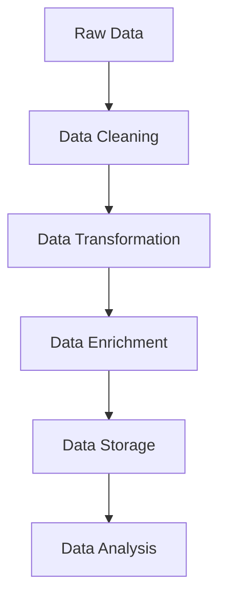

## 16.1. Introduction to Data Engineering in Clojure

Data engineering is a critical component of modern software development, focusing on the design, construction, and maintenance of systems that collect, store, and analyze data. As data becomes increasingly central to business operations, the need for efficient, scalable, and reliable data processing solutions has never been greater. In this context, Clojure, a functional programming language that runs on the Java Virtual Machine (JVM), offers unique advantages for data engineering tasks.

### Understanding Data Engineering

Data engineering involves the creation of data pipelines that transform raw data into a format suitable for analysis. This process typically includes data ingestion, cleaning, transformation, and storage. The goal is to ensure that data is accurate, accessible, and ready for analysis by data scientists and business analysts.

**Key Components of Data Engineering:**

- **Data Ingestion:** Collecting data from various sources, such as databases, APIs, and files.
- **Data Cleaning:** Removing or correcting errors and inconsistencies in the data.
- **Data Transformation:** Converting data into a usable format, often involving aggregation, filtering, and enrichment.
- **Data Storage:** Storing processed data in databases or data warehouses for easy access and analysis.

### Why Clojure for Data Engineering?

Clojure's functional programming paradigm, immutability, and concurrency support make it particularly well-suited for data engineering tasks. Let's explore these features in detail:

#### Functional Programming Paradigm

Clojure is a functional programming language, which means it emphasizes the use of pure functions and avoids mutable state. This approach leads to more predictable and maintainable code, which is crucial for complex data processing tasks.

- **Pure Functions:** Functions that always produce the same output for the same input, without side effects. This predictability simplifies debugging and testing.
- **Higher-Order Functions:** Functions that can take other functions as arguments or return them as results. This allows for flexible and reusable code.

**Example: Using Higher-Order Functions for Data Transformation**

```clojure
(defn transform-data [data]
  (->> data
       (filter #(> (:value %) 10))
       (map #(update % :value inc))
       (reduce (fn [acc item] (conj acc (:value item))) [])))

;; Sample data
(def data [{:id 1 :value 5} {:id 2 :value 15} {:id 3 :value 20}])

;; Transform the data
(transform-data data)
;; => [16 21]
```

In this example, we use `filter`, `map`, and `reduce` to transform a collection of data. These higher-order functions allow us to express complex transformations concisely and clearly.

#### Immutability

Immutability is a core concept in Clojure, meaning that data structures cannot be modified after they are created. Instead, operations on data structures return new versions, leaving the original unchanged. This feature is particularly beneficial for data engineering because it:

- **Prevents Side Effects:** Ensures that functions do not inadvertently alter data, leading to more reliable code.
- **Facilitates Concurrency:** Allows multiple threads to safely access shared data without the risk of race conditions.

**Example: Immutability in Action**

```clojure
(def original-data {:id 1 :value 10})

;; Attempt to update the value
(def updated-data (assoc original-data :value 20))

;; original-data remains unchanged
original-data
;; => {:id 1 :value 10}

;; updated-data is a new map
updated-data
;; => {:id 1 :value 20}
```

Here, the `assoc` function creates a new map with the updated value, leaving the original map unchanged. This immutability ensures that data transformations do not introduce unintended side effects.

#### Concurrency Support

Clojure provides robust concurrency primitives, such as atoms, refs, agents, and core.async channels, which facilitate safe and efficient concurrent programming. This is particularly important for data engineering tasks that involve processing large volumes of data in parallel.

- **Atoms:** Provide a way to manage shared, mutable state with atomic updates.
- **Refs and Software Transactional Memory (STM):** Allow coordinated updates to multiple pieces of state.
- **Agents:** Enable asynchronous updates to state.
- **Core.async Channels:** Facilitate communication between concurrent processes.

**Example: Using Atoms for Concurrent Data Processing**

```clojure
(def counter (atom 0))

(defn increment-counter []
  (swap! counter inc))

;; Simulate concurrent updates
(doseq [_ (range 1000)]
  (future (increment-counter)))

;; Wait for all futures to complete
(Thread/sleep 1000)

;; Check the final value of the counter
@counter
;; => 1000
```

In this example, we use an atom to safely manage a shared counter across multiple threads. The `swap!` function ensures that updates are atomic, preventing race conditions.

### Thinking in Data Transformation Pipelines

Clojure encourages thinking in terms of data transformation pipelines, where data flows through a series of transformations, each represented by a function. This approach aligns well with the principles of data engineering, where data is often processed in stages.

**Example: Building a Data Transformation Pipeline**

```clojure
(defn process-data [data]
  (->> data
       (map #(assoc % :processed true))
       (filter :processed)
       (group-by :category)))

;; Sample data
(def data [{:id 1 :category "A"} {:id 2 :category "B"} {:id 3 :category "A"}])

;; Process the data
(process-data data)
;; => {"A" [{:id 1 :category "A" :processed true} {:id 3 :category "A" :processed true}]
;;     "B" [{:id 2 :category "B" :processed true}]}
```

In this example, we use a series of transformations to process a collection of data. The `->>` macro allows us to express the pipeline in a clear and readable manner.

### Setting the Context for Subsequent Topics

This introduction to data engineering in Clojure sets the stage for exploring more advanced topics in the following sections. We will delve deeper into building ETL pipelines, integrating with various data stores, handling large data sets, and ensuring data quality. We will also explore real-time data processing, scheduling, and automation, providing practical examples and best practices.

### Encouragement to Explore and Experiment

As you embark on your journey into data engineering with Clojure, remember that experimentation and exploration are key to mastering these concepts. Try modifying the code examples provided, and consider how you might apply these techniques to your own data processing tasks. The power of Clojure lies in its ability to express complex transformations concisely and elegantly, making it an ideal choice for data engineering.

### Visualizing Data Transformation Pipelines

To further illustrate the concept of data transformation pipelines, let's visualize the process using a flowchart. This diagram represents the flow of data through a series of transformations, highlighting the key steps involved.



**Figure 1: Visualizing a Data Transformation Pipeline**

In this flowchart, raw data is first cleaned to remove errors and inconsistencies. It then undergoes transformation and enrichment before being stored in a database or data warehouse. Finally, the processed data is ready for analysis.

### References and Further Reading

For more information on data engineering and Clojure, consider exploring the following resources:

- [Clojure Official Website](https://clojure.org/)
- [Functional Programming Principles](https://www.manning.com/books/functional-programming-in-scala)
- [Concurrency in Clojure](https://clojure.org/reference/atoms)
- [Data Engineering on the JVM](https://www.oreilly.com/library/view/data-engineering-on/9781492046390/)

### Knowledge Check

To reinforce your understanding of the concepts covered in this section, try answering the following questions:

## **Ready to Test Your Knowledge?**



### What is a key advantage of using Clojure for data engineering?

- [x] Immutability ensures data integrity
- [ ] It is a dynamically typed language
- [ ] It has a large standard library
- [ ] It supports object-oriented programming

> **Explanation:** Immutability in Clojure ensures that data structures cannot be modified, which helps maintain data integrity and prevents side effects.

### Which Clojure feature facilitates safe concurrent programming?

- [ ] Macros
- [ ] Lists
- [x] Atoms
- [ ] Keywords

> **Explanation:** Atoms in Clojure provide a way to manage shared, mutable state with atomic updates, making them suitable for concurrent programming.

### What is the purpose of data transformation in data engineering?

- [ ] To store data in a database
- [x] To convert data into a usable format
- [ ] To delete unnecessary data
- [ ] To encrypt data

> **Explanation:** Data transformation involves converting data into a format suitable for analysis, often involving aggregation, filtering, and enrichment.

### How does Clojure's functional paradigm aid in data manipulation?

- [ ] By using mutable state
- [x] By emphasizing pure functions
- [ ] By supporting inheritance
- [ ] By providing a large standard library

> **Explanation:** Clojure's functional paradigm emphasizes pure functions, which are predictable and maintainable, aiding in data manipulation.

### What is a benefit of using higher-order functions in Clojure?

- [x] They allow for flexible and reusable code
- [ ] They increase code complexity
- [ ] They require more memory
- [ ] They are slower to execute

> **Explanation:** Higher-order functions in Clojure can take other functions as arguments or return them as results, allowing for flexible and reusable code.

### What does immutability prevent in Clojure?

- [ ] Code execution
- [ ] Function calls
- [x] Side effects
- [ ] Data storage

> **Explanation:** Immutability in Clojure prevents side effects by ensuring that data structures cannot be modified after they are created.

### Which Clojure feature allows for communication between concurrent processes?

- [ ] Macros
- [ ] Lists
- [ ] Keywords
- [x] Core.async Channels

> **Explanation:** Core.async channels in Clojure facilitate communication between concurrent processes, enabling efficient data processing.

### What is the role of data storage in data engineering?

- [ ] To transform data
- [ ] To clean data
- [x] To store processed data for analysis
- [ ] To delete data

> **Explanation:** Data storage involves storing processed data in databases or data warehouses, making it accessible for analysis.

### What is a characteristic of pure functions in Clojure?

- [ ] They modify global state
- [ ] They have side effects
- [x] They always produce the same output for the same input
- [ ] They require mutable state

> **Explanation:** Pure functions in Clojure always produce the same output for the same input and do not have side effects, making them predictable and reliable.

### True or False: Clojure's immutability makes it difficult to handle concurrent programming.

- [ ] True
- [x] False

> **Explanation:** False. Clojure's immutability actually facilitates concurrent programming by allowing multiple threads to safely access shared data without the risk of race conditions.



Remember, this is just the beginning. As you progress, you'll build more complex and interactive data processing pipelines. Keep experimenting, stay curious, and enjoy the journey!
