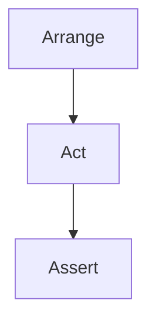

## 16.1 Arrange/Act/Assert in Clojure

Testing is a crucial aspect of software development, ensuring that code behaves as expected and remains robust over time. The Arrange/Act/Assert (AAA) pattern is a widely adopted methodology for structuring tests, promoting clarity and maintainability. This article delves into the AAA pattern within the context of Clojure, providing insights, examples, and best practices for implementing this pattern effectively.

### Introduction to Arrange/Act/Assert

The Arrange/Act/Assert pattern divides a test into three distinct phases:

1. **Arrange**: Set up the test data and environment.
2. **Act**: Execute the function or code under test.
3. **Assert**: Verify that the outcome matches the expected result.

By clearly separating these phases, the AAA pattern enhances the readability and organization of test suites, making it easier for developers to understand and maintain tests.

### Detailed Explanation of the AAA Pattern

#### Arrange Phase

In the Arrange phase, you prepare everything needed for the test. This includes setting up any necessary data structures, initializing objects, and configuring the environment. The goal is to create a controlled context in which the test can run predictably.

#### Act Phase

The Act phase involves executing the function or code under test. This is the core action of the test, where you apply the inputs arranged in the previous phase to the system under test.

#### Assert Phase

Finally, the Assert phase checks whether the outcome of the Act phase matches the expected result. This involves comparing the actual output to the expected output and asserting that they are equal. If they are not, the test fails, indicating a potential issue in the code.

### Visual Representation of the AAA Pattern

To better understand the flow of the AAA pattern, consider the following diagram:



This simple flowchart illustrates the linear progression from arranging the test environment to acting on the system under test and finally asserting the results.

### Writing Tests in Clojure Using AAA

Let's explore how to implement the AAA pattern in Clojure with practical examples. We'll use the popular testing framework `clojure.test` to demonstrate this pattern.

#### Example: Testing a Simple Function

Suppose we have a function `add` that adds two numbers:

```clojure
(defn add [a b]
  (+ a b))
```

Here's how we can write a test for this function using the AAA pattern:

```clojure
(ns myapp.core-test
  (:require [clojure.test :refer :all]
            [myapp.core :refer :all]))

(deftest test-add
  ;; Arrange
  (let [x 3
        y 5
        expected 8]
    ;; Act
    (let [result (add x y)]
      ;; Assert
      (is (= expected result)))))
```

In this example, the test is structured into three clear sections: Arrange, Act, and Assert. This separation makes it easy to understand what the test is doing and why.

### Importance of Separating Each Phase

Separating each phase of the AAA pattern is crucial for several reasons:

- **Readability**: Clear separation makes it easier for developers to read and understand the test logic.
- **Maintainability**: Isolated phases allow for easier updates and modifications to the test as the code evolves.
- **Debugging**: When a test fails, it's easier to pinpoint the issue if the phases are well-defined.

### Enhancing Clarity and Maintainability

The AAA pattern not only improves readability but also contributes to the maintainability of test suites. By adhering to this structure, tests become self-explanatory, reducing the need for extensive comments or documentation.

### Best Practices for Organizing Test Files and Functions

To maximize the benefits of the AAA pattern, consider the following practices:

- **Consistent Naming**: Use descriptive names for test functions that reflect the behavior being tested.
- **Modular Tests**: Break down complex tests into smaller, focused tests that each verify a single aspect of the code.
- **Reusable Setup**: Extract common setup logic into helper functions to avoid duplication and simplify the Arrange phase.
- **Clear Assertions**: Use expressive assertions that clearly convey the expected outcome.

### Conclusion

The Arrange/Act/Assert pattern is a powerful tool for structuring tests in Clojure. By clearly delineating the phases of a test, AAA enhances both the clarity and maintainability of test suites. By following best practices and leveraging Clojure's testing capabilities, developers can create robust and reliable tests that stand the test of time.

## Quiz Time!



### What is the primary purpose of the Arrange phase in the AAA pattern?

- [x] To set up the test data and environment
- [ ] To execute the function or code under test
- [ ] To verify the outcome matches the expected result
- [ ] To clean up after the test

> **Explanation:** The Arrange phase is responsible for setting up the necessary data and environment for the test.

### In the AAA pattern, what does the Act phase involve?

- [ ] Setting up the test data
- [x] Executing the function or code under test
- [ ] Verifying the outcome
- [ ] Cleaning up resources

> **Explanation:** The Act phase involves executing the function or code that is being tested.

### What is the role of the Assert phase in the AAA pattern?

- [ ] To set up the test environment
- [ ] To execute the code under test
- [x] To verify that the outcome matches the expected result
- [ ] To log the test results

> **Explanation:** The Assert phase checks whether the actual outcome matches the expected result.

### Why is it important to separate each phase in the AAA pattern?

- [x] For readability and maintainability
- [ ] To reduce the number of tests
- [ ] To increase test execution speed
- [ ] To minimize code duplication

> **Explanation:** Separating each phase enhances readability and maintainability, making tests easier to understand and modify.

### Which Clojure library is commonly used for implementing the AAA pattern in tests?

- [ ] core.async
- [x] clojure.test
- [ ] clojure.spec
- [ ] clojure.core

> **Explanation:** `clojure.test` is a widely used library for writing tests in Clojure, supporting the AAA pattern.

### What is a key benefit of using the AAA pattern in test suites?

- [ ] Faster test execution
- [x] Improved test clarity
- [ ] Reduced code complexity
- [ ] Increased code coverage

> **Explanation:** The AAA pattern improves test clarity by clearly separating the setup, execution, and verification phases.

### How can you enhance the Arrange phase for complex tests?

- [x] By extracting common setup logic into helper functions
- [ ] By combining it with the Act phase
- [ ] By minimizing the use of variables
- [ ] By using random data

> **Explanation:** Extracting common setup logic into helper functions reduces duplication and simplifies the Arrange phase.

### What is a recommended practice for naming test functions?

- [ ] Use generic names like `test1`, `test2`
- [x] Use descriptive names that reflect the behavior being tested
- [ ] Use random names
- [ ] Use numbers only

> **Explanation:** Descriptive names help convey the purpose of the test, making it easier to understand.

### What does the following Clojure test snippet demonstrate?

```clojure
(deftest test-add
  (let [x 3
        y 5
        expected 8]
    (let [result (add x y)]
      (is (= expected result)))))
```

- [x] The AAA pattern with Arrange, Act, and Assert phases
- [ ] A performance test
- [ ] A property-based test
- [ ] A test without assertions

> **Explanation:** The snippet demonstrates the AAA pattern with clear Arrange, Act, and Assert phases.

### True or False: The AAA pattern is only applicable to unit tests.

- [ ] True
- [x] False

> **Explanation:** The AAA pattern can be applied to various types of tests, including integration and functional tests.


