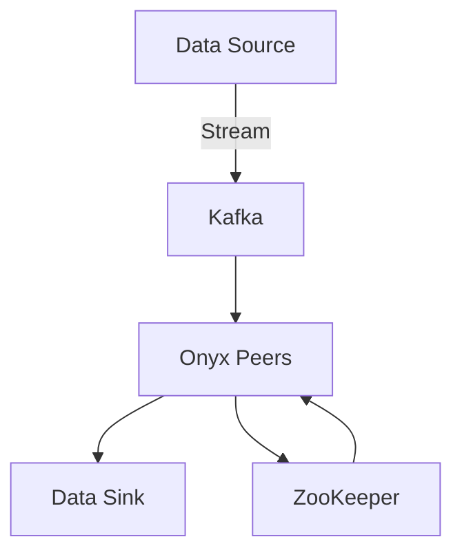
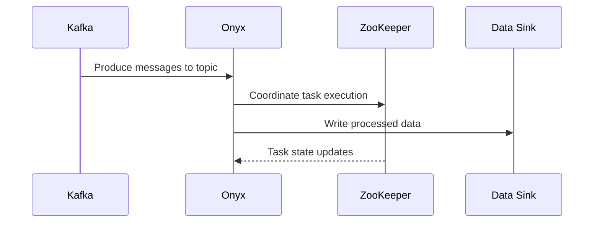

## 16.10. Real-Time Data Processing with Onyx and Kafka

In the realm of data engineering, real-time data processing has become a critical component for modern applications. The ability to process data as it arrives allows businesses to make timely decisions, enhance user experiences, and maintain competitive advantages. In this section, we will explore how to build real-time data processing pipelines using Onyx and Kafka, two powerful tools in the Clojure ecosystem.

### Introduction to Onyx

Onyx is a distributed, masterless, fault-tolerant data processing platform designed for high-throughput and low-latency workloads. It is built on top of Clojure and leverages its functional programming paradigms to provide a flexible and expressive way to define data processing workflows.

#### Onyx Architecture

Onyx's architecture is designed to be scalable and resilient. It consists of several key components:

- **Peers**: These are the worker nodes that execute tasks. Peers can be added or removed dynamically, allowing the system to scale horizontally.
- **ZooKeeper**: Used for coordination and state management. It helps in leader election and maintaining the cluster's metadata.
- **Task Lifecycle**: Onyx tasks have a well-defined lifecycle, including stages like start, stop, and checkpointing, which aid in fault tolerance and state recovery.
- **Catalog**: A centralized repository for task definitions, schemas, and workflow configurations.



*Figure 1: Onyx Architecture with Kafka Integration*

### Using Kafka as a Data Source and Sink

Apache Kafka is a distributed event streaming platform capable of handling trillions of events a day. It is often used as a data source and sink in real-time processing systems due to its durability, scalability, and high throughput.

#### Kafka as a Data Source

Kafka topics can be used to ingest data into Onyx workflows. Each message in a Kafka topic can be processed as a separate event, allowing for fine-grained control over data processing.

#### Kafka as a Data Sink

Processed data can be written back to Kafka topics, enabling downstream systems to consume the results. This is particularly useful in microservices architectures where different services may need access to processed data.

### Defining Onyx Jobs and Workflows

An Onyx job is a collection of tasks that define how data should be processed. Each task represents a unit of work, such as filtering, transforming, or aggregating data.

#### Example: Defining an Onyx Workflow

Let's walk through an example of defining an Onyx workflow that reads data from a Kafka topic, processes it, and writes the results back to another Kafka topic.

```clojure
(ns my-onyx-job
  (:require [onyx.api :as onyx]
            [onyx.plugin.kafka :as kafka]))

(def workflow
  [[:in :process]
   [:process :out]])

(def catalog
  [{:onyx/name :in
    :onyx/plugin :onyx.plugin.kafka/input
    :onyx/type :input
    :onyx/medium :kafka
    :kafka/topic "input-topic"
    :kafka/group-id "my-group"
    :onyx/batch-size 1000}

   {:onyx/name :process
    :onyx/fn ::process-data
    :onyx/type :function
    :onyx/batch-size 1000}

   {:onyx/name :out
    :onyx/plugin :onyx.plugin.kafka/output
    :onyx/type :output
    :onyx/medium :kafka
    :kafka/topic "output-topic"
    :onyx/batch-size 1000}])

(defn process-data
  [segment]
  ;; Transform the data
  (assoc segment :processed true))

(defn start-job []
  (onyx/start-job {:workflow workflow
                   :catalog catalog
                   :lifecycles []
                   :task-scheduler :onyx.task-scheduler/balanced}))
```

*Code Example 1: Defining an Onyx Workflow with Kafka Integration*

In this example, we define a simple Onyx workflow with three tasks: `:in`, `:process`, and `:out`. The `:in` task reads data from a Kafka topic, the `:process` task applies a transformation, and the `:out` task writes the processed data back to another Kafka topic.

### Fault Tolerance and Scalability

Onyx is designed to be fault-tolerant and scalable. It achieves this through several mechanisms:

- **Checkpointing**: Onyx periodically saves the state of each task, allowing it to recover from failures without data loss.
- **Dynamic Scaling**: Peers can be added or removed from the cluster without downtime, enabling the system to handle varying workloads.
- **Backpressure Management**: Onyx can adjust the rate of data ingestion based on the processing capacity of the system, preventing overloads.

### Benefits of Real-Time Processing

Real-time data processing offers several benefits:

- **Timely Insights**: Businesses can make decisions based on the most current data, improving responsiveness and competitiveness.
- **Enhanced User Experiences**: Applications can provide real-time feedback and updates to users, increasing engagement and satisfaction.
- **Operational Efficiency**: Automated real-time processing reduces the need for manual intervention, lowering operational costs.

### Try It Yourself

To get hands-on experience with Onyx and Kafka, try modifying the example workflow to include additional processing steps, such as filtering or aggregating data. Experiment with different batch sizes and observe how they affect performance.

### Visualizing Real-Time Data Processing



*Figure 2: Sequence Diagram of Real-Time Data Processing with Onyx and Kafka*

### References and Links

- [Onyx Platform](http://www.onyxplatform.org/)
- [Kafka](https://kafka.apache.org/)

### Knowledge Check

## **Ready to Test Your Knowledge?**



### What is Onyx primarily used for in data processing?

- [x] Real-time data processing
- [ ] Batch processing
- [ ] Data storage
- [ ] Data visualization

> **Explanation:** Onyx is designed for real-time data processing, allowing for high-throughput and low-latency workloads.

### Which component in Onyx is responsible for task execution?

- [x] Peers
- [ ] ZooKeeper
- [ ] Catalog
- [ ] Workflow

> **Explanation:** Peers are the worker nodes in Onyx that execute tasks.

### What role does Kafka play in an Onyx workflow?

- [x] Data source and sink
- [ ] Task scheduler
- [ ] State manager
- [ ] User interface

> **Explanation:** Kafka is used as a data source and sink in Onyx workflows, providing a reliable way to ingest and output data.

### How does Onyx achieve fault tolerance?

- [x] Checkpointing
- [ ] Data replication
- [ ] Manual intervention
- [ ] Static scaling

> **Explanation:** Onyx uses checkpointing to periodically save the state of tasks, allowing for recovery from failures.

### What is a key benefit of real-time data processing?

- [x] Timely insights
- [ ] Reduced data storage
- [ ] Increased manual intervention
- [ ] Slower processing times

> **Explanation:** Real-time data processing provides timely insights, enabling businesses to make decisions based on the most current data.

### In the provided Onyx workflow example, what does the `:process` task do?

- [x] Transforms the data
- [ ] Reads data from Kafka
- [ ] Writes data to Kafka
- [ ] Manages task state

> **Explanation:** The `:process` task applies a transformation to the data.

### What is the purpose of ZooKeeper in Onyx?

- [x] Coordination and state management
- [ ] Data ingestion
- [ ] Task execution
- [ ] Data visualization

> **Explanation:** ZooKeeper is used for coordination and state management in Onyx.

### How can Onyx handle varying workloads?

- [x] Dynamic scaling
- [ ] Static scaling
- [ ] Manual scaling
- [ ] No scaling

> **Explanation:** Onyx supports dynamic scaling, allowing peers to be added or removed without downtime.

### True or False: Onyx can only process data from Kafka.

- [ ] True
- [x] False

> **Explanation:** Onyx can process data from various sources, not just Kafka.

### What is a common use case for real-time data processing?

- [x] Enhancing user experiences
- [ ] Archiving historical data
- [ ] Manual data entry
- [ ] Static reporting

> **Explanation:** Real-time data processing is often used to enhance user experiences by providing timely feedback and updates.



Remember, this is just the beginning. As you progress, you'll build more complex and interactive data processing pipelines. Keep experimenting, stay curious, and enjoy the journey!
