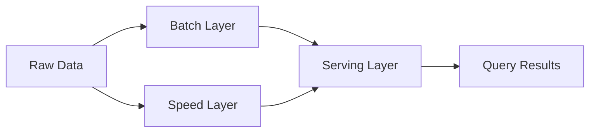

## 16.11. The Lambda Architecture Pattern

### Introduction

In the realm of big data, the Lambda Architecture has emerged as a powerful pattern for processing massive quantities of data by combining batch and real-time processing. This architecture is particularly relevant in scenarios where data needs to be processed both in real-time and in batch mode to ensure accuracy and speed. In this section, we will delve into the components of the Lambda Architecture, explore how Clojure can be utilized in each layer, and provide examples of integrating tools like Hadoop for batch processing and Kafka for real-time streaming. We will also highlight the advantages and complexities of this architecture, with a focus on data consistency and synchronization.

### Understanding the Lambda Architecture

The Lambda Architecture is designed to handle large-scale data processing by dividing the workload into three main layers: the batch layer, the speed layer, and the serving layer. Each layer has a distinct role in processing and managing data, ensuring that the system can handle both historical and real-time data efficiently.

#### Components of the Lambda Architecture

1. **Batch Layer**: This layer is responsible for processing large volumes of historical data. It computes batch views from the master dataset and ensures that the data is accurate and complete. The batch layer is typically implemented using distributed processing frameworks like Hadoop or Apache Spark.

2. **Speed Layer**: Also known as the real-time layer, this component processes data as it arrives, providing low-latency updates to the system. The speed layer compensates for the latency of the batch layer by providing real-time views. Tools like Apache Kafka and Storm are commonly used in this layer.

3. **Serving Layer**: This layer indexes and stores the processed data from both the batch and speed layers, making it available for querying. The serving layer ensures that the data is accessible and can be queried efficiently.

### Implementing the Lambda Architecture with Clojure

Clojure, with its functional programming paradigm and rich ecosystem, is well-suited for implementing the Lambda Architecture. Let's explore how Clojure can be used in each layer of the architecture.

#### Batch Layer with Clojure

In the batch layer, Clojure can be used alongside Hadoop or Apache Spark to process large datasets. Clojure's immutable data structures and concurrency support make it an excellent choice for distributed data processing.

```clojure
(ns batch-layer.core
  (:require [clojure.java.io :as io]
            [clojure.data.csv :as csv]
            [clojure.string :as str]))

(defn process-batch-data [file-path]
  ;; Read and process CSV data
  (with-open [reader (io/reader file-path)]
    (doall
     (csv/read-csv reader))))

(defn compute-batch-view [data]
  ;; Compute aggregate metrics from batch data
  (reduce (fn [acc row]
            (let [key (first row)
                  value (Integer. (second row))]
              (update acc key (fnil + 0) value)))
          {}
          data))

;; Example usage
(let [data (process-batch-data "data.csv")]
  (println (compute-batch-view data)))
```

In this example, we use Clojure to read and process CSV data, computing aggregate metrics as part of the batch view. This approach can be scaled using Hadoop or Spark to handle larger datasets.

#### Speed Layer with Clojure

For the speed layer, Clojure can be integrated with Kafka to process streaming data in real-time. Kafka's robust messaging capabilities, combined with Clojure's concurrency features, allow for efficient real-time data processing.

```clojure
(ns speed-layer.core
  (:require [clojure.core.async :as async]
            [clj-kafka.consumer :as consumer]
            [clj-kafka.producer :as producer]))

(defn start-kafka-consumer [topic]
  ;; Start a Kafka consumer to process real-time data
  (let [consumer (consumer/create-consumer {:bootstrap.servers "localhost:9092"
                                            :group.id "clojure-group"
                                            :auto.offset.reset "earliest"})]
    (consumer/subscribe consumer [topic])
    (async/go-loop []
      (let [records (consumer/poll consumer 100)]
        (doseq [record records]
          (println "Received:" (.value record)))
        (recur)))))

;; Example usage
(start-kafka-consumer "real-time-topic")
```

This code snippet demonstrates how to set up a Kafka consumer in Clojure to process real-time data. The `core.async` library is used to handle asynchronous data processing.

#### Serving Layer with Clojure

The serving layer can be implemented using Clojure's rich set of libraries for data storage and querying. Databases like Datomic or Elasticsearch can be used to store and index the processed data.

```clojure
(ns serving-layer.core
  (:require [datomic.api :as d]))

(defn query-data [db]
  ;; Query data from the serving layer
  (d/q '[:find ?e ?name
         :where [?e :person/name ?name]]
       db))

;; Example usage
(let [conn (d/connect "datomic:mem://example")]
  (println (query-data (d/db conn))))
```

In this example, we use Datomic to query data from the serving layer, demonstrating how Clojure can be used to access and query indexed data efficiently.

### Advantages and Complexity of the Lambda Architecture

The Lambda Architecture offers several advantages, including:

- **Scalability**: By separating batch and real-time processing, the architecture can scale to handle large volumes of data.
- **Fault Tolerance**: The architecture is designed to be fault-tolerant, ensuring that data is processed accurately even in the event of failures.
- **Flexibility**: The architecture supports a wide range of use cases, from real-time analytics to historical data processing.

However, the Lambda Architecture also introduces complexity, particularly in terms of:

- **Data Consistency**: Ensuring consistency between the batch and speed layers can be challenging, requiring careful synchronization and reconciliation.
- **Operational Overhead**: Managing and maintaining the infrastructure for both batch and real-time processing can be resource-intensive.

### Considerations for Data Consistency and Synchronization

To ensure data consistency and synchronization in the Lambda Architecture, consider the following strategies:

- **Use Idempotent Operations**: Ensure that operations in both the batch and speed layers are idempotent, allowing for safe retries and reprocessing.
- **Implement a Reconciliation Process**: Periodically reconcile data between the batch and speed layers to ensure consistency.
- **Leverage Versioning**: Use versioning to track changes and updates to data, facilitating synchronization and consistency.

### Conclusion

The Lambda Architecture is a powerful pattern for processing large-scale data, combining the strengths of batch and real-time processing. By leveraging Clojure's functional programming capabilities and rich ecosystem, developers can implement each layer of the architecture efficiently. While the architecture offers significant advantages in terms of scalability and flexibility, it also introduces complexity, particularly in terms of data consistency and operational overhead. By carefully considering these factors and implementing appropriate strategies, developers can harness the full potential of the Lambda Architecture for data engineering and ETL with Clojure.

### Try It Yourself

Experiment with the provided code examples by modifying the data processing logic or integrating additional tools like Apache Spark or Elasticsearch. Consider setting up a local Kafka cluster to test real-time data processing with Clojure.

### Visualizing the Lambda Architecture

Below is a diagram representing the Lambda Architecture, illustrating the flow of data through the batch, speed, and serving layers.



**Figure 1**: The Lambda Architecture Pattern - Data flows from raw data sources through the batch and speed layers, converging in the serving layer for querying.

### References and Further Reading

- [Lambda Architecture on Wikipedia](https://en.wikipedia.org/wiki/Lambda_architecture)
- [Clojure Documentation](https://clojure.org/)
- [Apache Kafka Documentation](https://kafka.apache.org/documentation/)
- [Datomic Documentation](https://docs.datomic.com/)

## **Ready to Test Your Knowledge?**



### What are the three main components of the Lambda Architecture?

- [x] Batch Layer, Speed Layer, Serving Layer
- [ ] Data Layer, Processing Layer, Output Layer
- [ ] Input Layer, Transformation Layer, Output Layer
- [ ] Storage Layer, Compute Layer, Query Layer

> **Explanation:** The Lambda Architecture consists of the Batch Layer, Speed Layer, and Serving Layer, each serving a specific purpose in data processing.

### How does the batch layer in the Lambda Architecture handle data?

- [x] Processes large volumes of historical data
- [ ] Handles real-time data processing
- [ ] Stores data for querying
- [ ] Manages data consistency

> **Explanation:** The batch layer is responsible for processing large volumes of historical data to ensure accuracy and completeness.

### Which tool is commonly used in the speed layer for real-time data processing?

- [x] Apache Kafka
- [ ] Hadoop
- [ ] Datomic
- [ ] Elasticsearch

> **Explanation:** Apache Kafka is commonly used in the speed layer for real-time data processing due to its robust messaging capabilities.

### What is the primary role of the serving layer in the Lambda Architecture?

- [x] Indexes and stores processed data for querying
- [ ] Processes real-time data
- [ ] Computes batch views
- [ ] Ensures data consistency

> **Explanation:** The serving layer indexes and stores processed data from both the batch and speed layers, making it available for querying.

### What is a key advantage of the Lambda Architecture?

- [x] Scalability
- [ ] Simplicity
- [ ] Low operational overhead
- [ ] Single-layer processing

> **Explanation:** The Lambda Architecture is scalable, allowing it to handle large volumes of data by separating batch and real-time processing.

### What challenge does the Lambda Architecture introduce?

- [x] Data consistency
- [ ] Lack of flexibility
- [ ] Inability to handle real-time data
- [ ] Limited scalability

> **Explanation:** Ensuring data consistency between the batch and speed layers can be challenging, requiring careful synchronization.

### What strategy can help ensure data consistency in the Lambda Architecture?

- [x] Use idempotent operations
- [ ] Avoid reconciliation processes
- [ ] Implement single-layer processing
- [ ] Rely solely on the speed layer

> **Explanation:** Using idempotent operations ensures that operations can be safely retried and reprocessed, aiding in data consistency.

### Which Clojure library is used for asynchronous data processing in the speed layer?

- [x] core.async
- [ ] clojure.data.csv
- [ ] clj-http
- [ ] datomic.api

> **Explanation:** The `core.async` library is used for asynchronous data processing, making it suitable for the speed layer in the Lambda Architecture.

### What is the role of the batch layer in the Lambda Architecture?

- [x] Computes batch views from the master dataset
- [ ] Processes data as it arrives
- [ ] Indexes and stores data for querying
- [ ] Manages data consistency

> **Explanation:** The batch layer computes batch views from the master dataset, ensuring data accuracy and completeness.

### True or False: The Lambda Architecture is designed to handle both historical and real-time data efficiently.

- [x] True
- [ ] False

> **Explanation:** True. The Lambda Architecture is designed to handle both historical and real-time data efficiently by combining batch and real-time processing.



Remember, this is just the beginning. As you progress, you'll build more complex and interactive data processing systems. Keep experimenting, stay curious, and enjoy the journey!
