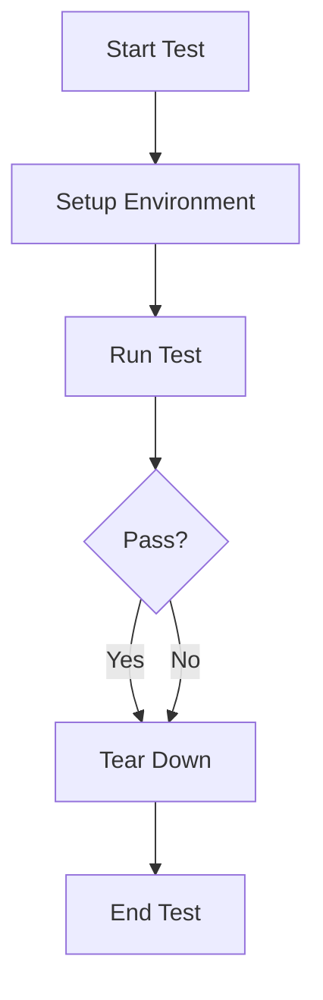

## 16.2 Test Fixtures and Data Generators in Clojure

In the realm of software testing, ensuring a consistent and reliable test environment is crucial for validating the correctness and robustness of your code. Clojure, with its functional programming paradigm, offers powerful tools for managing test environments through test fixtures and data generators. This article delves into the use of these tools, highlighting their significance and demonstrating how they can be effectively employed in Clojure applications.

### Introduction to Test Fixtures

Test fixtures are a fundamental concept in software testing, providing a controlled environment in which tests can be executed. They ensure that each test starts with a known state, which is essential for achieving reliable and repeatable results. In Clojure, test fixtures are typically used to set up the necessary context before a test runs and to clean up afterward.

#### Using Clojure's `with-fixtures` Macro

Clojure's `clojure.test` library provides the `with-fixtures` macro, which is instrumental in managing setup and teardown processes for tests. This macro allows you to define code that should run before and after your tests, ensuring that each test has a clean slate to work with.

Here's a basic example of using `with-fixtures`:

```clojure
(ns myapp.test.core
  (:require [clojure.test :refer :all]))

(defn setup []
  (println "Setting up test environment"))

(defn teardown []
  (println "Tearing down test environment"))

(use-fixtures :each (fn [f]
                      (setup)
                      (f)
                      (teardown)))

(deftest sample-test
  (is (= 1 1)))
```

In this example, `setup` and `teardown` functions are defined to prepare and clean up the test environment, respectively. The `use-fixtures` function is used to apply these functions around each test, ensuring a consistent environment.

### Introducing Data Generators

Data generators are tools that create diverse and dynamic test data, which is crucial for testing the robustness of your code against a wide range of inputs. In Clojure, the `test.check` library is a popular choice for generating random data.

#### Using `test.check` for Random Data Generation

`test.check` is a property-based testing library that allows you to specify properties that your code should satisfy and then automatically generates test cases to verify those properties. This approach is particularly useful for uncovering edge cases that might not be considered in traditional example-based testing.

Here's an example of using `test.check` to generate random integers:

```clojure
(ns myapp.test.generators
  (:require [clojure.test.check.generators :as gen]
            [clojure.test.check.properties :as prop]
            [clojure.test.check :as tc]))

(def int-gen (gen/choose 0 100))

(def prop-example
  (prop/for-all [n int-gen]
    (<= 0 n 100)))

(tc/quick-check 100 prop-example)
```

In this example, `gen/choose` is used to create a generator for integers between 0 and 100. The `prop/for-all` macro defines a property that checks if the generated integers fall within the specified range. `tc/quick-check` runs the property test with 100 random inputs.

### Centralizing Object Creation Logic

To avoid duplication and ensure consistency in your tests, it's beneficial to centralize object creation logic. This approach not only reduces redundancy but also makes it easier to update test data structures across multiple tests.

#### Creating Reusable Functions for Test Data Setup

By encapsulating data creation logic in reusable functions, you can streamline the process of setting up test data. Here's an example:

```clojure
(defn create-user [id name]
  {:id id :name name})

(deftest user-test
  (let [user (create-user 1 "Alice")]
    (is (= (:name user) "Alice"))))
```

In this example, the `create-user` function centralizes the creation of user data, making it easy to reuse across different tests.

### Benefits of Using Fixtures and Data Generators

The use of test fixtures and data generators offers several advantages:

- **Consistency:** Fixtures ensure that tests run in a controlled environment, reducing the likelihood of flaky tests.
- **Thoroughness:** Data generators allow for testing with a wide range of inputs, increasing the chances of catching edge cases.
- **Maintainability:** Centralizing object creation logic simplifies test maintenance and reduces duplication.
- **Scalability:** As your codebase grows, these tools help manage the complexity of testing by providing reusable and flexible testing components.

### Visualizing the Workflow

To better understand the workflow of using test fixtures and data generators, consider the following diagram:



This diagram illustrates the typical flow of a test using fixtures, where the environment is set up before the test and torn down afterward, regardless of the test outcome.

### Conclusion

Incorporating test fixtures and data generators into your Clojure testing strategy can significantly enhance the reliability and coverage of your tests. By leveraging tools like `with-fixtures` and `test.check`, you can create robust test environments and explore a wide range of input scenarios, ultimately leading to more resilient and dependable software.

## Quiz Time!



### What is the primary purpose of test fixtures in Clojure?

- [x] To provide a consistent test environment by managing setup and teardown processes.
- [ ] To generate random test data for property-based testing.
- [ ] To centralize object creation logic for tests.
- [ ] To replace the need for unit tests.

> **Explanation:** Test fixtures are used to ensure that each test starts with a known state, providing a consistent environment for reliable and repeatable results.

### Which Clojure macro is used to manage test setup and teardown?

- [x] `with-fixtures`
- [ ] `defmacro`
- [ ] `let`
- [ ] `defn`

> **Explanation:** The `with-fixtures` macro in Clojure's `clojure.test` library is used to manage setup and teardown processes for tests.

### What library is commonly used in Clojure for generating random test data?

- [x] `test.check`
- [ ] `clojure.data`
- [ ] `core.async`
- [ ] `clojure.spec`

> **Explanation:** `test.check` is a property-based testing library in Clojure that is commonly used for generating random test data.

### How can you centralize object creation logic in Clojure tests?

- [x] By creating reusable functions for test data setup.
- [ ] By using `test.check` generators.
- [ ] By writing separate test cases for each object.
- [ ] By using global variables.

> **Explanation:** Centralizing object creation logic can be achieved by creating reusable functions for test data setup, reducing redundancy and ensuring consistency.

### What is a benefit of using data generators in testing?

- [x] They allow for testing with a wide range of inputs, increasing the chances of catching edge cases.
- [ ] They eliminate the need for test fixtures.
- [ ] They simplify the test setup process by using global variables.
- [ ] They ensure that tests always pass.

> **Explanation:** Data generators allow for testing with diverse inputs, which helps in uncovering edge cases that might not be considered in traditional testing.

### What does the `gen/choose` function do in `test.check`?

- [x] It creates a generator for random values within a specified range.
- [ ] It defines a property for testing.
- [ ] It runs the property test with random inputs.
- [ ] It sets up the test environment.

> **Explanation:** The `gen/choose` function in `test.check` creates a generator for random values within a specified range.

### Why is it beneficial to use `with-fixtures` in tests?

- [x] It ensures that each test has a clean slate to work with by managing setup and teardown.
- [ ] It generates random test data for each test.
- [ ] It replaces the need for assertions in tests.
- [ ] It automatically fixes failing tests.

> **Explanation:** `with-fixtures` ensures that each test has a clean slate by managing setup and teardown processes, providing a consistent environment.

### What is the role of `prop/for-all` in `test.check`?

- [x] It defines a property that should hold true for all generated test cases.
- [ ] It creates a generator for random values.
- [ ] It runs the property test with random inputs.
- [ ] It sets up the test environment.

> **Explanation:** `prop/for-all` is used to define a property that should hold true for all generated test cases in `test.check`.

### What is a key advantage of centralizing object creation logic in tests?

- [x] It simplifies test maintenance and reduces duplication.
- [ ] It eliminates the need for test fixtures.
- [ ] It ensures that tests always pass.
- [ ] It generates random test data for each test.

> **Explanation:** Centralizing object creation logic simplifies test maintenance and reduces duplication, making it easier to update test data structures across multiple tests.

### True or False: Data generators can replace the need for test fixtures in Clojure.

- [ ] True
- [x] False

> **Explanation:** Data generators and test fixtures serve different purposes. Data generators create diverse test data, while test fixtures manage the test environment setup and teardown.


