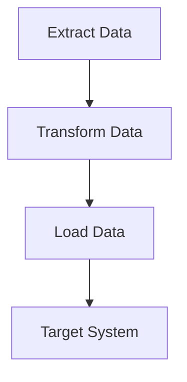

## 16.2. Building ETL Pipelines with Clojure

In today's data-driven world, the ability to efficiently move and transform data between systems is crucial. Extract, Transform, Load (ETL) pipelines are the backbone of data engineering, enabling organizations to harness the power of their data. In this section, we will explore how to build robust ETL pipelines using Clojure, a functional programming language known for its simplicity and power.

### Understanding ETL Pipelines

ETL pipelines consist of three main components:

1. **Extract**: Retrieve data from various sources, such as databases, APIs, or files.
2. **Transform**: Manipulate and clean the data to fit the desired format or schema.
3. **Load**: Insert the transformed data into a target system, such as a data warehouse or another database.

Let's dive into each of these components and see how Clojure can be leveraged to build efficient ETL pipelines.

### Extracting Data

The extraction phase involves retrieving data from different sources. Clojure's interoperability with Java and its rich ecosystem of libraries make it an excellent choice for data extraction tasks.

#### Extracting Data from Databases

To extract data from databases, we can use the `clojure.java.jdbc` library, which provides a simple interface for interacting with SQL databases.

```clojure
(require '[clojure.java.jdbc :as jdbc])

(def db-spec {:dbtype "mysql"
              :dbname "mydb"
              :user "user"
              :password "password"})

(defn extract-data []
  (jdbc/query db-spec ["SELECT * FROM my_table"]))
```

In this example, we define a database specification and use the `jdbc/query` function to extract data from a MySQL database.

#### Extracting Data from APIs

For extracting data from APIs, we can use the `clj-http` library, which provides a simple HTTP client for Clojure.

```clojure
(require '[clj-http.client :as client])

(defn extract-api-data []
  (let [response (client/get "https://api.example.com/data")]
    (:body response)))
```

Here, we make a GET request to an API endpoint and extract the response body.

#### Extracting Data from Files

Clojure's standard library provides functions for reading data from files. For example, we can use `slurp` to read data from a text file.

```clojure
(defn extract-file-data [file-path]
  (slurp file-path))
```

This function reads the entire content of a file into a string.

### Transforming Data

The transformation phase involves cleaning, normalizing, and reshaping the data. Clojure's functional programming paradigm and powerful data manipulation functions make it ideal for data transformation tasks.

#### Using Core Functions for Transformation

Clojure's core library provides a rich set of functions for transforming data. Let's look at some examples.

```clojure
(defn transform-data [data]
  (->> data
       (map #(update % :price inc))
       (filter #(> (:price %) 100))
       (sort-by :price)))
```

In this example, we use `map` to increment the price of each item, `filter` to retain items with a price greater than 100, and `sort-by` to sort the items by price.

#### Leveraging Libraries for Complex Transformations

For more complex transformations, we can use libraries like `clojure.data.csv` for CSV data or `cheshire` for JSON data.

```clojure
(require '[clojure.data.csv :as csv]
         '[cheshire.core :as json])

(defn transform-csv-data [csv-data]
  (->> (csv/read-csv csv-data)
       (map #(zipmap [:id :name :price] %))
       (filter #(> (:price %) 100))))

(defn transform-json-data [json-data]
  (->> (json/parse-string json-data true)
       (map #(update % :price inc))))
```

These functions demonstrate how to transform CSV and JSON data using the respective libraries.

### Loading Data

The loading phase involves inserting the transformed data into a target system. Clojure's interoperability with Java and its libraries make it easy to load data into various systems.

#### Loading Data into Databases

We can use `clojure.java.jdbc` to insert data into a database.

```clojure
(defn load-data [data]
  (jdbc/insert-multi! db-spec :my_table data))
```

This function inserts a collection of data into a database table.

#### Loading Data into Files

To load data into files, we can use Clojure's standard library functions.

```clojure
(defn load-data-to-file [data file-path]
  (spit file-path (pr-str data)))
```

This function writes data to a file in a readable format.

### Error Handling and Data Validation

Error handling and data validation are crucial aspects of building reliable ETL pipelines. Let's explore some strategies for handling errors and validating data in Clojure.

#### Error Handling

Clojure provides several mechanisms for error handling, including `try-catch` blocks and the `ex-info` function for creating exceptions with additional context.

```clojure
(defn safe-extract-data []
  (try
    (extract-data)
    (catch Exception e
      (println "Error extracting data:" (.getMessage e)))))
```

In this example, we use a `try-catch` block to handle exceptions during data extraction.

#### Data Validation

For data validation, we can use the `clojure.spec` library, which provides a powerful way to define and validate data structures.

```clojure
(require '[clojure.spec.alpha :as s])

(s/def ::price pos-int?)

(defn validate-data [data]
  (every? #(s/valid? ::price (:price %)) data))
```

This example defines a spec for positive integers and uses it to validate the price field in a collection of data.

### Visualizing ETL Pipelines

To better understand the flow of data through an ETL pipeline, let's visualize the process using a flowchart.



This flowchart illustrates the basic flow of data through an ETL pipeline, from extraction to transformation and loading into a target system.

### Best Practices for Building ETL Pipelines

- **Modularize Your Code**: Break down your ETL pipeline into small, reusable functions.
- **Use Pure Functions**: Leverage Clojure's functional programming paradigm to write pure functions that are easy to test and reason about.
- **Leverage Concurrency**: Use Clojure's concurrency primitives to parallelize data processing tasks and improve performance.
- **Implement Logging**: Add logging to track the progress and status of your ETL pipeline.
- **Monitor and Alert**: Set up monitoring and alerting to detect and respond to issues in your ETL pipeline.

### Try It Yourself

Now that we've covered the basics of building ETL pipelines with Clojure, it's time to experiment. Try modifying the code examples to extract data from different sources, apply various transformations, and load data into different target systems. Consider adding error handling and data validation to make your pipeline more robust.

### Conclusion

Building ETL pipelines with Clojure offers a powerful and flexible approach to data engineering. By leveraging Clojure's functional programming paradigm, rich ecosystem of libraries, and interoperability with Java, you can create efficient and reliable ETL pipelines that meet the needs of your organization.

## **Ready to Test Your Knowledge?**



### What are the three main components of an ETL pipeline?

- [x] Extract, Transform, Load
- [ ] Extract, Transfer, Load
- [ ] Extract, Transform, Link
- [ ] Extract, Transfer, Link

> **Explanation:** ETL stands for Extract, Transform, Load, which are the three main components of an ETL pipeline.

### Which Clojure library is commonly used for interacting with SQL databases?

- [x] clojure.java.jdbc
- [ ] clj-http
- [ ] cheshire
- [ ] clojure.data.csv

> **Explanation:** The `clojure.java.jdbc` library is commonly used for interacting with SQL databases in Clojure.

### How can you handle errors during data extraction in Clojure?

- [x] Use try-catch blocks
- [ ] Use map-reduce
- [ ] Use filter
- [ ] Use sort-by

> **Explanation:** You can handle errors during data extraction in Clojure using `try-catch` blocks to catch exceptions.

### What is the purpose of the `clojure.spec` library?

- [x] To define and validate data structures
- [ ] To interact with SQL databases
- [ ] To make HTTP requests
- [ ] To read and write CSV files

> **Explanation:** The `clojure.spec` library is used to define and validate data structures in Clojure.

### Which function is used to read the entire content of a file into a string in Clojure?

- [x] slurp
- [ ] spit
- [ ] read
- [ ] write

> **Explanation:** The `slurp` function is used to read the entire content of a file into a string in Clojure.

### What is the benefit of using pure functions in ETL pipelines?

- [x] They are easy to test and reason about
- [ ] They are faster than impure functions
- [ ] They require less memory
- [ ] They are easier to write

> **Explanation:** Pure functions are easy to test and reason about, making them beneficial in ETL pipelines.

### How can you parallelize data processing tasks in Clojure?

- [x] Use Clojure's concurrency primitives
- [ ] Use map-reduce
- [ ] Use filter
- [ ] Use sort-by

> **Explanation:** You can parallelize data processing tasks in Clojure using its concurrency primitives.

### Which library is used for making HTTP requests in Clojure?

- [x] clj-http
- [ ] clojure.java.jdbc
- [ ] cheshire
- [ ] clojure.data.csv

> **Explanation:** The `clj-http` library is used for making HTTP requests in Clojure.

### What is the purpose of the `spit` function in Clojure?

- [x] To write data to a file
- [ ] To read data from a file
- [ ] To transform data
- [ ] To validate data

> **Explanation:** The `spit` function is used to write data to a file in Clojure.

### True or False: Clojure's interoperability with Java makes it easy to load data into various systems.

- [x] True
- [ ] False

> **Explanation:** Clojure's interoperability with Java allows it to easily load data into various systems.



Remember, this is just the beginning. As you progress, you'll build more complex and interactive ETL pipelines. Keep experimenting, stay curious, and enjoy the journey!


