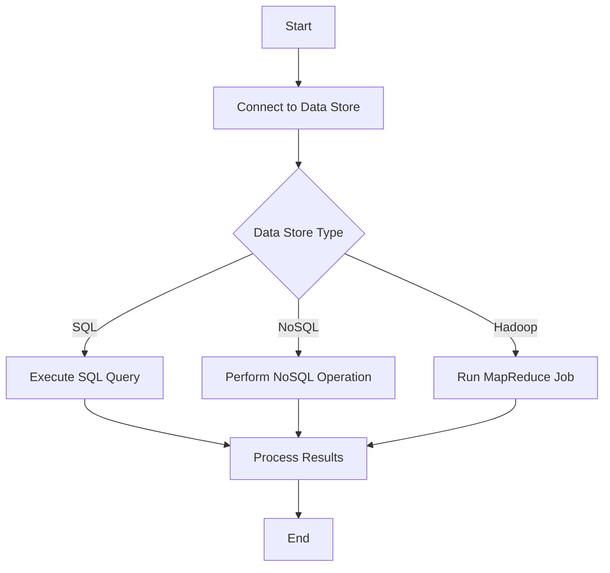

## 16.3. Integrating with Data Stores: SQL, NoSQL, and Hadoop in Clojure

In the world of data engineering, integrating with various data stores is a crucial skill. Clojure, with its functional programming paradigm and robust ecosystem, provides powerful tools for connecting to SQL databases, NoSQL databases, and Hadoop ecosystems. This section will guide you through the process of integrating Clojure with these data stores, emphasizing best practices, performance optimization, and data consistency.

### 1. Interacting with SQL Databases

SQL databases are a staple in data storage, known for their ACID properties and structured query language. In Clojure, you can interact with SQL databases using JDBC or libraries like [next.jdbc](https://github.com/seancorfield/next-jdbc).

#### 1.1. Using JDBC in Clojure

JDBC (Java Database Connectivity) is a Java-based API that allows you to connect to a wide range of databases. In Clojure, you can use JDBC to execute SQL queries and manage database connections.

**Example: Connecting to a SQL Database Using JDBC**

```clojure
(ns myapp.database
  (:require [clojure.java.jdbc :as jdbc]))

(def db-spec
  {:dbtype "mysql"
   :dbname "mydatabase"
   :user "username"
   :password "password"})

;; Querying the database
(defn get-users []
  (jdbc/query db-spec ["SELECT * FROM users"]))
```

In this example, we define a `db-spec` map containing the database connection details. The `jdbc/query` function is used to execute a SQL query and retrieve data from the `users` table.

#### 1.2. Leveraging next.jdbc

[next.jdbc](https://github.com/seancorfield/next-jdbc) is a modern, low-level Clojure wrapper for JDBC. It provides a more idiomatic Clojure interface and better performance.

**Example: Using next.jdbc for Database Operations**

```clojure
(ns myapp.database
  (:require [next.jdbc :as jdbc]))

(def db-spec
  {:dbtype "postgresql"
   :dbname "mydatabase"
   :user "username"
   :password "password"})

;; Creating a connection pool
(def datasource (jdbc/get-datasource db-spec))

;; Fetching data
(defn fetch-users []
  (jdbc/execute! datasource ["SELECT * FROM users"]))
```

Here, we use `next.jdbc/get-datasource` to create a connection pool, which is more efficient for handling multiple database requests. The `jdbc/execute!` function is used to execute SQL queries.

#### 1.3. Best Practices for SQL Integration

- **Connection Pooling**: Use connection pooling to manage database connections efficiently and reduce overhead.
- **Prepared Statements**: Use prepared statements to prevent SQL injection attacks and improve performance.
- **Indexing**: Ensure proper indexing of database tables to speed up query execution.
- **Transaction Management**: Use transactions to maintain data consistency and integrity.

### 2. Working with NoSQL Databases

NoSQL databases offer flexible schemas and are designed for scalability. Clojure provides libraries like [Monger](https://github.com/michaelklishin/monger) for interacting with NoSQL databases such as MongoDB.

#### 2.1. Introduction to Monger

Monger is a Clojure library that provides a comprehensive interface for MongoDB, a popular NoSQL database.

**Example: Connecting to MongoDB Using Monger**

```clojure
(ns myapp.nosql
  (:require [monger.core :as mg]
            [monger.collection :as mc]))

;; Connect to MongoDB
(def conn (mg/connect))
(def db (mg/get-db conn "mydatabase"))

;; Insert a document
(defn insert-user [user]
  (mc/insert db "users" user))

;; Find documents
(defn find-users []
  (mc/find-maps db "users"))
```

In this example, we use `monger.core/connect` to establish a connection to MongoDB and `monger.collection/insert` to add a document to the `users` collection.

#### 2.2. Best Practices for NoSQL Integration

- **Schema Design**: Design your schema to take advantage of NoSQL's flexibility and scalability.
- **Indexing**: Use indexes to improve query performance.
- **Data Consistency**: Implement strategies for eventual consistency if required by your application.

### 3. Integrating with Hadoop Ecosystems

Hadoop is a framework for distributed storage and processing of large data sets. Clojure can integrate with Hadoop using libraries like [Parkour](https://github.com/damballa/parkour).

#### 3.1. Introduction to Parkour

Parkour is a Clojure library for working with Hadoop, providing a functional interface for MapReduce jobs.

**Example: Running a MapReduce Job with Parkour**

```clojure
(ns myapp.hadoop
  (:require [parkour.core :as pk]
            [parkour.mapreduce :as mr]))

(defn map-fn [key value]
  ;; Map function logic
  )

(defn reduce-fn [key values]
  ;; Reduce function logic
  )

(defn run-job []
  (pk/with-job [job (mr/job "My MapReduce Job")]
    (mr/set-mapper job map-fn)
    (mr/set-reducer job reduce-fn)
    (mr/submit job)))
```

In this example, we define a MapReduce job using Parkour, specifying the map and reduce functions.

#### 3.2. Best Practices for Hadoop Integration

- **Data Partitioning**: Partition data effectively to optimize processing.
- **Resource Management**: Monitor and manage resources to ensure efficient job execution.
- **Data Locality**: Ensure data locality to minimize data transfer and improve performance.

### 4. Considerations for Performance and Data Consistency

When integrating with data stores, consider the following:

- **Latency**: Minimize latency by optimizing queries and using efficient data structures.
- **Scalability**: Design your system to scale horizontally as data volume increases.
- **Consistency**: Choose the appropriate consistency model (e.g., strong, eventual) based on your application's requirements.

### 5. Query Optimization and Indexing

- **Analyze Query Plans**: Use tools to analyze query execution plans and identify bottlenecks.
- **Optimize Joins**: Optimize join operations by indexing foreign keys and using efficient join algorithms.
- **Use Caching**: Implement caching strategies to reduce database load and improve response times.

### Visualizing Data Integration Workflows

To better understand the integration process, let's visualize a typical data integration workflow using a flowchart.



**Figure 1**: A flowchart illustrating the data integration workflow in Clojure.

### Conclusion

Integrating Clojure with SQL, NoSQL, and Hadoop data stores opens up a world of possibilities for data engineering and ETL processes. By following best practices and leveraging Clojure's powerful libraries, you can build efficient, scalable, and consistent data integration solutions.

Remember, this is just the beginning. As you progress, you'll discover more advanced techniques and optimizations. Keep experimenting, stay curious, and enjoy the journey!

## **Ready to Test Your Knowledge?**



### What is the primary purpose of JDBC in Clojure?

- [x] To connect to SQL databases
- [ ] To connect to NoSQL databases
- [ ] To connect to Hadoop ecosystems
- [ ] To connect to cloud services

> **Explanation:** JDBC (Java Database Connectivity) is used to connect to SQL databases in Clojure.

### Which library is recommended for interacting with MongoDB in Clojure?

- [ ] next.jdbc
- [x] Monger
- [ ] Parkour
- [ ] Aleph

> **Explanation:** Monger is a Clojure library specifically designed for interacting with MongoDB.

### What is the benefit of using connection pooling in SQL integration?

- [x] It manages database connections efficiently
- [ ] It increases query execution time
- [ ] It decreases data consistency
- [ ] It simplifies schema design

> **Explanation:** Connection pooling manages database connections efficiently, reducing overhead and improving performance.

### Which library is used for integrating Clojure with Hadoop?

- [ ] Monger
- [ ] next.jdbc
- [x] Parkour
- [ ] Aleph

> **Explanation:** Parkour is a Clojure library for working with Hadoop ecosystems.

### What is a key consideration when designing schemas for NoSQL databases?

- [x] Flexibility and scalability
- [ ] Strong consistency
- [ ] Complex joins
- [ ] Fixed schemas

> **Explanation:** NoSQL databases are designed for flexibility and scalability, allowing for dynamic schema design.

### How can you prevent SQL injection attacks in Clojure?

- [x] Use prepared statements
- [ ] Use dynamic SQL queries
- [ ] Use connection pooling
- [ ] Use MapReduce jobs

> **Explanation:** Prepared statements help prevent SQL injection attacks by parameterizing queries.

### What is the role of indexing in database integration?

- [x] To speed up query execution
- [ ] To increase data redundancy
- [ ] To simplify schema design
- [ ] To manage database connections

> **Explanation:** Indexing speeds up query execution by allowing faster data retrieval.

### Which consistency model is typically used in NoSQL databases?

- [ ] Strong consistency
- [x] Eventual consistency
- [ ] Immediate consistency
- [ ] Sequential consistency

> **Explanation:** NoSQL databases often use eventual consistency to allow for high availability and partition tolerance.

### What is a common strategy for optimizing join operations in SQL databases?

- [x] Indexing foreign keys
- [ ] Using dynamic SQL queries
- [ ] Using MapReduce jobs
- [ ] Using connection pooling

> **Explanation:** Indexing foreign keys optimizes join operations by allowing faster data retrieval.

### True or False: Parkour is used for integrating Clojure with SQL databases.

- [ ] True
- [x] False

> **Explanation:** Parkour is used for integrating Clojure with Hadoop ecosystems, not SQL databases.


