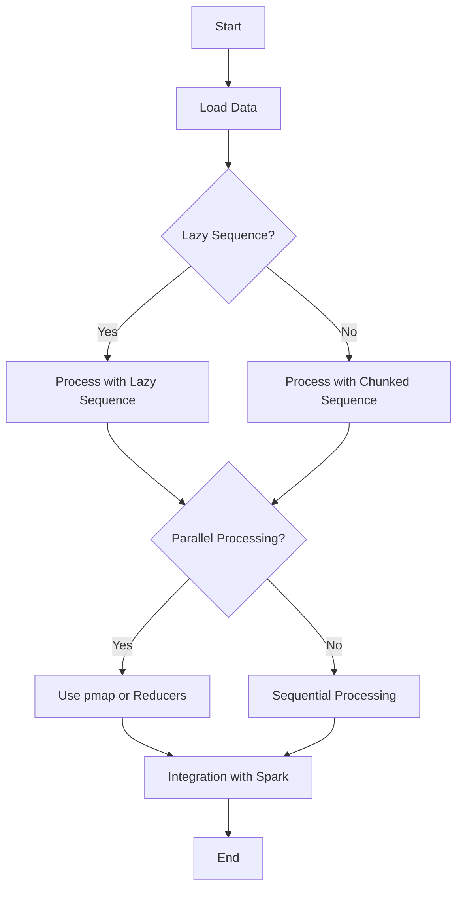

## 16.4. Handling Large Data Sets Efficiently

In the realm of data engineering, efficiently handling large data sets is a critical skill. Clojure, with its functional programming paradigm and powerful concurrency models, offers unique capabilities to tackle big data challenges. In this section, we will explore techniques for processing large data sets efficiently, focusing on memory management, lazy sequences, parallel processing, and integration with distributed computing frameworks like Apache Spark via [Flambo](https://github.com/yieldbot/flambo).

### Challenges of Big Data Processing

Handling large data sets presents several challenges, including:

- **Memory Management**: Large data sets can quickly exhaust available memory, leading to performance degradation or crashes.
- **Processing Speed**: Efficient algorithms and data structures are necessary to process data quickly.
- **Concurrency and Parallelism**: Leveraging multiple cores and processors can significantly speed up data processing.
- **Scalability**: The ability to scale processing across multiple machines is crucial for handling truly massive data sets.

Let's delve into how Clojure addresses these challenges.

### Lazy Sequences and Chunked Processing

Clojure's lazy sequences are a powerful tool for handling large data sets. Lazy sequences allow you to work with potentially infinite data structures without loading the entire data set into memory at once. This can be particularly useful when dealing with large files or streams of data.

#### Example: Lazy Sequences

```clojure
(defn process-large-file [file-path]
  (with-open [rdr (clojure.java.io/reader file-path)]
    (doall
      (for [line (line-seq rdr)]
        (process-line line)))))

(defn process-line [line]
  ;; Process each line of the file
  (println line))
```

In this example, `line-seq` creates a lazy sequence of lines from a file, allowing you to process each line without loading the entire file into memory.

#### Chunked Processing

Clojure's chunked sequences can further optimize performance by processing data in chunks, reducing the overhead of repeatedly calling sequence functions.

```clojure
(defn chunked-processing [coll]
  (doseq [chunk (partition-all 1000 coll)]
    (process-chunk chunk)))

(defn process-chunk [chunk]
  ;; Process each chunk
  (println (count chunk)))
```

Here, `partition-all` divides the collection into chunks of 1000 elements, allowing you to process each chunk efficiently.

### Parallel Processing with `pmap` and Reducers

Parallel processing can significantly improve the performance of data processing tasks by utilizing multiple CPU cores. Clojure provides several tools for parallel processing, including `pmap` and reducers.

#### Using `pmap`

`pmap` is a parallel version of `map` that applies a function to each element of a collection in parallel.

```clojure
(defn parallel-processing [coll]
  (pmap process-item coll))

(defn process-item [item]
  ;; Process each item
  (println item))
```

`pmap` is ideal for CPU-bound tasks where the processing of each element is independent of the others.

#### Reducers

Reducers provide a more flexible and efficient way to perform parallel processing, especially for operations that can be expressed as reductions.

```clojure
(require '[clojure.core.reducers :as r])

(defn parallel-reduce [coll]
  (r/fold + (r/map process-item coll)))

(defn process-item [item]
  ;; Process each item and return a numeric result
  (inc item))
```

In this example, `r/fold` performs a parallel reduction over the collection, applying `process-item` to each element.

### Integration with Distributed Computing Frameworks

For truly massive data sets, distributed computing frameworks like Apache Spark can be invaluable. Clojure can integrate with Spark using libraries like [Flambo](https://github.com/yieldbot/flambo), allowing you to leverage Spark's distributed processing capabilities.

#### Example: Using Flambo with Spark

```clojure
(require '[flambo.api :as f])
(require '[flambo.conf :as conf])

(defn spark-processing [data]
  (let [conf (-> (conf/spark-conf)
                 (conf/master "local")
                 (conf/app-name "Clojure Spark Example"))
        sc (f/spark-context conf)]
    (-> (f/parallelize sc data)
        (f/map process-item)
        (f/collect))))

(defn process-item [item]
  ;; Process each item
  (inc item))
```

In this example, we create a Spark context and use Flambo to parallelize and process data across a Spark cluster.

### Monitoring and Optimizing Resource Usage

Efficiently handling large data sets also involves monitoring and optimizing resource usage. Here are some tips:

- **Profile Your Code**: Use profiling tools to identify bottlenecks and optimize performance.
- **Optimize Memory Usage**: Use lazy sequences and chunked processing to minimize memory consumption.
- **Leverage Parallelism**: Use `pmap`, reducers, and distributed computing frameworks to maximize CPU utilization.
- **Monitor Resource Usage**: Use monitoring tools to track CPU, memory, and network usage, and adjust your processing strategy accordingly.

### Try It Yourself

Experiment with the examples provided in this section. Try modifying the chunk size in the chunked processing example, or use different functions with `pmap` and reducers to see how they affect performance. Explore integrating Clojure with Spark using Flambo for distributed processing.

### Visualizing Data Processing Flow

To better understand the flow of data processing in Clojure, let's visualize the process using a flowchart.



This flowchart illustrates the decision-making process for handling large data sets in Clojure, from loading data to processing it with lazy sequences, chunked sequences, and parallel processing techniques.

### Key Takeaways

- **Lazy Sequences**: Use lazy sequences to handle large data sets without loading everything into memory.
- **Chunked Processing**: Optimize performance by processing data in chunks.
- **Parallel Processing**: Leverage `pmap` and reducers for parallel processing.
- **Distributed Computing**: Integrate with frameworks like Apache Spark using Flambo for distributed processing.
- **Resource Optimization**: Monitor and optimize resource usage to ensure efficient data processing.

### Ready to Test Your Knowledge?



### What is the primary benefit of using lazy sequences in Clojure?

- [x] They allow processing of large data sets without loading everything into memory.
- [ ] They automatically parallelize data processing.
- [ ] They increase the speed of data processing by default.
- [ ] They provide built-in error handling for data processing.

> **Explanation:** Lazy sequences in Clojure allow you to process large data sets without loading the entire data set into memory, which is crucial for handling large files or streams of data efficiently.

### Which Clojure function is used for parallel processing of collections?

- [ ] map
- [x] pmap
- [ ] reduce
- [ ] filter

> **Explanation:** `pmap` is the parallel version of `map` in Clojure, allowing you to apply a function to each element of a collection in parallel.

### What is the purpose of chunked processing in Clojure?

- [x] To process data in chunks, reducing the overhead of repeatedly calling sequence functions.
- [ ] To automatically distribute data processing across multiple machines.
- [ ] To ensure data processing is done sequentially.
- [ ] To provide error handling for data processing.

> **Explanation:** Chunked processing in Clojure allows you to process data in chunks, which can reduce the overhead of repeatedly calling sequence functions and improve performance.

### How can Clojure integrate with Apache Spark for distributed processing?

- [ ] Using the core.async library
- [x] Using the Flambo library
- [ ] Using the reducers library
- [ ] Using the spec library

> **Explanation:** Clojure can integrate with Apache Spark for distributed processing using the Flambo library, which provides a Clojure-friendly API for Spark.

### What is a key consideration when using `pmap` for parallel processing?

- [x] Each element's processing should be independent of others.
- [ ] It automatically handles memory management.
- [ ] It is suitable for I/O-bound tasks.
- [ ] It requires a distributed computing framework.

> **Explanation:** When using `pmap` for parallel processing, it's important that the processing of each element is independent of others, as `pmap` does not guarantee the order of execution.

### Which of the following is a benefit of using reducers in Clojure?

- [x] They provide a flexible and efficient way to perform parallel processing.
- [ ] They automatically handle distributed computing.
- [ ] They are only suitable for small data sets.
- [ ] They require the use of lazy sequences.

> **Explanation:** Reducers in Clojure provide a flexible and efficient way to perform parallel processing, especially for operations that can be expressed as reductions.

### What is the role of monitoring tools in handling large data sets?

- [x] To track CPU, memory, and network usage and adjust processing strategies.
- [ ] To automatically optimize code for parallel processing.
- [ ] To provide built-in error handling for data processing.
- [ ] To ensure data processing is done sequentially.

> **Explanation:** Monitoring tools are used to track CPU, memory, and network usage, allowing you to adjust your processing strategies to ensure efficient data processing.

### Which function is used to divide a collection into chunks in Clojure?

- [ ] partition
- [x] partition-all
- [ ] split-at
- [ ] chunk

> **Explanation:** The `partition-all` function in Clojure is used to divide a collection into chunks, allowing you to process each chunk efficiently.

### What is the advantage of using Flambo for Spark integration?

- [x] It provides a Clojure-friendly API for Spark.
- [ ] It automatically parallelizes data processing.
- [ ] It is built into the Clojure standard library.
- [ ] It requires no additional setup for distributed computing.

> **Explanation:** Flambo provides a Clojure-friendly API for Spark, making it easier to integrate Clojure with Spark for distributed processing.

### True or False: Lazy sequences in Clojure load the entire data set into memory at once.

- [ ] True
- [x] False

> **Explanation:** False. Lazy sequences in Clojure do not load the entire data set into memory at once; they allow you to process data incrementally, which is crucial for handling large data sets efficiently.



Remember, this is just the beginning. As you progress, you'll build more complex and efficient data processing pipelines. Keep experimenting, stay curious, and enjoy the journey!
