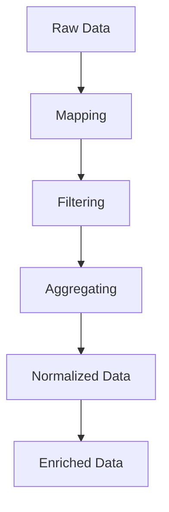

## 16.5. Data Transformation and Enrichment

In the realm of data engineering, transforming and enriching data is crucial for preparing it for analysis or storage. Clojure, with its functional programming paradigm and powerful libraries, offers a robust toolkit for these tasks. In this section, we will explore various patterns and techniques for data transformation and enrichment, focusing on mapping, filtering, aggregating, and handling complex data structures.

### Understanding Data Transformation and Enrichment

Data transformation involves converting data from one format or structure to another. This process is essential for integrating data from different sources, ensuring consistency, and preparing it for analysis. Enrichment, on the other hand, involves enhancing the data by adding new information or context, making it more valuable for decision-making.

### Mapping, Filtering, and Aggregating Data

Clojure provides a rich set of core functions for data transformation, including `map`, `filter`, and `reduce`. These functions allow you to process collections efficiently and expressively.

#### Mapping

The `map` function applies a given function to each element of a collection, returning a new collection of the results. This is useful for transforming data elements individually.

```clojure
(defn square [x]
  (* x x))

(def numbers [1 2 3 4 5])

(def squared-numbers (map square numbers))
;; => (1 4 9 16 25)
```

#### Filtering

The `filter` function selects elements from a collection that satisfy a given predicate function. This is useful for removing unwanted data.

```clojure
(defn even? [x]
  (zero? (mod x 2)))

(def even-numbers (filter even? numbers))
;; => (2 4)
```

#### Aggregating

The `reduce` function processes a collection to produce a single accumulated result. It is often used for summing, counting, or combining data.

```clojure
(defn sum [acc x]
  (+ acc x))

(def total-sum (reduce sum 0 numbers))
;; => 15
```

### Advanced Data Transformation with Specter

Specter is a powerful library for navigating and transforming nested data structures in Clojure. It provides a concise and expressive way to manipulate complex data.

#### Navigating Nested Structures

Specter allows you to define paths through nested data structures, making it easy to access and modify deeply nested elements.

```clojure
(require '[com.rpl.specter :as s])

(def data {:a {:b {:c 1 :d 2} :e 3} :f 4})

(def c-value (s/select [:a :b :c] data))
;; => [1]
```

#### Transforming Data

With Specter, you can apply transformations to specific parts of a data structure without affecting the rest.

```clojure
(def updated-data (s/transform [:a :b :c] inc data))
;; => {:a {:b {:c 2 :d 2} :e 3} :f 4}
```

### Techniques for Data Normalization and Cleaning

Data normalization and cleaning are critical steps in preparing data for analysis. These processes involve standardizing data formats, removing duplicates, and correcting errors.

#### Normalizing Data

Normalization involves adjusting data to a common scale or format. This can include converting dates to a standard format or scaling numerical values.

```clojure
(defn normalize-date [date-str]
  ;; Assume date-str is in "MM/DD/YYYY" format
  (let [[month day year] (clojure.string/split date-str #"/")]
    (str year "-" month "-" day)))

(def dates ["12/31/2020" "01/01/2021"])

(def normalized-dates (map normalize-date dates))
;; => ("2020-12-31" "2021-01-01")
```

#### Cleaning Data

Data cleaning involves identifying and correcting errors or inconsistencies in data. This can include removing null values, correcting typos, or eliminating duplicates.

```clojure
(def raw-data [1 2 nil 4 5 nil 7])

(def cleaned-data (filter some? raw-data))
;; => (1 2 4 5 7)
```

### Handling Complex or Nested Data Structures

Clojure's immutable data structures and functional approach make it well-suited for handling complex or nested data. Specter, as mentioned earlier, is particularly useful for these tasks.

#### Example: Transforming Nested JSON

Consider a nested JSON structure representing user data. We can use Specter to transform specific fields.

```clojure
(def user-data
  {:users [{:id 1 :name "Alice" :age 30}
           {:id 2 :name "Bob" :age 25}]})

(def updated-user-data
  (s/transform [:users s/ALL :age] inc user-data))
;; => {:users [{:id 1 :name "Alice" :age 31}
;;             {:id 2 :name "Bob" :age 26}]}
```

### Emphasizing Data Integrity

Maintaining data integrity is crucial during transformation and enrichment. This involves ensuring that data remains accurate, consistent, and reliable.

#### Validating Data

Clojure Spec is a powerful tool for validating data structures and ensuring data integrity. It allows you to define specifications for data and functions, providing automatic validation.

```clojure
(require '[clojure.spec.alpha :as s])

(s/def ::name string?)
(s/def ::age pos-int?)

(s/def ::user (s/keys :req [::name ::age]))

(defn validate-user [user]
  (if (s/valid? ::user user)
    user
    (throw (ex-info "Invalid user data" {:user user}))))
```

### Try It Yourself

Experiment with the code examples provided. Try modifying the transformation functions, adding new fields to the data structures, or using Specter to navigate different paths. This hands-on approach will deepen your understanding of data transformation and enrichment in Clojure.

### Visualizing Data Transformation

To better understand the flow of data transformation, let's visualize the process using a flowchart. This diagram represents the steps involved in transforming and enriching data.



This flowchart illustrates the sequential steps of mapping, filtering, and aggregating data, followed by normalization and enrichment.

### References and Further Reading

- [Specter GitHub Repository](https://github.com/redplanetlabs/specter)
- [Clojure Spec Guide](https://clojure.org/guides/spec)
- [Functional Programming in Clojure](https://clojure.org/about/rationale)

### Knowledge Check

Before we conclude, let's test your understanding of the concepts covered in this section.

## **Ready to Test Your Knowledge?**



### What is the primary purpose of data transformation?

- [x] To convert data from one format or structure to another
- [ ] To store data in a database
- [ ] To delete unwanted data
- [ ] To visualize data

> **Explanation:** Data transformation involves converting data from one format or structure to another, preparing it for analysis or storage.

### Which Clojure function is used to apply a function to each element of a collection?

- [x] map
- [ ] filter
- [ ] reduce
- [ ] apply

> **Explanation:** The `map` function applies a given function to each element of a collection, returning a new collection of the results.

### What is the role of Specter in Clojure?

- [x] To navigate and transform nested data structures
- [ ] To connect to databases
- [ ] To perform mathematical calculations
- [ ] To manage concurrency

> **Explanation:** Specter is a library used for navigating and transforming nested data structures in Clojure.

### How does the `filter` function work in Clojure?

- [x] It selects elements from a collection that satisfy a given predicate function
- [ ] It applies a function to each element of a collection
- [ ] It combines elements of a collection into a single result
- [ ] It sorts elements of a collection

> **Explanation:** The `filter` function selects elements from a collection that satisfy a given predicate function.

### What is data enrichment?

- [x] Enhancing data by adding new information or context
- [ ] Removing duplicates from data
- [ ] Converting data to a common format
- [ ] Storing data in a database

> **Explanation:** Data enrichment involves enhancing data by adding new information or context, making it more valuable for decision-making.

### Which Clojure function is used for aggregating data?

- [x] reduce
- [ ] map
- [ ] filter
- [ ] apply

> **Explanation:** The `reduce` function processes a collection to produce a single accumulated result, often used for aggregating data.

### What is the purpose of data normalization?

- [x] Adjusting data to a common scale or format
- [ ] Removing null values from data
- [ ] Enhancing data with new information
- [ ] Storing data in a database

> **Explanation:** Data normalization involves adjusting data to a common scale or format, ensuring consistency and comparability.

### How can you validate data in Clojure?

- [x] Using Clojure Spec
- [ ] Using Specter
- [ ] Using map
- [ ] Using filter

> **Explanation:** Clojure Spec is a tool for validating data structures and ensuring data integrity by defining specifications for data and functions.

### What is the benefit of using immutable data structures in Clojure?

- [x] They ensure data integrity and prevent unintended modifications
- [ ] They allow for faster data processing
- [ ] They simplify database connections
- [ ] They enable real-time data visualization

> **Explanation:** Immutable data structures ensure data integrity and prevent unintended modifications, which is crucial for reliable data processing.

### True or False: Specter can only be used for data transformation, not navigation.

- [ ] True
- [x] False

> **Explanation:** Specter is used for both navigating and transforming nested data structures in Clojure.



Remember, mastering data transformation and enrichment in Clojure is a journey. Keep experimenting, stay curious, and enjoy the process of learning and applying these powerful techniques!
