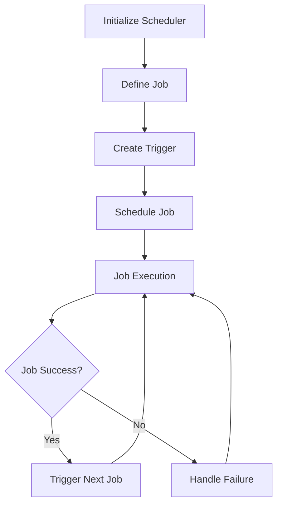

## 16.6. Scheduling and Automation with Quartzite

In the realm of data engineering, scheduling and automation are crucial for ensuring that data processing tasks are executed reliably and efficiently. Whether you're orchestrating complex ETL (Extract, Transform, Load) pipelines or simply automating routine data updates, a robust scheduling system is essential. In this section, we delve into Quartzite, a powerful scheduling library for Clojure, and explore how it can be leveraged to automate data processing tasks.

### The Need for Scheduling in Data Pipelines

Data pipelines often involve a series of tasks that must be executed in a specific order and at specific times. These tasks can include data extraction from various sources, transformation of data into a desired format, and loading data into a target system. Scheduling these tasks ensures that they run at the right time, in the right sequence, and with the necessary resources.

#### Key Reasons for Scheduling:

- **Timeliness**: Ensures that data is processed and available when needed.
- **Resource Management**: Optimizes the use of computational resources by scheduling tasks during off-peak hours.
- **Error Handling**: Provides mechanisms to retry or alert on failures.
- **Dependency Management**: Ensures tasks are executed in the correct order based on dependencies.

### Introducing Quartzite

[Quartzite](https://github.com/michaelklishin/quartzite) is a Clojure library that provides a robust and flexible scheduling framework. Built on top of the Quartz Scheduler, Quartzite offers a Clojure-friendly API for defining and managing jobs and triggers.

#### Capabilities of Quartzite:

- **Job Scheduling**: Define and schedule jobs with various triggers.
- **Cron Expressions**: Use cron-like syntax for complex scheduling needs.
- **Job Persistence**: Store job details in a database for durability.
- **Concurrency Management**: Handle concurrent job execution with ease.
- **Event Listeners**: React to job lifecycle events for custom logic.

### Setting Up Quartzite

Before we dive into examples, let's set up Quartzite in a Clojure project. Ensure you have Leiningen installed, and add Quartzite as a dependency in your `project.clj` file:

```clojure
(defproject my-data-pipeline "0.1.0-SNAPSHOT"
  :dependencies [[org.clojure/clojure "1.10.3"]
                 [luminus/quartzite "2.0.0"]])
```

### Scheduling Jobs with Quartzite

Let's explore how to define and schedule a simple job using Quartzite. We'll create a job that prints a message to the console.

#### Defining a Job

In Quartzite, a job is defined as a function that takes a context map as an argument. Here's a simple job definition:

```clojure
(ns my-data-pipeline.jobs
  (:require [clojure.tools.logging :as log]))

(defn print-message-job
  [context]
  (log/info "Executing job: Print Message"))
```

#### Creating a Scheduler

To schedule jobs, we need to create a scheduler instance. Quartzite provides a convenient way to do this:

```clojure
(ns my-data-pipeline.core
  (:require [quartzite.scheduler :as qs]
            [quartzite.jobs :as qj]
            [quartzite.triggers :as qt]))

(def scheduler (qs/start! (qs/initialize)))
```

#### Scheduling the Job

With the scheduler in place, we can now schedule our job. We'll use a simple trigger that fires every 10 seconds:

```clojure
(defn schedule-print-message-job []
  (let [job (qj/build
              (qj/of-type my-data-pipeline.jobs/print-message-job)
              (qj/with-identity "print-message-job"))
        trigger (qt/build
                  (qt/with-identity "print-message-trigger")
                  (qt/start-now)
                  (qt/with-schedule (qt/simple-schedule
                                      :repeat-interval 10000
                                      :repeat-count qt/indefinitely)))]
    (qs/schedule! scheduler job trigger)))
```

### Managing Triggers

Triggers define the schedule for job execution. Quartzite supports various types of triggers, including simple triggers and cron triggers.

#### Using Cron Triggers

Cron triggers allow for more complex scheduling using cron expressions. Here's how to schedule a job to run every day at midnight:

```clojure
(defn schedule-daily-job []
  (let [job (qj/build
              (qj/of-type my-data-pipeline.jobs/print-message-job)
              (qj/with-identity "daily-job"))
        trigger (qt/build
                  (qt/with-identity "daily-trigger")
                  (qt/start-now)
                  (qt/with-schedule (qt/cron-schedule "0 0 0 * * ?")))]
    (qs/schedule! scheduler job trigger)))
```

### Handling Dependencies and Job Failures

In complex data pipelines, tasks often depend on the successful completion of previous tasks. Quartzite provides mechanisms to handle dependencies and manage job failures.

#### Job Dependencies

To manage dependencies, you can use job listeners to trigger subsequent jobs upon successful completion of a job:

```clojure
(defn job-completion-listener
  [context]
  (log/info "Job completed successfully, triggering next job"))

(qs/add-listener! scheduler :job-completion job-completion-listener)
```

#### Handling Failures

For handling job failures, you can define a listener that reacts to job execution failures:

```clojure
(defn job-failure-listener
  [context]
  (log/error "Job execution failed, retrying..."))

(qs/add-listener! scheduler :job-failure job-failure-listener)
```

### Best Practices for Reliable Automation

To ensure reliable and efficient automation of data processing tasks, consider the following best practices:

- **Use Persistent Job Stores**: Store job details in a database to ensure durability across application restarts.
- **Monitor Job Execution**: Implement logging and monitoring to track job execution and identify issues.
- **Handle Exceptions Gracefully**: Ensure that jobs handle exceptions and retry if necessary.
- **Optimize Resource Usage**: Schedule jobs during off-peak hours to optimize resource utilization.
- **Test Job Logic**: Thoroughly test job logic to ensure correctness and reliability.

### Try It Yourself

To get hands-on experience with Quartzite, try modifying the code examples to schedule different types of jobs. Experiment with different triggers and job listeners to see how they affect job execution.

### Visualizing Job Scheduling with Quartzite

To better understand the flow of job scheduling with Quartzite, let's visualize the process using a Mermaid.js flowchart.



**Caption**: This flowchart illustrates the process of scheduling and executing a job with Quartzite, including handling job success and failure.

### References and Further Reading

For more information on Quartzite and its capabilities, refer to the [Quartzite GitHub repository](https://github.com/michaelklishin/quartzite). Additionally, explore the [Quartz Scheduler documentation](http://www.quartz-scheduler.org/documentation/) for in-depth details on scheduling concepts.

## **Ready to Test Your Knowledge?**



### What is the primary purpose of scheduling in data pipelines?

- [x] To ensure tasks run at the right time and sequence
- [ ] To increase data storage capacity
- [ ] To enhance data visualization
- [ ] To reduce data redundancy

> **Explanation:** Scheduling ensures tasks are executed at the correct times and in the correct order, which is crucial for data pipelines.

### Which library does Quartzite build upon?

- [x] Quartz Scheduler
- [ ] Apache Kafka
- [ ] Hadoop
- [ ] Spark

> **Explanation:** Quartzite is built on top of the Quartz Scheduler, providing a Clojure-friendly API for job scheduling.

### What is a key feature of Quartzite?

- [x] Job Persistence
- [ ] Data Encryption
- [ ] Machine Learning
- [ ] Real-time Analytics

> **Explanation:** Quartzite supports job persistence, allowing job details to be stored in a database for durability.

### How can you define a job in Quartzite?

- [x] As a function that takes a context map
- [ ] As a class with a main method
- [ ] As a JSON object
- [ ] As a YAML file

> **Explanation:** In Quartzite, a job is defined as a function that takes a context map as an argument.

### What is the purpose of a cron trigger?

- [x] To schedule jobs using cron-like syntax
- [ ] To encrypt data
- [ ] To transform data
- [ ] To visualize data

> **Explanation:** Cron triggers allow for complex scheduling using cron-like syntax.

### What should you do to handle job failures?

- [x] Implement a job failure listener
- [ ] Increase server capacity
- [ ] Use a different programming language
- [ ] Ignore the failure

> **Explanation:** Implementing a job failure listener allows you to react to job execution failures and take appropriate actions.

### What is a best practice for reliable automation?

- [x] Use persistent job stores
- [ ] Avoid monitoring job execution
- [ ] Schedule all jobs at the same time
- [ ] Use random job intervals

> **Explanation:** Using persistent job stores ensures job details are durable across application restarts.

### How can you visualize job scheduling with Quartzite?

- [x] Using a flowchart
- [ ] Using a pie chart
- [ ] Using a bar graph
- [ ] Using a scatter plot

> **Explanation:** A flowchart can effectively illustrate the process of job scheduling and execution.

### What is the role of a job listener?

- [x] To react to job lifecycle events
- [ ] To encrypt job data
- [ ] To transform job data
- [ ] To visualize job data

> **Explanation:** Job listeners react to job lifecycle events, allowing custom logic to be executed.

### True or False: Quartzite can only schedule jobs to run once.

- [ ] True
- [x] False

> **Explanation:** Quartzite can schedule jobs to run multiple times using various triggers, including simple and cron triggers.



Remember, mastering scheduling and automation with Quartzite is just the beginning. As you progress, you'll be able to build more complex and efficient data pipelines. Keep experimenting, stay curious, and enjoy the journey!
