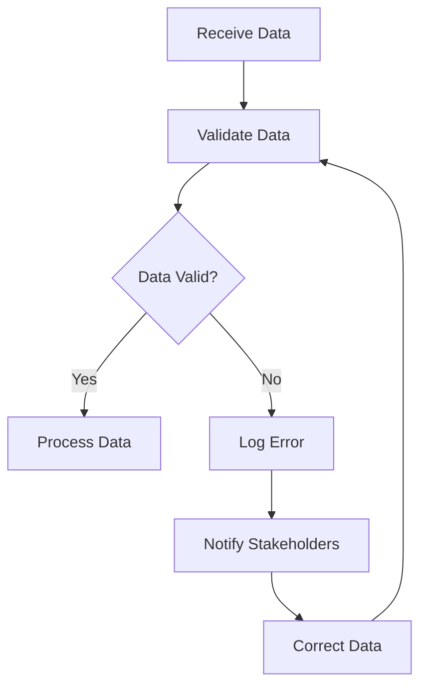

## 16.7. Data Validation and Quality Assurance

In the realm of data engineering and ETL (Extract, Transform, Load) processes, ensuring data validity and quality is paramount. Data validation and quality assurance are critical components that help maintain the integrity, accuracy, and reliability of data as it flows through the processing pipeline. In this section, we will explore the importance of data validation, demonstrate how to use Clojure Spec and custom predicate functions for validation, discuss strategies for handling invalid data, and highlight the role of automated testing in data transformations. We will also emphasize the importance of documentation and clear error reporting.

### The Importance of Data Validation

Data validation is the process of ensuring that data meets certain criteria before it is processed or stored. This step is crucial in preventing errors, inconsistencies, and inaccuracies that can lead to faulty analyses and decisions. In ETL pipelines, data validation ensures that only clean and correct data is loaded into the target systems, thereby maintaining data quality and integrity.

#### Key Benefits of Data Validation:

- **Accuracy**: Ensures that data is correct and free from errors.
- **Consistency**: Maintains uniformity across data sets.
- **Reliability**: Provides confidence in the data for decision-making.
- **Compliance**: Meets regulatory and business standards.

### Using Clojure Spec for Data Validation

Clojure Spec is a powerful library for describing the structure of data and functions. It provides a declarative way to specify the shape of data, validate it, and generate test data. Let's explore how to use Clojure Spec for data validation.

#### Defining Specs

To define a spec, use the `s/def` function to associate a spec with a keyword. Here's an example of defining a spec for a simple map representing a user:

```clojure
(require '[clojure.spec.alpha :as s])

(s/def ::name string?)
(s/def ::age (s/and int? #(> % 0)))
(s/def ::email (s/and string? #(re-matches #".+@.+\..+" %)))

(s/def ::user (s/keys :req [::name ::age ::email]))
```

In this example, we define specs for `::name`, `::age`, and `::email`, and then combine them into a `::user` spec using `s/keys`.

#### Validating Data

To validate data against a spec, use the `s/valid?` function:

```clojure
(def user-data {:name "Alice" :age 30 :email "alice@example.com"})

(s/valid? ::user user-data) ; => true
```

If the data does not conform to the spec, `s/valid?` returns `false`.

#### Explaining Validation Errors

To get detailed information about why data does not conform to a spec, use the `s/explain` function:

```clojure
(def invalid-user-data {:name "Bob" :age -5 :email "bobexample.com"})

(s/explain ::user invalid-user-data)
```

This will output a detailed explanation of the validation errors.

### Custom Predicate Functions

In addition to using Clojure Spec, you can create custom predicate functions for more complex validation logic. Predicate functions return `true` if the data is valid and `false` otherwise.

#### Example of a Custom Predicate Function

```clojure
(defn valid-phone-number? [phone]
  (re-matches #"\\(\d{3}\\) \d{3}-\d{4}" phone))

(valid-phone-number? "(123) 456-7890") ; => true
(valid-phone-number? "123-456-7890")   ; => false
```

### Strategies for Handling Invalid Data

Handling invalid data gracefully is crucial in maintaining the robustness of your ETL pipeline. Here are some strategies:

- **Logging and Monitoring**: Log validation errors for monitoring and analysis.
- **Data Correction**: Implement automated or manual correction processes.
- **Fallback Mechanisms**: Use default values or alternative data sources.
- **Alerting**: Set up alerts for critical validation failures.

### Automated Testing of Data Transformations

Automated testing is essential for ensuring that data transformations are performed correctly. Use Clojure's testing libraries, such as `clojure.test`, to write tests for your data processing functions.

#### Example of a Simple Test

```clojure
(ns myapp.core-test
  (:require [clojure.test :refer :all]
            [myapp.core :refer :all]))

(deftest test-transform-data
  (is (= (transform-data {:name "Alice" :age 30})
         {:name "Alice" :age 31})))
```

This test checks that the `transform-data` function correctly increments the age by 1.

### Emphasizing Documentation and Clear Error Reporting

Clear documentation and error reporting are vital for maintaining data quality and facilitating debugging. Ensure that your validation logic is well-documented and that error messages are informative and actionable.

#### Best Practices for Documentation and Error Reporting

- **Detailed Error Messages**: Provide context and suggestions for resolution.
- **Consistent Logging**: Use a consistent format for logging validation errors.
- **User-Friendly Documentation**: Write clear and concise documentation for your validation logic.

### Visualizing Data Validation Workflow

To better understand the data validation process, let's visualize a typical workflow using a flowchart.



**Figure 1**: A flowchart illustrating the data validation workflow in an ETL pipeline.

### Try It Yourself

Experiment with the provided code examples by modifying the specs and predicate functions to suit different validation scenarios. Try adding new fields to the `::user` spec or creating more complex predicate functions.

### References and Links

- [Clojure Spec Guide](https://clojure.org/guides/spec)
- [Clojure Documentation](https://clojure.org/reference/documentation)
- [Regex Tutorial](https://www.regular-expressions.info/tutorial.html)

### Knowledge Check

To reinforce your understanding of data validation and quality assurance in Clojure, try answering the following questions.

## **Ready to Test Your Knowledge?**



### What is the primary purpose of data validation in ETL pipelines?

- [x] To ensure data accuracy and integrity
- [ ] To increase data processing speed
- [ ] To reduce data storage costs
- [ ] To simplify data transformation logic

> **Explanation:** Data validation ensures that data is accurate and meets specified criteria before processing, maintaining data integrity.

### Which Clojure library is commonly used for data validation?

- [x] Clojure Spec
- [ ] Clojure Core
- [ ] Clojure Test
- [ ] Clojure Async

> **Explanation:** Clojure Spec is a powerful library for defining and validating data structures and functions.

### How can you define a spec for a map with required keys in Clojure Spec?

- [x] Using `s/keys` with `:req` option
- [ ] Using `s/map` with `:required` option
- [ ] Using `s/def` with `:keys` option
- [ ] Using `s/validate` with `:req` option

> **Explanation:** The `s/keys` function with the `:req` option is used to define a spec for a map with required keys.

### What function is used to check if data conforms to a spec in Clojure Spec?

- [x] `s/valid?`
- [ ] `s/check`
- [ ] `s/conform`
- [ ] `s/assert`

> **Explanation:** The `s/valid?` function checks if data conforms to a specified spec.

### What is a custom predicate function in Clojure?

- [x] A function that returns `true` or `false` based on custom validation logic
- [ ] A function that generates random data for testing
- [ ] A function that transforms data into a different format
- [ ] A function that logs validation errors

> **Explanation:** A custom predicate function is used to implement specific validation logic, returning `true` or `false`.

### How can you handle invalid data in an ETL pipeline?

- [x] Log errors and notify stakeholders
- [ ] Ignore the data and continue processing
- [ ] Automatically correct the data without logging
- [ ] Halt the entire pipeline

> **Explanation:** Logging errors and notifying stakeholders allows for proper handling and correction of invalid data.

### What is the role of automated testing in data validation?

- [x] To ensure data transformations are performed correctly
- [ ] To increase the speed of data processing
- [ ] To reduce the need for manual validation
- [ ] To simplify the data validation logic

> **Explanation:** Automated testing verifies that data transformations are accurate and meet the specified requirements.

### Why is clear error reporting important in data validation?

- [x] It helps in debugging and resolving validation issues
- [ ] It reduces the need for data validation
- [ ] It simplifies the data transformation logic
- [ ] It increases data processing speed

> **Explanation:** Clear error reporting provides context and guidance for resolving validation issues.

### What is the benefit of using Clojure Spec for data validation?

- [x] It provides a declarative way to define and validate data structures
- [ ] It increases data processing speed
- [ ] It reduces data storage costs
- [ ] It simplifies data transformation logic

> **Explanation:** Clojure Spec offers a declarative approach to defining and validating data structures, enhancing data quality.

### True or False: Custom predicate functions can be used in conjunction with Clojure Spec for complex validation logic.

- [x] True
- [ ] False

> **Explanation:** Custom predicate functions can be integrated with Clojure Spec to handle complex validation scenarios.



Remember, this is just the beginning. As you progress, you'll build more complex and interactive data validation processes. Keep experimenting, stay curious, and enjoy the journey!


