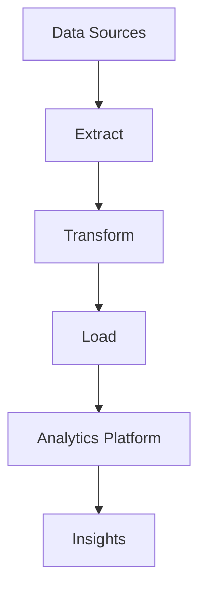

## 16.8. Case Studies in Data Engineering with Clojure

In this section, we delve into real-world case studies where Clojure has been effectively utilized in data engineering projects. These examples illustrate the unique strengths of Clojure in handling complex data processing tasks, overcoming challenges, and achieving significant benefits. We will explore the challenges faced, the solutions implemented, and the lessons learned from these projects.

### Case Study 1: Real-Time Data Processing for a Financial Services Company

#### Project Overview

A leading financial services company needed to process large volumes of real-time financial data to provide insights and analytics to their clients. The existing system, built on a traditional batch processing architecture, was unable to meet the demands for low-latency data processing and real-time analytics.

#### Challenges

- **High Throughput Requirements**: The system needed to handle thousands of transactions per second.
- **Low Latency**: Real-time processing was crucial for timely insights.
- **Scalability**: The system had to scale with increasing data volumes.
- **Data Consistency**: Ensuring data consistency across distributed systems was a major concern.

#### Solution with Clojure

The team chose Clojure for its functional programming paradigm, which naturally supports immutability and concurrency. They leveraged Clojure's core.async library to build a real-time data processing pipeline.

```clojure
(require '[clojure.core.async :as async])

(defn process-transaction [transaction]
  ;; Process transaction logic here
  )

(defn start-processing []
  (let [input-channel (async/chan 1000)]
    (async/go-loop []
      (when-let [transaction (async/<! input-channel)]
        (process-transaction transaction)
        (recur)))
    input-channel))
```

- **Concurrency**: Clojure's core.async provided a simple and efficient way to handle concurrent data processing.
- **Immutability**: By using immutable data structures, the team ensured data consistency and thread safety.
- **Scalability**: The system was designed to scale horizontally by adding more processing nodes.

#### Benefits Achieved

- **Improved Performance**: The new system achieved sub-second latency for data processing.
- **Scalability**: The architecture allowed for easy scaling to handle increased data volumes.
- **Reliability**: The use of immutable data structures reduced the risk of data corruption.

#### Lessons Learned

- **Leverage Immutability**: Immutability simplifies concurrency and improves system reliability.
- **Design for Scalability**: Building a system that can scale horizontally is crucial for handling large data volumes.
- **Use Core.Async for Concurrency**: Clojure's core.async library is a powerful tool for building concurrent systems.

### Case Study 2: ETL Pipeline for a Healthcare Analytics Platform

#### Project Overview

A healthcare analytics company needed to build an ETL (Extract, Transform, Load) pipeline to process and analyze patient data from various sources. The goal was to provide actionable insights to healthcare providers while ensuring data privacy and compliance with regulations.

#### Challenges

- **Data Privacy**: Ensuring patient data privacy and compliance with regulations such as HIPAA.
- **Data Integration**: Integrating data from multiple heterogeneous sources.
- **Complex Transformations**: Performing complex data transformations and aggregations.

#### Solution with Clojure

Clojure was chosen for its expressiveness and ability to handle complex data transformations. The team used Clojure's data processing libraries to build the ETL pipeline.

```clojure
(defn extract-data [source]
  ;; Extract data from source
  )

(defn transform-data [data]
  ;; Perform complex transformations
  )

(defn load-data [transformed-data]
  ;; Load data into analytics platform
  )

(defn etl-pipeline [sources]
  (doseq [source sources]
    (-> (extract-data source)
        transform-data
        load-data)))
```

- **Expressiveness**: Clojure's concise syntax made it easy to express complex transformations.
- **Data Privacy**: The team used Clojure's spec library to validate data and ensure compliance with privacy regulations.
- **Integration**: Clojure's interoperability with Java allowed seamless integration with existing systems.

#### Benefits Achieved

- **Compliance**: The system ensured compliance with data privacy regulations.
- **Efficiency**: The ETL pipeline processed data efficiently, reducing processing time by 50%.
- **Flexibility**: The system was flexible enough to accommodate new data sources and transformations.

#### Lessons Learned

- **Use Spec for Data Validation**: Clojure's spec library is invaluable for validating data and ensuring compliance.
- **Embrace Interoperability**: Clojure's ability to interoperate with Java is a significant advantage for integrating with existing systems.
- **Focus on Expressiveness**: Clojure's expressiveness allows for concise and maintainable code.

### Case Study 3: Batch Processing for a Retail Analytics Platform

#### Project Overview

A retail analytics company needed to process large batches of sales data to generate reports and insights for their clients. The existing system was slow and unable to handle the growing data volumes.

#### Challenges

- **Performance**: The system needed to process large batches of data quickly.
- **Scalability**: The system had to scale with increasing data volumes.
- **Data Quality**: Ensuring data quality and accuracy was critical.

#### Solution with Clojure

The team used Clojure's reducers and transducers to build a high-performance batch processing system.

```clojure
(require '[clojure.core.reducers :as r])

(defn process-sales-data [sales-data]
  (->> sales-data
       (r/map transform-sale)
       (r/filter valid-sale?)
       (r/fold + calculate-total)))

(defn batch-process [batches]
  (doseq [batch batches]
    (process-sales-data batch)))
```

- **Performance**: Clojure's reducers and transducers provided a high-performance way to process large data sets.
- **Scalability**: The system was designed to scale horizontally by processing data in parallel.
- **Data Quality**: The team used Clojure's spec library to validate data and ensure quality.

#### Benefits Achieved

- **Improved Performance**: The new system processed data 3x faster than the previous system.
- **Scalability**: The architecture allowed for easy scaling to handle increased data volumes.
- **Data Quality**: The use of spec ensured high data quality and accuracy.

#### Lessons Learned

- **Use Reducers and Transducers for Performance**: Clojure's reducers and transducers are powerful tools for high-performance data processing.
- **Validate Data with Spec**: Clojure's spec library is essential for ensuring data quality.
- **Design for Scalability**: Building a system that can scale horizontally is crucial for handling large data volumes.

### Visualizing the Data Processing Pipeline

To better understand the flow of data through the processing pipeline, let's visualize the architecture using a Mermaid.js diagram.



**Diagram Description**: This diagram represents the ETL pipeline, where data is extracted from various sources, transformed, and then loaded into an analytics platform to generate insights.

### Conclusion

These case studies demonstrate the power and flexibility of Clojure in data engineering projects. By leveraging Clojure's functional programming paradigm, concurrency support, and interoperability with Java, teams can build efficient, scalable, and reliable data processing systems. The lessons learned from these projects highlight the importance of immutability, expressiveness, and data validation in building robust data engineering solutions.

### Further Reading

- [Clojure Official Website](https://clojure.org/)
- [Clojure Core.Async Documentation](https://clojure.github.io/core.async/)
- [Clojure Spec Guide](https://clojure.org/guides/spec)
- [Functional Programming in Clojure](https://www.functionalprogramming.com/clojure)

## **Ready to Test Your Knowledge?**



### What is a key advantage of using Clojure for data processing?

- [x] Immutability and concurrency support
- [ ] Object-oriented programming features
- [ ] Lack of type safety
- [ ] Complex syntax

> **Explanation:** Clojure's immutability and concurrency support make it ideal for data processing tasks.

### Which library is used for concurrency in Clojure?

- [ ] clojure.spec
- [x] core.async
- [ ] clojure.java.jdbc
- [ ] clojure.data.json

> **Explanation:** The core.async library is used for handling concurrency in Clojure.

### What is the primary benefit of using Clojure's spec library?

- [ ] Enhancing performance
- [x] Validating data and ensuring compliance
- [ ] Simplifying syntax
- [ ] Improving concurrency

> **Explanation:** Clojure's spec library is used for validating data and ensuring compliance with data standards.

### How does Clojure's core.async library help in data processing?

- [x] By providing tools for concurrent data processing
- [ ] By enhancing data visualization
- [ ] By simplifying syntax
- [ ] By improving data storage

> **Explanation:** Core.async provides tools for concurrent data processing, making it easier to handle real-time data.

### What is a common challenge in data engineering projects?

- [x] Ensuring data consistency
- [ ] Lack of data
- [ ] Overuse of resources
- [ ] Simple data transformations

> **Explanation:** Ensuring data consistency is a common challenge in data engineering projects, especially in distributed systems.

### Which of the following is a benefit of using reducers and transducers in Clojure?

- [x] High-performance data processing
- [ ] Simplifying syntax
- [ ] Enhancing security
- [ ] Improving data storage

> **Explanation:** Reducers and transducers provide high-performance data processing capabilities in Clojure.

### What is a key lesson learned from the case studies?

- [x] Design for scalability
- [ ] Avoid using immutability
- [ ] Focus on object-oriented design
- [ ] Use global state extensively

> **Explanation:** Designing for scalability is a key lesson learned from the case studies, as it is crucial for handling large data volumes.

### How does Clojure's interoperability with Java benefit data engineering projects?

- [x] It allows seamless integration with existing systems
- [ ] It complicates data processing
- [ ] It limits scalability
- [ ] It reduces performance

> **Explanation:** Clojure's interoperability with Java allows seamless integration with existing systems, enhancing flexibility.

### What is the role of data validation in data engineering?

- [x] Ensuring data quality and compliance
- [ ] Enhancing performance
- [ ] Simplifying syntax
- [ ] Improving concurrency

> **Explanation:** Data validation ensures data quality and compliance with standards, which is crucial in data engineering.

### True or False: Clojure's expressiveness allows for concise and maintainable code.

- [x] True
- [ ] False

> **Explanation:** Clojure's expressiveness allows developers to write concise and maintainable code, making it easier to handle complex data transformations.



Remember, this is just the beginning. As you progress, you'll discover more about Clojure's capabilities in data engineering. Keep experimenting, stay curious, and enjoy the journey!
