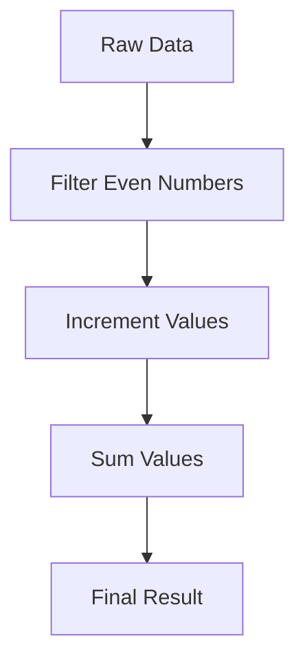

## 16.9. Best Practices and Performance Considerations

In the realm of data engineering, Clojure offers a powerful set of tools and paradigms that can lead to highly efficient and maintainable code. However, to truly harness its potential, it's crucial to adhere to best practices and performance considerations. This section will guide you through essential strategies for writing optimal Clojure code in data engineering contexts, focusing on code organization, performance optimization, and team collaboration.

### Code Organization and Modularity

#### Embrace Functional Decomposition

Functional decomposition is a cornerstone of Clojure programming. Break down complex problems into smaller, reusable functions. This not only makes your code more readable but also easier to test and maintain. Use higher-order functions to abstract common patterns and behaviors.

```clojure
(defn process-data [data]
  (->> data
       (filter valid-entry?)
       (map transform-entry)
       (reduce combine-entries)))
```

In this example, `process-data` is composed of smaller functions, each responsible for a specific task. This modular approach enhances readability and reusability.

#### Leverage Namespaces for Organization

Namespaces in Clojure help organize code into logical units. Use them to separate different components of your application, such as data processing, I/O operations, and business logic. This separation of concerns makes your codebase easier to navigate and maintain.

```clojure
(ns myapp.data-processing
  (:require [clojure.string :as str]))

(defn process-entry [entry]
  ;; processing logic
  )
```

#### Use Protocols and Multimethods for Extensibility

Protocols and multimethods provide a way to define polymorphic functions. Use them to create flexible and extensible systems that can easily adapt to new requirements.

```clojure
(defprotocol DataProcessor
  (process [this data]))

(defmulti process-data (fn [processor data] (:type processor)))

(defmethod process-data :json [processor data]
  ;; JSON processing logic
  )
```

### Performance Optimization Techniques

#### Avoid Unnecessary Laziness

While Clojure's lazy sequences are powerful, they can introduce performance overhead if used improperly. Avoid laziness in performance-critical paths where eager evaluation is more appropriate.

```clojure
;; Lazy sequence
(defn lazy-sum [coll]
  (reduce + (map inc coll)))

;; Eager evaluation
(defn eager-sum [coll]
  (transduce (map inc) + coll))
```

In the `eager-sum` function, we use transducers to perform eager evaluation, which can be more efficient for large datasets.

#### Utilize Transducers for Efficient Data Transformation

Transducers provide a way to compose data transformation functions without creating intermediate collections. They are particularly useful in ETL pipelines where performance is critical.

```clojure
(def xf (comp (filter even?) (map inc)))

(transduce xf + (range 1000))
```

By using transducers, you can achieve significant performance gains by eliminating unnecessary intermediate steps.

#### Profile and Benchmark Your Code

Profiling and benchmarking are essential for identifying performance bottlenecks. Use tools like [Criterium](https://github.com/hugoduncan/criterium) to measure the performance of your code and guide optimization efforts.

```clojure
(require '[criterium.core :as crit])

(crit/quick-bench (eager-sum (range 10000)))
```

Regular profiling helps you understand where your code spends the most time and allows you to make informed decisions about optimization.

### Documentation and Collaboration

#### Maintain Comprehensive Documentation

Clear documentation is vital for team collaboration and long-term maintainability. Use docstrings to document functions and namespaces, and consider generating API documentation using tools like [Codox](https://github.com/weavejester/codox).

```clojure
(defn process-entry
  "Processes a single data entry, applying necessary transformations."
  [entry]
  ;; processing logic
  )
```

#### Foster a Collaborative Development Environment

Encourage code reviews and pair programming to share knowledge and improve code quality. Use version control systems like Git to manage changes and collaborate effectively.

### Continuous Learning and Adaptation

#### Stay Updated with the Clojure Ecosystem

The Clojure ecosystem is constantly evolving. Stay informed about new libraries, tools, and best practices by following community resources like [ClojureVerse](https://clojureverse.org/) and [Clojure Reddit](https://www.reddit.com/r/Clojure/).

#### Experiment with New Tools and Techniques

Don't hesitate to explore new tools and techniques that can enhance your workflow. For example, consider using [Onyx](https://github.com/onyx-platform/onyx) for distributed data processing or [Datomic](https://www.datomic.com/) for immutable database management.

### Visualizing Performance Optimization

To better understand the impact of different optimization techniques, let's visualize the data flow in a typical ETL pipeline using transducers.



In this diagram, each step represents a transformation in the pipeline. By using transducers, we can streamline this process and improve performance.

### Knowledge Check

Before we conclude, let's reinforce our understanding with a few questions:

1. What are the benefits of using namespaces in Clojure?
2. How can transducers improve performance in data processing tasks?
3. Why is it important to profile and benchmark your code regularly?

### Summary

In this section, we've explored best practices and performance considerations for data engineering in Clojure. By focusing on code organization, performance optimization, documentation, and continuous learning, you can write efficient and maintainable Clojure code. Remember, the journey of mastering Clojure is ongoing, and staying curious and adaptable is key to success.

## **Ready to Test Your Knowledge?**



### What is a key benefit of using namespaces in Clojure?

- [x] Organizing code into logical units
- [ ] Improving execution speed
- [ ] Reducing memory usage
- [ ] Enabling lazy evaluation

> **Explanation:** Namespaces help organize code into logical units, making it easier to navigate and maintain.

### How do transducers improve performance?

- [x] By eliminating intermediate collections
- [ ] By enabling lazy evaluation
- [ ] By reducing memory usage
- [ ] By increasing code readability

> **Explanation:** Transducers eliminate intermediate collections, which can lead to significant performance gains.

### Why is profiling important in Clojure development?

- [x] To identify performance bottlenecks
- [ ] To improve code readability
- [ ] To enable lazy evaluation
- [ ] To reduce memory usage

> **Explanation:** Profiling helps identify performance bottlenecks, allowing developers to optimize their code effectively.

### What tool can be used for benchmarking in Clojure?

- [x] Criterium
- [ ] Codox
- [ ] Leiningen
- [ ] Eastwood

> **Explanation:** Criterium is a tool used for benchmarking Clojure code.

### What is a benefit of functional decomposition?

- [x] Easier testing and maintenance
- [ ] Faster execution speed
- [ ] Reduced memory usage
- [ ] Improved lazy evaluation

> **Explanation:** Functional decomposition makes code easier to test and maintain by breaking down complex problems into smaller functions.

### What is the role of docstrings in Clojure?

- [x] Documenting functions and namespaces
- [ ] Improving execution speed
- [ ] Enabling lazy evaluation
- [ ] Reducing memory usage

> **Explanation:** Docstrings are used to document functions and namespaces, aiding in code understanding and maintenance.

### How can you stay updated with the Clojure ecosystem?

- [x] Following community resources like ClojureVerse
- [ ] Regularly profiling your code
- [ ] Using transducers
- [ ] Writing comprehensive docstrings

> **Explanation:** Following community resources like ClojureVerse helps stay informed about new libraries, tools, and best practices.

### What is the purpose of using protocols in Clojure?

- [x] Defining polymorphic functions
- [ ] Improving execution speed
- [ ] Reducing memory usage
- [ ] Enabling lazy evaluation

> **Explanation:** Protocols are used to define polymorphic functions, allowing for flexible and extensible systems.

### What is the impact of unnecessary laziness in Clojure?

- [x] Performance overhead
- [ ] Improved code readability
- [ ] Reduced memory usage
- [ ] Enhanced modularity

> **Explanation:** Unnecessary laziness can introduce performance overhead, especially in performance-critical paths.

### True or False: Transducers can be used to compose data transformation functions without creating intermediate collections.

- [x] True
- [ ] False

> **Explanation:** Transducers allow for the composition of data transformation functions without creating intermediate collections, leading to performance improvements.



Remember, this is just the beginning. As you progress, you'll build more complex and efficient data engineering solutions with Clojure. Keep experimenting, stay curious, and enjoy the journey!
