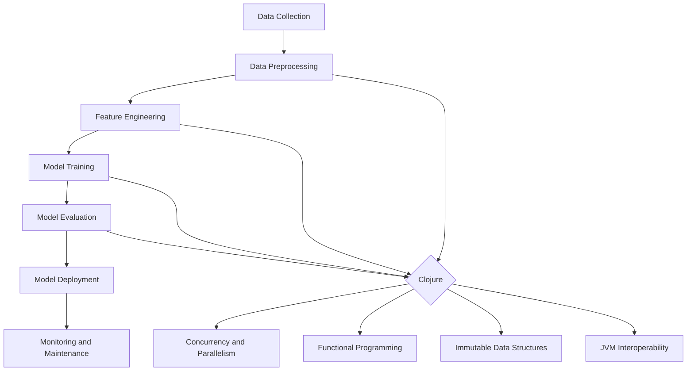

## 17.1. Overview of Machine Learning in Clojure

Machine learning (ML) and data science are rapidly evolving fields that require robust, efficient, and scalable programming languages. Clojure, a functional programming language that runs on the Java Virtual Machine (JVM), offers unique advantages for tackling the challenges inherent in these domains. In this section, we will explore how Clojure is utilized in machine learning and data science, focusing on its strengths in handling complex data transformations, concurrency, and its functional programming paradigms.

### Why Clojure for Machine Learning?

Clojure's appeal in the realm of machine learning and data science stems from several key features:

1. **Immutable Data Structures**: Clojure's immutable data structures provide a foundation for building reliable and predictable machine learning models. Immutability ensures that data remains consistent throughout the computation process, reducing the risk of side effects and making it easier to reason about code.

2. **Concurrency Support**: With built-in concurrency primitives like atoms, refs, and agents, Clojure excels at parallelizing tasks, a crucial capability for processing large datasets and training complex models.

3. **Functional Programming Paradigms**: Clojure's functional nature encourages the use of pure functions, higher-order functions, and lazy evaluation, which are beneficial for data processing and transformation tasks. These paradigms facilitate the creation of concise, expressive, and reusable code.

4. **Interoperability with the JVM**: Running on the JVM allows Clojure to leverage a vast ecosystem of Java libraries and tools, including those specifically designed for machine learning and data science.

5. **Rich Ecosystem of Libraries**: Clojure boasts a growing collection of libraries tailored for data manipulation, statistical analysis, and machine learning, such as `core.matrix`, `Incanter`, and `clojure.ml`.

### Functional Programming in Data Processing

Functional programming (FP) is particularly well-suited for data processing tasks due to its emphasis on immutability and pure functions. In Clojure, data is often transformed through a series of function compositions, allowing for clear and concise expression of complex data transformations.

#### Example: Data Transformation with Functional Composition

```clojure
(defn process-data [data]
  (->> data
       (filter #(> (:value %) 10))
       (map #(update % :value inc))
       (reduce (fn [acc item] (+ acc (:value item))) 0)))

;; Sample data
(def data [{:value 5} {:value 15} {:value 25}])

;; Processed result
(process-data data)
;; => 42
```

In this example, we use the threading macro `->>` to compose a series of transformations on a dataset. We filter, map, and reduce the data in a functional style, demonstrating how Clojure's functional programming capabilities can simplify data processing tasks.

### Concurrency and Parallelism

Handling large datasets and computationally intensive tasks often requires concurrent and parallel processing. Clojure's concurrency primitives make it easier to write concurrent code without the pitfalls of traditional multithreading.

#### Example: Parallel Data Processing with `pmap`

```clojure
(defn expensive-computation [x]
  (Thread/sleep 1000) ; Simulate a time-consuming task
  (* x x))

(defn parallel-process [data]
  (pmap expensive-computation data))

;; Sample data
(def data [1 2 3 4 5])

;; Process data in parallel
(time (parallel-process data))
;; "Elapsed time: 1005.123 msecs"
;; => (1 4 9 16 25)
```

In this example, we use `pmap` to apply an expensive computation to each element of a dataset in parallel. This approach significantly reduces processing time compared to sequential execution.

### Tools and Libraries for Machine Learning in Clojure

Clojure's ecosystem includes several libraries that facilitate machine learning and data science tasks. Here are some notable ones:

- **`core.matrix`**: A comprehensive library for matrix operations, providing a foundation for numerical computing in Clojure.
- **`Incanter`**: A statistical computing and graphics environment inspired by R, offering tools for data analysis and visualization.
- **`clojure.ml`**: A machine learning library that provides algorithms for classification, regression, clustering, and more.
- **`libpython-clj`**: Enables interoperability with Python, allowing Clojure developers to leverage Python's extensive machine learning libraries like TensorFlow and scikit-learn.

### Setting Expectations for Future Exploration

In the subsequent sections, we will delve deeper into the tools and libraries mentioned above, exploring their capabilities and how they can be applied to real-world machine learning and data science problems. We will also examine case studies and practical examples to illustrate the power of Clojure in these domains.

### Visualizing Clojure's Role in Machine Learning

To better understand Clojure's role in machine learning, let's visualize its interaction with key components of a typical machine learning workflow.



**Diagram Description**: This flowchart illustrates the stages of a machine learning workflow, highlighting where Clojure's strengths—such as concurrency, functional programming, and immutable data structures—can be leveraged to enhance each stage.

### Knowledge Check

To reinforce your understanding of Clojure's application in machine learning, consider the following questions:

- How does immutability benefit machine learning models?
- What are the advantages of using functional programming for data processing?
- How can Clojure's concurrency primitives be used to parallelize data processing tasks?

### Embrace the Journey

As we continue our exploration of Clojure in machine learning and data science, remember that this is just the beginning. The concepts and tools introduced here are foundational, and as you progress, you'll discover more advanced techniques and applications. Keep experimenting, stay curious, and enjoy the journey!

## **Ready to Test Your Knowledge?**



### How does Clojure's immutability benefit machine learning?

- [x] Ensures data consistency and reduces side effects
- [ ] Increases memory usage
- [ ] Slows down computation
- [ ] Complicates data transformations

> **Explanation:** Immutability ensures that data remains consistent throughout computations, reducing side effects and making code easier to reason about.

### What is a key advantage of functional programming in data processing?

- [x] Encourages the use of pure functions and higher-order functions
- [ ] Requires more lines of code
- [ ] Relies heavily on mutable state
- [ ] Makes debugging more difficult

> **Explanation:** Functional programming encourages the use of pure functions and higher-order functions, which lead to concise and reusable code.

### Which Clojure feature supports parallel data processing?

- [x] Concurrency primitives like atoms, refs, and agents
- [ ] Mutable data structures
- [ ] Object-oriented programming
- [ ] Synchronous execution

> **Explanation:** Clojure's concurrency primitives like atoms, refs, and agents support parallel data processing, enabling efficient handling of large datasets.

### What is `pmap` used for in Clojure?

- [x] Parallel processing of collections
- [ ] Sequential processing of collections
- [ ] Data serialization
- [ ] Error handling

> **Explanation:** `pmap` is used for parallel processing of collections, applying a function to each element in parallel.

### Which library provides matrix operations in Clojure?

- [x] `core.matrix`
- [ ] `Incanter`
- [ ] `clojure.ml`
- [ ] `libpython-clj`

> **Explanation:** `core.matrix` is a library for matrix operations, providing a foundation for numerical computing in Clojure.

### How does Clojure's interoperability with the JVM benefit machine learning?

- [x] Allows access to a vast ecosystem of Java libraries
- [ ] Limits the use of functional programming
- [ ] Increases code complexity
- [ ] Reduces performance

> **Explanation:** Clojure's interoperability with the JVM allows access to a vast ecosystem of Java libraries, enhancing its capabilities in machine learning.

### What is `libpython-clj` used for?

- [x] Interoperability with Python libraries
- [ ] Data visualization
- [ ] Statistical analysis
- [ ] Matrix operations

> **Explanation:** `libpython-clj` enables interoperability with Python, allowing Clojure developers to leverage Python's extensive machine learning libraries.

### Which paradigm does Clojure emphasize for data processing?

- [x] Functional programming
- [ ] Object-oriented programming
- [ ] Procedural programming
- [ ] Imperative programming

> **Explanation:** Clojure emphasizes functional programming, which is beneficial for data processing tasks.

### What is a benefit of using pure functions in data processing?

- [x] Predictable and testable code
- [ ] Increased side effects
- [ ] Dependency on global state
- [ ] Complex debugging

> **Explanation:** Pure functions lead to predictable and testable code, as they do not rely on external state or cause side effects.

### True or False: Clojure's concurrency support is limited to single-threaded applications.

- [ ] True
- [x] False

> **Explanation:** False. Clojure's concurrency support includes primitives like atoms, refs, and agents, which enable multi-threaded applications.




