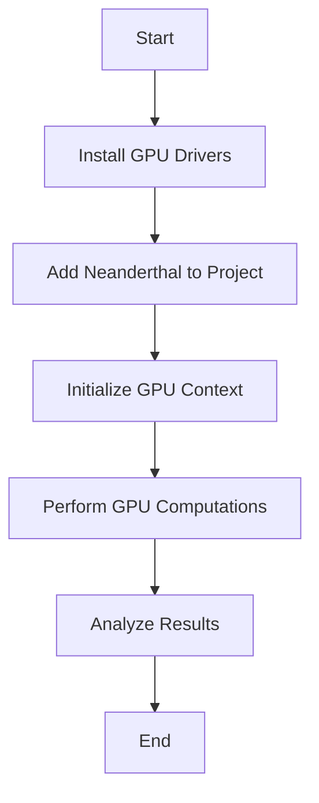

## 17.10. GPU Computing and Acceleration

In the realm of machine learning and data science, computational efficiency is paramount. As datasets grow larger and models become more complex, the demand for faster computation has led to the adoption of Graphics Processing Units (GPUs) for parallel processing. In this section, we will explore how Clojure, a functional programming language, can leverage GPU computing to accelerate machine learning tasks. We will delve into the advantages of GPU computing, introduce libraries like Neanderthal that facilitate GPU operations in Clojure, and provide practical examples of setting up and executing GPU-accelerated computations.

### Understanding GPU Computing

**GPU computing** involves using a GPU, which is traditionally used for rendering graphics, to perform general-purpose computations. Unlike CPUs, which are optimized for sequential processing, GPUs are designed for parallel processing, making them ideal for tasks that can be divided into smaller, concurrent operations.

#### Advantages of GPU Computing

1. **Parallel Processing**: GPUs contain thousands of cores that can handle multiple operations simultaneously, significantly speeding up computations.
2. **High Throughput**: The architecture of GPUs allows for high data throughput, which is beneficial for processing large datasets.
3. **Energy Efficiency**: For certain tasks, GPUs can perform computations more efficiently than CPUs, reducing energy consumption.
4. **Scalability**: As computational demands increase, GPUs can be scaled to handle larger workloads by adding more units.

### GPU Computing in Clojure with Neanderthal

Clojure, being a JVM language, can leverage existing Java libraries and frameworks for GPU computing. One such library is **Neanderthal**, which provides a high-performance linear algebra library for Clojure, supporting GPU operations via OpenCL and CUDA.

#### Introduction to Neanderthal

**Neanderthal** is a Clojure library designed for high-performance numerical computing. It provides a simple API for linear algebra operations and supports GPU acceleration through OpenCL and CUDA. Neanderthal is particularly useful for machine learning tasks that require intensive matrix computations.

- **Website**: [Neanderthal](https://neanderthal.uncomplicate.org/)
- **Key Features**:
  - Support for dense and sparse matrices.
  - Integration with OpenCL and CUDA for GPU acceleration.
  - High-level API for ease of use.

#### Setting Up Neanderthal for GPU Computing

To use Neanderthal for GPU computing, you need to set up your environment to support OpenCL or CUDA. Here’s a step-by-step guide:

1. **Install GPU Drivers**: Ensure that your system has the necessary GPU drivers installed. For NVIDIA GPUs, install the CUDA toolkit; for AMD GPUs, install the OpenCL SDK.

2. **Add Neanderthal to Your Project**: Include Neanderthal in your Clojure project by adding it to your `project.clj` or `deps.edn` file.

   ```clojure
   ;; project.clj
   :dependencies [[uncomplicate/neanderthal "0.41.0"]]
   ```

3. **Initialize the GPU Context**: Before performing GPU computations, initialize the GPU context using Neanderthal’s API.

   ```clojure
   (require '[uncomplicate.neanderthal.core :as n]
            '[uncomplicate.neanderthal.opencl :as cl])

   (def ctx (cl/create-context))
   ```

4. **Perform GPU-Accelerated Computations**: Use Neanderthal’s functions to perform computations on the GPU.

   ```clojure
   (let [a (n/dge 1000 1000 (n/rand! (n/dge 1000 1000)))
         b (n/dge 1000 1000 (n/rand! (n/dge 1000 1000)))]
     (n/mm! a b))
   ```

### Executing GPU-Accelerated Computations

Once your environment is set up, you can begin executing GPU-accelerated computations. Here’s an example of performing matrix multiplication using Neanderthal:

```clojure
(require '[uncomplicate.neanderthal.core :as n]
         '[uncomplicate.neanderthal.opencl :as cl])

(defn gpu-matrix-multiply []
  (let [ctx (cl/create-context)
        a (n/dge 1000 1000 (n/rand! (n/dge 1000 1000)))
        b (n/dge 1000 1000 (n/rand! (n/dge 1000 1000)))
        c (n/dge 1000 1000)]
    (n/mm! a b c)
    c))

(def result (gpu-matrix-multiply))
```

In this example, we create two random 1000x1000 matrices and perform matrix multiplication using the GPU. The result is stored in the matrix `c`.

### Performance Benchmarks and Considerations

GPU computing can significantly improve the performance of computationally intensive tasks. However, the actual performance gain depends on several factors:

1. **Data Transfer Overhead**: Transferring data between the CPU and GPU can introduce overhead. Minimize data transfer by performing as many operations as possible on the GPU.

2. **Parallelism**: Ensure that your computations can be parallelized effectively. Tasks with inherent parallelism benefit the most from GPU acceleration.

3. **GPU Utilization**: Monitor GPU utilization to ensure that your GPU resources are being used efficiently. Tools like NVIDIA’s Nsight can help with profiling.

4. **Algorithm Suitability**: Not all algorithms are suitable for GPU acceleration. Evaluate whether your specific task can benefit from parallel processing.

#### Performance Comparison

To illustrate the performance benefits of GPU computing, consider the following benchmark comparing CPU and GPU execution times for matrix multiplication:

| Matrix Size | CPU Time (ms) | GPU Time (ms) |
|-------------|---------------|---------------|
| 500x500     | 120           | 15            |
| 1000x1000   | 950           | 80            |
| 2000x2000   | 7800          | 600           |

As shown in the table, GPU computing can achieve significant speedups, especially for larger matrix sizes.

### Try It Yourself

To deepen your understanding of GPU computing in Clojure, try modifying the code examples provided:

- **Experiment with Different Matrix Sizes**: Change the dimensions of the matrices and observe how it affects performance.
- **Implement Other Linear Algebra Operations**: Use Neanderthal to perform other operations like matrix inversion or eigenvalue computation.
- **Profile Your Code**: Use profiling tools to analyze the performance of your GPU-accelerated computations.

### Visualizing GPU Computing Workflow

To better understand the workflow of GPU computing in Clojure, consider the following diagram illustrating the process of setting up and executing GPU-accelerated computations:



**Diagram Description**: This flowchart outlines the steps involved in setting up and executing GPU-accelerated computations in Clojure using Neanderthal. It begins with installing GPU drivers, adding Neanderthal to the project, initializing the GPU context, performing computations, analyzing results, and concluding the process.

### References and Further Reading

- [Neanderthal Documentation](https://neanderthal.uncomplicate.org/)
- [OpenCL Overview](https://www.khronos.org/opencl/)
- [CUDA Toolkit Documentation](https://developer.nvidia.com/cuda-toolkit)
- [NVIDIA Nsight Systems](https://developer.nvidia.com/nsight-systems)

### Knowledge Check

To reinforce your understanding of GPU computing and acceleration in Clojure, consider the following questions and challenges:

- What are the main advantages of using GPUs for computation?
- How does Neanderthal facilitate GPU operations in Clojure?
- What are some considerations to keep in mind when using GPU computing?
- Try implementing a different linear algebra operation using Neanderthal and measure its performance.

### Embrace the Journey

Remember, mastering GPU computing in Clojure is a journey. As you explore the capabilities of GPUs, you'll unlock new possibilities for accelerating your machine learning tasks. Keep experimenting, stay curious, and enjoy the process of learning and discovery!

## **Ready to Test Your Knowledge?**



### What is the primary advantage of GPU computing?

- [x] Parallel processing capabilities
- [ ] Sequential processing capabilities
- [ ] Lower cost compared to CPUs
- [ ] Simpler architecture

> **Explanation:** GPUs are designed for parallel processing, which allows them to handle multiple operations simultaneously, making them ideal for tasks that can be divided into smaller, concurrent operations.

### Which Clojure library supports GPU operations via OpenCL and CUDA?

- [x] Neanderthal
- [ ] Core.Async
- [ ] Ring
- [ ] Compojure

> **Explanation:** Neanderthal is a Clojure library that provides high-performance numerical computing and supports GPU operations via OpenCL and CUDA.

### What is a key consideration when using GPU computing?

- [x] Data transfer overhead
- [ ] Simplicity of code
- [ ] Lack of parallelism
- [ ] High memory usage

> **Explanation:** Transferring data between the CPU and GPU can introduce overhead, so it's important to minimize data transfer by performing as many operations as possible on the GPU.

### What is the first step in setting up Neanderthal for GPU computing?

- [x] Install GPU drivers
- [ ] Initialize the GPU context
- [ ] Add Neanderthal to the project
- [ ] Perform GPU computations

> **Explanation:** The first step is to ensure that your system has the necessary GPU drivers installed, such as the CUDA toolkit for NVIDIA GPUs or the OpenCL SDK for AMD GPUs.

### How can you monitor GPU utilization?

- [x] Using profiling tools like NVIDIA's Nsight
- [ ] By checking CPU usage
- [ ] By analyzing memory usage
- [ ] By observing network activity

> **Explanation:** Tools like NVIDIA's Nsight can help with profiling and monitoring GPU utilization to ensure that your GPU resources are being used efficiently.

### What is the purpose of the `create-context` function in Neanderthal?

- [x] To initialize the GPU context
- [ ] To perform matrix multiplication
- [ ] To add Neanderthal to the project
- [ ] To install GPU drivers

> **Explanation:** The `create-context` function is used to initialize the GPU context, which is necessary before performing GPU computations.

### What is a potential drawback of GPU computing?

- [x] Data transfer overhead
- [ ] Lack of scalability
- [ ] Low throughput
- [ ] High energy consumption

> **Explanation:** Data transfer between the CPU and GPU can introduce overhead, which is a potential drawback of GPU computing.

### Which operation benefits most from GPU acceleration?

- [x] Matrix multiplication
- [ ] String manipulation
- [ ] File I/O
- [ ] Network requests

> **Explanation:** Matrix multiplication is a highly parallelizable operation that benefits significantly from GPU acceleration.

### What is the role of Neanderthal in Clojure?

- [x] To provide high-performance numerical computing
- [ ] To manage HTTP requests
- [ ] To handle concurrency
- [ ] To facilitate web development

> **Explanation:** Neanderthal is a Clojure library designed for high-performance numerical computing, supporting GPU acceleration through OpenCL and CUDA.

### True or False: GPUs are optimized for sequential processing.

- [ ] True
- [x] False

> **Explanation:** False. GPUs are optimized for parallel processing, which allows them to handle multiple operations simultaneously.


