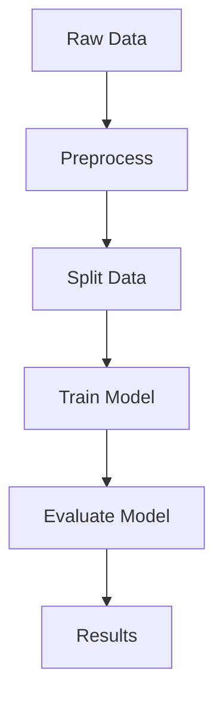

## 17.11. The Pipeline Pattern in ML Workflows

In the realm of machine learning (ML) and data science, the pipeline pattern is a crucial design pattern that facilitates the creation of modular, maintainable, and reusable workflows. This pattern is particularly relevant in Clojure due to its functional programming paradigm and powerful threading macros, which make it easy to chain data transformations and build complex data processing pipelines.

### Understanding the Pipeline Pattern

The pipeline pattern is a design approach that structures a series of data processing steps into a linear sequence, where the output of one step serves as the input to the next. This pattern is akin to an assembly line in a factory, where each station performs a specific task, and the product moves from one station to the next until it is complete.

#### Key Benefits of the Pipeline Pattern

1. **Modularity**: Each step in the pipeline is a self-contained function, making it easy to modify, replace, or reuse individual components without affecting the entire workflow.
2. **Maintainability**: By breaking down complex processes into smaller, manageable steps, the pipeline pattern simplifies debugging and enhances code readability.
3. **Reusability**: Functions within a pipeline can be reused across different workflows, promoting code reuse and reducing redundancy.
4. **Scalability**: Pipelines can be easily extended by adding new steps, allowing workflows to evolve as requirements change.

### Building Data Processing Pipelines in Clojure

Clojure's functional programming features and threading macros (`->>`, `as->`, etc.) make it an ideal language for implementing the pipeline pattern. Let's explore how to build data processing pipelines using these tools.

#### Using Threading Macros

Threading macros in Clojure provide a concise and readable way to chain function calls. The `->>` macro is particularly useful for building pipelines, as it threads the result of each expression as the last argument to the next expression.

```clojure
(defn process-data [data]
  (->> data
       (filter some-predicate)
       (map some-transformation)
       (reduce some-aggregation)))
```

In this example, `process-data` takes an input `data`, filters it using `some-predicate`, transforms it with `some-transformation`, and aggregates the results with `some-aggregation`.

#### Example: A Simple ML Pipeline

Let's build a simple machine learning pipeline that preprocesses data, trains a model, and evaluates its performance.

```clojure
(defn preprocess [data]
  ;; Normalize and clean data
  (->> data
       (map normalize)
       (filter valid?)))

(defn train-model [training-data]
  ;; Train a model using the training data
  (let [model (create-model)]
    (fit model training-data)))

(defn evaluate-model [model test-data]
  ;; Evaluate the model's performance
  (let [predictions (predict model test-data)]
    (calculate-accuracy predictions test-data)))

(defn ml-pipeline [raw-data]
  (->> raw-data
       preprocess
       (split-data 0.8) ;; Split into training and test sets
       (fn [[train test]]
         (let [model (train-model train)]
           (evaluate-model model test)))))
```

In this pipeline, `preprocess` cleans and normalizes the data, `train-model` trains a machine learning model, and `evaluate-model` assesses the model's accuracy. The `ml-pipeline` function orchestrates these steps, splitting the data into training and test sets and passing them through the pipeline.

### Error Handling and Debugging in Pipelines

Error handling is a critical aspect of building robust pipelines. In Clojure, we can use `try` and `catch` blocks to manage exceptions and ensure that errors are handled gracefully.

#### Example: Error Handling in a Pipeline

```clojure
(defn safe-preprocess [data]
  (try
    (preprocess data)
    (catch Exception e
      (println "Error during preprocessing:" (.getMessage e))
      nil)))

(defn safe-ml-pipeline [raw-data]
  (->> raw-data
       safe-preprocess
       (when-not nil?
         (split-data 0.8))
       (fn [[train test]]
         (when (and train test)
           (let [model (train-model train)]
             (evaluate-model model test))))))
```

In this example, `safe-preprocess` wraps the `preprocess` function in a `try-catch` block to handle exceptions. The `safe-ml-pipeline` function checks for `nil` values to prevent the pipeline from proceeding with invalid data.

### Debugging Pipelines

Debugging pipelines can be challenging due to their linear nature. However, Clojure's REPL (Read-Eval-Print Loop) provides an interactive environment for testing and debugging individual pipeline steps.

#### Tips for Debugging Pipelines

1. **Use the REPL**: Test each function in the pipeline independently in the REPL to ensure it behaves as expected.
2. **Add Logging**: Insert logging statements at key points in the pipeline to track data flow and identify where errors occur.
3. **Break Down Steps**: If a pipeline step is complex, break it down into smaller functions and test each one separately.

### Visualizing the Pipeline Pattern

To better understand the flow of data through a pipeline, let's visualize the process using a flowchart.



**Figure 1**: A flowchart illustrating the pipeline pattern in a machine learning workflow. Data flows from raw input through preprocessing, splitting, training, and evaluation, resulting in the final output.

### Clojure's Unique Features in Pipelines

Clojure offers several unique features that enhance the implementation of the pipeline pattern:

- **Immutable Data Structures**: Clojure's immutable data structures ensure that data transformations do not have side effects, making pipelines more predictable and easier to reason about.
- **First-Class Functions**: Functions are first-class citizens in Clojure, allowing them to be passed as arguments, returned from other functions, and stored in data structures. This flexibility is crucial for building dynamic and reusable pipelines.
- **Macros**: Clojure's macro system allows developers to create custom control structures and domain-specific languages (DSLs) that can simplify pipeline construction and enhance readability.

### Differences and Similarities with Other Patterns

The pipeline pattern is often compared to the decorator pattern, as both involve chaining operations. However, while the decorator pattern focuses on adding behavior to objects, the pipeline pattern is centered around data transformation.

### Try It Yourself

To deepen your understanding of the pipeline pattern, try modifying the example pipeline:

- Add a new preprocessing step, such as data augmentation or feature extraction.
- Implement a different model training algorithm and compare its performance.
- Introduce error handling for the model training step.

### Summary

The pipeline pattern is a powerful design approach for building modular, maintainable, and reusable machine learning workflows in Clojure. By leveraging Clojure's functional programming features and threading macros, developers can create efficient data processing pipelines that are easy to extend and debug. Remember, this is just the beginning. As you progress, you'll build more complex and interactive ML workflows. Keep experimenting, stay curious, and enjoy the journey!

## **Ready to Test Your Knowledge?**



### What is the primary benefit of using the pipeline pattern in ML workflows?

- [x] Modularity and reusability of code
- [ ] Increased execution speed
- [ ] Reduced memory usage
- [ ] Simplified user interfaces

> **Explanation:** The pipeline pattern enhances modularity and reusability by structuring workflows into a series of independent, reusable steps.

### Which Clojure macro is commonly used to build pipelines?

- [ ] `->`
- [x] `->>`
- [ ] `cond->`
- [ ] `as->`

> **Explanation:** The `->>` macro is used to thread the result of each expression as the last argument to the next, making it ideal for building pipelines.

### How does Clojure's immutability benefit pipeline construction?

- [x] It ensures data transformations have no side effects.
- [ ] It increases the speed of data processing.
- [ ] It allows for dynamic typing.
- [ ] It simplifies error handling.

> **Explanation:** Immutability ensures that data transformations do not alter the original data, making pipelines more predictable and easier to reason about.

### What is a common method for handling errors in a Clojure pipeline?

- [ ] Using `let` bindings
- [x] Using `try-catch` blocks
- [ ] Using `defn` declarations
- [ ] Using `loop-recur` constructs

> **Explanation:** `try-catch` blocks are used to handle exceptions and manage errors gracefully within a pipeline.

### Which of the following is NOT a benefit of the pipeline pattern?

- [ ] Modularity
- [ ] Reusability
- [ ] Maintainability
- [x] Increased memory usage

> **Explanation:** The pipeline pattern does not inherently increase memory usage; it focuses on modularity, reusability, and maintainability.

### What is the role of threading macros in Clojure pipelines?

- [x] They chain function calls in a readable manner.
- [ ] They handle concurrency issues.
- [ ] They optimize memory usage.
- [ ] They provide type safety.

> **Explanation:** Threading macros like `->>` chain function calls, making the code more readable and expressive.

### How can logging help in debugging pipelines?

- [x] By tracking data flow and identifying errors
- [ ] By increasing execution speed
- [ ] By reducing code complexity
- [ ] By ensuring type safety

> **Explanation:** Logging helps track the flow of data through the pipeline, making it easier to identify where errors occur.

### What is a key difference between the pipeline and decorator patterns?

- [x] The pipeline pattern focuses on data transformation.
- [ ] The decorator pattern focuses on data transformation.
- [ ] The pipeline pattern is used for UI design.
- [ ] The decorator pattern is used for concurrency.

> **Explanation:** The pipeline pattern is centered around data transformation, while the decorator pattern adds behavior to objects.

### True or False: Clojure's macros can simplify pipeline construction.

- [x] True
- [ ] False

> **Explanation:** Clojure's macros allow developers to create custom control structures, simplifying pipeline construction and enhancing readability.

### Which feature of Clojure allows functions to be passed as arguments in pipelines?

- [x] First-class functions
- [ ] Immutable data structures
- [ ] Dynamic typing
- [ ] Macros

> **Explanation:** Clojure's first-class functions enable them to be passed as arguments, returned from other functions, and stored in data structures, facilitating dynamic and reusable pipelines.


