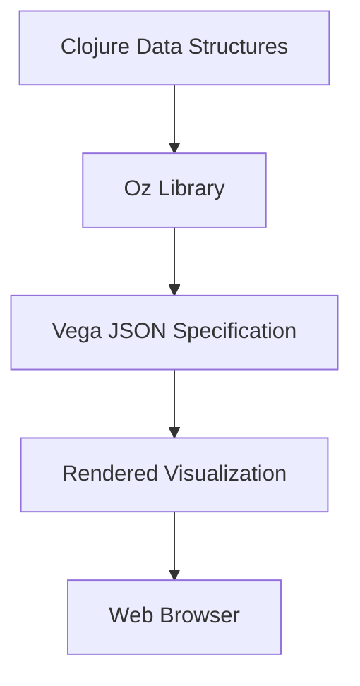

## 17.12. Data Visualization with Vega and Oz

Data visualization is a crucial aspect of data science and machine learning, providing insights and understanding through graphical representation. In this section, we will explore how to create interactive and insightful data visualizations in Clojure using **Vega** and **Oz**. We'll delve into the declarative approach of Vega, how Oz simplifies visualization creation in Clojure, and provide code examples for common chart types. Additionally, we'll discuss integrating these visualizations into web applications.

### Introduction to Vega

**Vega** is a powerful, declarative language for creating, sharing, and exploring interactive visualization designs. It allows developers to describe visualizations in a JSON format, specifying the data, visual encoding, and interaction techniques. This approach abstracts the complexity of drawing graphics, enabling developers to focus on the data and its representation.

#### Key Features of Vega

- **Declarative Syntax**: Define visualizations using JSON, making it easy to understand and modify.
- **Interactivity**: Built-in support for interactive features like tooltips, zooming, and filtering.
- **Extensibility**: Easily extendable with custom data transformations and visualizations.
- **Cross-Platform**: Compatible with web browsers and can be integrated into various environments.

### Introducing Oz

**Oz** is a Clojure library that leverages Vega and Vega-Lite to create visualizations in a more idiomatic Clojure way. It simplifies the process of generating and displaying visualizations by providing a seamless interface between Clojure data structures and Vega's JSON specifications.

#### Why Use Oz?

- **Clojure Integration**: Directly use Clojure data structures to define visualizations.
- **Interactive Development**: Leverage Clojure's REPL for rapid prototyping and iteration.
- **Web Integration**: Easily embed visualizations in web applications or serve them as standalone web pages.

### Setting Up Oz in Your Clojure Project

To get started with Oz, you need to include it in your Clojure project. Add the following dependency to your `project.clj` or `deps.edn` file:

```clojure
;; For Leiningen
[metasoarous/oz "1.6.0-alpha5"]

;; For deps.edn
{:deps {metasoarous/oz {:mvn/version "1.6.0-alpha5"}}}
```

### Creating Your First Visualization

Let's create a simple bar chart using Oz. We'll start by defining the data and then specify the visualization using Vega-Lite syntax.

```clojure
(ns my-visualization.core
  (:require [oz.core :as oz]))

(def data
  [{:category "A" :value 30}
   {:category "B" :value 80}
   {:category "C" :value 45}
   {:category "D" :value 60}])

(def bar-chart
  {:data {:values data}
   :mark "bar"
   :encoding {:x {:field "category" :type "ordinal"}
              :y {:field "value" :type "quantitative"}}})

;; Display the chart
(oz/view! bar-chart)
```

### Understanding the Code

- **Data Definition**: We define a simple dataset as a vector of maps, each representing a category and its corresponding value.
- **Vega-Lite Specification**: The `bar-chart` map specifies the data source, the type of mark (bar), and the encoding for the x and y axes.
- **Display**: The `oz/view!` function renders the visualization in a browser window.

### Creating Common Chart Types

Let's explore how to create other common chart types using Oz and Vega-Lite.

#### Line Graph

```clojure
(def line-data
  [{:date "2024-01-01" :value 100}
   {:date "2024-02-01" :value 110}
   {:date "2024-03-01" :value 95}
   {:date "2024-04-01" :value 120}])

(def line-chart
  {:data {:values line-data}
   :mark "line"
   :encoding {:x {:field "date" :type "temporal"}
              :y {:field "value" :type "quantitative"}}})

(oz/view! line-chart)
```

#### Scatter Plot

```clojure
(def scatter-data
  [{:x 1 :y 2}
   {:x 2 :y 3}
   {:x 3 :y 5}
   {:x 4 :y 7}])

(def scatter-plot
  {:data {:values scatter-data}
   :mark "point"
   :encoding {:x {:field "x" :type "quantitative"}
              :y {:field "y" :type "quantitative"}}})

(oz/view! scatter-plot)
```

### Integrating Visualizations into Web Applications

Integrating Oz visualizations into web applications can enhance user experience by providing interactive and dynamic data representations. Here's how you can embed an Oz visualization in a web application using Clojure's Ring and Compojure libraries.

#### Setting Up a Web Server

First, add the necessary dependencies to your project:

```clojure
;; For Leiningen
[ring "1.9.0"]
[compojure "1.6.2"]

;; For deps.edn
{:deps {ring {:mvn/version "1.9.0"}
        compojure {:mvn/version "1.6.2"}}}
```

#### Creating a Simple Web Application

```clojure
(ns my-web-app.core
  (:require [compojure.core :refer [defroutes GET]]
            [ring.adapter.jetty :refer [run-jetty]]
            [oz.core :as oz]))

(defroutes app-routes
  (GET "/" [] (oz/view! bar-chart)))

(defn -main []
  (run-jetty app-routes {:port 3000 :join? false}))
```

### Understanding the Code

- **Routes Definition**: We define a simple route that serves the bar chart at the root URL.
- **Server Initialization**: The `run-jetty` function starts a Jetty server on port 3000, serving the defined routes.

### Try It Yourself

Experiment with the provided code examples by modifying the data, chart types, and encodings. Try creating a pie chart or a heatmap using the Vega-Lite specifications. Explore the Oz and Vega documentation for more options and customization.

### Visualizing Data Flow

To better understand how data flows from Clojure to Vega through Oz, let's visualize this process using a Mermaid.js diagram.



**Diagram Description**: This diagram illustrates the flow of data from Clojure data structures through the Oz library, which converts it into a Vega JSON specification. This specification is then rendered into a visualization displayed in a web browser.

### References and Further Reading

- [Vega Documentation](https://vega.github.io/vega/docs/)
- [Oz GitHub Repository](https://github.com/metasoarous/oz)
- [Clojure Documentation](https://clojure.org/reference/documentation)

### Knowledge Check

To reinforce your understanding, try answering the following questions and challenges.

## **Ready to Test Your Knowledge?**



### What is the primary advantage of using Vega for data visualization?

- [x] Declarative syntax for defining visualizations
- [ ] Imperative programming model
- [ ] Built-in machine learning algorithms
- [ ] Automatic data cleaning

> **Explanation:** Vega uses a declarative syntax, allowing users to define visualizations in a straightforward and understandable manner.

### How does Oz simplify visualization creation in Clojure?

- [x] By providing a seamless interface between Clojure data structures and Vega's JSON specifications
- [ ] By offering built-in machine learning models
- [ ] By automatically generating data
- [ ] By providing a GUI for visualization design

> **Explanation:** Oz simplifies visualization creation by allowing Clojure data structures to be directly used in defining visualizations, bridging the gap with Vega's JSON specifications.

### Which function is used to display a visualization in Oz?

- [x] oz/view!
- [ ] oz/render!
- [ ] oz/display!
- [ ] oz/show!

> **Explanation:** The `oz/view!` function is used to render and display the visualization in a browser window.

### What type of chart is created with the following Vega-Lite specification: `{:mark "line"}`?

- [x] Line graph
- [ ] Bar chart
- [ ] Scatter plot
- [ ] Pie chart

> **Explanation:** The `mark` type "line" specifies that the visualization should be a line graph.

### Which library is used to integrate Oz visualizations into a Clojure web application?

- [x] Ring
- [ ] Oz
- [ ] Compojure
- [ ] Jetty

> **Explanation:** Ring is used to handle HTTP requests and responses, allowing Oz visualizations to be served in a web application.

### What is the role of the `run-jetty` function in a Clojure web application?

- [x] To start a Jetty server and serve the defined routes
- [ ] To render visualizations
- [ ] To compile Clojure code
- [ ] To manage database connections

> **Explanation:** The `run-jetty` function initializes and starts a Jetty server, serving the routes defined in the application.

### Which of the following is a key feature of Vega?

- [x] Interactivity
- [ ] Built-in SQL support
- [ ] Automatic data scraping
- [ ] Machine learning integration

> **Explanation:** Vega supports interactivity, allowing users to create visualizations with features like tooltips, zooming, and filtering.

### What is the purpose of the `:data` key in a Vega-Lite specification?

- [x] To specify the data source for the visualization
- [ ] To define the chart type
- [ ] To set the visualization's color scheme
- [ ] To configure interactivity options

> **Explanation:** The `:data` key is used to specify the data source that the visualization will represent.

### True or False: Oz can only be used for static visualizations.

- [ ] True
- [x] False

> **Explanation:** False. Oz supports interactive visualizations, leveraging Vega's capabilities to create dynamic and engaging graphics.

### Which of the following is a common use case for data visualization in Clojure?

- [x] Exploring data insights
- [ ] Compiling code
- [ ] Managing server configurations
- [ ] Writing unit tests

> **Explanation:** Data visualization is commonly used to explore and gain insights from data, making it a valuable tool in data science and analytics.



Remember, this is just the beginning. As you progress, you'll build more complex and interactive visualizations. Keep experimenting, stay curious, and enjoy the journey!
