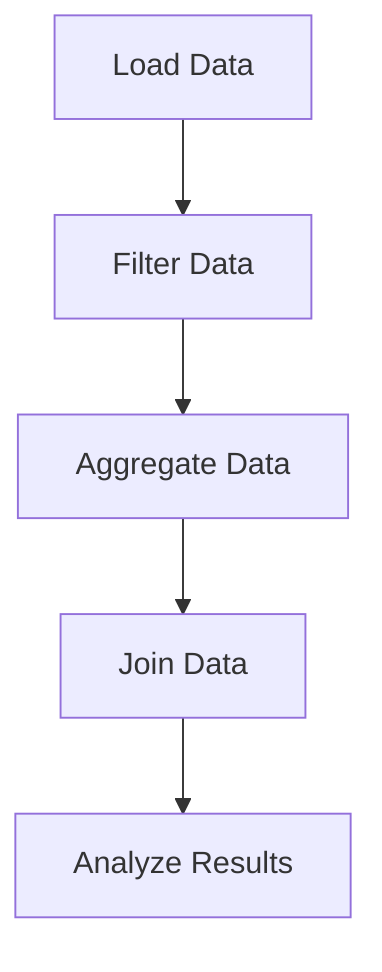

## 17.14. Data Processing with `tech.ml.dataset` and Tablecloth

Data processing is a critical aspect of data science and machine learning workflows. In Clojure, the `tech.ml.dataset` library offers a robust solution for handling data efficiently, while the `Tablecloth` library provides a more user-friendly API on top of it. This section will guide you through the capabilities of these libraries, demonstrating how they can be used to perform common data operations such as filtering, aggregations, and joins. We will also discuss performance optimizations to ensure your data processing tasks are as efficient as possible.

### Introduction to `tech.ml.dataset`

`tech.ml.dataset` is a powerful library designed for data manipulation in Clojure. It provides a comprehensive set of tools for loading, transforming, and analyzing data. The library is built with performance in mind, leveraging the capabilities of the JVM to handle large datasets efficiently.

#### Key Features of `tech.ml.dataset`

- **Immutable Data Structures**: Ensures data integrity and supports functional programming paradigms.
- **Columnar Storage**: Optimizes memory usage and access patterns for data processing tasks.
- **Interoperability**: Seamlessly integrates with other Clojure libraries and Java-based tools.
- **Extensive API**: Offers a wide range of functions for data manipulation, including filtering, sorting, and aggregation.

### Introducing Tablecloth

Tablecloth is a high-level API that sits on top of `tech.ml.dataset`, providing a more intuitive and user-friendly interface for data manipulation. It simplifies common data processing tasks, making it easier for developers to work with data without delving into the complexities of `tech.ml.dataset`.

#### Benefits of Using Tablecloth

- **Simplified Syntax**: Reduces boilerplate code and enhances readability.
- **Chainable Operations**: Allows for concise and expressive data transformations.
- **Rich Functionality**: Supports a wide range of data operations, including joins, pivots, and groupings.

### Common Data Operations

Let's explore some common data operations using `tech.ml.dataset` and Tablecloth. We'll cover filtering, aggregations, and joins, providing code examples to illustrate each concept.

#### Filtering Data

Filtering is a fundamental operation in data processing, allowing you to extract subsets of data based on specific criteria.

```clojure
(require '[tech.ml.dataset :as ds])
(require '[tablecloth.api :as tc])

;; Load a dataset
(def data (ds/->dataset {:name ["Alice" "Bob" "Charlie"]
                         :age [30 25 35]
                         :city ["New York" "Los Angeles" "Chicago"]}))

;; Filter using tech.ml.dataset
(def filtered-data (ds/filter (fn [row] (> (:age row) 30)) data))

;; Filter using Tablecloth
(def filtered-data-tc (tc/select-rows data #(> (:age %) 30)))

;; Print the filtered datasets
(println "Filtered Data with tech.ml.dataset:" filtered-data)
(println "Filtered Data with Tablecloth:" filtered-data-tc)
```

In this example, we demonstrate how to filter rows where the age is greater than 30 using both `tech.ml.dataset` and Tablecloth. Notice how Tablecloth's syntax is more concise and expressive.

#### Aggregating Data

Aggregation is used to summarize data, often by computing statistics such as sums, averages, or counts.

```clojure
;; Aggregate using tech.ml.dataset
(def aggregated-data (ds/aggregate-columns data {:age ds/mean}))

;; Aggregate using Tablecloth
(def aggregated-data-tc (tc/aggregate data {:age tc/mean}))

;; Print the aggregated datasets
(println "Aggregated Data with tech.ml.dataset:" aggregated-data)
(println "Aggregated Data with Tablecloth:" aggregated-data-tc)
```

Here, we calculate the mean age of the dataset using both libraries. Again, Tablecloth provides a more streamlined approach.

#### Joining Data

Joining datasets is essential when you need to combine information from multiple sources.

```clojure
;; Create another dataset
(def more-data (ds/->dataset {:name ["Alice" "Bob"]
                              :salary [70000 80000]}))

;; Join using tech.ml.dataset
(def joined-data (ds/join data more-data :name))

;; Join using Tablecloth
(def joined-data-tc (tc/join data more-data :name))

;; Print the joined datasets
(println "Joined Data with tech.ml.dataset:" joined-data)
(println "Joined Data with Tablecloth:" joined-data-tc)
```

In this example, we join two datasets on the `name` column. Both libraries provide straightforward methods for performing joins, with Tablecloth offering a more concise syntax.

### Performance Optimizations

Efficient data processing is crucial when working with large datasets. Here are some tips for optimizing performance with `tech.ml.dataset` and Tablecloth:

- **Leverage Columnar Storage**: Both libraries use columnar storage, which improves memory access patterns and speeds up data processing tasks.
- **Use Lazy Evaluation**: Take advantage of lazy evaluation to defer computation until necessary, reducing memory usage and improving performance.
- **Optimize Data Loading**: Load only the necessary columns and rows to minimize memory usage and processing time.
- **Parallelize Operations**: Utilize Clojure's concurrency primitives to parallelize data processing tasks where possible.

### Visualizing Data Processing

To better understand the flow of data processing with `tech.ml.dataset` and Tablecloth, let's visualize the process using a flowchart.



**Figure 1**: Data Processing Workflow with `tech.ml.dataset` and Tablecloth.

This flowchart illustrates a typical data processing workflow, starting with data loading, followed by filtering, aggregation, joining, and finally, analysis.

### Try It Yourself

Now that we've covered the basics, it's time to experiment with the code examples provided. Try modifying the filtering criteria, aggregation functions, or join keys to see how the results change. This hands-on approach will help solidify your understanding of data processing with `tech.ml.dataset` and Tablecloth.

### Knowledge Check

To reinforce your learning, consider the following questions:

- How does Tablecloth simplify data processing compared to `tech.ml.dataset`?
- What are the benefits of using columnar storage for data processing?
- How can lazy evaluation improve performance in data processing tasks?

### Conclusion

In this section, we've explored the powerful capabilities of `tech.ml.dataset` and Tablecloth for data processing in Clojure. These libraries provide efficient and user-friendly tools for handling data, making them invaluable for data science and machine learning workflows. Remember, this is just the beginning. As you progress, you'll discover even more advanced techniques and optimizations to enhance your data processing tasks. Keep experimenting, stay curious, and enjoy the journey!

## **Ready to Test Your Knowledge?**



### What is the primary advantage of using Tablecloth over `tech.ml.dataset`?

- [x] Simplified syntax and user-friendly API
- [ ] Faster data processing
- [ ] More extensive dataset support
- [ ] Better integration with Java

> **Explanation:** Tablecloth provides a simplified syntax and user-friendly API on top of `tech.ml.dataset`, making data manipulation more intuitive.

### Which feature of `tech.ml.dataset` helps optimize memory usage?

- [x] Columnar storage
- [ ] Row-based storage
- [ ] In-memory caching
- [ ] Data compression

> **Explanation:** Columnar storage optimizes memory usage and access patterns, improving data processing efficiency.

### How does lazy evaluation benefit data processing?

- [x] Reduces memory usage and defers computation
- [ ] Increases processing speed
- [ ] Simplifies code syntax
- [ ] Enhances data accuracy

> **Explanation:** Lazy evaluation reduces memory usage by deferring computation until necessary, which can improve performance.

### What is a common use case for data aggregation?

- [x] Calculating statistical summaries
- [ ] Filtering data
- [ ] Joining datasets
- [ ] Loading data

> **Explanation:** Data aggregation is commonly used to calculate statistical summaries such as sums, averages, or counts.

### Which operation is essential for combining information from multiple datasets?

- [x] Joining
- [ ] Filtering
- [ ] Aggregating
- [ ] Sorting

> **Explanation:** Joining is essential for combining information from multiple datasets based on common keys.

### What is a key benefit of using immutable data structures in data processing?

- [x] Ensures data integrity
- [ ] Increases processing speed
- [ ] Simplifies code syntax
- [ ] Enhances data accuracy

> **Explanation:** Immutable data structures ensure data integrity by preventing unintended modifications.

### How can you optimize data loading in `tech.ml.dataset`?

- [x] Load only necessary columns and rows
- [ ] Use in-memory caching
- [ ] Compress data files
- [ ] Increase processing speed

> **Explanation:** Loading only the necessary columns and rows minimizes memory usage and processing time.

### What is the role of concurrency in data processing?

- [x] Parallelizes operations to improve performance
- [ ] Simplifies code syntax
- [ ] Enhances data accuracy
- [ ] Increases memory usage

> **Explanation:** Concurrency parallelizes operations, which can improve performance by utilizing multiple CPU cores.

### Which library provides a high-level API for data manipulation in Clojure?

- [x] Tablecloth
- [ ] tech.ml.dataset
- [ ] core.async
- [ ] clojure.test

> **Explanation:** Tablecloth provides a high-level API on top of `tech.ml.dataset` for data manipulation in Clojure.

### True or False: `tech.ml.dataset` is designed for row-based data storage.

- [ ] True
- [x] False

> **Explanation:** `tech.ml.dataset` is designed for columnar data storage, which optimizes memory usage and access patterns.


