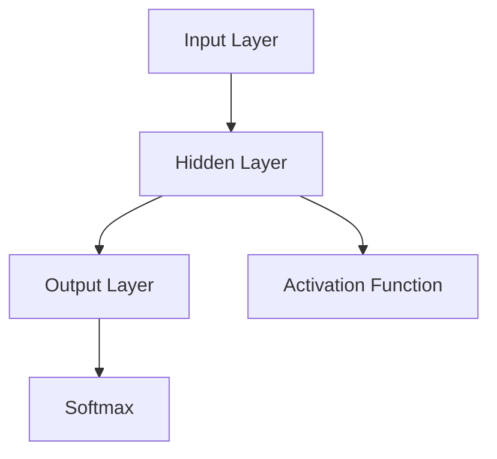

## 17.15. Deep Learning with Cortex and Clojure

Deep learning has revolutionized the field of artificial intelligence, enabling machines to perform tasks that were once thought to be the exclusive domain of humans. From image recognition to natural language processing, deep learning models have demonstrated remarkable capabilities. In this section, we will explore how to harness the power of deep learning in Clojure using the Cortex library.

### Introduction to Deep Learning

Deep learning is a subset of machine learning that focuses on neural networks with many layers, known as deep neural networks. These networks are capable of learning complex patterns and representations from large amounts of data. The key components of deep learning include:

- **Neurons**: The basic units of a neural network, inspired by biological neurons.
- **Layers**: Collections of neurons that transform input data into output data.
- **Activation Functions**: Functions applied to the output of each neuron to introduce non-linearity.
- **Loss Functions**: Functions that measure the difference between the predicted output and the actual output.
- **Optimization Algorithms**: Methods used to adjust the weights of the network to minimize the loss function.

### Why Use Clojure for Deep Learning?

Clojure is a functional programming language that runs on the Java Virtual Machine (JVM). It offers several advantages for deep learning:

- **Immutable Data Structures**: Clojure's immutable data structures make it easier to reason about state changes in neural networks.
- **Concurrency**: Clojure's concurrency primitives allow for efficient parallel processing, which is essential for training large models.
- **Interoperability**: Clojure can easily interoperate with Java libraries, providing access to a vast ecosystem of tools and libraries.

### Cortex: A Deep Learning Library for Clojure

Cortex is a Clojure library designed for building and training neural networks. It provides a high-level API for constructing models, as well as low-level access to the underlying computational graph. Some of the key features of Cortex include:

- **Flexible Model Construction**: Cortex allows you to define custom neural network architectures using a simple and expressive syntax.
- **Automatic Differentiation**: Cortex automatically computes gradients for backpropagation, simplifying the training process.
- **GPU Support**: Cortex can leverage GPUs for faster training, making it suitable for large-scale deep learning tasks.

### Building a Simple Neural Network with Cortex

Let's start by building a simple neural network using Cortex. We'll create a network that classifies handwritten digits from the MNIST dataset.

#### Step 1: Setting Up the Environment

First, ensure that you have Clojure and Leiningen installed on your system. Then, create a new project and add Cortex as a dependency in your `project.clj` file:

```clojure
(defproject deep-learning-example "0.1.0-SNAPSHOT"
  :dependencies [[org.clojure/clojure "1.10.3"]
                 [thinktopic/cortex "0.9.11"]])
```

#### Step 2: Loading the Data

We need to load the MNIST dataset, which consists of 28x28 pixel grayscale images of handwritten digits. We'll use Cortex's data utilities to load and preprocess the data.

```clojure
(ns deep-learning-example.core
  (:require [cortex.dataset :as ds]
            [cortex.nn :as nn]
            [cortex.optimizers :as optim]))

(defn load-mnist []
  ;; Load and preprocess the MNIST dataset
  (let [train-data (ds/load-mnist :train)
        test-data (ds/load-mnist :test)]
    {:train train-data
     :test test-data}))
```

#### Step 3: Defining the Neural Network

Next, we'll define a simple feedforward neural network with one hidden layer.

```clojure
(defn create-model []
  ;; Define a simple neural network model
  (nn/sequential
    [(nn/input 784)          ;; Input layer with 784 neurons (28x28 pixels)
     (nn/dense 128)          ;; Hidden layer with 128 neurons
     (nn/relu)               ;; ReLU activation function
     (nn/dense 10)           ;; Output layer with 10 neurons (one for each digit)
     (nn/softmax)]))         ;; Softmax activation for classification
```

#### Step 4: Training the Model

We'll use the stochastic gradient descent (SGD) optimizer to train the model.

```clojure
(defn train-model [model train-data]
  ;; Train the model using SGD
  (let [optimizer (optim/sgd :learning-rate 0.01)]
    (nn/train model train-data optimizer
              :epochs 10
              :batch-size 32)))
```

#### Step 5: Evaluating the Model

After training, we can evaluate the model's performance on the test dataset.

```clojure
(defn evaluate-model [model test-data]
  ;; Evaluate the model on the test dataset
  (let [accuracy (nn/evaluate model test-data)]
    (println "Test Accuracy:" accuracy)))
```

### Training, Evaluation, and Deployment

Training a deep learning model involves iteratively adjusting the model's weights to minimize the loss function. Cortex simplifies this process with its high-level API. Once trained, the model can be evaluated on unseen data to assess its performance.

Deployment involves integrating the trained model into a production environment, where it can make predictions on new data. Cortex models can be serialized and deserialized, making it easy to save and load models for deployment.

### Limitations and Comparisons

While Cortex provides a powerful and flexible framework for deep learning in Clojure, it has some limitations:

- **Community and Support**: Cortex has a smaller community compared to popular frameworks like TensorFlow and PyTorch, which may limit the availability of resources and support.
- **Ecosystem**: The ecosystem of pre-trained models and tools is more extensive in other frameworks.

However, Cortex's integration with Clojure's functional programming paradigm and its ability to leverage the JVM ecosystem make it a compelling choice for Clojure developers.

### Try It Yourself

Experiment with the code examples provided by modifying the network architecture, changing the optimizer, or adjusting the learning rate. Observe how these changes affect the model's performance.

### Visualizing Neural Networks

To better understand the structure of neural networks, let's visualize a simple feedforward network using a diagram.



**Diagram Description**: This diagram represents a simple feedforward neural network with an input layer, a hidden layer with an activation function, and an output layer with a softmax function.

### References and Further Reading

- [Cortex GitHub Repository](https://github.com/thinktopic/cortex)
- [Deep Learning Book by Ian Goodfellow](https://www.deeplearningbook.org/)
- [Clojure Official Website](https://clojure.org/)

### Knowledge Check

To reinforce your understanding, try answering the following questions:

## **Ready to Test Your Knowledge?**



### What is the primary advantage of using Clojure for deep learning?

- [x] Immutable data structures
- [ ] Object-oriented programming
- [ ] Lack of concurrency support
- [ ] Limited interoperability

> **Explanation:** Clojure's immutable data structures make it easier to reason about state changes in neural networks.

### Which library is used for deep learning in Clojure?

- [x] Cortex
- [ ] TensorFlow
- [ ] PyTorch
- [ ] Scikit-learn

> **Explanation:** Cortex is a deep learning library specifically designed for Clojure.

### What is the role of activation functions in neural networks?

- [x] Introduce non-linearity
- [ ] Measure loss
- [ ] Optimize weights
- [ ] Load data

> **Explanation:** Activation functions introduce non-linearity into the network, allowing it to learn complex patterns.

### How does Cortex handle gradient computation?

- [x] Automatic differentiation
- [ ] Manual computation
- [ ] Numerical approximation
- [ ] No gradient computation

> **Explanation:** Cortex uses automatic differentiation to compute gradients for backpropagation.

### What is the purpose of the softmax function in the output layer?

- [x] Convert logits to probabilities
- [ ] Increase model complexity
- [ ] Reduce overfitting
- [ ] Improve training speed

> **Explanation:** The softmax function converts logits into probabilities, making it suitable for classification tasks.

### Which optimizer is used in the provided example?

- [x] Stochastic Gradient Descent (SGD)
- [ ] Adam
- [ ] RMSprop
- [ ] Adagrad

> **Explanation:** The example uses stochastic gradient descent (SGD) as the optimizer.

### What is a key limitation of Cortex compared to other frameworks?

- [x] Smaller community
- [ ] Lack of GPU support
- [ ] Inability to handle large datasets
- [ ] No support for neural networks

> **Explanation:** Cortex has a smaller community compared to popular frameworks like TensorFlow and PyTorch.

### How can Cortex models be deployed?

- [x] Serialize and deserialize models
- [ ] Rewrite models in another language
- [ ] Use only in development
- [ ] Deploy without training

> **Explanation:** Cortex models can be serialized and deserialized, making it easy to save and load models for deployment.

### What is the main function of the loss function in training?

- [x] Measure the difference between predicted and actual output
- [ ] Optimize the model architecture
- [ ] Load the dataset
- [ ] Visualize the network

> **Explanation:** The loss function measures the difference between the predicted output and the actual output.

### True or False: Cortex can leverage GPUs for faster training.

- [x] True
- [ ] False

> **Explanation:** Cortex can leverage GPUs for faster training, making it suitable for large-scale deep learning tasks.



Remember, this is just the beginning. As you progress, you'll build more complex and interactive models. Keep experimenting, stay curious, and enjoy the journey!
