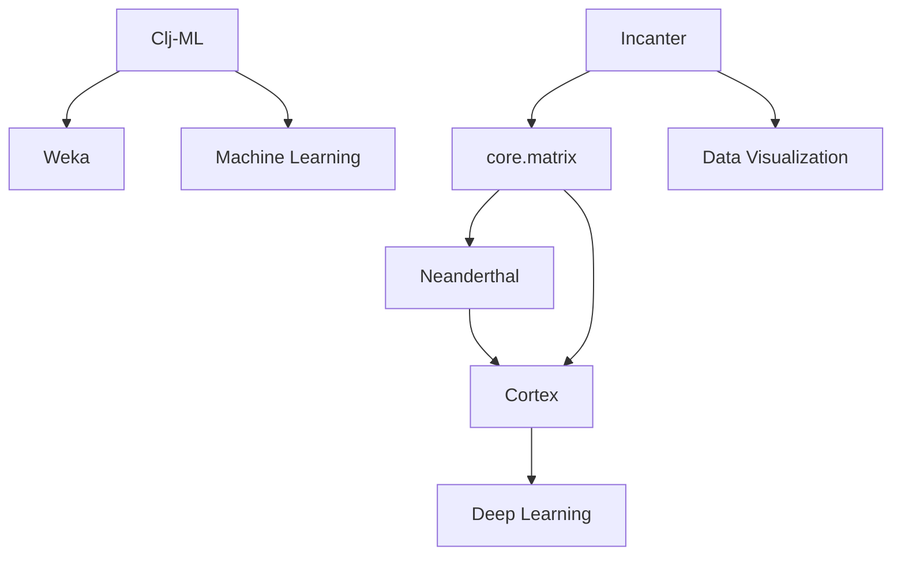

## 17.2. Libraries and Tools for Machine Learning

Machine learning (ML) and data science are rapidly evolving fields that require robust tools and libraries to handle complex computations and data manipulations. Clojure, with its functional programming paradigm and seamless Java interoperability, offers a unique ecosystem for building machine learning applications. In this section, we will explore some of the key libraries and tools available in the Clojure ecosystem for machine learning, including their functionalities, use cases, and integration with Clojure.

### Core Libraries for Machine Learning in Clojure

#### 1. [core.matrix](https://github.com/mikera/core.matrix)

**Overview**: `core.matrix` is a foundational library for numerical computing in Clojure. It provides a common API for matrix operations, supporting multiple backends for performance optimization.

**Key Features**:
- **Unified API**: Offers a consistent interface for matrix operations, making it easy to switch between different backends.
- **Interoperability**: Integrates with Java libraries like Apache Commons Math and JBLAS for enhanced performance.
- **Extensibility**: Allows users to define custom matrix implementations.

**Use Cases**:
- **Data Manipulation**: Ideal for handling large datasets and performing complex mathematical operations.
- **Linear Algebra**: Supports operations such as matrix multiplication, inversion, and decomposition.

**Example Usage**:
```clojure
(require '[clojure.core.matrix :as m])

;; Create a matrix
(def matrix-a (m/matrix [[1 2] [3 4]]))

;; Perform matrix multiplication
(def matrix-b (m/matrix [[5 6] [7 8]]))
(def result (m/mmul matrix-a matrix-b))

;; Output the result
(println "Matrix Multiplication Result:" result)
```

**Integration Tips**:
- Choose the appropriate backend based on your performance needs. For instance, use JBLAS for high-performance linear algebra operations.
- Leverage core.matrix's extensibility to integrate with custom data structures.

#### 2. [Neanderthal](https://neanderthal.uncomplicate.org/)

**Overview**: Neanderthal is a high-performance linear algebra library for Clojure, designed to leverage native CPU capabilities for maximum efficiency.

**Key Features**:
- **Native Performance**: Utilizes native libraries like OpenBLAS and Intel MKL for accelerated computations.
- **Rich API**: Provides a comprehensive set of functions for vector and matrix operations.
- **GPU Support**: Offers integration with GPU computing for even greater performance.

**Use Cases**:
- **Scientific Computing**: Suitable for applications requiring intensive numerical computations.
- **Machine Learning**: Can be used to implement custom ML algorithms that require efficient linear algebra operations.

**Example Usage**:
```clojure
(require '[uncomplicate.neanderthal.core :refer :all]
         '[uncomplicate.neanderthal.native :refer :all])

;; Create a dense matrix
(def matrix-a (dge 2 2 [1 2 3 4]))

;; Perform matrix multiplication
(def matrix-b (dge 2 2 [5 6 7 8]))
(def result (mm matrix-a matrix-b))

;; Output the result
(println "Neanderthal Matrix Multiplication Result:" result)
```

**Integration Tips**:
- Ensure that your system has the necessary native libraries installed for optimal performance.
- Consider using Neanderthal in conjunction with GPU libraries for tasks that can benefit from parallel processing.

#### 3. [Clj-ML](https://github.com/antoniogarrote/clj-ml)

**Overview**: Clj-ML is a Clojure library that provides a wrapper around the popular Weka machine learning library, enabling access to a wide range of ML algorithms.

**Key Features**:
- **Algorithm Variety**: Supports classification, regression, clustering, and more.
- **Data Preprocessing**: Includes tools for data cleaning and transformation.
- **Model Evaluation**: Offers functions for evaluating model performance.

**Use Cases**:
- **Prototyping**: Quickly experiment with different ML algorithms and datasets.
- **Educational Purposes**: Ideal for learning and teaching machine learning concepts.

**Example Usage**:
```clojure
(require '[clj-ml.data :as data]
         '[clj-ml.classifiers :as classifiers])

;; Load dataset
(def dataset (data/load-dataset :arff "path/to/dataset.arff"))

;; Train a classifier
(def classifier (classifiers/make-classifier :decision-tree :j48))
(classifiers/train classifier dataset)

;; Evaluate the classifier
(def evaluation (classifiers/evaluate classifier :cross-validation dataset 10))
(println "Evaluation Results:" evaluation)
```

**Integration Tips**:
- Familiarize yourself with Weka's capabilities to fully leverage Clj-ML's potential.
- Use Clj-ML for rapid prototyping and testing of machine learning models.

### Additional Tools and Libraries

#### 4. [Cortex](https://github.com/originrose/cortex)

**Overview**: Cortex is a Clojure library for building neural networks and deep learning models. It is designed to be flexible and easy to use, with support for GPU acceleration.

**Key Features**:
- **Neural Network Support**: Provides tools for constructing and training neural networks.
- **GPU Acceleration**: Leverages GPU capabilities for faster training times.
- **Integration with core.matrix**: Uses core.matrix for numerical operations.

**Use Cases**:
- **Deep Learning**: Suitable for tasks such as image recognition and natural language processing.
- **Research**: Ideal for experimenting with new neural network architectures.

**Example Usage**:
```clojure
(require '[cortex.nn :as nn]
         '[cortex.optimizers :as optimizers])

;; Define a simple neural network
(def model (nn/sequential
             [(nn/dense 784 128)
              (nn/relu)
              (nn/dense 128 10)
              (nn/softmax)]))

;; Train the model
(nn/train model training-data {:optimizer (optimizers/adam)})

;; Evaluate the model
(def accuracy (nn/evaluate model test-data))
(println "Model Accuracy:" accuracy)
```

**Integration Tips**:
- Ensure that your system has the necessary GPU drivers installed for optimal performance.
- Use Cortex in combination with other data processing libraries for a complete ML pipeline.

#### 5. [Incanter](https://github.com/incanter/incanter)

**Overview**: Incanter is a Clojure-based statistical computing and graphics environment, inspired by R and MATLAB.

**Key Features**:
- **Statistical Functions**: Provides a wide range of statistical functions for data analysis.
- **Data Visualization**: Includes tools for creating plots and charts.
- **Integration with core.matrix**: Uses core.matrix for numerical operations.

**Use Cases**:
- **Data Analysis**: Suitable for exploratory data analysis and statistical modeling.
- **Visualization**: Ideal for creating visual representations of data.

**Example Usage**:
```clojure
(require '[incanter.core :as incanter]
         '[incanter.charts :as charts])

;; Load data
(def data (incanter/dataset "path/to/data.csv"))

;; Create a scatter plot
(def plot (charts/scatter-plot :x :y :data data))

;; Display the plot
(incanter/view plot)
```

**Integration Tips**:
- Use Incanter for data exploration and visualization before building machine learning models.
- Combine Incanter with other libraries for a comprehensive data analysis workflow.

### Visualizing the Clojure ML Ecosystem

To better understand how these libraries fit into the Clojure machine learning ecosystem, let's visualize their relationships and roles:



**Diagram Description**: This diagram illustrates the relationships between key Clojure libraries for machine learning. `core.matrix` serves as a foundational library for numerical operations, supporting both `Neanderthal` and `Cortex`. `Clj-ML` provides a bridge to Weka for machine learning tasks, while `Incanter` offers tools for data visualization and analysis.

### Conclusion

Clojure offers a rich ecosystem of libraries and tools for machine learning and data science. By leveraging these resources, developers can build efficient and scalable ML applications. Whether you're performing basic data manipulation with `core.matrix`, implementing high-performance algorithms with `Neanderthal`, or exploring deep learning with `Cortex`, Clojure provides the flexibility and power needed for modern machine learning tasks.

### Try It Yourself

To get started with these libraries, try experimenting with the code examples provided. Modify the parameters, change the datasets, or integrate multiple libraries to see how they can work together. Remember, the key to mastering machine learning in Clojure is practice and experimentation.

## **Ready to Test Your Knowledge?**



### Which library provides a unified API for matrix operations in Clojure?

- [x] core.matrix
- [ ] Neanderthal
- [ ] Clj-ML
- [ ] Incanter

> **Explanation:** `core.matrix` offers a consistent interface for matrix operations, supporting multiple backends.

### What is the primary advantage of using Neanderthal for linear algebra operations?

- [x] Native performance
- [ ] Easy syntax
- [ ] Large community support
- [ ] Built-in visualization tools

> **Explanation:** Neanderthal utilizes native libraries like OpenBLAS and Intel MKL for accelerated computations, providing native performance.

### Which library is a wrapper around the Weka machine learning library?

- [ ] core.matrix
- [ ] Neanderthal
- [x] Clj-ML
- [ ] Cortex

> **Explanation:** Clj-ML provides a wrapper around the Weka machine learning library, enabling access to a wide range of ML algorithms.

### Which library is designed for building neural networks and deep learning models in Clojure?

- [ ] core.matrix
- [ ] Neanderthal
- [ ] Clj-ML
- [x] Cortex

> **Explanation:** Cortex is a Clojure library for building neural networks and deep learning models, with support for GPU acceleration.

### What is a common use case for Incanter?

- [x] Data visualization
- [ ] Neural network training
- [ ] GPU computing
- [ ] Real-time analytics

> **Explanation:** Incanter provides tools for creating plots and charts, making it ideal for data visualization.

### Which library integrates with GPU computing for enhanced performance?

- [ ] core.matrix
- [x] Neanderthal
- [ ] Clj-ML
- [ ] Incanter

> **Explanation:** Neanderthal offers integration with GPU computing for even greater performance.

### What is the role of core.matrix in the Clojure ML ecosystem?

- [x] Provides a foundational API for numerical computing
- [ ] Offers built-in machine learning algorithms
- [ ] Specializes in data visualization
- [ ] Focuses on statistical analysis

> **Explanation:** core.matrix provides a foundational API for numerical computing, supporting multiple backends for performance optimization.

### Which library is inspired by R and MATLAB for statistical computing?

- [ ] core.matrix
- [ ] Neanderthal
- [ ] Clj-ML
- [x] Incanter

> **Explanation:** Incanter is a Clojure-based statistical computing and graphics environment, inspired by R and MATLAB.

### Which library would you use for rapid prototyping of machine learning models?

- [ ] core.matrix
- [ ] Neanderthal
- [x] Clj-ML
- [ ] Cortex

> **Explanation:** Clj-ML is ideal for rapid prototyping and testing of machine learning models, providing access to a wide range of algorithms.

### True or False: Cortex can be used for both deep learning and GPU acceleration.

- [x] True
- [ ] False

> **Explanation:** Cortex is designed for building neural networks and deep learning models, with support for GPU acceleration.



Remember, this is just the beginning. As you progress, you'll build more complex and interactive machine learning applications. Keep experimenting, stay curious, and enjoy the journey!
