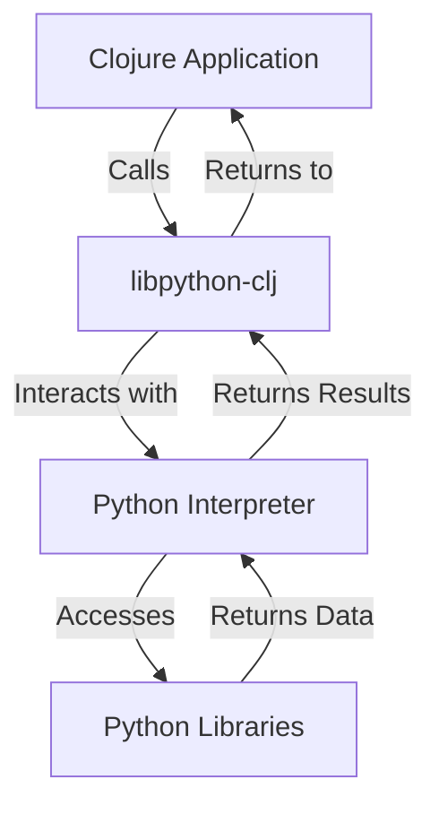

## 17.3. Interoperability with Python via `libpython-clj`

In the realm of machine learning and data science, Python stands out due to its extensive ecosystem of libraries such as NumPy, Pandas, and TensorFlow. However, Clojure developers need not miss out on these powerful tools. With the `libpython-clj` library, we can seamlessly integrate Python's capabilities into Clojure applications, combining the best of both worlds.

### Introduction to `libpython-clj`

**`libpython-clj`** is a Clojure library designed to facilitate interoperability with Python. It allows Clojure applications to call Python functions, manipulate Python objects, and leverage Python libraries directly. This integration is particularly beneficial for data science and machine learning tasks, where Python's libraries are often indispensable.

#### Key Features of `libpython-clj`

- **Direct Access to Python Libraries**: Use Python's extensive libraries directly from Clojure.
- **Seamless Data Exchange**: Easily pass data between Clojure and Python.
- **Interactive Development**: Utilize Clojure's REPL for interactive Python development.
- **Performance**: Efficiently execute Python code with minimal overhead.

### Setting Up `libpython-clj`

To start using `libpython-clj`, we need to set up our development environment. This involves installing the library and configuring it to interact with Python.

#### Prerequisites

- **Clojure**: Ensure you have Clojure installed on your system.
- **Python**: Install Python, preferably version 3.x, along with the desired libraries (e.g., NumPy, Pandas, TensorFlow).

#### Installation Steps

1. **Add `libpython-clj` to Your Project**: Include `libpython-clj` in your `deps.edn` or `project.clj` file.

   ```clojure
   ;; deps.edn
   {:deps {clj-python/libpython-clj {:mvn/version "2.00"}}}
   ```

2. **Install Python Libraries**: Use pip to install necessary Python libraries.

   ```bash
   pip install numpy pandas tensorflow
   ```

3. **Configure Environment**: Ensure that your Python environment is accessible from Clojure. You may need to set environment variables or configure paths.

### Using `libpython-clj` to Call Python Functions

Once set up, we can start calling Python functions from Clojure. Let's explore how to use `libpython-clj` to interact with Python libraries.

#### Basic Usage

Start by requiring the necessary namespaces and initializing the Python environment.

```clojure
(ns myproject.core
  (:require [libpython-clj.python :as py]
            [libpython-clj.require :refer [require-python]]))

;; Initialize Python environment
(py/initialize!)
```

#### Calling Python Functions

Let's demonstrate calling a simple Python function using `libpython-clj`.

```clojure
;; Import a Python module
(require-python 'math)

;; Call a Python function
(def pi (py/call-attr math "pi"))
(def result (py/call-attr math "sqrt" 16))

(println "Pi:" pi)
(println "Square root of 16:" result)
```

#### Working with Python Libraries

Now, let's see how to use popular Python libraries like NumPy and Pandas.

```clojure
;; Import NumPy
(require-python 'numpy)

;; Create a NumPy array
(def np-array (py/call-attr numpy "array" [1 2 3 4 5]))

;; Perform operations
(def sum (py/call-attr numpy "sum" np-array))

(println "NumPy Array:" np-array)
(println "Sum of Array:" sum)
```

### Best Practices for Cross-Language Integration

While `libpython-clj` provides powerful interoperability, it's essential to follow best practices to ensure smooth integration.

#### Data Conversion

- **Understand Data Types**: Be aware of how data types are converted between Clojure and Python. For example, Clojure vectors map to Python lists.
- **Use `py/->clj` and `py/->py`**: These functions help convert data between Clojure and Python formats.

#### Error Handling

- **Handle Exceptions**: Python exceptions can be caught and handled in Clojure using try-catch blocks.
- **Debugging**: Use Clojure's REPL for interactive debugging and testing of Python code.

#### Performance Considerations

- **Minimize Cross-Language Calls**: Frequent calls between Clojure and Python can introduce overhead. Batch operations when possible.
- **Optimize Data Transfer**: Large data transfers can be costly. Use efficient data structures and minimize unnecessary conversions.

### Potential Pitfalls

Despite its advantages, there are potential pitfalls to be aware of when using `libpython-clj`.

#### Version Compatibility

- **Python Version**: Ensure compatibility between the Python version and the libraries you intend to use.
- **Library Versions**: Some Python libraries may have specific version requirements.

#### Resource Management

- **Memory Usage**: Be mindful of memory usage, especially when dealing with large datasets.
- **Garbage Collection**: Understand how garbage collection works across Clojure and Python to avoid memory leaks.

### Visualizing Interoperability

To better understand the interaction between Clojure and Python using `libpython-clj`, let's visualize the process.



**Diagram Description**: This flowchart illustrates how a Clojure application uses `libpython-clj` to interact with the Python interpreter and access Python libraries, returning results back to the Clojure application.

### Try It Yourself

Experiment with the following code snippets to deepen your understanding of `libpython-clj`. Try modifying the examples to call different Python functions or use other libraries.

```clojure
;; Experiment with Pandas
(require-python 'pandas)

;; Create a Pandas DataFrame
(def data (py/call-attr pandas "DataFrame" {:data [[1 2] [3 4]] :columns ["A" "B"]}))

;; Display DataFrame
(println "DataFrame:" data)

;; Access a column
(def column-a (py/call-attr data "A"))

(println "Column A:" column-a)
```

### References and Further Reading

- [libpython-clj GitHub Repository](https://github.com/clj-python/libpython-clj)
- [Python Official Documentation](https://docs.python.org/3/)
- [NumPy Documentation](https://numpy.org/doc/)
- [Pandas Documentation](https://pandas.pydata.org/docs/)
- [TensorFlow Documentation](https://www.tensorflow.org/)

### Knowledge Check

Let's reinforce what we've learned with some questions and exercises.

## **Ready to Test Your Knowledge?**



### What is the primary purpose of `libpython-clj`?

- [x] To enable interoperability between Clojure and Python
- [ ] To compile Clojure code to Python
- [ ] To convert Python libraries to Clojure libraries
- [ ] To replace Python with Clojure

> **Explanation:** `libpython-clj` is designed to enable interoperability between Clojure and Python, allowing Clojure applications to use Python libraries.

### Which function initializes the Python environment in `libpython-clj`?

- [x] `py/initialize!`
- [ ] `py/start!`
- [ ] `py/init!`
- [ ] `py/setup!`

> **Explanation:** The `py/initialize!` function is used to initialize the Python environment in `libpython-clj`.

### How do you import a Python module using `libpython-clj`?

- [x] `require-python`
- [ ] `import-python`
- [ ] `load-python`
- [ ] `use-python`

> **Explanation:** The `require-python` function is used to import a Python module in `libpython-clj`.

### What is a potential pitfall when using `libpython-clj`?

- [x] Version compatibility issues
- [ ] Lack of Python library support
- [ ] Inability to call Python functions
- [ ] No data conversion between Clojure and Python

> **Explanation:** Version compatibility issues can arise when using `libpython-clj`, especially with different Python versions and library dependencies.

### Which Python library is commonly used for numerical computations?

- [x] NumPy
- [ ] Pandas
- [ ] TensorFlow
- [ ] Matplotlib

> **Explanation:** NumPy is a Python library commonly used for numerical computations.

### What is the recommended way to handle Python exceptions in Clojure?

- [x] Using try-catch blocks
- [ ] Ignoring them
- [ ] Using Python's exception handling
- [ ] Logging them without handling

> **Explanation:** Python exceptions can be caught and handled in Clojure using try-catch blocks.

### Which function is used to convert data from Python to Clojure format?

- [x] `py/->clj`
- [ ] `py/convert`
- [ ] `py/to-clj`
- [ ] `py/transform`

> **Explanation:** The `py/->clj` function is used to convert data from Python to Clojure format.

### What should you be mindful of when transferring large datasets between Clojure and Python?

- [x] Memory usage
- [ ] Execution time
- [ ] Code readability
- [ ] Syntax differences

> **Explanation:** Memory usage should be considered when transferring large datasets between Clojure and Python to avoid performance issues.

### True or False: `libpython-clj` can be used to create Python libraries from Clojure code.

- [ ] True
- [x] False

> **Explanation:** `libpython-clj` is used to call Python libraries from Clojure, not to create Python libraries from Clojure code.

### Which library is used for data manipulation and analysis in Python?

- [ ] NumPy
- [x] Pandas
- [ ] TensorFlow
- [ ] SciPy

> **Explanation:** Pandas is a Python library used for data manipulation and analysis.



Remember, this is just the beginning. As you progress, you'll build more complex and interactive applications by leveraging the power of both Clojure and Python. Keep experimenting, stay curious, and enjoy the journey!
