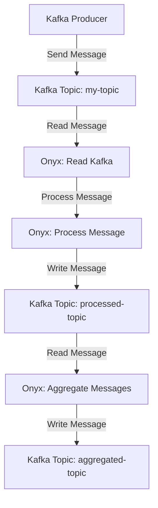

## 17.4. Streaming Data Processing for ML Applications

In the rapidly evolving world of machine learning (ML), the ability to process streaming data in real-time has become a critical requirement. Streaming data processing enables applications to handle continuous flows of data, making it possible to perform real-time analytics, detect anomalies, and update models dynamically. In this section, we will explore how Clojure, with its powerful concurrency utilities, can be leveraged to build robust streaming data pipelines for ML applications. We will delve into tools like Onyx and Apache Kafka, and provide practical examples to illustrate the concepts.

### The Importance of Streaming Data in Modern ML Applications

Streaming data processing is essential in modern ML applications for several reasons:

1. **Real-Time Decision Making**: Many applications, such as fraud detection, recommendation systems, and autonomous vehicles, require immediate responses based on the latest data.

2. **Scalability**: Streaming data systems can handle large volumes of data by processing it incrementally, reducing the need for batch processing.

3. **Dynamic Model Updates**: Continuous data streams allow for the real-time updating of ML models, ensuring they remain accurate and relevant.

4. **Resource Efficiency**: By processing data as it arrives, streaming systems can reduce storage and computational overhead compared to batch processing.

### Tools for Stream Processing in Clojure

Clojure offers several tools and libraries for stream processing, with Onyx and Apache Kafka being two of the most prominent.

#### Onyx

[Onyx](http://www.onyxplatform.org/) is a distributed, masterless, fault-tolerant data processing system written in Clojure. It is designed to handle both batch and streaming workloads, making it an excellent choice for building data pipelines.

- **Key Features**:
  - **Dynamic Workflows**: Onyx allows for the creation of dynamic workflows that can be modified at runtime.
  - **Fault Tolerance**: It provides robust fault tolerance mechanisms, ensuring data integrity and system reliability.
  - **Scalability**: Onyx can scale horizontally, handling large volumes of data efficiently.

#### Apache Kafka

[Apache Kafka](https://kafka.apache.org/) is a distributed event streaming platform capable of handling trillions of events a day. It is widely used for building real-time data pipelines and streaming applications.

- **Key Features**:
  - **High Throughput**: Kafka is designed to handle high throughput, making it suitable for large-scale data processing.
  - **Durability**: It provides durable storage for streams of records.
  - **Scalability**: Kafka can scale horizontally by adding more brokers.

#### clj-kafka

[clj-kafka](https://github.com/pingles/clj-kafka) is a Clojure library that provides a simple interface to interact with Kafka, allowing developers to produce and consume messages with ease.

### Building Streaming Data Pipelines

Let's explore how to build a streaming data pipeline using Clojure, Onyx, and Kafka. We'll start by setting up a basic pipeline that reads data from Kafka, processes it using Onyx, and writes the results back to Kafka.

#### Setting Up Kafka

First, ensure that Kafka is installed and running on your system. You can follow the [official Kafka documentation](https://kafka.apache.org/quickstart) for installation instructions.

#### Creating a Kafka Producer

We'll create a Kafka producer to send messages to a Kafka topic.

```clojure
(ns my-app.kafka-producer
  (:require [clj-kafka.producer :as producer]))

(defn send-message [topic message]
  (let [producer-config {"bootstrap.servers" "localhost:9092"
                         "key.serializer" "org.apache.kafka.common.serialization.StringSerializer"
                         "value.serializer" "org.apache.kafka.common.serialization.StringSerializer"}
        producer (producer/make-producer producer-config)]
    (producer/send producer (producer/record topic nil message))
    (.close producer)))

;; Usage
(send-message "my-topic" "Hello, Kafka!")
```

- **Explanation**: This code snippet creates a Kafka producer that sends a message to a specified topic. The `producer-config` map contains the necessary configuration for connecting to the Kafka broker.

#### Setting Up Onyx

Next, we'll set up an Onyx workflow to process the messages from Kafka.

```clojure
(ns my-app.onyx-workflow
  (:require [onyx.api :as onyx]
            [onyx.plugin.kafka :as kafka]))

(def workflow
  [{:onyx/name :read-kafka
    :onyx/plugin :onyx.plugin.kafka/read-messages
    :kafka/topic "my-topic"
    :onyx/type :input
    :onyx/medium :kafka
    :onyx/batch-size 10}

   {:onyx/name :process-message
    :onyx/fn :my-app.onyx-workflow/process
    :onyx/type :function
    :onyx/batch-size 10}

   {:onyx/name :write-kafka
    :onyx/plugin :onyx.plugin.kafka/write-messages
    :kafka/topic "processed-topic"
    :onyx/type :output
    :onyx/medium :kafka
    :onyx/batch-size 10}])

(defn process [segment]
  (str "Processed: " segment))

(defn start-workflow []
  (let [env-config {:zookeeper/address "localhost:2181"}
        peer-config {:onyx/id (java.util.UUID/randomUUID)}
        peer-group (onyx/start-peer-group peer-config)]
    (onyx/submit-job peer-group {:workflow workflow
                                 :catalog []
                                 :lifecycles []
                                 :task-scheduler :onyx.task-scheduler/balanced})
    (Thread/sleep 10000)
    (onyx/shutdown-peer-group peer-group)))

;; Usage
(start-workflow)
```

- **Explanation**: This Onyx workflow reads messages from a Kafka topic, processes them using the `process` function, and writes the results to another Kafka topic. The `start-workflow` function initializes the Onyx environment and submits the job.

### Handling Real-Time Data Transformations and Analytics

Real-time data transformations and analytics are crucial for extracting insights from streaming data. Let's explore some common techniques:

#### Data Transformation

Data transformation involves converting raw data into a more useful format. In our Onyx workflow, the `process` function performs a simple transformation by appending "Processed: " to each message. You can extend this function to perform more complex transformations, such as parsing JSON data or applying machine learning models.

#### Real-Time Analytics

Real-time analytics involves analyzing data as it arrives to generate insights. This can include aggregating data, detecting anomalies, or updating dashboards. Onyx provides built-in support for windowing and aggregation, making it easy to implement real-time analytics.

```clojure
(defn aggregate [segments]
  (reduce + (map #(Integer/parseInt %) segments)))

(def workflow
  [{:onyx/name :read-kafka
    :onyx/plugin :onyx.plugin.kafka/read-messages
    :kafka/topic "my-topic"
    :onyx/type :input
    :onyx/medium :kafka
    :onyx/batch-size 10}

   {:onyx/name :aggregate-messages
    :onyx/fn :my-app.onyx-workflow/aggregate
    :onyx/type :function
    :onyx/batch-size 10
    :onyx/window {:window/id :sliding
                  :window/aggregation :onyx.window.aggregation/sum
                  :window/range [5 :elements]
                  :window/slide [1 :elements]}}

   {:onyx/name :write-kafka
    :onyx/plugin :onyx.plugin.kafka/write-messages
    :kafka/topic "aggregated-topic"
    :onyx/type :output
    :onyx/medium :kafka
    :onyx/batch-size 10}])
```

- **Explanation**: This workflow aggregates messages from a Kafka topic using a sliding window. The `aggregate` function sums the values of the messages within the window.

### Visualizing Streaming Data Processing

To better understand the flow of data through our streaming pipeline, let's visualize the process using a flowchart.



- **Description**: This flowchart illustrates the flow of data through the streaming pipeline, from the Kafka producer to the final aggregated topic.

### Try It Yourself

Now that we've covered the basics of streaming data processing in Clojure, it's time to experiment with the code examples. Here are some suggestions for modifications:

- **Modify the Transformation Function**: Change the `process` function to perform a different transformation, such as parsing JSON data or applying a machine learning model.

- **Add a New Step**: Introduce a new step in the workflow to filter messages based on specific criteria.

- **Experiment with Windowing**: Modify the windowing parameters in the aggregation step to see how it affects the results.

### References and Further Reading

- [Onyx Documentation](http://www.onyxplatform.org/docs/)
- [Apache Kafka Documentation](https://kafka.apache.org/documentation/)
- [clj-kafka GitHub Repository](https://github.com/pingles/clj-kafka)

### Knowledge Check

Before we conclude, let's test your understanding of streaming data processing in Clojure with a few questions.

## **Ready to Test Your Knowledge?**



### What is the primary advantage of streaming data processing in ML applications?

- [x] Real-time decision making
- [ ] Reduced data storage requirements
- [ ] Simplified data models
- [ ] Increased computational complexity

> **Explanation:** Streaming data processing enables real-time decision making by allowing applications to process data as it arrives.

### Which tool is used for distributed event streaming in Clojure?

- [ ] Onyx
- [x] Apache Kafka
- [ ] Hadoop
- [ ] Spark

> **Explanation:** Apache Kafka is a distributed event streaming platform widely used for building real-time data pipelines.

### What is the function of the `process` function in the Onyx workflow?

- [ ] To read messages from Kafka
- [x] To transform messages
- [ ] To write messages to Kafka
- [ ] To aggregate messages

> **Explanation:** The `process` function is responsible for transforming messages in the Onyx workflow.

### How does Onyx handle fault tolerance?

- [ ] By using a master-slave architecture
- [x] By providing robust fault tolerance mechanisms
- [ ] By relying on external systems
- [ ] By ignoring faults

> **Explanation:** Onyx provides robust fault tolerance mechanisms to ensure data integrity and system reliability.

### What is the purpose of windowing in real-time analytics?

- [ ] To increase data throughput
- [x] To aggregate data over a specific range
- [ ] To reduce data latency
- [ ] To simplify data models

> **Explanation:** Windowing allows for the aggregation of data over a specific range, enabling real-time analytics.

### Which library provides a simple interface to interact with Kafka in Clojure?

- [ ] Onyx
- [x] clj-kafka
- [ ] core.async
- [ ] Aleph

> **Explanation:** clj-kafka is a Clojure library that provides a simple interface to interact with Kafka.

### What is the role of the Kafka producer in the streaming pipeline?

- [x] To send messages to a Kafka topic
- [ ] To read messages from a Kafka topic
- [ ] To process messages
- [ ] To aggregate messages

> **Explanation:** The Kafka producer is responsible for sending messages to a Kafka topic.

### What is a key feature of Onyx?

- [ ] High latency
- [x] Dynamic workflows
- [ ] Limited scalability
- [ ] Master-slave architecture

> **Explanation:** Onyx supports dynamic workflows that can be modified at runtime.

### True or False: Streaming data processing can reduce storage and computational overhead compared to batch processing.

- [x] True
- [ ] False

> **Explanation:** Streaming data processing reduces storage and computational overhead by processing data incrementally as it arrives.

### What is the purpose of the `aggregate` function in the Onyx workflow?

- [ ] To transform messages
- [ ] To read messages from Kafka
- [x] To sum the values of messages
- [ ] To write messages to Kafka

> **Explanation:** The `aggregate` function sums the values of messages within a sliding window in the Onyx workflow.



Remember, this is just the beginning. As you progress, you'll build more complex and interactive streaming data pipelines. Keep experimenting, stay curious, and enjoy the journey!
