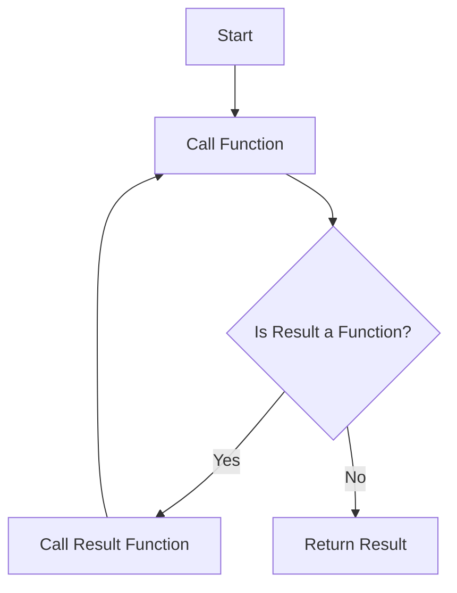

## 17.4 Trampoline in Clojure

In functional programming, recursion is a powerful tool for solving problems. However, deep recursion can lead to stack overflow errors, especially in languages with limited stack space. Clojure offers a unique solution to this problem with the `trampoline` function. This article explores the Trampoline pattern in Clojure, demonstrating how it optimizes recursive functions by converting recursion into iteration.

### Purpose of Trampoline

The Trampoline pattern in Clojure is designed to optimize recursive functions by preventing stack overflow errors. It achieves this by transforming recursive calls into iterative processes, allowing for deep recursion without consuming additional stack space. This pattern is particularly useful when dealing with recursive algorithms that risk exceeding the stack limit.

### How `trampoline` Works

The `trampoline` function in Clojure repeatedly calls a function until a non-function value is returned. This process involves returning a function from recursive calls instead of invoking the function directly. By doing so, `trampoline` manages the execution flow iteratively, effectively simulating recursion without the associated stack growth.

Here's a conceptual diagram to illustrate how `trampoline` works:



### Implementing Trampoline

#### Recursive Function Example

Consider a standard recursive function for calculating the factorial of a number. This function can lead to stack overflow for large inputs due to deep recursion.

```clojure
(defn factorial [n]
  (if (<= n 1)
    1
    (* n (factorial (dec n)))))
```

Calling `(factorial 10000)` would result in a stack overflow error.

#### Refactoring with Trampoline

To refactor this function using `trampoline`, we modify it to return a function instead of calling itself directly. We then wrap the initial call with `trampoline` to manage execution.

```clojure
(defn factorial-trampoline [n]
  (letfn [(fact [n acc]
            (if (<= n 1)
              acc
              #(fact (dec n) (* n acc))))]
    (trampoline fact n 1)))

;; Usage
(factorial-trampoline 10000)
```

In this refactored version, `fact` returns a function (a "thunk") that represents the next step in the computation. The `trampoline` function repeatedly calls these thunks until a non-function value is returned, effectively managing the recursion iteratively.

### Usage Guidelines

#### When to Use Trampoline

- **Deep Recursion:** Use `trampoline` for recursive algorithms that risk exceeding the stack limit.
- **Cross-Function Recursion:** It is useful when `recur` cannot be applied due to cross-function recursion.

#### Performance Considerations

While `trampoline` prevents stack overflow, it introduces some overhead due to the creation and invocation of thunks. It's important to weigh this overhead against the benefits of avoiding stack overflow. In some cases, alternative approaches like `loop/recur` or iterative solutions may be more efficient.

### Limitations

#### Readability

Refactoring code to use `trampoline` can make it less intuitive. The introduction of thunks and the need to manage execution flow manually can obscure the original logic of the function.

#### Not a Silver Bullet

`trampoline` is not suitable for mutually recursive functions without modification. In such cases, additional refactoring is required to ensure that all recursive paths return thunks.

### Examples

Let's explore a complete example demonstrating the before and after of using `trampoline`.

#### Before: Standard Recursive Fibonacci

```clojure
(defn fibonacci [n]
  (if (<= n 1)
    n
    (+ (fibonacci (- n 1)) (fibonacci (- n 2)))))
```

This implementation will quickly lead to stack overflow for large `n`.

#### After: Trampoline-Optimized Fibonacci

```clojure
(defn fibonacci-trampoline [n]
  (letfn [(fib [a b n]
            (if (zero? n)
              a
              #(fib b (+ a b) (dec n))))]
    (trampoline fib 0 1 n)))

;; Usage
(fibonacci-trampoline 10000)
```

In this version, the `fib` function returns a thunk for each recursive call, allowing `trampoline` to manage the recursion iteratively.

### Conclusion

The Trampoline pattern in Clojure provides a powerful tool for optimizing recursive functions, preventing stack overflow, and improving performance. While it introduces some complexity, its benefits in handling deep recursion make it a valuable pattern in the Clojure programmer's toolkit. By understanding and experimenting with `trampoline`, developers can enhance the robustness and efficiency of their recursive algorithms.

## Quiz Time!



### What is the primary purpose of the Trampoline pattern in Clojure?

- [x] To optimize recursive functions and prevent stack overflow errors.
- [ ] To enhance the readability of recursive functions.
- [ ] To convert iterative functions into recursive ones.
- [ ] To manage memory allocation in Clojure.

> **Explanation:** The Trampoline pattern is used to optimize recursive functions by converting recursion into iteration, thus preventing stack overflow errors.

### How does the `trampoline` function work in Clojure?

- [x] It repeatedly calls a function until a non-function value is returned.
- [ ] It converts a function into a loop automatically.
- [ ] It optimizes memory usage by caching function calls.
- [ ] It simplifies the syntax of recursive functions.

> **Explanation:** The `trampoline` function repeatedly calls a function until a non-function value is returned, effectively managing recursion iteratively.

### In the context of `trampoline`, what is a "thunk"?

- [x] A function that represents the next step in a computation.
- [ ] A data structure used for memoization.
- [ ] A special type of loop in Clojure.
- [ ] A method for optimizing tail recursion.

> **Explanation:** A "thunk" is a function that represents the next step in a computation, used in the `trampoline` pattern to defer execution.

### When is it appropriate to use `trampoline` in Clojure?

- [x] When dealing with recursive algorithms that risk exceeding the stack limit.
- [ ] When optimizing iterative functions for performance.
- [ ] When converting functions to use tail recursion.
- [ ] When simplifying function syntax.

> **Explanation:** `trampoline` is suitable for recursive algorithms that risk exceeding the stack limit, especially when `recur` cannot be applied.

### What is a potential drawback of using `trampoline`?

- [x] It can make code less intuitive and harder to read.
- [ ] It increases the risk of stack overflow errors.
- [ ] It automatically converts all functions to loops.
- [ ] It reduces the performance of iterative functions.

> **Explanation:** Refactoring code to use `trampoline` can make it less intuitive and harder to read due to the introduction of thunks.

### Can `trampoline` be used for mutually recursive functions without modification?

- [ ] Yes, it works seamlessly with mutually recursive functions.
- [x] No, additional refactoring is required for mutually recursive functions.
- [ ] Yes, but only for functions with a single argument.
- [ ] No, it cannot be used with any recursive functions.

> **Explanation:** `trampoline` is not suitable for mutually recursive functions without modification, as it requires all recursive paths to return thunks.

### What is a "thunk" in the context of the Trampoline pattern?

- [x] A function that represents the next step in a computation.
- [ ] A data structure used for memoization.
- [ ] A special type of loop in Clojure.
- [ ] A method for optimizing tail recursion.

> **Explanation:** A "thunk" is a function that represents the next step in a computation, used in the `trampoline` pattern to defer execution.

### What is a potential performance consideration when using `trampoline`?

- [x] It introduces overhead due to the creation and invocation of thunks.
- [ ] It automatically optimizes all recursive functions.
- [ ] It reduces the memory usage of recursive functions.
- [ ] It simplifies the syntax of recursive functions.

> **Explanation:** While `trampoline` prevents stack overflow, it introduces some overhead due to the creation and invocation of thunks.

### Which of the following is a benefit of using `trampoline`?

- [x] It prevents stack overflow in deep recursive calls.
- [ ] It automatically converts all functions to loops.
- [ ] It reduces the performance of iterative functions.
- [ ] It simplifies the syntax of recursive functions.

> **Explanation:** `trampoline` prevents stack overflow in deep recursive calls by managing recursion iteratively.

### True or False: `trampoline` can be used to optimize any recursive function in Clojure.

- [ ] True
- [x] False

> **Explanation:** `trampoline` is not suitable for all recursive functions, especially mutually recursive functions without modification.


