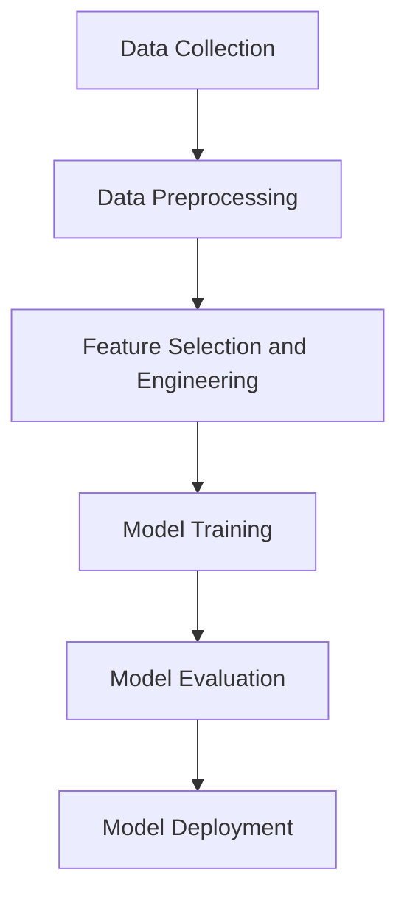

## 17.5. Building Predictive Models

Building predictive models is a cornerstone of machine learning and data science. In this section, we will explore how to construct predictive models using Clojure, a functional programming language that offers unique advantages for data processing and model building. We will cover data preprocessing, feature selection and engineering, model training, and evaluation, using libraries like [clj-ml](https://github.com/antoniogarrote/clj-ml).

### Introduction to Predictive Modeling

Predictive modeling involves using statistical techniques to predict future outcomes based on historical data. This process typically includes several steps:

1. **Data Collection**: Gathering relevant data for analysis.
2. **Data Preprocessing**: Cleaning and transforming data to make it suitable for modeling.
3. **Feature Engineering**: Selecting and transforming variables to improve model performance.
4. **Model Training**: Using algorithms to learn patterns from the data.
5. **Model Evaluation**: Assessing the model's performance using various metrics.

Let's dive into each of these steps in the context of Clojure.

### Data Preprocessing in Clojure

Data preprocessing is crucial for building effective predictive models. It involves cleaning, transforming, and organizing data to ensure it is in a suitable format for analysis.

#### Data Cleaning

Data cleaning involves handling missing values, removing duplicates, and correcting errors. In Clojure, we can leverage its functional programming capabilities to perform these tasks efficiently.

```clojure
(defn clean-data [data]
  (->> data
       (filter #(not (nil? (:important-field %))))
       (distinct)))
```

In this example, we use the `filter` function to remove records with missing values in the `:important-field` and `distinct` to eliminate duplicates.

#### Data Transformation

Data transformation involves converting data into a format that can be easily analyzed. This may include normalization, encoding categorical variables, and more.

```clojure
(defn normalize [data]
  (let [max-val (apply max data)
        min-val (apply min data)]
    (map #(-> (- % min-val)
              (/ (- max-val min-val)))
         data)))
```

Here, we normalize a dataset by scaling values to a range between 0 and 1.

### Feature Selection and Engineering

Feature selection and engineering are critical for improving model performance. They involve selecting the most relevant variables and creating new features that capture important patterns in the data.

#### Feature Selection

Feature selection can be performed using various techniques, such as correlation analysis or recursive feature elimination. In Clojure, we can use functional programming to implement these techniques.

```clojure
(defn select-features [data features]
  (map #(select-keys % features) data))
```

This function selects specific features from a dataset, allowing us to focus on the most relevant variables.

#### Feature Engineering

Feature engineering involves creating new features from existing data. This can be done using domain knowledge or automated techniques.

```clojure
(defn add-derived-feature [data]
  (map #(assoc % :new-feature (* (:feature1 %) (:feature2 %))) data))
```

In this example, we create a new feature by multiplying two existing features.

### Implementing Models with clj-ml

Clojure's [clj-ml](https://github.com/antoniogarrote/clj-ml) library provides tools for building machine learning models. Let's explore how to use this library to train predictive models.

#### Setting Up clj-ml

First, add clj-ml to your project dependencies:

```clojure
:dependencies [[clj-ml "0.4.0"]]
```

#### Training a Model

To train a model, we need to prepare the data and choose an appropriate algorithm.

```clojure
(require '[clj-ml.data :as ml-data]
         '[clj-ml.classifiers :as ml-classifiers])

(def dataset (ml-data/make-dataset "example" [:feature1 :feature2 :label]
                                   [[1.0 2.0 "A"]
                                    [2.0 3.0 "B"]
                                    [3.0 4.0 "A"]]))

(def classifier (ml-classifiers/make-classifier :decision-tree))
(ml-classifiers/train classifier dataset)
```

In this example, we create a dataset and train a decision tree classifier.

### Evaluating and Validating Model Performance

Model evaluation is essential to ensure that the model performs well on unseen data. Common evaluation metrics include accuracy, precision, recall, and F1-score.

#### Cross-Validation

Cross-validation is a technique for assessing how the results of a statistical analysis will generalize to an independent dataset. It involves partitioning the data into subsets, training the model on some subsets, and validating it on others.

```clojure
(defn cross-validate [classifier dataset]
  (ml-classifiers/cross-validate classifier dataset 10))
```

This function performs 10-fold cross-validation on a given classifier and dataset.

#### Performance Metrics

Once the model is trained, we can evaluate its performance using various metrics.

```clojure
(defn evaluate-model [classifier dataset]
  (let [evaluation (ml-classifiers/evaluate classifier dataset)]
    {:accuracy (ml-classifiers/accuracy evaluation)
     :precision (ml-classifiers/precision evaluation)
     :recall (ml-classifiers/recall evaluation)
     :f1-score (ml-classifiers/f1-score evaluation)}))
```

This function calculates accuracy, precision, recall, and F1-score for a trained model.

### Try It Yourself

Experiment with the code examples provided by modifying the dataset or changing the classifier type. Try different feature engineering techniques or evaluation metrics to see how they affect model performance.

### Visualizing the Predictive Modeling Process

To better understand the predictive modeling process, let's visualize it using a flowchart.



**Figure 1**: The predictive modeling process involves data collection, preprocessing, feature selection and engineering, model training, evaluation, and deployment.

### References and Further Reading

- [clj-ml GitHub Repository](https://github.com/antoniogarrote/clj-ml)
- [Machine Learning in Clojure](https://clojure.org/guides/machine_learning)
- [Functional Programming in Clojure](https://clojure.org/about/rationale)

### Knowledge Check

- What are the key steps in building a predictive model?
- How can you handle missing values in a dataset using Clojure?
- What is the purpose of feature engineering?
- How does cross-validation help in model evaluation?

### Embrace the Journey

Remember, building predictive models is an iterative process. As you gain experience, you'll develop a deeper understanding of the data and the models. Keep experimenting, stay curious, and enjoy the journey!

## **Ready to Test Your Knowledge?**



### What is the first step in building a predictive model?

- [x] Data Collection
- [ ] Model Training
- [ ] Feature Engineering
- [ ] Model Evaluation

> **Explanation:** Data collection is the first step in building a predictive model, as it involves gathering relevant data for analysis.

### How can missing values be handled in Clojure?

- [x] Using the `filter` function to remove records with missing values
- [ ] Using the `map` function to fill missing values
- [ ] Using the `reduce` function to aggregate missing values
- [ ] Using the `assoc` function to add missing values

> **Explanation:** The `filter` function can be used to remove records with missing values, ensuring that the dataset is clean for analysis.

### What is the purpose of feature engineering?

- [x] To create new features that capture important patterns in the data
- [ ] To remove irrelevant features from the dataset
- [ ] To normalize the data
- [ ] To evaluate the model's performance

> **Explanation:** Feature engineering involves creating new features that capture important patterns in the data, which can improve model performance.

### What is cross-validation used for?

- [x] To assess how the results of a statistical analysis will generalize to an independent dataset
- [ ] To train the model on the entire dataset
- [ ] To select the best features for the model
- [ ] To visualize the model's performance

> **Explanation:** Cross-validation is used to assess how the results of a statistical analysis will generalize to an independent dataset, providing a more reliable evaluation of the model's performance.

### Which library is used for building machine learning models in Clojure?

- [x] clj-ml
- [ ] clojure.data
- [ ] clojure.core
- [ ] clojure.java

> **Explanation:** The `clj-ml` library is used for building machine learning models in Clojure, providing tools for data processing and model training.

### What is the role of the `normalize` function in data preprocessing?

- [x] To scale values to a range between 0 and 1
- [ ] To remove duplicates from the dataset
- [ ] To encode categorical variables
- [ ] To fill missing values

> **Explanation:** The `normalize` function is used to scale values to a range between 0 and 1, which is an important step in data preprocessing.

### How can you select specific features from a dataset in Clojure?

- [x] Using the `select-keys` function
- [ ] Using the `map` function
- [ ] Using the `reduce` function
- [ ] Using the `filter` function

> **Explanation:** The `select-keys` function can be used to select specific features from a dataset, allowing us to focus on the most relevant variables.

### What is the purpose of the `evaluate-model` function?

- [x] To calculate accuracy, precision, recall, and F1-score for a trained model
- [ ] To train the model on the dataset
- [ ] To select the best features for the model
- [ ] To visualize the model's performance

> **Explanation:** The `evaluate-model` function is used to calculate accuracy, precision, recall, and F1-score for a trained model, providing insights into its performance.

### What is the benefit of using functional programming for feature engineering?

- [x] It allows for concise and expressive code
- [ ] It simplifies data collection
- [ ] It improves model evaluation
- [ ] It enhances data visualization

> **Explanation:** Functional programming allows for concise and expressive code, making it easier to implement feature engineering techniques in Clojure.

### True or False: The `clj-ml` library is used for data visualization in Clojure.

- [ ] True
- [x] False

> **Explanation:** False. The `clj-ml` library is used for building machine learning models in Clojure, not for data visualization.


