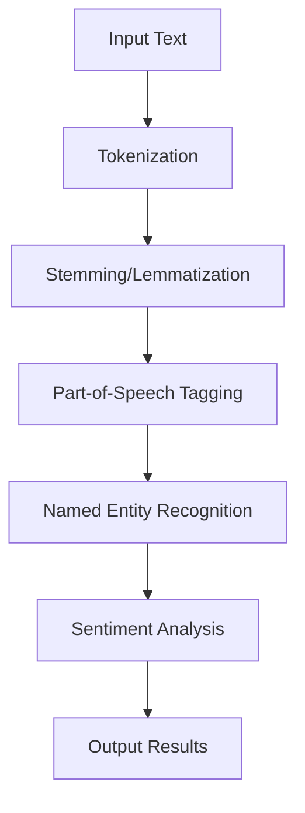

## 17.6. Natural Language Processing (NLP) with Clojure

Natural Language Processing (NLP) is a fascinating field that bridges the gap between human language and computer understanding. It involves the application of computational techniques to analyze and synthesize natural language and speech. In this section, we will explore how Clojure, with its functional programming paradigm and rich ecosystem, can be leveraged to perform NLP tasks effectively.

### Introduction to NLP Concepts

NLP encompasses a wide range of tasks, including but not limited to:

- **Tokenization**: Breaking down text into individual words or phrases.
- **Stemming and Lemmatization**: Reducing words to their base or root form.
- **Part-of-Speech Tagging**: Identifying the grammatical parts of speech in a sentence.
- **Named Entity Recognition (NER)**: Detecting and classifying named entities in text.
- **Sentiment Analysis**: Determining the sentiment expressed in a piece of text.
- **Machine Translation**: Translating text from one language to another.

These tasks are crucial for applications such as chatbots, sentiment analysis tools, and language translation services.

### Why Use Clojure for NLP?

Clojure offers several advantages for NLP tasks:

- **Immutable Data Structures**: Ensure thread safety and simplify concurrent processing.
- **Functional Paradigm**: Encourages concise and expressive code.
- **Interoperability with Java**: Access to a vast array of Java NLP libraries.
- **Rich Ecosystem**: Libraries like `clojure-opennlp` and `lang-clj` provide robust NLP capabilities.

### Key Libraries for NLP in Clojure

#### clojure-opennlp

The `clojure-opennlp` library is a Clojure wrapper for the Apache OpenNLP library, which provides tools for processing natural language text. It supports tasks such as tokenization, sentence detection, and part-of-speech tagging.

#### lang-clj

`lang-clj` is another library that offers language detection and other NLP functionalities. It is useful for identifying the language of a given text, which is a common requirement in multilingual applications.

### Setting Up Your Environment

Before diving into code examples, ensure you have Clojure and Leiningen installed. You can add the necessary dependencies to your `project.clj` file:

```clojure
(defproject nlp-clojure "0.1.0-SNAPSHOT"
  :dependencies [[org.clojure/clojure "1.10.3"]
                 [clojure-opennlp "0.5.0"]
                 [lang-clj "0.1.0"]])
```

### Tokenization with clojure-opennlp

Tokenization is the process of breaking down text into individual words or tokens. Let's see how we can achieve this using `clojure-opennlp`.

```clojure
(ns nlp-clojure.core
  (:require [opennlp.nlp :as nlp]
            [opennlp.tools.tokenize :as tokenize]))

(def tokenizer (nlp/make-tokenizer "models/en-token.bin"))

(defn tokenize-text [text]
  (tokenize/tokenize tokenizer text))

;; Example usage
(def text "Clojure is a powerful language for NLP.")
(println (tokenize-text text))
```

In this example, we load a pre-trained English tokenizer model and use it to tokenize a sample sentence. The output will be a sequence of tokens: `["Clojure" "is" "a" "powerful" "language" "for" "NLP."]`.

### Stemming and Lemmatization

Stemming and lemmatization are techniques used to reduce words to their base or root form. While stemming is a crude heuristic process, lemmatization is more sophisticated and considers the context of the word.

```clojure
(ns nlp-clojure.stemming
  (:require [opennlp.tools.stemmer :as stemmer]))

(def porter-stemmer (stemmer/make-stemmer))

(defn stem-words [words]
  (map #(stemmer/stem porter-stemmer %) words))

;; Example usage
(def words ["running" "jumps" "easily"])
(println (stem-words words))
```

This code snippet demonstrates how to use a Porter stemmer to stem a list of words. The output will be `["run" "jump" "easili"]`.

### Sentiment Analysis

Sentiment analysis involves determining the sentiment expressed in a piece of text, such as positive, negative, or neutral. While `clojure-opennlp` does not provide sentiment analysis out of the box, we can integrate it with other libraries or services.

```clojure
(ns nlp-clojure.sentiment
  (:require [clj-http.client :as client]))

(defn analyze-sentiment [text]
  (let [response (client/post "https://api.sentim.io/v1/analyze"
                              {:headers {"Content-Type" "application/json"}
                               :body (json/write-str {:text text})})]
    (json/read-str (:body response) :key-fn keyword)))

;; Example usage
(def sentiment (analyze-sentiment "I love programming in Clojure!"))
(println sentiment)
```

In this example, we use an external sentiment analysis API to analyze the sentiment of a given text. The response will include the sentiment score and classification.

### Integrating NLP into Larger Applications

Integrating NLP tasks into larger applications involves several considerations:

- **Pipeline Architecture**: Design a pipeline to process text data through various NLP tasks.
- **Concurrency**: Leverage Clojure's concurrency primitives to handle large volumes of text data efficiently.
- **Interoperability**: Utilize Java libraries for advanced NLP functionalities not available in Clojure.

### Visualizing NLP Workflow

To better understand the NLP workflow, let's visualize a typical NLP pipeline using Mermaid.js.



This diagram represents a sequential NLP pipeline where each task builds upon the previous one, ultimately leading to the extraction of meaningful insights from the text.

### Try It Yourself

Experiment with the provided code examples by modifying the input text or exploring additional functionalities offered by the libraries. Consider integrating other NLP tasks such as part-of-speech tagging or named entity recognition to enhance your understanding.

### Knowledge Check

- What are the key tasks involved in NLP?
- How does Clojure's functional paradigm benefit NLP tasks?
- What are the main differences between stemming and lemmatization?
- How can you integrate sentiment analysis into a Clojure application?

### Summary

In this section, we explored the fundamentals of NLP and how Clojure can be utilized to perform various NLP tasks. By leveraging libraries like `clojure-opennlp` and `lang-clj`, we can effectively tokenize, stem, and analyze text data. Integrating these tasks into larger applications requires careful consideration of architecture and concurrency. Remember, this is just the beginning. As you progress, you'll unlock more advanced NLP capabilities and build powerful applications. Keep experimenting, stay curious, and enjoy the journey!

## **Ready to Test Your Knowledge?**



### What is tokenization in NLP?

- [x] Breaking down text into individual words or phrases
- [ ] Reducing words to their base form
- [ ] Identifying grammatical parts of speech
- [ ] Detecting named entities in text

> **Explanation:** Tokenization is the process of breaking down text into individual words or phrases, which are called tokens.

### Which Clojure library is a wrapper for Apache OpenNLP?

- [x] clojure-opennlp
- [ ] lang-clj
- [ ] clj-http
- [ ] core.async

> **Explanation:** The `clojure-opennlp` library is a Clojure wrapper for the Apache OpenNLP library, providing tools for processing natural language text.

### What is the main purpose of stemming in NLP?

- [x] Reducing words to their base or root form
- [ ] Detecting sentiment in text
- [ ] Identifying named entities
- [ ] Translating text between languages

> **Explanation:** Stemming is used to reduce words to their base or root form, which helps in normalizing text for analysis.

### How can sentiment analysis be integrated into a Clojure application?

- [x] By using external APIs or services
- [ ] By using clojure-opennlp directly
- [ ] By using lang-clj directly
- [ ] By using core.async

> **Explanation:** Sentiment analysis can be integrated into a Clojure application by using external APIs or services, as `clojure-opennlp` does not provide sentiment analysis out of the box.

### What is the benefit of using immutable data structures in NLP tasks?

- [x] Ensures thread safety and simplifies concurrent processing
- [ ] Allows for dynamic typing
- [ ] Provides faster execution
- [ ] Enables direct Java interop

> **Explanation:** Immutable data structures ensure thread safety and simplify concurrent processing, which is beneficial for handling large volumes of text data in NLP tasks.

### Which task involves identifying grammatical parts of speech in a sentence?

- [x] Part-of-Speech Tagging
- [ ] Tokenization
- [ ] Stemming
- [ ] Named Entity Recognition

> **Explanation:** Part-of-Speech Tagging involves identifying the grammatical parts of speech in a sentence, such as nouns, verbs, and adjectives.

### What is the role of `lang-clj` in NLP?

- [x] Language detection and other NLP functionalities
- [ ] Tokenization and sentence detection
- [ ] Sentiment analysis
- [ ] Machine translation

> **Explanation:** `lang-clj` offers language detection and other NLP functionalities, making it useful for identifying the language of a given text.

### How does Clojure's interoperability with Java benefit NLP tasks?

- [x] Access to a vast array of Java NLP libraries
- [ ] Faster execution of NLP tasks
- [ ] Simplified syntax for NLP tasks
- [ ] Built-in sentiment analysis

> **Explanation:** Clojure's interoperability with Java allows access to a vast array of Java NLP libraries, enhancing the capabilities available for NLP tasks.

### What is the output of tokenizing the text "Clojure is a powerful language for NLP."?

- [x] ["Clojure" "is" "a" "powerful" "language" "for" "NLP."]
- [ ] ["Clojure" "powerful" "language" "NLP"]
- [ ] ["Clojure" "is" "powerful" "language"]
- [ ] ["Clojure" "language" "NLP"]

> **Explanation:** Tokenizing the text "Clojure is a powerful language for NLP." results in the sequence of tokens: `["Clojure" "is" "a" "powerful" "language" "for" "NLP."]`.

### True or False: Lemmatization is a more sophisticated process than stemming.

- [x] True
- [ ] False

> **Explanation:** True. Lemmatization is a more sophisticated process than stemming as it considers the context of the word to reduce it to its base form.


