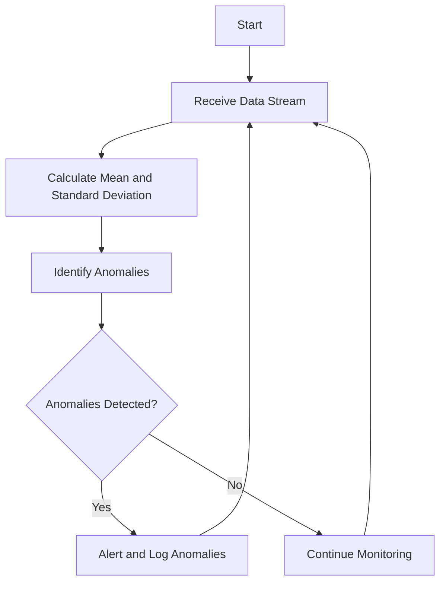

## 17.7. Real-Time Analytics and Anomaly Detection

In today's fast-paced world, the ability to process and analyze data in real-time is crucial for businesses across various industries. Real-time analytics allows organizations to gain immediate insights from data as it is generated, enabling them to make timely decisions and respond to events as they occur. Anomaly detection, on the other hand, involves identifying unusual patterns or behaviors in data that may indicate potential issues or opportunities. In this section, we will explore how to implement real-time analytics and anomaly detection systems using Clojure's powerful data processing capabilities.

### Understanding Real-Time Analytics

Real-time analytics refers to the process of analyzing data as it is created or received, allowing for immediate insights and actions. This capability is essential in industries such as finance, healthcare, e-commerce, and telecommunications, where timely decision-making can significantly impact outcomes. Real-time analytics systems are designed to handle high-velocity data streams, process them efficiently, and deliver insights with minimal latency.

#### Importance of Real-Time Analytics

- **Immediate Decision-Making**: Real-time analytics enables organizations to make informed decisions quickly, improving operational efficiency and customer satisfaction.
- **Proactive Monitoring**: By continuously analyzing data, businesses can detect and address issues before they escalate, reducing downtime and improving service quality.
- **Competitive Advantage**: Organizations that leverage real-time analytics can stay ahead of the competition by responding to market trends and customer needs more effectively.

### Anomaly Detection Techniques

Anomaly detection involves identifying patterns in data that do not conform to expected behavior. These anomalies can indicate potential problems, such as fraud, network intrusions, or equipment failures, or opportunities, such as emerging trends or customer preferences.

#### Common Anomaly Detection Algorithms

1. **Statistical Methods**: These methods involve identifying data points that deviate significantly from the norm. Examples include Z-score and moving average techniques.
2. **Machine Learning Models**: Algorithms such as clustering (e.g., k-means), classification (e.g., support vector machines), and neural networks can be used to detect anomalies.
3. **Time-Series Analysis**: Techniques like ARIMA and seasonal decomposition are used to identify anomalies in time-series data.
4. **Isolation Forests**: This ensemble method isolates anomalies by randomly selecting a feature and splitting the data.

### Leveraging Clojure for Real-Time Analytics and Anomaly Detection

Clojure, with its functional programming paradigm and robust concurrency features, is well-suited for building real-time analytics and anomaly detection systems. Its immutable data structures and powerful libraries make it an excellent choice for processing streaming data efficiently.

#### Key Clojure Libraries for Real-Time Analytics

- **core.async**: Provides facilities for asynchronous programming and communication between concurrent processes.
- **Onyx**: A distributed computation system for building high-performance, fault-tolerant data processing applications.
- **Kafka-clj**: A Clojure client for Apache Kafka, enabling integration with distributed messaging systems.
- **Incanter**: A Clojure-based, R-like platform for statistical computing and graphics.

#### Using core.async for Streaming Data Processing

The `core.async` library allows us to handle asynchronous data streams effectively. It provides channels for communication between different parts of a program, enabling concurrent data processing.

```clojure
(require '[clojure.core.async :as async])

(defn process-stream [input-channel]
  (async/go-loop []
    (when-let [data (async/<! input-channel)]
      ;; Process the data
      (println "Processing data:" data)
      (recur))))

(defn start-stream []
  (let [input-channel (async/chan)]
    (process-stream input-channel)
    ;; Simulate data stream
    (async/go
      (doseq [i (range 10)]
        (async/>! input-channel i)
        (Thread/sleep 1000)))
    input-channel))

(start-stream)
```

In this example, we create a channel to simulate a data stream and use a `go-loop` to process each data item asynchronously.

#### Implementing Anomaly Detection with Clojure

Let's explore how to implement a simple anomaly detection system using Clojure. We'll use a statistical method to identify anomalies in a stream of numerical data.

```clojure
(defn calculate-mean [data]
  (/ (reduce + data) (count data)))

(defn calculate-standard-deviation [data mean]
  (Math/sqrt (/ (reduce + (map #(Math/pow (- % mean) 2) data)) (count data))))

(defn detect-anomalies [data threshold]
  (let [mean (calculate-mean data)
        std-dev (calculate-standard-deviation data mean)]
    (filter #(> (Math/abs (- % mean)) (* threshold std-dev)) data)))

(defn process-data-stream [input-channel threshold]
  (async/go-loop [data []]
    (when-let [new-data (async/<! input-channel)]
      (let [updated-data (conj data new-data)
            anomalies (detect-anomalies updated-data threshold)]
        (println "Anomalies detected:" anomalies)
        (recur updated-data)))))

(defn start-anomaly-detection []
  (let [input-channel (async/chan)]
    (process-data-stream input-channel 2)
    ;; Simulate data stream
    (async/go
      (doseq [i (concat (range 10) [100 105 110])]
        (async/>! input-channel i)
        (Thread/sleep 1000)))
    input-channel))

(start-anomaly-detection)
```

In this example, we calculate the mean and standard deviation of the data stream and identify anomalies based on a specified threshold.

### Visualizing Real-Time Analytics and Anomaly Detection

To better understand the flow of data and the detection of anomalies, let's visualize the process using a flowchart.



**Figure 1**: This flowchart illustrates the process of receiving a data stream, calculating statistical metrics, detecting anomalies, and taking appropriate actions.

### Practical Considerations and Best Practices

- **Scalability**: Ensure your system can handle increasing data volumes by leveraging distributed processing frameworks like Onyx.
- **Latency**: Minimize latency by optimizing data processing pipelines and using efficient data structures.
- **Accuracy**: Choose appropriate anomaly detection algorithms based on the nature of your data and the specific requirements of your application.
- **Monitoring**: Implement monitoring and alerting mechanisms to ensure the system operates as expected and to quickly address any issues.

### Try It Yourself

Experiment with the provided code examples by modifying the data stream or changing the anomaly detection threshold. Observe how these changes affect the detection of anomalies. Consider integrating additional Clojure libraries, such as Kafka-clj, to handle more complex data streams.

### References and Further Reading

- [Clojure core.async Documentation](https://clojure.github.io/core.async/)
- [Onyx Platform](http://www.onyxplatform.org/)
- [Apache Kafka Documentation](https://kafka.apache.org/documentation/)
- [Incanter Documentation](https://github.com/incanter/incanter)

### Summary

In this section, we've explored the concepts of real-time analytics and anomaly detection, highlighting their importance in various industries. We've demonstrated how to leverage Clojure's powerful libraries and concurrency features to process streaming data and detect anomalies effectively. By understanding these techniques and applying them in practice, you can build robust systems that provide valuable insights and enhance decision-making capabilities.

## **Ready to Test Your Knowledge?**



### What is the primary benefit of real-time analytics?

- [x] Immediate decision-making
- [ ] Reduced data storage costs
- [ ] Improved data accuracy
- [ ] Simplified data visualization

> **Explanation:** Real-time analytics enables organizations to make informed decisions quickly, improving operational efficiency and customer satisfaction.

### Which Clojure library is commonly used for asynchronous programming?

- [x] core.async
- [ ] Incanter
- [ ] Onyx
- [ ] Kafka-clj

> **Explanation:** The `core.async` library provides facilities for asynchronous programming and communication between concurrent processes.

### What is an example of a statistical method for anomaly detection?

- [x] Z-score
- [ ] k-means clustering
- [ ] Neural networks
- [ ] Isolation forests

> **Explanation:** Z-score is a statistical method used to identify data points that deviate significantly from the norm.

### Which algorithm is used for time-series anomaly detection?

- [x] ARIMA
- [ ] Support vector machines
- [ ] Isolation forests
- [ ] k-means clustering

> **Explanation:** ARIMA is a technique used to identify anomalies in time-series data.

### What is the purpose of the `go-loop` in the provided Clojure code examples?

- [x] To process data asynchronously
- [ ] To calculate statistical metrics
- [ ] To detect anomalies
- [ ] To simulate a data stream

> **Explanation:** The `go-loop` is used to process each data item asynchronously, allowing for concurrent data processing.

### Which Clojure library is used for statistical computing and graphics?

- [x] Incanter
- [ ] core.async
- [ ] Onyx
- [ ] Kafka-clj

> **Explanation:** Incanter is a Clojure-based, R-like platform for statistical computing and graphics.

### What is the role of the `async/chan` function in the code examples?

- [x] To create a channel for communication
- [ ] To calculate the mean of data
- [ ] To detect anomalies
- [ ] To simulate a data stream

> **Explanation:** The `async/chan` function is used to create a channel for communication between different parts of a program.

### How can you improve the scalability of a real-time analytics system in Clojure?

- [x] By leveraging distributed processing frameworks like Onyx
- [ ] By using more complex algorithms
- [ ] By increasing the data stream size
- [ ] By reducing the number of channels

> **Explanation:** Leveraging distributed processing frameworks like Onyx can help ensure the system can handle increasing data volumes.

### What is the main advantage of using immutable data structures in Clojure for real-time analytics?

- [x] They prevent data corruption in concurrent environments
- [ ] They simplify data visualization
- [ ] They reduce memory usage
- [ ] They improve data accuracy

> **Explanation:** Immutable data structures prevent data corruption in concurrent environments, making them ideal for real-time analytics.

### True or False: Anomaly detection can only be performed using machine learning models.

- [ ] True
- [x] False

> **Explanation:** Anomaly detection can be performed using various techniques, including statistical methods, machine learning models, and time-series analysis.



Remember, this is just the beginning. As you progress, you'll build more complex and interactive systems. Keep experimenting, stay curious, and enjoy the journey!
