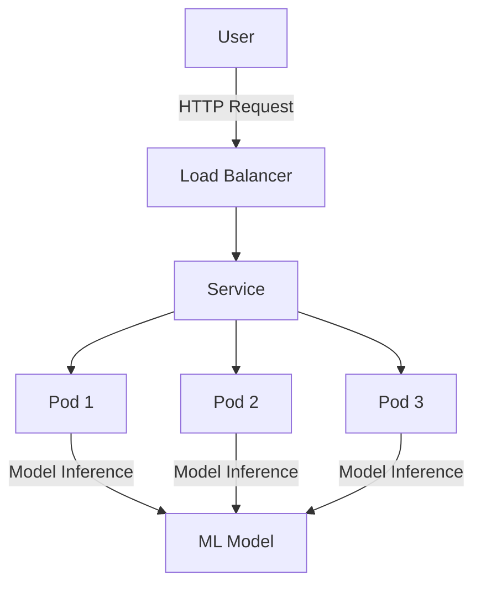

## 17.8. Deployment of ML Models in Clojure Applications

Deploying machine learning (ML) models in Clojure applications involves several strategies and considerations to ensure that models are scalable, maintainable, and performant. In this section, we will explore different deployment scenarios, discuss how to serve models using popular web frameworks like Ring and Compojure, and provide guidance on containerization with Docker and orchestration with Kubernetes. Additionally, we will address monitoring and updating deployed models to ensure they remain effective over time.

### Deployment Scenarios

When deploying ML models in Clojure applications, you can choose from various deployment scenarios based on your application's architecture and requirements. Here are some common scenarios:

#### Embedded Models

In this scenario, the ML model is embedded directly within the Clojure application. This approach is suitable for applications where the model is relatively small and does not require frequent updates. Embedding models can reduce latency since the model is loaded into memory alongside the application.

**Advantages:**
- Low latency due to in-memory model access.
- Simplified deployment without external dependencies.

**Disadvantages:**
- Limited scalability for large models.
- Difficult to update models without redeploying the application.

#### Microservices

Deploying ML models as microservices allows for greater flexibility and scalability. Each model can be deployed as an independent service, which can be updated or scaled independently of the main application. This approach is ideal for applications with multiple models or when models require frequent updates.

**Advantages:**
- Independent scaling and updating of models.
- Separation of concerns between application logic and model inference.

**Disadvantages:**
- Increased complexity in managing multiple services.
- Potential for increased latency due to network calls.

### Serving Models with Ring and Compojure

Clojure's web frameworks, such as Ring and Compojure, provide a robust foundation for serving ML models as web services. Let's explore how to set up a simple REST API to serve an ML model using these frameworks.

#### Setting Up a Ring Server

Ring is a Clojure library for handling HTTP requests and responses. It provides a simple and flexible way to create web servers.

```clojure
(ns ml-server.core
  (:require [ring.adapter.jetty :refer [run-jetty]]
            [ring.util.response :refer [response]]))

(defn handler [request]
  (response "Hello, World!"))

(defn -main []
  (run-jetty handler {:port 3000}))
```

**Explanation:**
- We define a simple handler function that returns a "Hello, World!" response.
- The `run-jetty` function starts a Jetty server on port 3000.

#### Integrating Compojure for Routing

Compojure is a routing library that works with Ring to define routes for your web application.

```clojure
(ns ml-server.core
  (:require [compojure.core :refer :all]
            [compojure.route :as route]
            [ring.adapter.jetty :refer [run-jetty]]
            [ring.util.response :refer [response]]))

(defroutes app-routes
  (GET "/" [] (response "Welcome to the ML Model Server"))
  (route/not-found "Not Found"))

(defn -main []
  (run-jetty app-routes {:port 3000}))
```

**Explanation:**
- We use `defroutes` to define our application's routes.
- The `GET` route responds with a welcome message.
- The `route/not-found` provides a default response for unmatched routes.

#### Serving an ML Model

To serve an ML model, we need to load the model and create an endpoint that accepts input data, performs inference, and returns the result.

```clojure
(ns ml-server.core
  (:require [compojure.core :refer :all]
            [compojure.route :as route]
            [ring.adapter.jetty :refer [run-jetty]]
            [ring.util.response :refer [response]]
            [clojure.data.json :as json]))

(defn load-model []
  ;; Load your ML model here
  ;; For example, using a pre-trained model from a file
  (println "Model loaded"))

(defn predict [input]
  ;; Perform inference using the loaded model
  ;; Return the prediction result
  {:result "prediction"})

(defroutes app-routes
  (GET "/" [] (response "Welcome to the ML Model Server"))
  (POST "/predict" req
        (let [input (json/read-str (slurp (:body req)) :key-fn keyword)
              prediction (predict input)]
          (response (json/write-str prediction))))
  (route/not-found "Not Found"))

(defn -main []
  (load-model)
  (run-jetty app-routes {:port 3000}))
```

**Explanation:**
- The `load-model` function is a placeholder for loading your ML model.
- The `predict` function performs inference using the model and returns a prediction.
- The `/predict` endpoint accepts POST requests with input data, performs prediction, and returns the result as JSON.

### Containerization with Docker

Containerization is a powerful technique for packaging applications and their dependencies into a single, portable unit. Docker is a popular tool for creating and managing containers.

#### Creating a Dockerfile

A Dockerfile is a script that contains instructions for building a Docker image.

```dockerfile
# Use an official Clojure image as the base
FROM clojure:openjdk-11-lein

# Set the working directory
WORKDIR /app

# Copy the project files
COPY . .

# Install dependencies and build the project
RUN lein uberjar

# Expose the application port
EXPOSE 3000

# Run the application
CMD ["java", "-jar", "target/uberjar/ml-server.jar"]
```

**Explanation:**
- We use the official Clojure image as the base.
- The `WORKDIR` command sets the working directory inside the container.
- The `COPY` command copies the project files into the container.
- The `RUN` command installs dependencies and builds the project using Leiningen.
- The `EXPOSE` command specifies the port the application will listen on.
- The `CMD` command runs the application.

#### Building and Running the Docker Image

To build and run the Docker image, use the following commands:

```bash
# Build the Docker image
docker build -t ml-server .

# Run the Docker container
docker run -p 3000:3000 ml-server
```

**Explanation:**
- The `docker build` command creates a Docker image named `ml-server`.
- The `docker run` command starts a container from the image, mapping port 3000 on the host to port 3000 in the container.

### Orchestration with Kubernetes

Kubernetes is an open-source platform for automating the deployment, scaling, and management of containerized applications.

#### Creating a Kubernetes Deployment

A Kubernetes deployment manages a set of identical pods, ensuring that the desired number of pods are running.

```yaml
apiVersion: apps/v1
kind: Deployment
metadata:
  name: ml-server
spec:
  replicas: 3
  selector:
    matchLabels:
      app: ml-server
  template:
    metadata:
      labels:
        app: ml-server
    spec:
      containers:
      - name: ml-server
        image: ml-server:latest
        ports:
        - containerPort: 3000
```

**Explanation:**
- The `Deployment` resource specifies the desired state for the application.
- The `replicas` field defines the number of pod replicas to run.
- The `selector` and `template` fields define the pod labels and template.

#### Exposing the Deployment with a Service

A Kubernetes service exposes a set of pods to the network, providing a stable endpoint for accessing the application.

```yaml
apiVersion: v1
kind: Service
metadata:
  name: ml-server
spec:
  type: LoadBalancer
  selector:
    app: ml-server
  ports:
  - protocol: TCP
    port: 80
    targetPort: 3000
```

**Explanation:**
- The `Service` resource exposes the deployment to the network.
- The `type` field specifies the service type, such as `LoadBalancer`.
- The `ports` field maps the service port to the target port in the pods.

### Monitoring and Updating Deployed Models

Once your ML models are deployed, it's crucial to monitor their performance and update them as needed to maintain accuracy and relevance.

#### Monitoring Model Performance

Monitoring involves tracking key metrics such as response time, error rates, and prediction accuracy. Tools like Prometheus and Grafana can be used to collect and visualize these metrics.

#### Updating Models

Updating models can be done by redeploying the service with a new model version. In a microservices architecture, this can be achieved with minimal downtime by using rolling updates or blue-green deployments.

### Visualizing the Deployment Architecture

Below is a diagram illustrating the deployment architecture for an ML model served as a microservice using Docker and Kubernetes.



**Diagram Description:**
- The user sends an HTTP request to the load balancer.
- The load balancer forwards the request to the Kubernetes service.
- The service routes the request to one of the available pods.
- Each pod contains the ML model and performs inference.

### Conclusion

Deploying ML models in Clojure applications involves selecting the appropriate deployment scenario, serving models using web frameworks, containerizing applications with Docker, orchestrating with Kubernetes, and monitoring and updating models. By following these strategies, you can ensure that your ML models are scalable, maintainable, and performant.

### Try It Yourself

Experiment with the code examples provided in this section. Try modifying the model inference logic, changing the number of replicas in the Kubernetes deployment, or integrating additional monitoring tools. Remember, this is just the beginning. As you progress, you'll build more complex and interactive applications. Keep experimenting, stay curious, and enjoy the journey!

## **Ready to Test Your Knowledge?**



### What is an advantage of deploying ML models as microservices?

- [x] Independent scaling and updating of models
- [ ] Reduced complexity in managing services
- [ ] Lower latency due to in-memory access
- [ ] Simplified deployment without external dependencies

> **Explanation:** Deploying ML models as microservices allows for independent scaling and updating, which is a significant advantage.

### Which Clojure library is used for handling HTTP requests and responses?

- [x] Ring
- [ ] Compojure
- [ ] Leiningen
- [ ] Docker

> **Explanation:** Ring is the Clojure library used for handling HTTP requests and responses.

### What is the purpose of a Dockerfile?

- [x] To create a script for building a Docker image
- [ ] To define routes for a web application
- [ ] To monitor model performance
- [ ] To expose a set of pods to the network

> **Explanation:** A Dockerfile is a script that contains instructions for building a Docker image.

### What is the role of a Kubernetes service?

- [x] To expose a set of pods to the network
- [ ] To manage a set of identical pods
- [ ] To automate the deployment of containers
- [ ] To perform model inference

> **Explanation:** A Kubernetes service exposes a set of pods to the network, providing a stable endpoint for accessing the application.

### Which tool can be used to collect and visualize metrics for monitoring model performance?

- [x] Prometheus
- [x] Grafana
- [ ] Docker
- [ ] Kubernetes

> **Explanation:** Prometheus and Grafana are tools that can be used to collect and visualize metrics for monitoring model performance.

### What is the benefit of using rolling updates in a microservices architecture?

- [x] Minimal downtime during updates
- [ ] Increased complexity in managing services
- [ ] Lower latency due to in-memory access
- [ ] Simplified deployment without external dependencies

> **Explanation:** Rolling updates allow for minimal downtime during updates, which is beneficial in a microservices architecture.

### What is the purpose of the `EXPOSE` command in a Dockerfile?

- [x] To specify the port the application will listen on
- [ ] To copy project files into the container
- [ ] To install dependencies and build the project
- [ ] To run the application

> **Explanation:** The `EXPOSE` command specifies the port the application will listen on.

### What is a disadvantage of embedding ML models directly within a Clojure application?

- [x] Difficult to update models without redeploying the application
- [ ] Low latency due to in-memory model access
- [ ] Simplified deployment without external dependencies
- [ ] Independent scaling and updating of models

> **Explanation:** Embedding ML models directly within a Clojure application makes it difficult to update models without redeploying the application.

### Which command is used to build a Docker image?

- [x] docker build
- [ ] docker run
- [ ] docker expose
- [ ] docker deploy

> **Explanation:** The `docker build` command is used to create a Docker image.

### True or False: Kubernetes can automate the deployment, scaling, and management of containerized applications.

- [x] True
- [ ] False

> **Explanation:** Kubernetes is an open-source platform that automates the deployment, scaling, and management of containerized applications.


