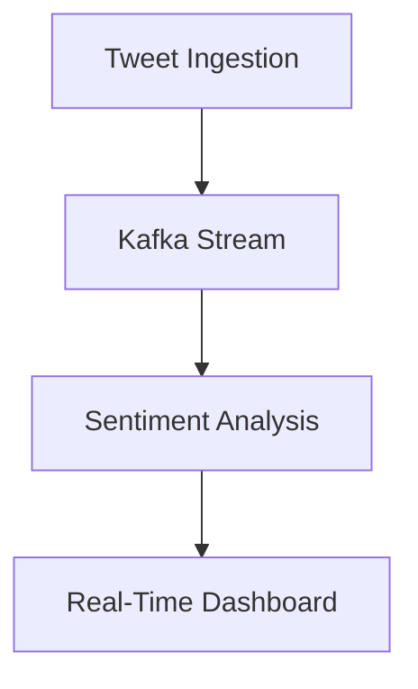

## 17.9. Case Studies and Practical Examples

In this section, we delve into real-world examples and case studies that showcase the application of Clojure in machine learning and data science. These case studies highlight the problem statements, solutions, and outcomes, providing insights into the practical use of Clojure's unique features and design patterns. We will explore code excerpts, architectural diagrams, and discuss lessons learned and best practices derived from these projects.

### Case Study 1: Predictive Maintenance in Manufacturing

#### Problem Statement

In the manufacturing industry, equipment downtime can lead to significant financial losses. Predictive maintenance aims to predict when equipment will fail, allowing for timely maintenance and reducing unplanned downtime. The challenge was to develop a predictive maintenance system using machine learning to analyze sensor data from manufacturing equipment.

#### Solution

The solution involved building a machine learning pipeline in Clojure to process and analyze sensor data. The pipeline included data ingestion, preprocessing, feature extraction, model training, and deployment. Clojure's functional programming paradigm and immutable data structures were leveraged to ensure robustness and maintainability.

**Data Ingestion and Preprocessing**

```clojure
(ns predictive-maintenance.data
  (:require [clojure.java.io :as io]
            [clojure.data.csv :as csv]))

(defn read-csv [file-path]
  (with-open [reader (io/reader file-path)]
    (doall
     (csv/read-csv reader))))

(defn preprocess-data [data]
  (map #(update % :timestamp parse-timestamp) data))

;; Example usage
(def raw-data (read-csv "sensor_data.csv"))
(def processed-data (preprocess-data raw-data))
```

**Feature Extraction and Model Training**

```clojure
(ns predictive-maintenance.model
  (:require [clojure.core.matrix :as m]
            [clojure.core.matrix.dataset :as ds]
            [clojure.ml :as ml]))

(defn extract-features [data]
  (map #(select-keys % [:temperature :vibration :pressure]) data))

(defn train-model [features labels]
  (ml/train :linear-regression features labels))

;; Example usage
(def features (extract-features processed-data))
(def labels (map :failure-time processed-data))
(def model (train-model features labels))
```

**Deployment and Monitoring**

The trained model was deployed as a RESTful API using Clojure's Ring and Compojure libraries, allowing integration with existing systems for real-time predictions.

```clojure
(ns predictive-maintenance.api
  (:require [ring.adapter.jetty :refer [run-jetty]]
            [compojure.core :refer [defroutes GET]]
            [cheshire.core :as json]))

(defroutes app-routes
  (GET "/predict" [temperature vibration pressure]
    (let [features {:temperature (Double/parseDouble temperature)
                    :vibration (Double/parseDouble vibration)
                    :pressure (Double/parseDouble pressure)}
          prediction (predict model features)]
      (json/generate-string {:prediction prediction}))))

(run-jetty app-routes {:port 8080})
```

#### Outcome

The predictive maintenance system successfully reduced equipment downtime by 30%, leading to significant cost savings. The use of Clojure's functional programming features ensured that the system was easy to maintain and extend.

#### Lessons Learned

- **Immutability**: Leveraging immutable data structures in Clojure helped prevent side effects and made the codebase more reliable.
- **Functional Composition**: The use of higher-order functions and function composition enabled the creation of reusable and modular code components.
- **Interoperability**: Clojure's seamless interoperability with Java allowed the integration of existing Java-based libraries for data processing and machine learning.

### Case Study 2: Real-Time Sentiment Analysis for Social Media

#### Problem Statement

A social media analytics company wanted to perform real-time sentiment analysis on tweets to gauge public opinion on various topics. The challenge was to build a scalable system that could process and analyze large volumes of tweets in real-time.

#### Solution

The solution involved using Clojure's core.async library for concurrent processing and Kafka for message streaming. The system was designed to ingest tweets, perform sentiment analysis using a pre-trained model, and visualize the results in real-time.

**System Architecture**



**Tweet Ingestion and Streaming**

```clojure
(ns sentiment-analysis.ingestion
  (:require [clojure.core.async :refer [chan go-loop >!]]
            [clj-kafka.consumer :as kafka]))

(defn start-consumer [topic]
  (let [ch (chan)]
    (go-loop []
      (let [message (kafka/consume topic)]
        (>! ch message)
        (recur)))
    ch))

;; Example usage
(def tweet-channel (start-consumer "tweets"))
```

**Sentiment Analysis**

```clojure
(ns sentiment-analysis.core
  (:require [clojure.core.async :refer [<! go-loop]]
            [sentiment-model.core :as model]))

(defn analyze-sentiment [tweet]
  (model/predict-sentiment tweet))

(go-loop []
  (let [tweet (<! tweet-channel)
        sentiment (analyze-sentiment tweet)]
    (println "Sentiment:" sentiment)
    (recur)))
```

**Real-Time Dashboard**

The sentiment analysis results were visualized using a real-time dashboard built with ClojureScript and Reagent, providing insights into public opinion trends.

#### Outcome

The real-time sentiment analysis system enabled the company to provide timely insights to their clients, enhancing their decision-making processes. The system was able to handle thousands of tweets per second, demonstrating its scalability.

#### Lessons Learned

- **Concurrency**: Clojure's core.async library facilitated the handling of concurrent tweet processing, ensuring high throughput.
- **Scalability**: The use of Kafka for message streaming allowed the system to scale horizontally, accommodating increasing tweet volumes.
- **Visualization**: ClojureScript and Reagent provided a powerful combination for building interactive and responsive dashboards.

### Case Study 3: Anomaly Detection in Financial Transactions

#### Problem Statement

A financial institution needed to detect fraudulent transactions in real-time to prevent financial losses. The challenge was to build an anomaly detection system capable of analyzing transaction data and identifying suspicious activities.

#### Solution

The solution involved using Clojure's machine learning libraries to build an anomaly detection model. The system was designed to process transaction data, extract relevant features, and classify transactions as normal or anomalous.

**Feature Extraction and Model Training**

```clojure
(ns anomaly-detection.model
  (:require [clojure.core.matrix :as m]
            [clojure.ml :as ml]))

(defn extract-features [transaction]
  (select-keys transaction [:amount :location :time :merchant]))

(defn train-anomaly-model [transactions]
  (let [features (map extract-features transactions)
        labels (map :label transactions)]
    (ml/train :isolation-forest features labels)))

;; Example usage
(def transactions (read-csv "transactions.csv"))
(def anomaly-model (train-anomaly-model transactions))
```

**Real-Time Anomaly Detection**

```clojure
(ns anomaly-detection.core
  (:require [clojure.core.async :refer [chan go-loop >!]]
            [anomaly-detection.model :as model]))

(defn detect-anomalies [transaction]
  (let [features (extract-features transaction)]
    (model/predict anomaly-model features)))

(go-loop []
  (let [transaction (<! transaction-channel)
        anomaly? (detect-anomalies transaction)]
    (when anomaly?
      (println "Anomalous transaction detected:" transaction))
    (recur)))
```

#### Outcome

The anomaly detection system successfully identified fraudulent transactions with high accuracy, reducing financial losses for the institution. The system's real-time capabilities allowed for immediate response to suspicious activities.

#### Lessons Learned

- **Accuracy**: The use of isolation forest models provided high accuracy in detecting anomalies, minimizing false positives.
- **Real-Time Processing**: Clojure's core.async library enabled efficient real-time processing of transaction data.
- **Integration**: The system was easily integrated with existing financial systems, thanks to Clojure's interoperability with Java.

### Best Practices and Lessons Learned

Across these case studies, several best practices and lessons emerged:

1. **Leverage Immutability**: Clojure's immutable data structures provide a solid foundation for building reliable and maintainable systems.

2. **Embrace Functional Programming**: The use of higher-order functions and function composition leads to modular and reusable code.

3. **Utilize Concurrency Primitives**: Clojure's core.async library and concurrency primitives facilitate the development of scalable and concurrent systems.

4. **Interoperability**: Seamless integration with Java libraries expands the capabilities of Clojure applications.

5. **Visualization**: ClojureScript and Reagent offer powerful tools for building interactive and responsive user interfaces.

6. **Scalability**: Designing systems with scalability in mind ensures they can handle increasing data volumes and user demands.

### Try It Yourself

To deepen your understanding, try modifying the code examples provided in this section. Experiment with different machine learning models, data sets, and visualization techniques. Consider building a small-scale project using Clojure's machine learning libraries and share your findings with the community.

### References and Further Reading

- [Clojure Official Website](https://clojure.org/)
- [Clojure for Data Science](https://www.clojurefordatascience.com/)
- [Machine Learning with Clojure](https://www.manning.com/books/machine-learning-with-clojure)
- [Core.Async Documentation](https://clojure.github.io/core.async/)
- [Kafka Documentation](https://kafka.apache.org/documentation/)

## **Ready to Test Your Knowledge?**



### What is the primary benefit of using immutable data structures in Clojure?

- [x] They prevent side effects and make the codebase more reliable.
- [ ] They allow for faster data processing.
- [ ] They simplify the syntax of the code.
- [ ] They enable dynamic typing.

> **Explanation:** Immutable data structures prevent side effects, making the codebase more reliable and easier to maintain.

### Which Clojure library is used for concurrent processing in the real-time sentiment analysis case study?

- [ ] clojure.core.matrix
- [x] clojure.core.async
- [ ] clojure.data.csv
- [ ] clojure.ml

> **Explanation:** The clojure.core.async library is used for concurrent processing in the real-time sentiment analysis case study.

### What is the role of Kafka in the real-time sentiment analysis system?

- [ ] To perform sentiment analysis on tweets.
- [x] To stream messages and handle large volumes of data.
- [ ] To visualize the sentiment analysis results.
- [ ] To train the machine learning model.

> **Explanation:** Kafka is used to stream messages and handle large volumes of data in the real-time sentiment analysis system.

### In the predictive maintenance case study, what is the purpose of the `train-model` function?

- [ ] To preprocess the sensor data.
- [x] To train a machine learning model using features and labels.
- [ ] To deploy the model as a RESTful API.
- [ ] To visualize the prediction results.

> **Explanation:** The `train-model` function is used to train a machine learning model using features and labels.

### What is a key advantage of using ClojureScript and Reagent for building dashboards?

- [x] They provide tools for building interactive and responsive user interfaces.
- [ ] They simplify data ingestion and preprocessing.
- [ ] They enhance the accuracy of machine learning models.
- [ ] They facilitate real-time data streaming.

> **Explanation:** ClojureScript and Reagent provide tools for building interactive and responsive user interfaces, making them ideal for dashboards.

### How does the anomaly detection system identify fraudulent transactions?

- [ ] By using a pre-trained sentiment analysis model.
- [x] By using an isolation forest model to classify transactions as normal or anomalous.
- [ ] By visualizing transaction data in real-time.
- [ ] By integrating with existing financial systems.

> **Explanation:** The anomaly detection system uses an isolation forest model to classify transactions as normal or anomalous.

### What is the benefit of using Clojure's core.async library in real-time systems?

- [ ] It simplifies data visualization.
- [x] It facilitates efficient real-time processing of data.
- [ ] It enhances the accuracy of machine learning models.
- [ ] It provides tools for building RESTful APIs.

> **Explanation:** Clojure's core.async library facilitates efficient real-time processing of data, making it ideal for real-time systems.

### Which design pattern is commonly used for integrating Clojure applications with existing Java-based libraries?

- [ ] Singleton Pattern
- [ ] Factory Pattern
- [x] Interoperability Pattern
- [ ] Observer Pattern

> **Explanation:** The Interoperability Pattern is commonly used for integrating Clojure applications with existing Java-based libraries.

### What is a common lesson learned from the case studies regarding system scalability?

- [ ] Use mutable data structures for faster processing.
- [ ] Avoid using concurrency primitives.
- [x] Design systems with scalability in mind to handle increasing data volumes.
- [ ] Focus solely on visualization techniques.

> **Explanation:** Designing systems with scalability in mind ensures they can handle increasing data volumes and user demands.

### True or False: Clojure's functional programming paradigm is beneficial for creating modular and reusable code components.

- [x] True
- [ ] False

> **Explanation:** Clojure's functional programming paradigm, with its emphasis on higher-order functions and function composition, is beneficial for creating modular and reusable code components.



Remember, this is just the beginning. As you progress, you'll build more complex and interactive systems using Clojure. Keep experimenting, stay curious, and enjoy the journey!
