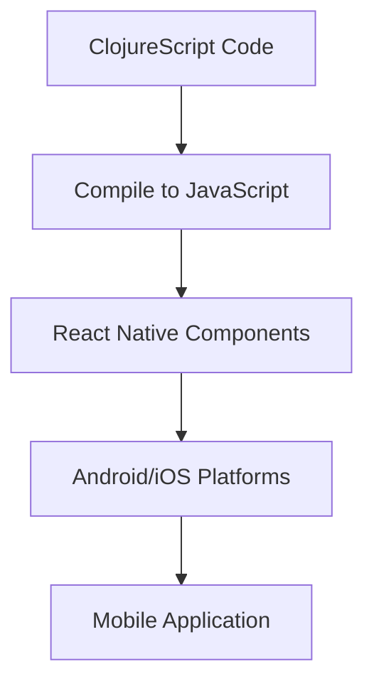

## 18.1. Clojure for Mobile Platforms

As mobile technology continues to evolve, developers are constantly seeking innovative ways to build robust, efficient, and scalable applications. Clojure, a dynamic, functional programming language that runs on the Java Virtual Machine (JVM), offers unique advantages for mobile development. This section explores the possibilities of using Clojure for mobile platforms, focusing on Android and iOS, and delves into the tools, technologies, benefits, and challenges associated with this approach.

### Introduction to Mobile Development with Clojure

Mobile development with Clojure is an exciting frontier that combines the power of functional programming with the flexibility of mobile platforms. Clojure's emphasis on immutability, first-class functions, and concurrency makes it an attractive choice for developers looking to build robust mobile applications. By leveraging Clojure's capabilities, developers can create applications that are not only efficient but also easier to maintain and extend.

### Tools and Technologies for Clojure Mobile Development

To effectively use Clojure for mobile development, it's essential to understand the tools and technologies that enable its integration with mobile platforms. Here, we introduce some of the key tools and frameworks that facilitate Clojure mobile development:

#### 1. ClojureScript

ClojureScript is a variant of Clojure that compiles to JavaScript, making it a powerful tool for cross-platform mobile development. By using ClojureScript, developers can write code that runs on both Android and iOS, leveraging the same codebase for multiple platforms.

#### 2. React Native

React Native is a popular framework for building mobile applications using JavaScript and React. With the help of ClojureScript, developers can use React Native to create cross-platform mobile apps with Clojure. This approach allows developers to take advantage of React Native's component-based architecture while writing application logic in ClojureScript.

#### 3. Re-Natal

Re-Natal is a tool that simplifies the process of setting up a React Native project with ClojureScript. It provides a streamlined workflow for creating and managing ClojureScript-based React Native applications, making it easier for developers to get started with mobile development using Clojure.

#### 4. Expo

Expo is a framework and platform for universal React applications. It extends React Native by providing a set of tools and services that simplify the development process. When combined with ClojureScript, Expo allows developers to build and deploy mobile applications quickly and efficiently.

#### 5. Java Interop

Clojure's ability to interoperate with Java is a significant advantage for Android development. Developers can leverage existing Java libraries and frameworks within their Clojure applications, enabling them to access a vast ecosystem of tools and resources.

### Benefits of Using Clojure for Mobile Development

Clojure offers several benefits for mobile development, making it an attractive choice for developers looking to build high-quality mobile applications:

#### 1. Functional Programming Paradigm

Clojure's functional programming paradigm promotes immutability and pure functions, leading to more predictable and maintainable code. This approach reduces the likelihood of bugs and makes it easier to reason about application behavior.

#### 2. Code Reusability

By using ClojureScript and React Native, developers can write code that runs on both Android and iOS platforms. This code reusability reduces development time and effort, allowing developers to focus on building features rather than managing platform-specific codebases.

#### 3. Concurrency and Performance

Clojure's concurrency model, based on Software Transactional Memory (STM) and immutable data structures, enables developers to build highly concurrent applications without the complexity of traditional threading models. This capability is particularly beneficial for mobile applications that require responsive user interfaces and efficient background processing.

#### 4. Rich Ecosystem

Clojure's integration with the JVM provides access to a rich ecosystem of libraries and tools. Developers can leverage existing Java libraries for tasks such as networking, data storage, and user interface development, enhancing the capabilities of their mobile applications.

### Challenges of Clojure Mobile Development

While Clojure offers many advantages for mobile development, there are also challenges to consider:

#### 1. Learning Curve

Clojure's functional programming paradigm and Lisp syntax can be challenging for developers accustomed to imperative programming languages. The learning curve may be steep for those new to functional programming, requiring time and effort to become proficient.

#### 2. Tooling and Debugging

The tooling and debugging experience for ClojureScript and React Native may not be as mature as for other mobile development frameworks. Developers may encounter challenges when setting up their development environment and debugging applications.

#### 3. Performance Considerations

While Clojure's functional programming model offers many benefits, it may introduce performance overhead compared to native mobile development. Developers need to be mindful of performance considerations, particularly when building resource-intensive applications.

#### 4. Community and Support

The Clojure mobile development community is smaller compared to other mobile development ecosystems. Finding community support, resources, and documentation may be more challenging, requiring developers to rely on self-learning and experimentation.

### Sample Code Snippet: Building a Simple Mobile App with ClojureScript and React Native

Let's explore a simple example of building a mobile application using ClojureScript and React Native. In this example, we'll create a basic "Hello, World!" application that runs on both Android and iOS.

```clojure
(ns my-app.core
  (:require [reagent.core :as r]
            [reagent.react-native :as rn]))

(defn hello-world []
  [rn/view {:style {:flex 1
                    :justify-content "center"
                    :align-items "center"}}
   [rn/text {:style {:font-size 20}} "Hello, World!"]])

(defn init []
  (r/render [hello-world]
            (.-appRegistry rn)))

(init)
```

In this code snippet, we define a simple React Native component using Reagent, a ClojureScript interface to React. The `hello-world` function returns a view containing a text element with the message "Hello, World!". The `init` function renders the component using Reagent's `render` function.

### Visualizing the Workflow: ClojureScript and React Native Integration

To better understand the workflow of integrating ClojureScript with React Native, let's visualize the process using a Mermaid.js diagram:



**Diagram Description**: This diagram illustrates the workflow of integrating ClojureScript with React Native. ClojureScript code is compiled to JavaScript, which is then used to create React Native components. These components are deployed to Android and iOS platforms, resulting in a mobile application.

### Try It Yourself: Experimenting with Clojure Mobile Development

To gain hands-on experience with Clojure mobile development, try modifying the sample code snippet to create a more complex application. Consider adding additional components, such as buttons or input fields, and experiment with different styles and layouts. By exploring the capabilities of ClojureScript and React Native, you'll gain a deeper understanding of how to build mobile applications using Clojure.

### Knowledge Check

Before moving on, take a moment to test your understanding of Clojure for mobile platforms with the following questions:

1. What are the key benefits of using Clojure for mobile development?
2. How does ClojureScript enable cross-platform mobile development?
3. What are some challenges associated with Clojure mobile development?
4. How can React Native be used in conjunction with ClojureScript for mobile development?
5. What are some tools and frameworks that facilitate Clojure mobile development?

### Conclusion

Clojure for mobile platforms offers a unique approach to building robust, efficient, and scalable mobile applications. By leveraging Clojure's functional programming capabilities and integrating with tools like ClojureScript and React Native, developers can create cross-platform applications that are both powerful and maintainable. While there are challenges to consider, the benefits of using Clojure for mobile development make it a compelling choice for developers seeking to innovate in the mobile space.

Remember, this is just the beginning. As you progress, you'll build more complex and interactive mobile applications. Keep experimenting, stay curious, and enjoy the journey!

## **Ready to Test Your Knowledge?**



### What is a key benefit of using Clojure for mobile development?

- [x] Functional programming paradigm
- [ ] Imperative programming paradigm
- [ ] Object-oriented programming paradigm
- [ ] Procedural programming paradigm

> **Explanation:** Clojure's functional programming paradigm promotes immutability and pure functions, leading to more predictable and maintainable code.

### How does ClojureScript enable cross-platform mobile development?

- [x] By compiling to JavaScript
- [ ] By compiling to Python
- [ ] By compiling to Swift
- [ ] By compiling to Kotlin

> **Explanation:** ClojureScript compiles to JavaScript, allowing developers to write code that runs on both Android and iOS platforms.

### What is a challenge associated with Clojure mobile development?

- [x] Learning curve
- [ ] Abundant community support
- [ ] Extensive documentation
- [ ] Simple debugging process

> **Explanation:** Clojure's functional programming paradigm and Lisp syntax can be challenging for developers accustomed to imperative programming languages.

### How can React Native be used in conjunction with ClojureScript for mobile development?

- [x] By using ClojureScript to write application logic
- [ ] By using ClojureScript to write native modules
- [ ] By using ClojureScript to write UI components only
- [ ] By using ClojureScript to manage app state only

> **Explanation:** Developers can use ClojureScript to write application logic while leveraging React Native's component-based architecture.

### What tool simplifies the process of setting up a React Native project with ClojureScript?

- [x] Re-Natal
- [ ] Expo
- [ ] Leiningen
- [ ] Boot

> **Explanation:** Re-Natal provides a streamlined workflow for creating and managing ClojureScript-based React Native applications.

### What is a benefit of Clojure's concurrency model for mobile applications?

- [x] Enables highly concurrent applications
- [ ] Simplifies imperative programming
- [ ] Reduces code reusability
- [ ] Increases performance overhead

> **Explanation:** Clojure's concurrency model, based on Software Transactional Memory (STM) and immutable data structures, enables developers to build highly concurrent applications.

### What is a challenge related to tooling and debugging in Clojure mobile development?

- [x] Tooling and debugging experience may not be as mature
- [ ] Tooling and debugging experience is highly mature
- [ ] Debugging is straightforward and simple
- [ ] Tooling is abundant and well-documented

> **Explanation:** The tooling and debugging experience for ClojureScript and React Native may not be as mature as for other mobile development frameworks.

### What is a benefit of Clojure's integration with the JVM for Android development?

- [x] Access to a rich ecosystem of libraries and tools
- [ ] Limited access to libraries
- [ ] Incompatibility with Java libraries
- [ ] Restricted use of JVM features

> **Explanation:** Clojure's integration with the JVM provides access to a rich ecosystem of libraries and tools, enhancing the capabilities of mobile applications.

### What is a potential performance consideration when using Clojure for mobile development?

- [x] Performance overhead compared to native development
- [ ] Performance improvement over native development
- [ ] No impact on performance
- [ ] Guaranteed performance optimization

> **Explanation:** Clojure's functional programming model may introduce performance overhead compared to native mobile development.

### True or False: ClojureScript allows developers to write code that runs on both Android and iOS platforms.

- [x] True
- [ ] False

> **Explanation:** ClojureScript compiles to JavaScript, enabling developers to write code that runs on both Android and iOS platforms.


