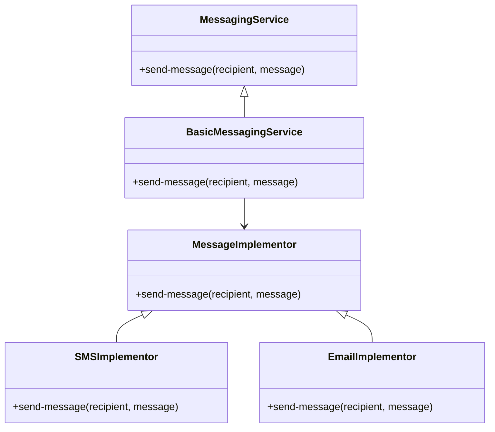

## 18.10. Bridge Pattern in Mobile Integration

### Introduction

In the realm of mobile development, the need for cross-platform compatibility and code reuse is paramount. The Bridge design pattern offers a robust solution by decoupling abstraction from implementation, allowing developers to create scalable and maintainable applications. In this section, we will delve into the Bridge pattern, explore its components, and demonstrate how it can be effectively applied in mobile app development using Clojure.

### Understanding the Bridge Pattern

#### Intent

The Bridge pattern is a structural design pattern that separates an abstraction from its implementation, enabling them to vary independently. This pattern is particularly useful when you want to avoid a permanent binding between an abstraction and its implementation, allowing for flexibility and extensibility.

#### Key Participants

- **Abstraction**: Defines the abstraction's interface and maintains a reference to an object of type Implementor.
- **Refined Abstraction**: Extends the interface defined by Abstraction.
- **Implementor**: Defines the interface for implementation classes. This interface doesn't need to correspond exactly to Abstraction's interface; in fact, the two interfaces can be quite different.
- **Concrete Implementor**: Implements the Implementor interface and defines its concrete implementation.

### Applicability in Mobile Development

The Bridge pattern is particularly beneficial in mobile development for the following reasons:

- **Cross-Platform Compatibility**: It allows for the separation of platform-specific code from the core logic, facilitating easier integration with different mobile platforms like Android and iOS.
- **Code Reuse**: By decoupling abstraction from implementation, the same abstraction can be used with different implementations, promoting code reuse.
- **Maintainability**: Changes in platform-specific implementations do not affect the core logic, making the application easier to maintain and extend.

### Implementing the Bridge Pattern in Clojure

Let's explore how the Bridge pattern can be implemented in Clojure for mobile integration. We'll create a simple example where we have a messaging application that needs to send messages through different platforms (e.g., SMS and Email).

#### Step 1: Define the Abstraction

First, we define the abstraction that represents the messaging service.

```clojure
(defprotocol MessagingService
  (send-message [this recipient message]))

(defrecord BasicMessagingService [implementor]
  MessagingService
  (send-message [this recipient message]
    (send-message implementor recipient message)))
```

In this code, `MessagingService` is the abstraction, and `BasicMessagingService` is the refined abstraction that delegates the message sending to the implementor.

#### Step 2: Define the Implementor Interface

Next, we define the implementor interface that will be used by different platform-specific implementations.

```clojure
(defprotocol MessageImplementor
  (send-message [this recipient message]))
```

#### Step 3: Create Concrete Implementors

Now, let's create concrete implementors for SMS and Email.

```clojure
(defrecord SMSImplementor []
  MessageImplementor
  (send-message [this recipient message]
    (println (str "Sending SMS to " recipient ": " message))))

(defrecord EmailImplementor []
  MessageImplementor
  (send-message [this recipient message]
    (println (str "Sending Email to " recipient ": " message))))
```

#### Step 4: Use the Bridge Pattern

Finally, we can use the Bridge pattern to send messages through different platforms.

```clojure
(def sms-service (->BasicMessagingService (->SMSImplementor)))
(def email-service (->BasicMessagingService (->EmailImplementor)))

(send-message sms-service "123-456-7890" "Hello via SMS!")
(send-message email-service "user@example.com" "Hello via Email!")
```

### Visualizing the Bridge Pattern

To better understand the Bridge pattern, let's visualize the relationships between the components using a Mermaid.js diagram.



### Benefits of Using the Bridge Pattern

- **Flexibility**: The Bridge pattern allows you to change or extend the implementation independently of the abstraction.
- **Scalability**: You can easily add new implementations without modifying the existing codebase.
- **Maintainability**: The separation of concerns makes the codebase easier to understand and maintain.

### Clojure's Unique Features

Clojure's functional programming paradigm and its powerful abstractions make it an ideal language for implementing the Bridge pattern. The use of protocols and records allows for clean separation of abstraction and implementation, while the language's emphasis on immutability ensures that the code remains robust and error-free.

### Differences and Similarities with Other Patterns

The Bridge pattern is often confused with the Adapter pattern. While both patterns are used to decouple interfaces, the Bridge pattern is designed to separate abstraction from implementation, whereas the Adapter pattern is used to make incompatible interfaces compatible.

### Design Considerations

When implementing the Bridge pattern, consider the following:

- **Interface Design**: Ensure that the abstraction and implementor interfaces are well-defined and flexible enough to accommodate future changes.
- **Performance**: While the Bridge pattern provides flexibility, it may introduce some overhead due to the additional layer of abstraction. Ensure that this overhead is acceptable for your application's performance requirements.

### Try It Yourself

To gain a deeper understanding of the Bridge pattern, try modifying the code examples to add a new messaging platform, such as Push Notifications. Consider how the pattern allows you to extend the functionality without modifying the existing codebase.

### Knowledge Check

- What is the primary purpose of the Bridge pattern?
- How does the Bridge pattern facilitate cross-platform compatibility?
- What are the key components of the Bridge pattern?
- How does Clojure's functional programming paradigm enhance the implementation of the Bridge pattern?

### Conclusion

The Bridge pattern is a powerful tool for decoupling abstraction from implementation, making it an excellent choice for mobile integration and cross-platform development. By leveraging Clojure's unique features, developers can create scalable, maintainable, and flexible applications that meet the demands of modern mobile environments.

## **Ready to Test Your Knowledge?**



### What is the primary purpose of the Bridge pattern?

- [x] To decouple abstraction from implementation
- [ ] To make incompatible interfaces compatible
- [ ] To provide a simplified interface to a complex system
- [ ] To ensure a class has only one instance

> **Explanation:** The Bridge pattern is designed to decouple abstraction from implementation, allowing them to vary independently.

### How does the Bridge pattern facilitate cross-platform compatibility?

- [x] By separating platform-specific code from core logic
- [ ] By providing a single interface for all platforms
- [ ] By using inheritance to share code across platforms
- [ ] By enforcing a strict interface for all implementations

> **Explanation:** The Bridge pattern separates platform-specific code from core logic, making it easier to integrate with different platforms.

### What are the key components of the Bridge pattern?

- [x] Abstraction, Implementor, Refined Abstraction, Concrete Implementor
- [ ] Singleton, Factory, Adapter, Proxy
- [ ] Observer, Subject, Concrete Observer, Concrete Subject
- [ ] Command, Receiver, Invoker, Client

> **Explanation:** The key components of the Bridge pattern are Abstraction, Implementor, Refined Abstraction, and Concrete Implementor.

### How does Clojure's functional programming paradigm enhance the implementation of the Bridge pattern?

- [x] By providing powerful abstractions and immutability
- [ ] By enforcing strict type checking
- [ ] By allowing dynamic typing and reflection
- [ ] By supporting object-oriented programming

> **Explanation:** Clojure's functional programming paradigm, with its emphasis on powerful abstractions and immutability, enhances the implementation of the Bridge pattern.

### What is the difference between the Bridge and Adapter patterns?

- [x] Bridge separates abstraction from implementation, Adapter makes incompatible interfaces compatible
- [ ] Bridge makes incompatible interfaces compatible, Adapter separates abstraction from implementation
- [ ] Both patterns serve the same purpose
- [ ] Bridge is used for object creation, Adapter is used for object composition

> **Explanation:** The Bridge pattern separates abstraction from implementation, while the Adapter pattern makes incompatible interfaces compatible.

### Which of the following is a benefit of using the Bridge pattern?

- [x] Flexibility and scalability
- [ ] Simplified interface
- [ ] Guaranteed single instance
- [ ] Enhanced security

> **Explanation:** The Bridge pattern provides flexibility and scalability by allowing abstraction and implementation to vary independently.

### In the provided Clojure example, what role does the `BasicMessagingService` play?

- [x] Refined Abstraction
- [ ] Concrete Implementor
- [ ] Abstraction
- [ ] Implementor

> **Explanation:** `BasicMessagingService` acts as the Refined Abstraction, delegating the message sending to the implementor.

### What is a potential drawback of using the Bridge pattern?

- [x] It may introduce some overhead due to the additional layer of abstraction
- [ ] It enforces a strict interface for all implementations
- [ ] It limits the flexibility of the codebase
- [ ] It makes the codebase more difficult to maintain

> **Explanation:** While the Bridge pattern provides flexibility, it may introduce some overhead due to the additional layer of abstraction.

### How can you extend the functionality of the Bridge pattern in the provided example?

- [x] By adding a new Concrete Implementor for a different messaging platform
- [ ] By modifying the existing Abstraction
- [ ] By creating a new Singleton class
- [ ] By using inheritance to extend the Refined Abstraction

> **Explanation:** You can extend the functionality of the Bridge pattern by adding a new Concrete Implementor for a different messaging platform.

### True or False: The Bridge pattern is only applicable to mobile development.

- [ ] True
- [x] False

> **Explanation:** False. The Bridge pattern is not limited to mobile development; it can be applied in various contexts where decoupling abstraction from implementation is beneficial.



Remember, this is just the beginning. As you progress, you'll build more complex and interactive applications. Keep experimenting, stay curious, and enjoy the journey!
