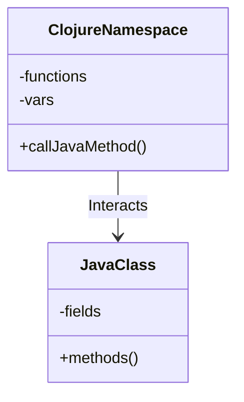

## 18.2. Building Android Apps with Clojure and Java Interop

In this section, we will explore how to harness the power of Clojure to build Android applications, leveraging Java interoperability to access Android SDK functionalities. This guide will walk you through setting up your development environment, understanding Java interoperability, and building a simple Android app using Clojure.

### Setting Up the Development Environment

Before we dive into coding, it's crucial to set up a development environment that supports both Clojure and Android development. Here's a step-by-step guide to get you started:

#### 1. Install Java Development Kit (JDK)

Ensure you have the latest version of the JDK installed on your machine. Android development requires JDK, as it provides the necessary tools to compile and run Java code.

- **Download JDK**: Visit the [Oracle JDK download page](https://www.oracle.com/java/technologies/javase-jdk11-downloads.html) and follow the installation instructions for your operating system.

#### 2. Install Android Studio

Android Studio is the official integrated development environment (IDE) for Android development. It includes the Android SDK, which is essential for building Android apps.

- **Download Android Studio**: Go to the [Android Studio download page](https://developer.android.com/studio) and install it on your system.

#### 3. Install Leiningen

Leiningen is a build automation tool for Clojure, similar to Maven for Java. It simplifies project setup and dependency management.

- **Install Leiningen**: Follow the instructions on the [Leiningen website](https://leiningen.org/) to install it on your machine.

#### 4. Set Up Clojure for Android

To use Clojure for Android development, you'll need a Clojure Android template. This template provides a basic structure for your Android project.

- **Clone the Clojure Android Template**: Use the following command to clone the template repository:

  ```bash
  git clone https://github.com/clojure-android/lein-droid.git
  ```

- **Install the Template**: Navigate to the cloned directory and run:

  ```bash
  lein install
  ```

#### 5. Configure Android SDK

Ensure that the Android SDK is correctly configured in Android Studio. This includes setting up the SDK path and installing necessary packages.

- **Configure SDK**: Open Android Studio, go to `File > Project Structure > SDK Location`, and set the SDK path.

### Understanding Java Interoperability

Clojure's interoperability with Java is one of its most powerful features, allowing you to call Java methods and use Java classes seamlessly. This is particularly useful for Android development, where the Android SDK is primarily Java-based.

#### Calling Java Methods from Clojure

To call a Java method from Clojure, you use the dot operator (`.`). Here's a simple example:

```clojure
;; Calling a static method
(. Math pow 2 3) ; Returns 8.0

;; Calling an instance method
(let [sb (StringBuilder.)]
  (.append sb "Hello, ")
  (.append sb "world!")
  (.toString sb)) ; Returns "Hello, world!"
```

#### Creating Java Objects

Creating Java objects in Clojure is straightforward. Use the `new` keyword or the constructor function.

```clojure
;; Using new
(def my-object (new java.util.Date))

;; Using constructor function
(def my-object (java.util.Date.))
```

#### Accessing Fields

Accessing fields in Java objects is done using the `.` operator.

```clojure
(def my-object (java.util.Date.))
(.getTime my-object) ; Accesses the getTime method
```

### Building a Simple Android App

Now that we have our environment set up and understand Java interoperability, let's build a simple Android app using Clojure.

#### Step 1: Create a New Project

Use the Clojure Android template to create a new project.

```bash
lein new android my-clojure-app
cd my-clojure-app
```

This command creates a new directory named `my-clojure-app` with the necessary files and structure for an Android app.

#### Step 2: Define the Main Activity

The main activity is the entry point of an Android app. In Clojure, you define it using a namespace and a class declaration.

```clojure
(ns my-clojure-app.core
  (:gen-class
   :name com.example.my_clojure_app.MainActivity
   :extends android.app.Activity))

(defn -onCreate [this savedInstanceState]
  (doto this
    (.superOnCreate savedInstanceState)
    (.setContentView (android.widget.TextView. this "Hello, Clojure!"))))
```

- **Namespace Declaration**: The `ns` macro declares a namespace for your activity.
- **Class Declaration**: The `:gen-class` directive generates a Java class that extends `android.app.Activity`.
- **onCreate Method**: The `-onCreate` function overrides the `onCreate` method of the `Activity` class.

#### Step 3: Update the Android Manifest

The Android manifest file (`AndroidManifest.xml`) declares essential information about your app, including its main activity.

```xml
<manifest xmlns:android="http://schemas.android.com/apk/res/android"
    package="com.example.my_clojure_app">

    <application
        android:allowBackup="true"
        android:label="@string/app_name"
        android:icon="@mipmap/ic_launcher"
        android:roundIcon="@mipmap/ic_launcher_round"
        android:supportsRtl="true"
        android:theme="@style/AppTheme">
        <activity android:name=".MainActivity">
            <intent-filter>
                <action android:name="android.intent.action.MAIN" />
                <category android:name="android.intent.category.LAUNCHER" />
            </intent-filter>
        </activity>
    </application>

</manifest>
```

#### Step 4: Build and Run the App

To build and run your app, use the following command:

```bash
lein droid doall
```

This command compiles your Clojure code, packages it into an APK, and installs it on a connected Android device or emulator.

### Code Examples and Screenshots

Let's look at some code examples and screenshots to illustrate the process.

#### Example: Displaying a Button

Here's how you can modify the main activity to display a button:

```clojure
(defn -onCreate [this savedInstanceState]
  (doto this
    (.superOnCreate savedInstanceState)
    (.setContentView
     (let [button (android.widget.Button. this)]
       (.setText button "Click Me")
       (.setOnClickListener button
         (proxy [android.view.View$OnClickListener] []
           (onClick [v]
             (android.widget.Toast/makeText this "Button Clicked!" android.widget.Toast/LENGTH_SHORT).show)))
       button))))
```

- **Button Creation**: We create a `Button` object and set its text.
- **Event Handling**: We use `proxy` to create an anonymous class that implements `OnClickListener`.

#### Screenshot


### Visualizing Java Interoperability

To better understand how Clojure interacts with Java, let's visualize the process using a class diagram.



**Diagram Description**: This diagram illustrates the interaction between a Clojure namespace and a Java class. Clojure functions can call Java methods, and Java classes can be instantiated and manipulated within Clojure code.

### Knowledge Check

Before we wrap up, let's test your understanding with a few questions:

1. **What is the primary tool for building Clojure projects?**
   - [ ] Maven
   - [x] Leiningen
   - [ ] Gradle
   - [ ] Ant

2. **Which method is overridden in the main activity of an Android app?**
   - [ ] onStart
   - [x] onCreate
   - [ ] onResume
   - [ ] onPause

3. **How do you call a Java method in Clojure?**
   - [x] Using the dot operator (`.`)
   - [ ] Using the arrow operator (`->`)
   - [ ] Using the colon operator (`:`)
   - [ ] Using the hash operator (`#`)

### Try It Yourself

Experiment with the code examples provided. Try modifying the button text or adding more UI elements. Explore the Android SDK documentation to discover additional functionalities you can incorporate into your app.

### References and Links

- [Clojure Android Template](https://github.com/clojure-android/lein-droid)
- [Android Developer Documentation](https://developer.android.com/docs)
- [Leiningen Official Site](https://leiningen.org/)
- [Oracle JDK Downloads](https://www.oracle.com/java/technologies/javase-jdk11-downloads.html)

### Embrace the Journey

Remember, building Android apps with Clojure is just the beginning. As you progress, you'll discover more advanced techniques and patterns to enhance your apps. Keep experimenting, stay curious, and enjoy the journey!

## **Ready to Test Your Knowledge?**



### What is the primary tool for building Clojure projects?

- [ ] Maven
- [x] Leiningen
- [ ] Gradle
- [ ] Ant

> **Explanation:** Leiningen is the build automation tool for Clojure, similar to Maven for Java.

### Which method is overridden in the main activity of an Android app?

- [ ] onStart
- [x] onCreate
- [ ] onResume
- [ ] onPause

> **Explanation:** The `onCreate` method is overridden in the main activity to set up the initial state of the app.

### How do you call a Java method in Clojure?

- [x] Using the dot operator (`.`)
- [ ] Using the arrow operator (`->`)
- [ ] Using the colon operator (`:`)
- [ ] Using the hash operator (`#`)

> **Explanation:** The dot operator is used to call Java methods from Clojure.

### What is the purpose of the Android manifest file?

- [x] To declare essential information about the app
- [ ] To store app data
- [ ] To manage user permissions
- [ ] To define UI layouts

> **Explanation:** The Android manifest file declares essential information about the app, such as its main activity and permissions.

### How do you create a new Java object in Clojure?

- [x] Using the `new` keyword
- [ ] Using the `create` function
- [ ] Using the `init` method
- [ ] Using the `construct` keyword

> **Explanation:** The `new` keyword is used to create new Java objects in Clojure.

### Which tool is used to install the Clojure Android template?

- [x] Git
- [ ] Maven
- [ ] Gradle
- [ ] Ant

> **Explanation:** Git is used to clone the Clojure Android template repository.

### What is the role of the `proxy` function in Clojure?

- [x] To create anonymous classes
- [ ] To manage dependencies
- [ ] To compile code
- [ ] To handle errors

> **Explanation:** The `proxy` function is used to create anonymous classes that implement interfaces or extend classes.

### What is the output of the following Clojure code: `(. Math pow 2 3)`?

- [x] 8.0
- [ ] 6.0
- [ ] 9.0
- [ ] 4.0

> **Explanation:** The code calls the `pow` method of the `Math` class, raising 2 to the power of 3, resulting in 8.0.

### How do you set the content view in an Android activity using Clojure?

- [x] Using the `setContentView` method
- [ ] Using the `displayView` method
- [ ] Using the `showView` method
- [ ] Using the `renderView` method

> **Explanation:** The `setContentView` method is used to set the content view in an Android activity.

### True or False: Clojure can directly call Android APIs without Java interoperability.

- [ ] True
- [x] False

> **Explanation:** Clojure requires Java interoperability to call Android APIs, as the Android SDK is primarily Java-based.


