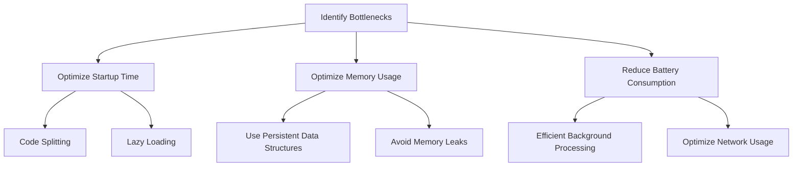

## 18.4. Performance Considerations for Mobile

Mobile applications developed with Clojure and ClojureScript offer a unique blend of functional programming paradigms and JavaScript interoperability. However, achieving optimal performance on mobile devices requires careful consideration of several factors. In this section, we will explore common performance bottlenecks in mobile apps, strategies for optimizing startup time, memory usage, and battery consumption, and techniques for profiling and monitoring app performance.

### Identifying Common Performance Bottlenecks

Before diving into optimization techniques, it's crucial to identify the common performance bottlenecks that can affect mobile applications:

1. **Startup Time**: The time it takes for an application to become usable after being launched is critical. Delays can lead to poor user experience and app abandonment.
2. **Memory Usage**: Mobile devices have limited memory resources. Excessive memory consumption can lead to app crashes and slow performance.
3. **Battery Consumption**: Mobile apps that drain battery quickly are often uninstalled by users. Efficient battery usage is vital for user satisfaction.
4. **Network Latency**: Slow network operations can degrade the performance of mobile apps, especially those that rely heavily on data fetching.
5. **UI Responsiveness**: A laggy or unresponsive UI can frustrate users and lead to negative reviews.

### Strategies for Optimizing Startup Time

Optimizing startup time involves several strategies that can be applied to Clojure and ClojureScript mobile applications:

#### 1. Code Splitting and Lazy Loading

- **Code Splitting**: Divide your application into smaller chunks that can be loaded on demand. This reduces the initial load time and improves startup performance.
- **Lazy Loading**: Load non-essential components only when they are needed. This can be achieved using dynamic imports in ClojureScript.

```clojure
;; Example of lazy loading a component in ClojureScript
(defn load-component []
  (js/require.ensure
    #js ["./my-component"]
    (fn [require]
      (let [component (require "./my-component")]
        (component/render)))))
```

#### 2. Minimize Initial Data Fetching

- **Local Caching**: Use local storage to cache data that doesn't change frequently. This reduces the need for network requests during startup.
- **Deferred Data Loading**: Load essential data first and defer non-essential data fetching until after the app is fully loaded.

#### 3. Optimize Asset Loading

- **Image Optimization**: Use compressed image formats and lazy load images as needed.
- **Font Loading**: Use system fonts or load custom fonts asynchronously to avoid blocking the rendering process.

### Memory Usage Optimization

Efficient memory management is crucial for mobile applications to prevent crashes and ensure smooth performance.

#### 1. Use Persistent Data Structures

Clojure's persistent data structures offer efficient memory usage through structural sharing. Use these structures to manage state without excessive memory overhead.

```clojure
;; Example of using a persistent vector in Clojure
(def my-vector (conj [1 2 3] 4))
```

#### 2. Avoid Memory Leaks

- **Remove Event Listeners**: Ensure that event listeners are removed when they are no longer needed to prevent memory leaks.
- **Manage References**: Avoid retaining unnecessary references to large objects or data structures.

#### 3. Optimize Data Structures

- **Choose the Right Data Structure**: Use appropriate data structures for your use case. For example, use maps for key-value pairs and vectors for ordered collections.
- **Minimize Object Creation**: Reuse objects when possible to reduce memory allocation overhead.

### Reducing Battery Consumption

Battery efficiency is a key consideration for mobile applications. Here are some strategies to minimize battery usage:

#### 1. Efficient Background Processing

- **Use Background Threads Wisely**: Offload non-UI tasks to background threads, but avoid excessive background processing that can drain the battery.
- **Schedule Tasks Appropriately**: Use APIs like `setTimeout` and `setInterval` judiciously to avoid unnecessary wake-ups.

#### 2. Optimize Network Usage

- **Batch Network Requests**: Combine multiple network requests into a single batch to reduce the number of network operations.
- **Use Caching**: Implement caching strategies to minimize network usage and reduce battery consumption.

#### 3. Minimize UI Updates

- **Throttle UI Updates**: Use techniques like debouncing and throttling to limit the frequency of UI updates.
- **Efficient Rendering**: Use libraries like Reagent in ClojureScript to efficiently manage UI rendering and updates.

### Profiling and Monitoring App Performance

Profiling and monitoring are essential to identify performance issues and validate optimizations.

#### 1. Use Profiling Tools

- **React Native Debugger**: For ClojureScript apps using React Native, use the React Native Debugger to profile and analyze performance.
- **Chrome DevTools**: Use Chrome DevTools for profiling web-based ClojureScript applications.

#### 2. Monitor Memory Usage

- **Heap Snapshots**: Take heap snapshots to identify memory leaks and excessive memory usage.
- **Garbage Collection Analysis**: Analyze garbage collection patterns to identify potential memory management issues.

#### 3. Analyze Network Performance

- **Network Throttling**: Simulate different network conditions to test app performance under varying network speeds.
- **Request Timing**: Measure the time taken for network requests to identify bottlenecks.

### Try It Yourself

Experiment with the following code examples to see how different optimization techniques can impact performance:

1. **Modify the lazy loading example** to load different components and observe the impact on startup time.
2. **Implement a caching strategy** for data fetching and measure the reduction in network requests.
3. **Profile a sample ClojureScript app** using Chrome DevTools and identify areas for improvement.

### Visualizing Performance Optimization

Below is a diagram illustrating the flow of performance optimization strategies for mobile applications:



**Diagram Description**: This flowchart outlines the key steps in optimizing mobile app performance, starting with identifying bottlenecks and proceeding to specific strategies for startup time, memory usage, and battery consumption.

### Key Takeaways

- **Identify and Address Bottlenecks**: Understanding common performance issues is the first step in optimization.
- **Optimize Startup Time**: Use techniques like code splitting and lazy loading to improve app launch speed.
- **Manage Memory Efficiently**: Leverage Clojure's persistent data structures and avoid memory leaks.
- **Reduce Battery Usage**: Optimize background processing and network usage to conserve battery life.
- **Profile and Monitor**: Use profiling tools to continuously monitor and improve app performance.

### Embrace the Journey

Remember, optimizing mobile app performance is an ongoing process. As you continue to develop and refine your applications, keep experimenting with different strategies, stay curious, and enjoy the journey of creating efficient and responsive mobile experiences.

## **Ready to Test Your Knowledge?**



### What is a common performance bottleneck in mobile applications?

- [x] Startup time
- [ ] Code readability
- [ ] User interface design
- [ ] Application color scheme

> **Explanation:** Startup time is a critical performance bottleneck that affects user experience.

### Which technique can help reduce initial load time in mobile apps?

- [x] Code splitting
- [ ] Increasing image resolution
- [ ] Adding more animations
- [ ] Using larger fonts

> **Explanation:** Code splitting divides the application into smaller chunks that can be loaded on demand, reducing initial load time.

### What is a benefit of using persistent data structures in Clojure?

- [x] Efficient memory usage
- [ ] Faster network requests
- [ ] Improved battery life
- [ ] Enhanced graphics rendering

> **Explanation:** Persistent data structures in Clojure use structural sharing, which leads to efficient memory usage.

### How can you minimize battery consumption in mobile apps?

- [x] Optimize network usage
- [ ] Increase background processing
- [ ] Use high-resolution images
- [ ] Add more UI animations

> **Explanation:** Optimizing network usage reduces the number of network operations, conserving battery life.

### What tool can be used to profile ClojureScript apps using React Native?

- [x] React Native Debugger
- [ ] Photoshop
- [ ] Microsoft Word
- [ ] Excel

> **Explanation:** React Native Debugger is a tool used to profile and analyze performance in React Native applications.

### Which strategy helps in optimizing memory usage?

- [x] Avoiding memory leaks
- [ ] Increasing object creation
- [ ] Using larger data structures
- [ ] Adding more event listeners

> **Explanation:** Avoiding memory leaks ensures that memory is not unnecessarily retained, optimizing memory usage.

### What is the purpose of lazy loading in mobile apps?

- [x] Load components only when needed
- [ ] Increase app size
- [ ] Enhance UI animations
- [ ] Improve color accuracy

> **Explanation:** Lazy loading defers the loading of non-essential components until they are needed, improving performance.

### How can you analyze network performance in mobile apps?

- [x] Network throttling
- [ ] Increasing data fetching
- [ ] Using larger data packets
- [ ] Adding more network requests

> **Explanation:** Network throttling simulates different network conditions to test app performance under varying speeds.

### What is a key takeaway for optimizing mobile app performance?

- [x] Continuously profile and monitor
- [ ] Focus only on UI design
- [ ] Ignore battery consumption
- [ ] Increase memory usage

> **Explanation:** Continuously profiling and monitoring app performance helps identify and address issues for optimization.

### True or False: Efficient rendering can help reduce battery consumption.

- [x] True
- [ ] False

> **Explanation:** Efficient rendering reduces unnecessary UI updates, conserving battery life.


